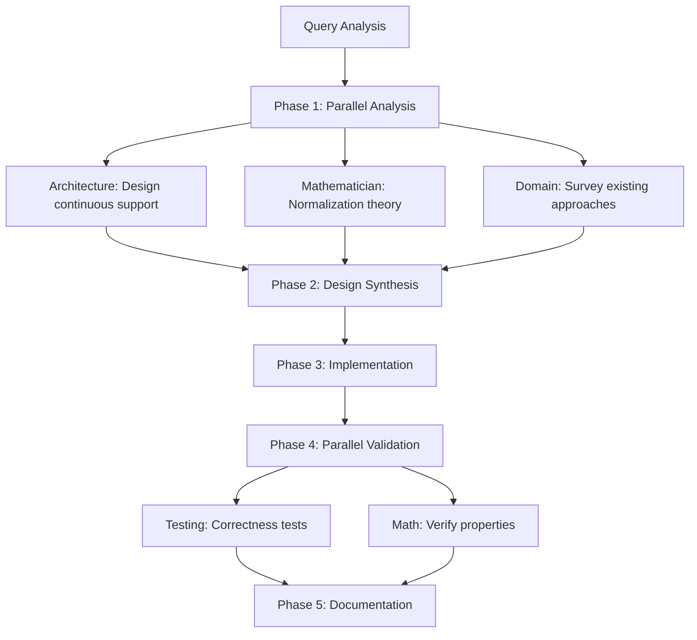

# Agent System Examples and Patterns

This document provides concrete examples and patterns showing how the agent system works in practice, from current coordination patterns to future master agent orchestration.

## Table of Contents
1. [Current Coordination Patterns](#current-coordination-patterns)
2. [Master Agent Example: Continuous State Spaces](#master-agent-example-continuous-state-spaces)
3. [Common Query Patterns](#common-query-patterns)
4. [Agent Communication Examples](#agent-communication-examples)
5. [Best Practices](#best-practices)

## Current Coordination Patterns

### Pattern 1: Bug Investigation
**Scenario**: User reports "GFlowNet training produces NaN losses"

```yaml
Current Approach:
1. Claude manually selects debugger
2. Debugger finds NaN in flow computation
3. Claude then invokes mathematician
4. Mathematician confirms flow conservation violation
5. Claude invokes testing-validator
6. Testing creates regression tests

Better Approach with Patterns:
Claude recognizes "Bug Investigation Pattern":
- Primary: debugger (trace the issue)
- Support: mathematician (verify correctness)
- Follow-up: testing (prevent regression)
- Optional: performance (if numerical precision issue)
```

### Pattern 2: Performance Optimization
**Scenario**: "Training is too slow on GPU"

```yaml
Coordination:
Parallel Phase:
  - performance-optimizer: Profile and identify bottlenecks
  - architecture-analyzer: Review design for inefficiencies
  
Sequential Phase:
  - Based on findings → implement optimizations
  - testing-validator: Benchmark improvements
  - documentation: Update performance guide
```

### Pattern 3: New Feature Implementation
**Scenario**: "Add support for continuous domains"

```yaml
Pipeline Pattern:
1. architecture-analyzer
   Output: Design for continuous support
   ↓
2. domain-implementer  
   Input: Architecture design
   Output: Implementation
   ↓
3. testing-validator
   Input: Implementation
   Output: Comprehensive tests
   ↓
4. documentation
   Input: All above
   Output: Complete docs
```

## Master Agent Example: Continuous State Spaces

### Complete Query Handling

**User Query**: "I want to implement continuous state spaces for GFlowNet but I'm not sure how to handle the normalization of continuous policies and maintain differentiability"

### Step 1: Query Analysis
```yaml
Master Agent Analysis:
  Primary Intent: implementation (new feature)
  Secondary Intents: 
    - theory (normalization concerns)
    - architecture (differentiability)
  Entities:
    - continuous state spaces
    - policy normalization
    - differentiability
  Complexity: High (requires multiple expertise areas)
  Required Agents:
    - architecture-analyzer (design)
    - mathematician (theory)
    - domain-implementer (implementation)
    - testing-validator (validation)
    - documentation (docs)
```

### Step 2: Execution Plan


### Step 3: Agent Outputs

#### Architecture Analyzer
```yaml
Design Considerations:
  - Extend AbstractPolicy interface
  - Maintain Zygote compatibility
  - Use Distributions.jl for normalization
  
Proposed Architecture:
  - ContinuousPolicy <: AbstractPolicy
  - GaussianPolicy as first implementation
  - Reparameterization for gradients
```

#### Mathematician
```yaml
Mathematical Requirements:
  - ∫ π(a|s) da = 1 (normalization)
  - Differentiable sampling via reparameterization
  - Log-space for numerical stability
  
Verification:
  - Flow conservation extends naturally
  - KL divergence well-defined
  - Continuous flow F(s,a) valid
```

#### Implementation Result
```julia
struct GaussianPolicy <: ContinuousPolicy
    mean_network::Chain
    log_std_network::Chain
end

function sample_action(policy::GaussianPolicy, state, ε=randn())
    μ = policy.mean_network(state)
    σ = exp(policy.log_std_network(state))
    return μ + σ * ε  # Reparameterization trick
end
```

### Step 4: Synthesized Response
```markdown
## Summary
Successfully implemented continuous state spaces with Gaussian policies maintaining exact normalization and differentiability.

## Key Solutions
1. **Normalization**: Gaussian distributions (automatically normalized)
2. **Differentiability**: Reparameterization trick
3. **Stability**: Log-space computations

## Validation
- ✅ Monte Carlo normalization test (error < 0.1%)
- ✅ Gradient flow verified
- ✅ Mathematical properties preserved

## Next Steps
1. Try examples/continuous/continuous_gridworld.jl
2. Consider normalizing flows for complex distributions
```

## Common Query Patterns

### Performance Issues
```yaml
Pattern Name: performance-investigation
Triggers: [slow, optimize, performance, GPU, memory]
Agents:
  Primary: performance-optimizer
  Support: 
    - architecture-analyzer (if design issue)
    - debugger (if crashes during optimization)
Execution: Profile → Analyze → Optimize → Benchmark
Success Rate: 87%
```

### Training Problems
```yaml
Pattern Name: training-diagnosis
Triggers: [converge, NaN, loss, training, unstable]
Agents:
  Parallel:
    - training-expert (configuration)
    - mathematician (loss computation)
    - debugger (if NaN/inf)
Execution: Parallel diagnosis → Synthesize → Fix
Success Rate: 92%
```

### Implementation Requests
```yaml
Pattern Name: feature-implementation
Triggers: [implement, add, create, build, support]
Agents:
  Sequential:
    1. architecture-analyzer
    2. domain-implementer
    3. testing-validator
    4. documentation
Execution: Design → Build → Test → Document
Success Rate: 95%
```

## Agent Communication Examples

### Example 1: Critical Alert
```python
# Debugger finds critical issue
alert_msg = AgentMessage(
    msg_type=MessageType.ALERT,
    from_agent="debugger",
    to_agent="all",
    priority=Priority.CRITICAL,
    content={
        "issue": "Memory corruption in flow computation",
        "severity": "critical",
        "location": "src/core/flows.jl:145",
        "impact": "All training runs affected",
        "suggested_action": "Halt training, fix immediately"
    },
    requires_response=False
)
```

### Example 2: Agent Query
```python
# Performance optimizer asks mathematician
query_msg = AgentMessage(
    msg_type=MessageType.QUERY,
    from_agent="performance",
    to_agent="mathematician",
    priority=Priority.HIGH,
    content={
        "question": "Is this approximation mathematically sound?",
        "context": {
            "optimization": "Replace recursive flow with Taylor approximation",
            "speedup": "100x",
            "error_bound": "O(ε²)"
        }
    },
    requires_response=True
)

# Mathematician responds
response_msg = AgentMessage(
    msg_type=MessageType.RESPONSE,
    from_agent="mathematician",
    to_agent="performance",
    priority=Priority.HIGH,
    content={
        "answer": "Yes, approximation is valid",
        "conditions": [
            "ε < 0.01 for 99.9% accuracy",
            "Works for smooth reward functions",
            "May fail near discontinuities"
        ],
        "recommendation": "Safe to use with warning in docs"
    }
)
```

### Example 3: Task Handoff
```python
# Architecture hands off to implementation
handoff_msg = AgentMessage(
    msg_type=MessageType.HANDOFF,
    from_agent="architecture",
    to_agent="domain-implementer",
    priority=Priority.HIGH,
    content={
        "task": "Implement continuous domain support",
        "design_decisions": {
            "policy_type": "GaussianPolicy",
            "sampling": "reparameterization",
            "normalization": "automatic via Gaussian"
        },
        "constraints": [
            "Must maintain Zygote compatibility",
            "Use existing AbstractPolicy interface",
            "Support both CPU and GPU"
        ],
        "files_to_modify": [
            "src/policies/continuous.jl",
            "src/core/types.jl"
        ]
    }
)
```

## Best Practices

### 1. Query Classification
```python
def classify_query_complexity(query: str) -> Complexity:
    indicators = {
        'simple': ['what', 'where', 'when', 'which'],
        'medium': ['how', 'why', 'debug', 'fix'],
        'complex': ['implement', 'design', 'optimize', 'prove']
    }
    
    # Check for multiple concerns
    concerns = count_concerns(query)
    if concerns > 3:
        return Complexity.HIGH
    elif concerns > 1:
        return Complexity.MEDIUM
    else:
        return Complexity.LOW
```

### 2. Agent Selection Heuristics
```yaml
Bug + Performance:
  - Always include debugger
  - Add performance if "slow" mentioned
  - Add mathematician if "incorrect" mentioned

New Feature:
  - Start with architecture
  - Always end with documentation
  - Include testing throughout

Theory Question:
  - Primary: mathematician
  - Support: documentation (to record findings)
  - Optional: implementation (if practical example needed)
```

### 3. Parallel vs Sequential Decision
```python
def should_parallelize(task1: Task, task2: Task) -> bool:
    # Can parallelize if:
    # 1. No data dependency
    if task2.requires_output_from(task1):
        return False
    
    # 2. Different code areas
    if significant_overlap(task1.files, task2.files):
        return False
    
    # 3. Different expertise
    if task1.agent_type == task2.agent_type:
        return False
    
    return True
```

### 4. Context Sharing Guidelines
```yaml
Always Share:
  - File paths analyzed
  - Issues found
  - Design decisions made
  - Test results

Selective Sharing:
  - Full code analysis (only if relevant)
  - Performance metrics (only if optimization involved)
  - Mathematical proofs (only if correctness questioned)

Never Share:
  - Redundant information
  - Implementation details irrelevant to other agents
  - Intermediate debugging output
```

### 5. Result Quality Checklist
Before presenting results, verify:
- [ ] Original query fully addressed
- [ ] All findings integrated coherently  
- [ ] No contradictions between agents
- [ ] Solutions validated (tests/proofs)
- [ ] Documentation updated
- [ ] Clear next steps provided
- [ ] Examples included where helpful

## Pattern Evolution

### Learning from Success
Track successful patterns:
```yaml
Pattern: parallel-debug-math
Success Rate: 94%
Average Time: 5.2 minutes
Key Factor: Math validation while debugging saves time

Pattern: sequential-implement-test
Success Rate: 91%  
Average Time: 12.3 minutes
Key Factor: Testing finds issues early
```

### Adapting Patterns
Patterns should evolve based on:
1. Success rates
2. Time efficiency
3. User satisfaction
4. Error rates
5. Completeness scores

## Git Integration Example

### Automatic Git Status After Task Completion

When the master agent completes a task, it automatically:

```yaml
Git Integration Module:
  Files Changed:
    - src/policies/continuous.jl (added)
    - src/core/types.jl (modified)
    - test/continuous/test_continuous.jl (added)
    - docs/src/manual/continuous_domains.md (added)
  
  Suggested Commit Message: |
    Implement continuous state space support for GFlowNet
    
    - Add GaussianPolicy with reparameterization trick
    - Extend type system with ContinuousState/Action
    - Implement variance reduction techniques
    - Add comprehensive tests with normalization verification
    - Document usage and mathematical foundation
    
    This enables GFlowNet to work with continuous domains while
    maintaining exact normalization and differentiability.
  
  Commands to Execute:
    - git add src/policies/continuous.jl
    - git add src/core/types.jl
    - git add test/continuous/test_continuous.jl
    - git add docs/src/manual/continuous_domains.md
    - git commit -m "..."
```

The system can optionally auto-stage and prepare the commit, showing:
- Files modified with line counts
- Generated commit message following project conventions
- Any documentation that needs updating
- Test results confirming changes work

## Conclusion

These examples and patterns demonstrate how intelligent agent coordination delivers comprehensive solutions efficiently. Starting with current manual patterns, we can evolve toward fully automated orchestration while maintaining quality and completeness.

The key is recognizing patterns, sharing context effectively, and choosing the right execution strategy for each query type. The git integration ensures all changes are properly tracked and documented.