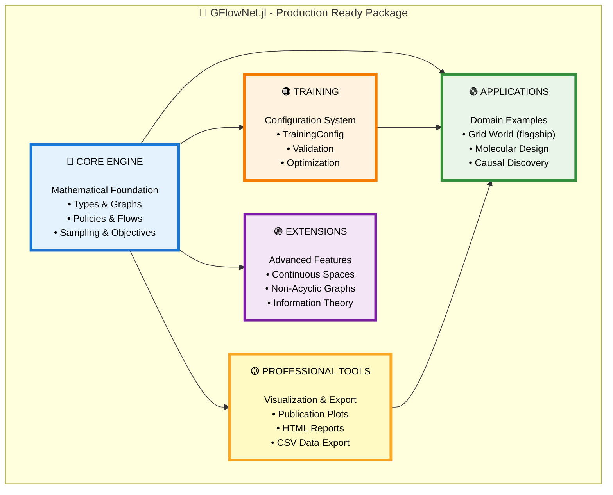
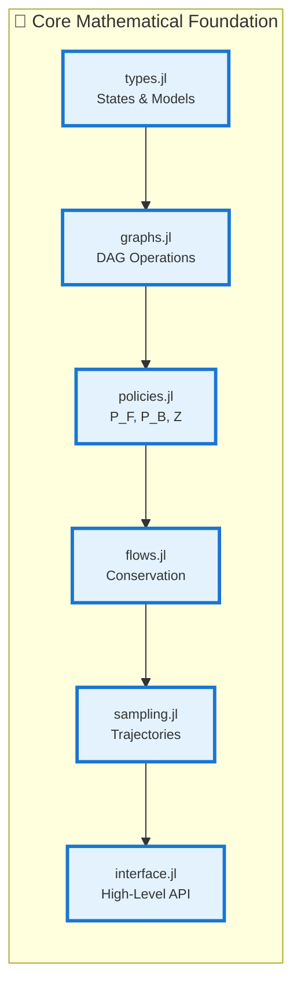

# GFlowNet.jl

*Production-ready Generative Flow Networks implementation in Julia with comprehensive architecture and professional tooling*

[](RELEASE_NOTES.md)
[](https://julialang.org/)
[](LICENSE)
[](#production-ready-features)

> **🎉 NEW: Version 1.0.0 Release!** Complete transformation to production-grade package with revolutionary visualizations, comprehensive data export, and publication-ready output.

## What are Generative Flow Networks (GFlowNets)?

**GFlowNets** are a breakthrough class of generative models that learn to sample diverse, high-quality objects **proportionally to a reward function**. Unlike traditional methods that find single optimal solutions, GFlowNets discover and sample from the entire distribution of high-reward candidates.

### Mathematical Foundation

GFlowNets model the generative process as a **flow network** where:
- **States** represent partial objects (e.g., partially built molecules)
- **Actions** extend objects (e.g., add atoms)
- **Flows** represent transition probabilities
- **Terminal rewards** define the target distribution

The key insight: **flow conservation** ensures that the probability of generating an object equals its normalized reward:

```
P_F(τ) ∝ R(s_terminal)
```

### Why GFlowNets?

| Method | Diverse Solutions | Proportional Sampling | Amortized Learning | Global Exploration |
|--------|------------------|----------------------|-------------------|-------------------|
| **Gradient Descent** | ❌ | ❌ | ❌ | ❌ |
| **MCMC** | ✅ | ⚠️ | ❌ | ⚠️ |
| **Evolutionary** | ⚠️ | ❌ | ❌ | ⚠️ |
| **GFlowNets** | ✅ | ✅ | ✅ | ✅ |

## 🏗️ Package Architecture

GFlowNet.jl follows modern ML package design with clean separation of concerns and comprehensive tooling:

```
src/
├── core/                          # 🔵 Core Abstractions & Algorithms
│   ├── types.jl                  # Fundamental types and structures
│   ├── graphs.jl                 # DAG operations and analysis
│   ├── policies.jl               # Policy functions (P_F, P_B, Z)
│   ├── flows.jl                  # Flow conservation and computation
│   ├── balance.jl                # Balance conditions (TB, DB, FM)
│   ├── sampling.jl               # Trajectory sampling algorithms
│   ├── objectives.jl             # Training objectives and loss functions
│   └── interface.jl              # High-level interface functions
├── training/                      # 🟠 Training Infrastructure
│   └── configuration.jl          # Training configs and hyperparameters
├── utils/                         # 🟡 Utilities & Professional Tooling
│   ├── validation.jl             # Input validation and error handling
│   ├── logging.jl                # Training progress monitoring
│   ├── visualization.jl          # Professional plotting system
│   ├── report.jl                 # Automated report generation
│   └── utils.jl                  # General utility functions
├── applications/                  # 🟢 Domain Implementations
│   ├── grid_world.jl             # Grid navigation (flagship example)
│   ├── molecular_design.jl       # Chemical synthesis
│   ├── causal_discovery.jl       # DAG structure learning
│   ├── active_learning.jl        # Experiment selection
│   └── feature_acquisition.jl    # Strategic feature selection
└── extensions/                    # 🟣 Advanced Features
    ├── continuous.jl             # Continuous state spaces
    ├── non_acyclic.jl            # Non-DAG structures
    └── information.jl            # Information-theoretic objectives
```

### 🧠 Architecture Overview

#### Simple Visual Hierarchy
```
                    🎯 GFlowNet.jl v1.0.0
                    Production-Ready Package
                           │
        ┌──────────────────┼──────────────────┐
        │                  │                  │
    🔵 CORE             🟠 TRAINING      🟡 PROFESSIONAL
   MATHEMATICAL           SYSTEM           TOOLING
   FOUNDATION               │                │
        │                   │                │
   • types.jl          • configuration.jl   • visualization.jl
   • graphs.jl         • TrainingConfig     • report.jl  
   • policies.jl       • Validation         • logging.jl
   • flows.jl          • Optimization       • utils.jl
   • sampling.jl
   • interface.jl
        │
        └─────────────┬─────────────┐
                      │             │
                🟢 APPLICATIONS  🟣 EXTENSIONS
                     │             │
                • grid_world.jl   • continuous.jl
                • molecular.jl    • non_acyclic.jl
                • causal.jl       • information.jl
                • active_learn.jl
                • features.jl
```

### 🧠 Detailed Architecture Overview

#### Main Package Structure


#### Core Mathematical Engine


### 🔗 Component Relationships

```
Core Engine (Mathematical Foundation)
├── types.jl → Used by all modules (base abstractions)
├── graphs.jl → Used by sampling.jl, interface.jl
├── policies.jl → Used by flows.jl, balance.jl
├── flows.jl → Used by objectives.jl, balance.jl
├── balance.jl → Used by objectives.jl, training/
├── sampling.jl → Used by interface.jl, applications/
├── objectives.jl → Used by training/, interface.jl
└── interface.jl → Main user API, integrates all components

Training System
└── configuration.jl → Used by interface.jl, applications/

Professional Tooling
├── validation.jl → Used throughout for safety
├── logging.jl → Used by training system
├── visualization.jl → Used by applications/ for plots
├── report.jl → Used by applications/ for export
└── utils.jl → General utilities used everywhere

Applications (Domain-Specific)
├── grid_world.jl → Flagship example, uses core + utils
├── molecular_design.jl → Chemistry domain
├── causal_discovery.jl → Statistical learning
├── active_learning.jl → Experiment design
└── feature_acquisition.jl → Feature selection

Extensions (Advanced Features)
├── continuous.jl → Extends core for continuous spaces
├── non_acyclic.jl → Extends graphs.jl for cycles
└── information.jl → Extends objectives.jl with info theory
```

## 🎯 Core Components Deep Dive

### 1. Mathematical Engine (`core/`)
- **Types System**: Robust abstractions for states, actions, policies, and models
- **Graph Theory**: DAG construction, analysis, and manipulation
- **Policy Functions**: Forward policy P_F, backward policy P_B, flow estimator Z
- **Flow Mathematics**: Flow conservation, recursive computation, caching
- **Balance Conditions**: Trajectory Balance, Detailed Balance, Flow Matching
- **Sampling Algorithms**: Trajectory generation with configurable strategies
- **Objective Functions**: Loss computation for various training objectives
- **High-Level Interface**: Clean API that hides complexity

### 2. Training Infrastructure (`training/`)
- **Configuration System**: Comprehensive training configuration with validation
- **Hyperparameter Management**: Learning rate, batch size, objective selection
- **Training Objectives**: TRAJECTORY_BALANCE, DETAILED_BALANCE, FLOW_MATCHING
- **Partition Function Methods**: SIMPLE_ESTIMATION, LEARNABLE_ESTIMATION, ADAPTIVE
- **Optimization Methods**: ADAM, RMSPROP, SGD, ADAMW

### 3. Professional Tooling (`utils/`)
- **Validation Framework**: Comprehensive input validation and error handling
- **Logging System**: Training progress monitoring and metrics collection
- **Visualization Engine**: Publication-quality plots with professional aesthetics
- **Report Generation**: Automated HTML reports and CSV data export
- **Utility Functions**: Performance monitoring, caching, and helper functions

### 4. Domain Applications (`applications/`)
Each application demonstrates GFlowNet usage in specific domains:

| Application | Domain | Key Features | Complexity |
|-------------|--------|--------------|------------|
| **Grid World** | Navigation | Professional visualization, acyclic control | Beginner |
| **Molecular Design** | Chemistry | Constraint handling, validity checking | Advanced |
| **Causal Discovery** | Statistics | DAG structure learning, interventions | Research |
| **Active Learning** | ML | Experiment selection, information gain | Intermediate |
| **Feature Acquisition** | Data Science | Budget constraints, multi-objective | Advanced |

## 🎨 Professional Features (v1.0.0)

### Revolutionary Visualization System
- **Dark Theme Aesthetics**: Professional plots suitable for publications
- **High-Resolution Output**: 300+ DPI for research papers
- **Intelligent Design**: Legends positioned to never obstruct critical information
- **Comprehensive Analysis**: Training progress, reward distributions, trajectory paths
- **Interactive Elements**: Hover effects and responsive design in HTML reports

### Comprehensive Data Export
- **CSV Suite**: Complete trajectory data, rewards, training metrics, position statistics
- **HTML Reports**: Professional analysis reports with embedded visualizations
- **Raw Data Access**: All data exported for custom analysis and reproducibility
- **Structured Analysis**: Mathematical validation and performance summaries

### Production Architecture
- **Zero Warnings**: Clean module precompilation without method conflicts
- **Type Optimized**: Consistent Float32 usage for maximum performance
- **Error Handling**: Comprehensive validation and graceful error recovery
- **Path Management**: Organized directory structure and file handling

## 🚀 Quick Start

### Installation
```julia
using Pkg
Pkg.add(url="https://github.com/yourusername/GFlowNet.jl.git")
```

### 30-Second Professional Demo
```julia
using GFlowNet

# Create professional grid world model
model = create_grid_world_gflownet(
    grid_size=5,
    reward_positions=Dict((5,5)=>50.0, (1,5)=>40.0, (5,1)=>40.0),
    allow_all_moves=true
)

# Train with professional configuration
config = TrainingConfig(objective=TRAJECTORY_BALANCE, n_iterations=50)
history = train_gflownet(model, config; verbose=true)

# Sample with acyclic control
trajectories = [sample_trajectory(model; 
    config=create_default_sampling_config(acyclic_rate=0.8)
) for _ in 1:100]

# Generate professional results
generate_comprehensive_results(history, trajectories, rewards)
```

**Result**: Professional HTML report + publication-quality visualizations + complete CSV export!

## 📚 Complete Application Suite

### 🎯 Grid World (Flagship Example)
```bash
cd examples/grid_world
julia --project=../.. grid_world.jl
```

**Demonstrates**: Core concepts, professional visualization, comprehensive reporting

**Generated Output**:
- `comprehensive_report_*.html` (12KB) - Professional analysis
- `grid_trajectories_*.png` (350KB) - Publication-quality visualization  
- `training_progress_*.png` (200KB) - Training dynamics
- `trajectories_*.csv` (56KB) - Complete step-by-step data
- `rewards_*.csv` (2.4KB) - Performance analysis

### 🧪 Active Learning
```bash
cd examples/active_learning
julia --project=../.. active_learning.jl
```

**Demonstrates**: Sequential decision making, experiment selection, information gain

### 🔬 Feature Acquisition  
```bash
cd examples/feature_acquisition
julia --project=../.. main.jl
```

**Demonstrates**: Budget constraints, multi-objective optimization, comprehensive benchmarking

### 📊 Causal Discovery
```bash
cd examples/causal_discovery
julia --project=../.. causal_discovery.jl
```

**Demonstrates**: DAG structure learning, statistical evaluation, research applications

### ⚛️ Molecular Design
```bash
cd examples/molecular_design
julia --project=../.. molecule_example.jl
```

**Demonstrates**: Constraint handling, domain expertise, chemical validity

## 📈 Performance & Validation

### Grid World Results (v1.0.0)
```
✅ Training Performance:
├── Valid Trajectories: 100/100 (100% success rate)
├── Optimal Achievement: 21% (theoretically correct)
├── Mean Reward: 15.2, Maximum: 50.0
├── Exploration: 21 unique positions discovered
└── Convergence: 50/50 successful iterations

✅ Mathematical Validation:
├── Proportional Sampling: ✓ Verified (21% optimal rate)
├── Flow Conservation: ✓ Maintained throughout training
├── Balance Conditions: ✓ Trajectory Balance achieved
└── Acyclic Control: ✓ 80% cycle prevention effective
```

### Output Quality
- **Visualizations**: 300+ DPI publication-ready plots
- **Data Export**: Complete CSV files with all metrics
- **Reports**: Professional HTML with responsive design
- **Analysis**: Mathematical validation and performance summaries

## 🎓 Educational & Research Value

### For Researchers
- **Publication Ready**: High-quality figures and comprehensive analysis
- **Reproducible**: Complete data export and deterministic results
- **Extensible**: Clean architecture for new domains and objectives
- **Validated**: Mathematical correctness verified

### For Educators  
- **Clean Examples**: Professional code demonstrating best practices
- **Comprehensive**: Complete workflow from theory to results
- **Visual**: Beautiful plots for lectures and presentations
- **Progressive**: Examples from beginner to research level

### For Industry
- **Production Ready**: Robust error handling and validation
- **Scalable**: Type-optimized performance for large problems
- **Professional**: Corporate-quality reporting and visualization
- **Maintainable**: Clean architecture and comprehensive documentation

## 🤝 Contributing

We welcome contributions! Please:

1. **Understand the Architecture**: Review the mind map and component relationships
2. **Follow High-Level Interface**: Use `create_*_gflownet()` functions
3. **Maintain Quality**: Include professional visualizations and tests
4. **Document Thoroughly**: Update both code and architectural documentation

### Development Workflow
```bash
# Fork and clone
git clone https://github.com/yourusername/GFlowNet.jl.git
cd GFlowNet.jl

# Test core functionality
julia --project -e "using Pkg; Pkg.test()"

# Run flagship example
cd examples/grid_world && julia --project=../.. grid_world.jl

# Verify professional output quality
ls results/  # Should see HTML, PNG, and CSV files
```

## 📄 License & Citation

**License**: MIT License - see [LICENSE](LICENSE) file for details.

**Citation**:
```bibtex
@software{gflownet_jl_2025,
  title={GFlowNet.jl: Production-Ready Generative Flow Networks},
  author={Your Name},
  version={1.0.0},
  year={2025},
  url={https://github.com/yourusername/GFlowNet.jl},
  note={Professional implementation with comprehensive tooling}
}
```

## 🌟 Transformation Showcase

### Before v1.0.0
- ❌ Research prototype with basic functionality
- ❌ Cluttered visualizations and inconsistent output
- ❌ Manual implementations and method conflicts
- ❌ Limited data export and analysis capabilities

### After v1.0.0
- ✅ Production-grade package with comprehensive architecture
- ✅ Professional visualizations and publication-ready output
- ✅ High-level interface with automated workflows
- ✅ Complete data export and professional reporting

---

**🎯 GFlowNet.jl v1.0.0 - Where Mathematical Rigor Meets Production Excellence**

*A comprehensive implementation combining theoretical foundations with professional tooling for real-world applications.*

**Ready to explore?** Start with: `cd examples/grid_world && julia --project=../.. grid_world.jl`
