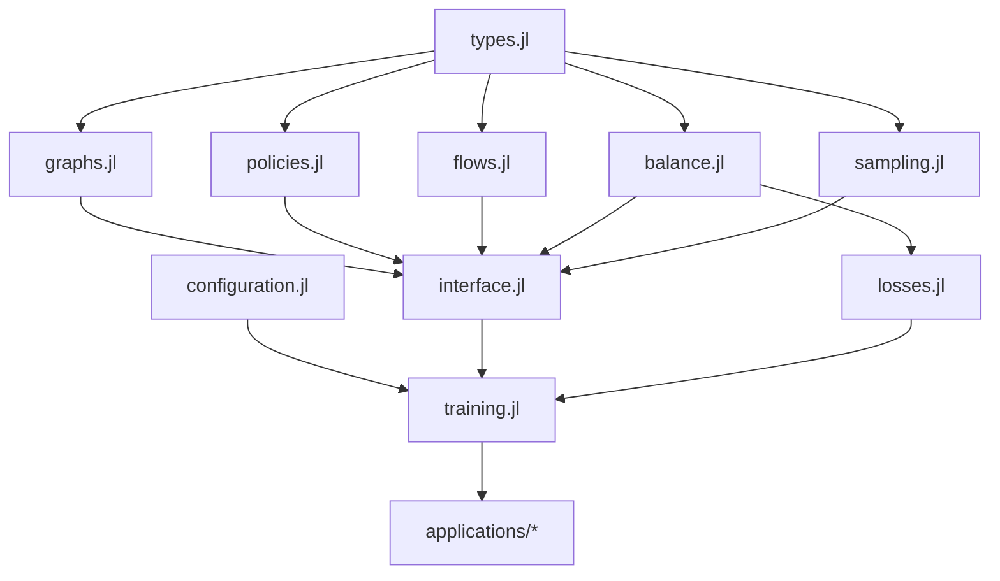

# GFlowNet.jl Module Structure Reference

## Overview

This document provides a comprehensive reference for the GFlowNet.jl module structure after the January 2025 training reorganization. It explains where to find each component and how they interact.

## Directory Structure

```
src/
├── GFlowNet.jl              # Main module file with exports
├── core/                    # Core mathematical components
│   ├── types.jl            # Abstract types and interfaces
│   ├── graphs.jl           # On-demand DAG operations
│   ├── policies.jl         # Forward/backward policies + validation
│   ├── flows.jl            # Flow computation and caching
│   ├── balance.jl          # Mathematical loss definitions
│   ├── sampling.jl         # Trajectory sampling
│   ├── interface.jl        # Model creation and high-level API
│   └── multi_start.jl      # Multi-start GFlowNets
├── training/               # Training infrastructure (NEW organization)
│   ├── configuration.jl    # TrainingConfig and related types
│   ├── objectives.jl       # Training objective definitions
│   ├── training.jl         # Main training loop
│   ├── losses.jl           # Loss computation functions
│   ├── utils.jl            # Training utilities
│   └── multi_start_training.jl  # Multi-start training
├── utils/                  # Utilities and helpers
│   ├── utils.jl            # General utilities
│   ├── validation.jl       # Input/output validation
│   ├── logging.jl          # Training progress logging
│   ├── visualization.jl    # Plotting and visualization
│   └── report.jl           # HTML report generation
├── applications/           # Domain implementations
│   ├── grid_world.jl       # Grid navigation domain
│   ├── molecular_design.jl # Molecular synthesis
│   ├── causal_discovery.jl # DAG structure learning
│   ├── active_learning.jl  # Experiment selection
│   └── supply_chain_optimization.jl  # Logistics
└── extensions/            # Advanced features
    ├── continuous.jl       # Continuous state spaces
    ├── non_acyclic.jl      # Non-DAG structures
    └── information.jl      # Information-theoretic objectives
```

## Key Module Changes (January 2025)

### Before Reorganization
- `core/interface.jl` contained both model creation AND training functions
- Training logic mixed with core API
- Difficult to navigate and maintain

### After Reorganization
- `core/interface.jl` - **Only** model creation and sampling
- `training/` directory - **All** training-related code
- Clear separation of concerns

## Module Loading Order

The modules are loaded in a specific order to handle dependencies:

```julia
# 1. Core types and utilities first
include("core/types.jl")
include("utils/utils.jl")

# 2. Core mathematical components
include("core/graphs.jl")
include("core/policies.jl")
include("core/flows.jl")
include("core/balance.jl")
include("core/sampling.jl")

# 3. Training configuration (needed by interface)
include("training/configuration.jl")

# 4. High-level interface
include("core/interface.jl")
include("core/multi_start.jl")

# 5. Training infrastructure
include("training/objectives.jl")
include("training/utils.jl")
include("training/losses.jl")
include("training/training.jl")
include("training/multi_start_training.jl")

# 6. Utilities, applications, extensions...
```

## Finding Key Functions

### Model Creation
- `create_gflownet()` → `src/core/interface.jl`
- `create_forward_policy()` → `src/core/interface.jl`
- `create_backward_policy()` → `src/core/interface.jl`
- `create_multi_start_gflownet()` → `src/core/multi_start.jl`

### Training Functions
- `train_gflownet()` → `src/training/training.jl`
- `train_step!()` → `src/training/training.jl`
- `compute_trajectory_loss()` → `src/training/losses.jl`
- `compute_single_trajectory_loss()` → `src/training/losses.jl`

### Loss Functions
- `trajectory_balance_loss()` → `src/core/balance.jl`
- `detailed_balance_loss()` → `src/core/balance.jl`
- `flow_matching_loss()` → `src/core/balance.jl`

### Sampling
- `sample_trajectory()` → `src/core/interface.jl`
- `sample_action_from_policy()` → `src/core/interface.jl`

### Validation
- `validate_backward_policy_normalization()` → `src/core/policies.jl`
- `validate_backward_policy_consistency()` → `src/core/policies.jl`
- `monitor_backward_policy_learning()` → `src/core/policies.jl`

## Import Patterns

### For Users
```julia
using GFlowNet

# All exported functions available
model = create_grid_world_gflownet(...)
config = TrainingConfig(...)
history = train_gflownet(model, config)
```

### For Tests/Development
```julia
using GFlowNet
using GFlowNet: compute_trajectory_loss  # Non-exported function
```

### Common Import Issues After Reorganization
1. **Missing `compute_trajectory_loss`**
   - Add: `using GFlowNet: compute_trajectory_loss`
   - Located in: `src/training/losses.jl`

2. **Optimizer name conflicts**
   - Both GFlowNet and Optimisers.jl export ADAM
   - Use: `GFlowNet.ADAM` or `using GFlowNet: ADAM`

3. **Type imports**
   - Many types are exported, but some internal ones need explicit import
   - Example: `using GFlowNet: ForwardPolicy, BackwardPolicy`

## Creating New Components

### Adding a New Training Objective
1. Add loss function to `src/core/balance.jl`
2. Add case to `compute_trajectory_loss()` in `src/training/losses.jl`
3. Add enum value to `TrainingObjective` in `src/training/configuration.jl`
4. Export if needed in `src/GFlowNet.jl`

### Adding a New Domain
1. Create file in `src/applications/your_domain.jl`
2. Implement required interface:
   - `state_to_features()`
   - `is_terminal_state()`
   - `reward()`
   - `is_applicable()`
   - `apply_action()`
3. Create high-level `create_your_domain_gflownet()` function
4. Include in `src/GFlowNet.jl` and add exports

### Adding Training Features
1. Core training loop → `src/training/training.jl`
2. Loss computation → `src/training/losses.jl`
3. Configuration options → `src/training/configuration.jl`
4. Utilities → `src/training/utils.jl`

## Module Dependencies



## Best Practices

1. **Import what you need**: Use explicit imports for non-exported functions
2. **Check exports**: Run `names(GFlowNet)` to see all exported symbols
3. **Follow patterns**: Look at existing domains/objectives for examples
4. **Test imports**: Always test after adding new imports
5. **Document dependencies**: Note which internal functions you're using

## Troubleshooting

### "UndefVarError: X not defined"
- Check if X is exported: `X in names(GFlowNet)`
- If not, add explicit import: `using GFlowNet: X`
- Check if module was moved in reorganization

### "Method not found"
- Function might have moved modules
- Check this reference for new location
- Ensure you have the latest imports

### "Ambiguous name"
- Multiple modules export same name
- Use qualified name: `GFlowNet.X` or `OtherModule.X`
- Or use explicit import to choose one

## Summary

The January 2025 reorganization creates a cleaner, more maintainable structure:
- **Core mathematics** stays in `core/`
- **Training logic** moves to `training/`
- **Clear separation** makes navigation easier
- **Consistent patterns** for adding new features

Always refer to this guide when working with the reorganized codebase!