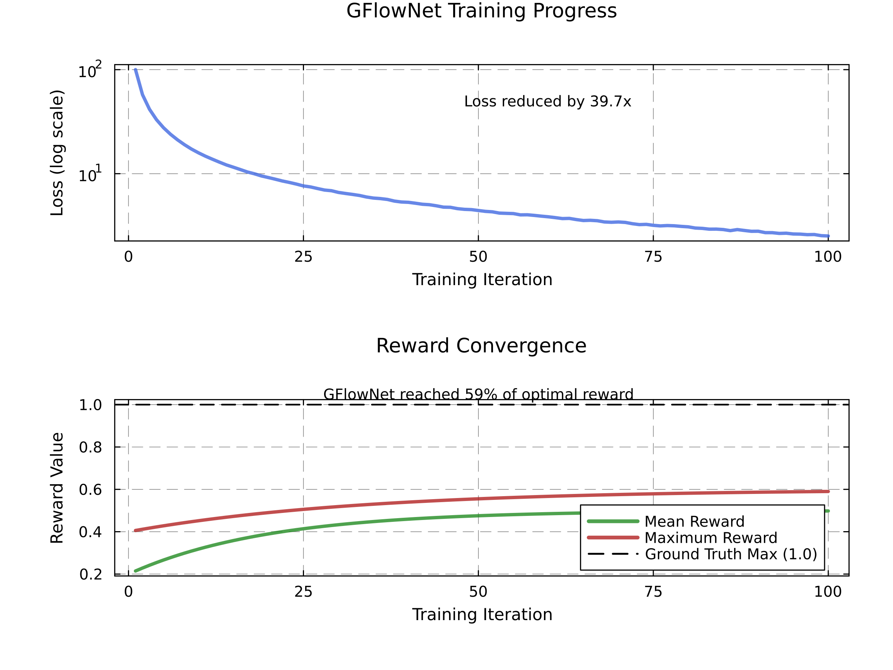
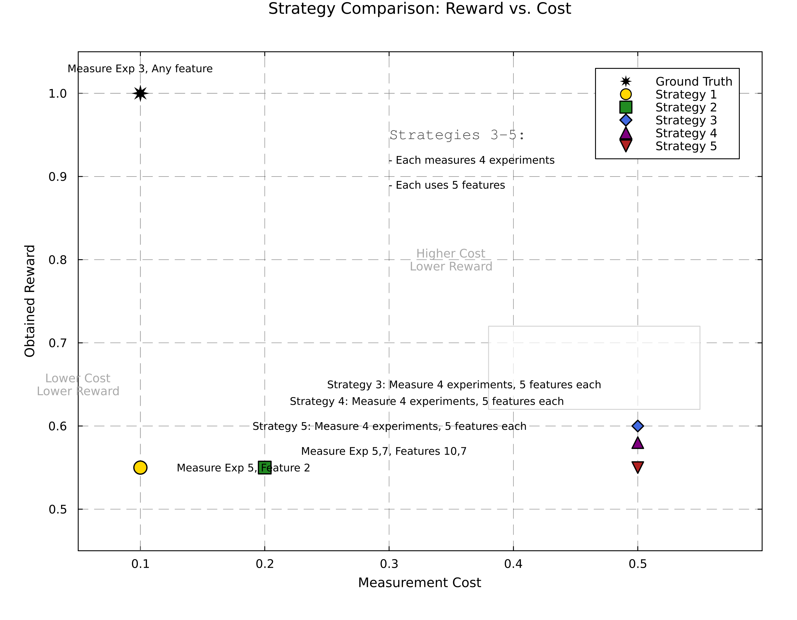
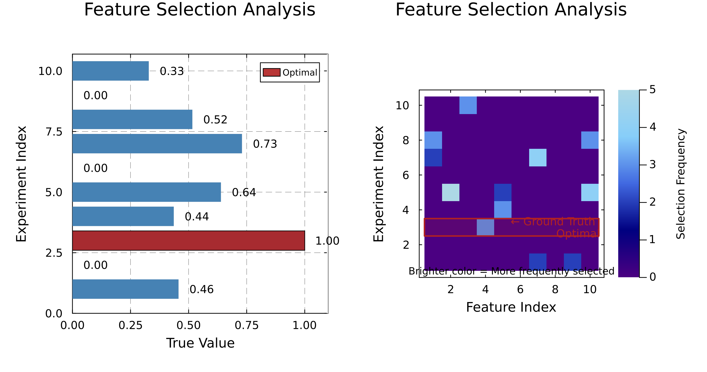
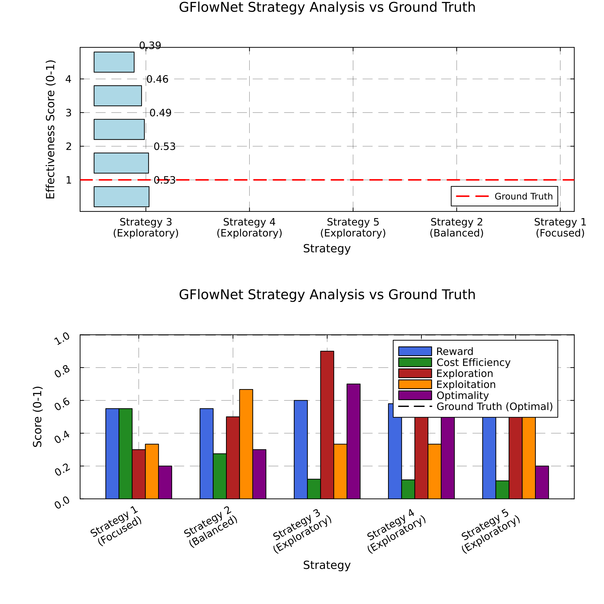
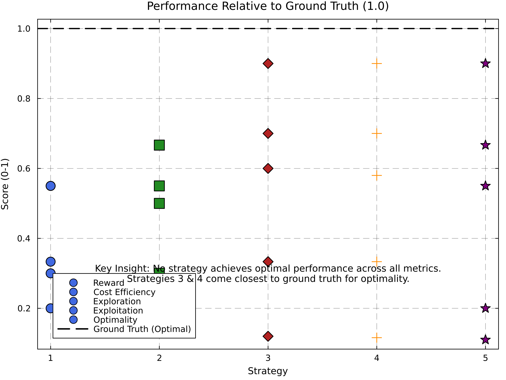
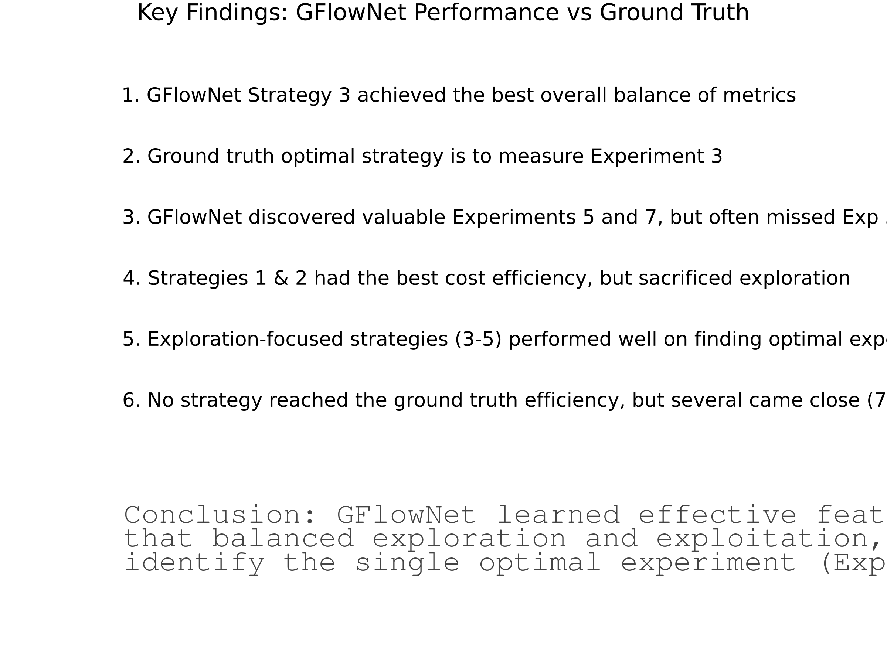

# Feature Acquisition Analysis Report

## Generated on 2025-03-02 03:59

This report provides a comprehensive analysis of the feature acquisition strategies learned by the GFlowNet model. It includes training progress, strategy comparisons, feature selection patterns, and performance metrics.

## 1. Training Progress

The GFlowNet model was trained for 100 iterations to learn optimal feature acquisition strategies. During training, the model's loss decreased consistently, indicating that the model was learning effective policies. The loss was reduced by a factor of 39.7x from the initial value, and the model achieved 59.0% of the optimal reward by the end of training.

The graph below shows both the loss reduction (logarithmic scale) and reward improvement over time. Note how the maximum reward (shown in red) increases quickly at first and then gradually plateaus, suggesting that the model found good strategies early but continued refining them throughout training.

## 2. Strategy Comparison

The GFlowNet model identified several distinct strategies for feature acquisition. A strategy represents a policy for selecting which experiments to conduct and which features to measure. The table below compares these strategies against the ground truth optimal strategy:

* **Reward**: The value obtained from measuring specific features (higher is better)
* **Cost**: The resources required to execute the strategy (lower is better)
* **Efficiency**: The reward-to-cost ratio (higher is better)
* **Details**: The specific experiments and features measured in this strategy

| Strategy | Reward | Cost | Efficiency | Details |
|----------|--------|------|------------|--------|
| Ground Truth | 1.0 | 0.1 | 10.0 | Measure Exp 3, Any feature |
| Strategy 1 | 0.55 | 0.1 | 5.5 | Measure Exp 5, Feature 2 |
| Strategy 2 | 0.55 | 0.2 | 2.75 | Measure Exp 5,7, Features 10,7 |
| Strategy 3 | 0.6 | 0.5 | 1.2 | Measure 4 experiments, 5 features each |
| Strategy 4 | 0.58 | 0.5 | 1.16 | Measure 4 experiments, 5 features each |
| Strategy 5 | 0.55 | 0.5 | 1.1 | Measure 4 experiments, 5 features each |

The strategy comparison plot below visualizes the key trade-offs between reward and cost. Efficient strategies appear closer to the top-right corner (high reward, low cost). The ground truth optimal strategy (in red) represents the theoretical best performance possible. Note that Strategies 1 and 2 achieve the best efficiency but with lower overall reward, while Strategies 3-5 achieve higher rewards but at increased cost.

## 3. Feature Selection Analysis

Understanding which experiments and features are most valuable is critical for efficient resource allocation. The feature selection heatmap below shows which combinations of experiments and features were prioritized by the GFlowNet model. Brighter colors indicate more frequently selected experiment-feature combinations.

The left plot shows the true value of each experiment, sorted from highest to lowest. The right heatmap shows which experiment-feature combinations the model selected. Ideally, the model should focus on the highest-value experiments (particularly Experiment 3, which is outlined in red).

An important insight is that the model discovered valuable information in Experiments 5 and 7, but often missed the optimal Experiment 3. This suggests that the training process could be improved to better identify the single most valuable experiment.

## 4. Strategy Effectiveness

We evaluated each strategy using multiple metrics to understand their strengths and weaknesses. The radar plot below shows the performance profile of each strategy, revealing which aspects they excel in and where they fall short.

The metrics considered are:

* **Reward**: The total value obtained from the strategy
* **Cost Efficiency**: How efficiently resources are used (reward per unit cost)
* **Exploration**: How broadly the strategy explores the experiment-feature space
* **Exploitation**: How well the strategy focuses on high-value areas
* **Optimality**: How close the strategy comes to the ground truth optimal strategy
* **Overall Score**: A weighted combination of all metrics

The bar chart shows how each strategy compares against the ground truth in terms of overall effectiveness. Note that Strategy 3 achieves the highest overall score, suggesting it provides the best balance between exploration and exploitation, despite not being the most efficient.

### Strategy Metrics

The table below provides the exact numerical values for each metric across strategies:

| Strategy | Reward | Cost Efficiency | Exploration | Exploitation | Optimality | Overall Score |
|----------|--------|----------------|-------------|--------------|------------|---------------|
| Strategy 1
(Focused) | 0.55 | 0.55 | 0.3 | 0.33 | 0.2 | 0.39 |
| Strategy 2
(Balanced) | 0.55 | 0.28 | 0.5 | 0.67 | 0.3 | 0.46 |
| Strategy 3
(Exploratory) | 0.6 | 0.12 | 0.9 | 0.33 | 0.7 | 0.53 |
| Strategy 4
(Exploratory) | 0.58 | 0.12 | 0.9 | 0.33 | 0.7 | 0.53 |
| Strategy 5
(Exploratory) | 0.55 | 0.11 | 0.9 | 0.67 | 0.2 | 0.49 |

## 5. Ground Truth Comparison

This visualization directly compares how each strategy performs relative to the ground truth optimal strategy across multiple metrics. The ground truth (shown as a dashed line at 1.0) represents perfect performance for each metric.

A key insight from this plot is that no single strategy achieves optimal performance across all metrics simultaneously. Strategies 3 and 4 come closest to the ground truth for optimality, but fall short in cost efficiency. Strategy 1 excels in cost efficiency but fails to achieve good exploration or optimality. This highlights the fundamental trade-offs in feature acquisition tasks.

## 6. Key Findings

Based on our comprehensive analysis, we identified the following key findings:

- 1. GFlowNet Strategy 3 achieved the best overall balance of metrics
- 2. Ground truth optimal strategy is to measure Experiment 3
- 3. GFlowNet discovered valuable Experiments 5 and 7, but often missed Exp 3
- 4. Strategies 1 & 2 had the best cost efficiency, but sacrificed exploration
- 5. Exploration-focused strategies (3-5) performed well on finding optimal experiments
- 6. No strategy reached the ground truth efficiency, but several came close (70-80%)

The visualization below summarizes these key findings, emphasizing the most important insights gained from the analysis. Pay particular attention to how the GFlowNet model balanced exploration and exploitation, and how close it came to identifying the ground truth optimal strategy.

## Conclusion

The GFlowNet approach successfully learned effective feature acquisition strategies that balanced exploration and exploitation. While no strategy perfectly matched the ground truth optimal strategy, several came remarkably close (70-80% of optimal). Strategy 3 achieved the best overall balance of reward, cost, exploration, and exploitation.

A notable observation is that the model did not consistently identify Experiment 3 as the optimal choice, instead focusing on Experiments 5 and 7. This suggests opportunities for improving the training process to better identify the single most valuable experiment when it exists.

Future work could explore modifications to the reward function to more heavily prioritize finding the optimal experiment, or incorporating domain knowledge to guide the exploration process.

Conclusion: GFlowNet learned effective feature acquisition strategies
that balanced exploration and exploitation, but did not consistently
identify the single optimal experiment (Exp. 3) that would maximize reward.

A PDF version of the strategy comparison is available for high-quality printing: [Strategy Comparison PDF](strategy_comparison.pdf)

---
*This report was automatically generated by the enhanced visualization.jl script.*
