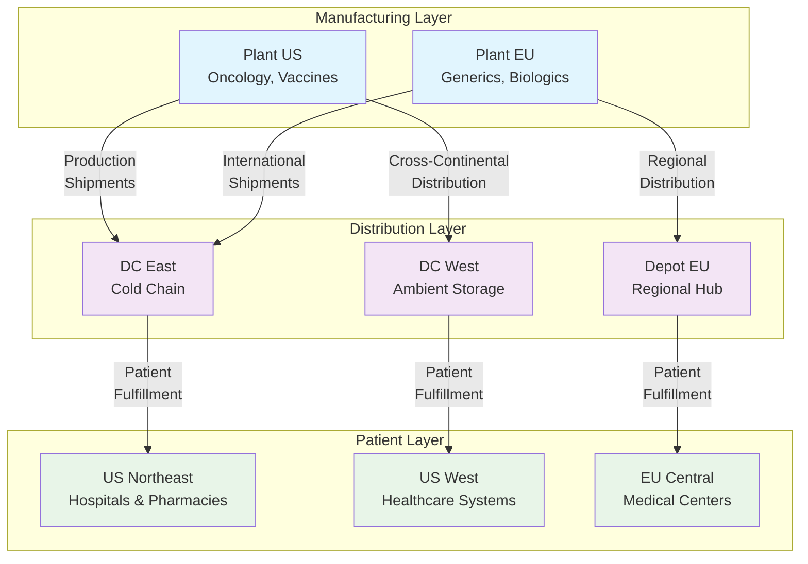
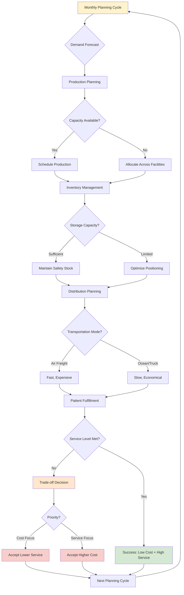
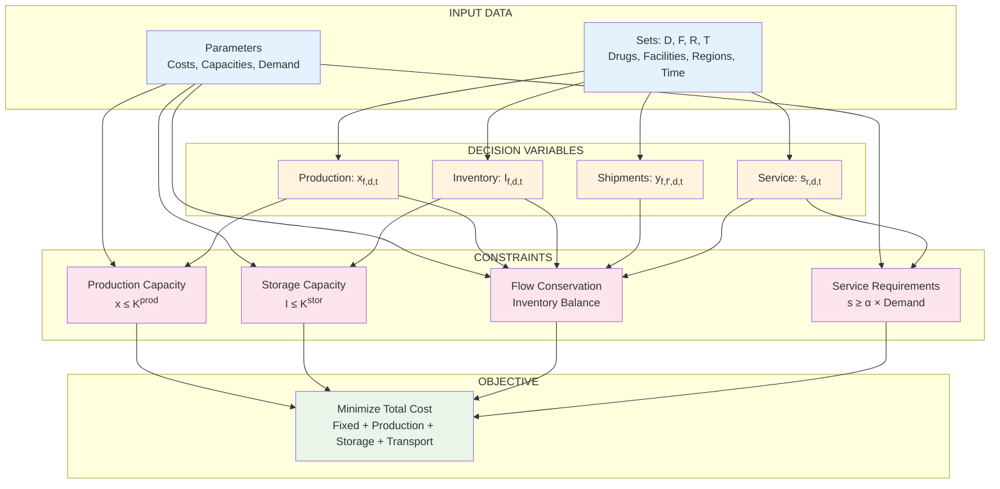
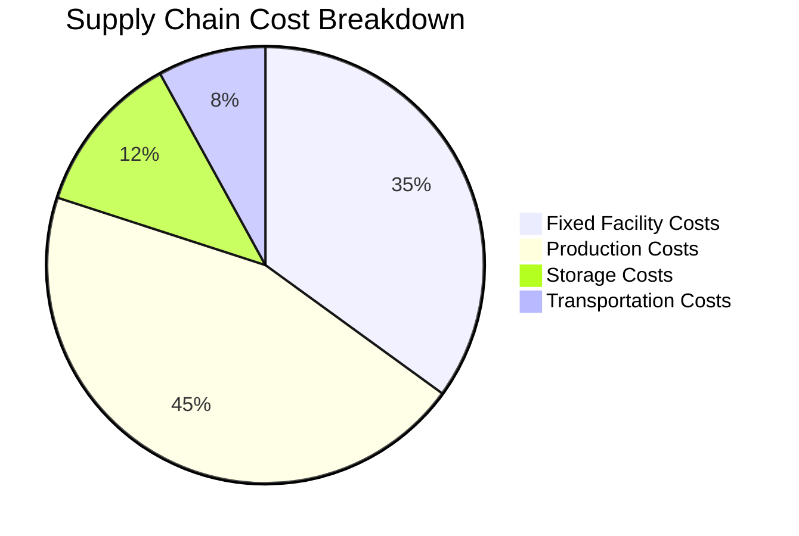
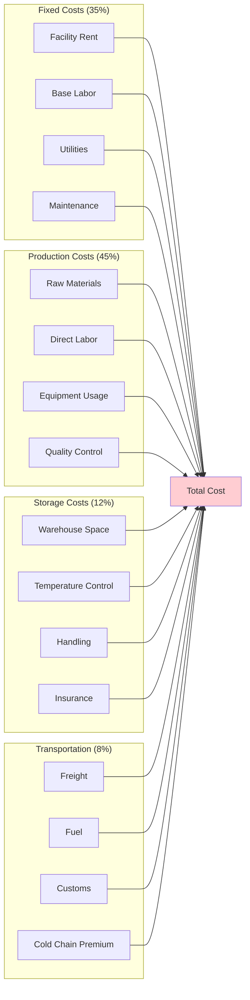
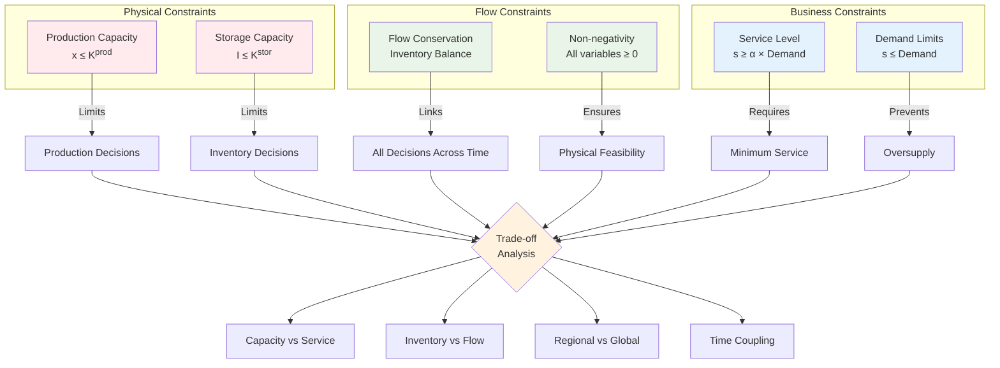
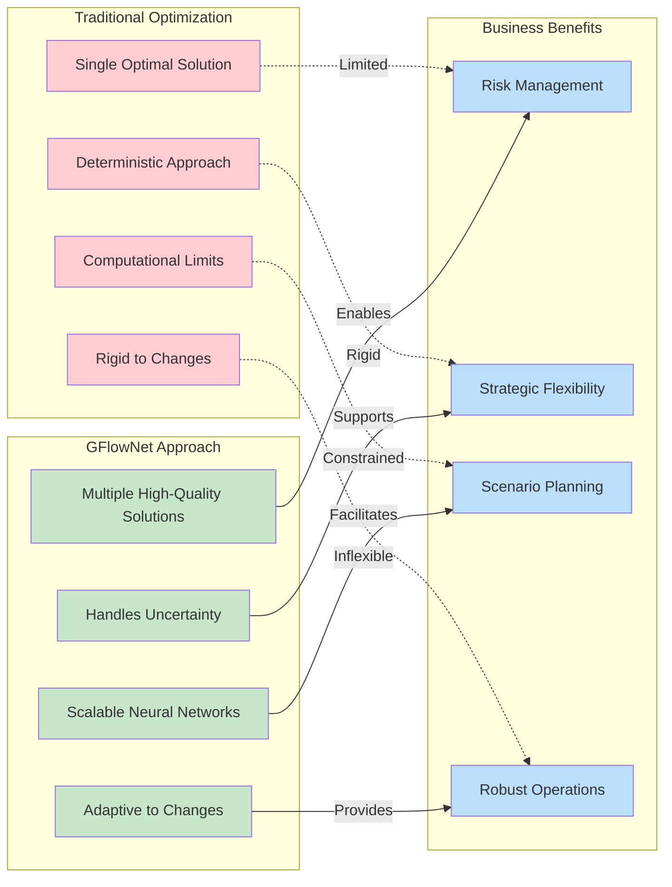

# Pharmaceutical Supply Chain Flow Optimization with GFlowNet

## Executive Summary

This document presents a comprehensive mathematical formulation of a real-world pharmaceutical supply chain flow optimization problem solved using Generative Flow Networks (GFlowNet). The problem addresses critical challenges in pharmaceutical operations: **how to optimally coordinate production, inventory, and distribution decisions across a multi-echelon network to minimize costs while ensuring reliable patient access to medications**.

## 1. Problem Introduction and Context

### 1.1 Real-World Motivation

Pharmaceutical supply chains are among the most complex and critical logistics networks in the world. Unlike typical consumer goods, pharmaceutical products have unique characteristics that make supply chain optimization particularly challenging:

**Product Complexity:**
- **Temperature sensitivity**: Many drugs require cold chain management (2-8°C) or frozen storage (-20°C)
- **Limited shelf life**: Biologics may expire in 3-6 months, requiring careful inventory rotation
- **High value**: A single vial of specialty oncology drugs can cost thousands of dollars
- **Regulatory constraints**: Different drugs have different approval status across regions

**Network Complexity:**
- **Multi-echelon structure**: Manufacturing plants → Distribution centers → Regional depots → Hospitals/Pharmacies
- **Global scale**: Production in one continent, distribution worldwide
- **Capacity constraints**: Limited manufacturing capacity for specialized drugs
- **Service criticality**: Patient lives depend on drug availability

**Business Challenges:**
- **Cost pressure**: Healthcare cost containment drives efficiency requirements
- **Service requirements**: Regulatory mandates for drug availability (typically 95%+ service levels)
- **Demand uncertainty**: Disease outbreaks, seasonal variations, new treatment protocols
- **Supply disruptions**: Manufacturing issues, regulatory shutdowns, transportation delays

### 1.2 Supply Chain Network Structure

The pharmaceutical supply chain follows a multi-echelon structure with complex interdependencies:



### 1.3 Problem Components

Our optimization problem involves coordinating decisions across four key components:

**1. Production Planning**
- **What to produce**: Which drugs to manufacture at each facility
- **When to produce**: Timing of production runs to meet demand
- **How much to produce**: Batch sizes balancing efficiency and inventory costs
- **Where to produce**: Allocation across multiple manufacturing sites

**2. Inventory Management**
- **Safety stock levels**: Buffer inventory to handle demand variability
- **Inventory positioning**: Where to hold stock in the network
- **Shelf life management**: First-in-first-out policies for perishable drugs
- **Storage capacity allocation**: Optimal use of limited warehouse space

**3. Distribution Strategy**
- **Transportation modes**: Air freight for urgent/cold chain vs. ocean for cost efficiency
- **Shipment consolidation**: Combining orders to reduce transportation costs
- **Route optimization**: Efficient paths through the multi-echelon network
- **Lead time management**: Balancing speed vs. cost in distribution

**4. Demand Fulfillment**
- **Service level targets**: Meeting 95%+ availability requirements
- **Regional prioritization**: Allocation during supply shortages
- **Emergency response**: Expedited supply for critical shortages
- **Demand forecasting integration**: Using predictions to guide decisions

### 1.3 Decision Variables Overview

The optimization involves three types of interconnected decisions:

**Operational Decisions (Monthly):**
- Production quantities at each manufacturing facility for each drug
- Inventory levels maintained at each facility for each drug
- Shipment quantities between all facility pairs for each drug
- Demand fulfillment quantities for each patient region

**Temporal Decisions:**
- Sequencing of production and distribution activities
- Timing of inventory replenishment
- Coordination across multiple planning periods

**Strategic Decisions (Embedded):**
- Capacity utilization strategies
- Network flow patterns
- Service level vs. cost trade-offs

### 1.4 Constraints and Objectives

**Hard Constraints (Must be satisfied):**
- Production cannot exceed facility capacity
- Inventory cannot exceed storage capacity
- Cannot ship more than available inventory
- Cannot serve more demand than required
- Flow conservation: inventory balance equations

**Soft Constraints (Objectives to optimize):**
- Minimize total supply chain costs
- Maximize service level achievement
- Balance utilization across facilities
- Minimize waste from expired products

### 1.5 Decision Process Flow

The supply chain optimization involves a sequence of interconnected decisions:



### 1.6 Why GFlowNet for This Problem?

Traditional optimization approaches (linear programming, mixed-integer programming) find single "optimal" solutions. However, pharmaceutical supply chains operate under significant uncertainty:

**Uncertainty Sources:**
- Demand variability (disease outbreaks, treatment changes)
- Supply disruptions (manufacturing issues, regulatory problems)
- Cost fluctuations (transportation, raw materials)
- Regulatory changes (new approvals, safety requirements)

**GFlowNet Advantages:**
- **Diverse solutions**: Generates multiple high-quality strategies
- **Risk management**: Portfolio of solutions for different scenarios
- **Adaptability**: Solutions that work under various conditions
- **Interpretability**: Clear operational meaning of each solution
- **Scalability**: Handles large, complex networks efficiently

## 2. Problem Statement

**Primary Objective**: Minimize total pharmaceutical supply chain cost while maintaining ≥95% service level for patient demand across a multi-echelon network.

**Secondary Objectives**:
- Maximize operational efficiency through balanced capacity utilization
- Minimize inventory waste from product expiration
- Ensure robust operations under demand and supply uncertainty

**Key Innovation**: Unlike traditional approaches that provide single optimal solutions, this GFlowNet formulation generates a diverse portfolio of high-quality operational strategies, enabling supply chain managers to select solutions that best match their risk tolerance and strategic priorities.

## 3. Mathematical Formulation

### 3.1 Mathematical Model Overview

The complete mathematical model structure shows the relationships between all components:



### 3.2 Sets and Indices

The mathematical model is built on five fundamental sets that represent the key entities in the pharmaceutical supply chain:

**Drug Portfolio ($D$)**: Set of pharmaceutical products, indexed by $d \in D$
- Represents the complete portfolio of drugs managed by the pharmaceutical company
- Each drug has unique characteristics (storage requirements, shelf life, production complexity)
- Typical size: 5-50 drugs for a focused therapeutic area, 100+ for large pharma companies
- Examples: $d_1$ = "Oncology Drug A", $d_2$ = "Vaccine B", $d_3$ = "Generic Drug C"

**Facility Network ($F$)**: Set of all facilities in the supply chain, indexed by $f \in F$
- **Manufacturing facilities ($F^M \subseteq F$)**: Production sites with specialized capabilities
  - High-tech facilities for biologics production
  - Large-scale plants for generic drug manufacturing
  - Specialized facilities for controlled substances
- **Distribution centers ($F^D \subseteq F$)**: Regional warehouses for inventory management
  - Temperature-controlled storage for cold chain products
  - High-volume automated facilities for efficient order fulfillment
  - Strategic locations near major population centers
- **Regional depots ($F^R \subseteq F$)**: Local distribution points
  - Last-mile distribution to hospitals and pharmacies
  - Emergency stock for critical medications
  - Compliance with local regulatory requirements

**Patient Regions ($R$)**: Set of geographic markets, indexed by $r \in R$
- Represents distinct patient populations with specific demand patterns
- Defined by regulatory boundaries (FDA regions, EMA territories)
- Each region has unique demand characteristics and service requirements
- Examples: $r_1$ = "US Northeast", $r_2$ = "European Union", $r_3$ = "Asia-Pacific"

**Time Periods ($T$)**: Set of planning horizons, indexed by $t \in T$
- Typically monthly periods for tactical planning (3-12 months ahead)
- Allows for seasonal demand patterns and production scheduling
- Enables coordination of production campaigns with demand cycles
- Example: $T = \{1, 2, 3\}$ represents a 3-month planning horizon

### 3.2 Parameters (Given Data)

The model parameters represent the physical and economic characteristics of the pharmaceutical supply chain. These are typically estimated from historical data, market research, and engineering specifications.

**Drug-Specific Properties:**

$c_d^{prod}$: **Production cost per unit** of drug $d$ ($/unit)
- Includes raw materials, labor, equipment depreciation, and quality control
- Varies significantly: generics ~$1-10/unit, biologics ~$100-1000/unit
- Critical for production planning decisions and facility allocation

$c_d^{stor}$: **Storage cost per unit per period** for drug $d$ ($/unit/month)
- Includes warehouse space, temperature control, handling, and insurance
- Cold chain products have 2-5x higher storage costs than ambient products
- Drives inventory level decisions and storage location choices

$\tau_d$: **Shelf life** of drug $d$ (months)
- Time from production until expiration and disposal
- Ranges from 3 months (some biologics) to 36+ months (stable generics)
- Constrains inventory holding periods and influences production scheduling

**Facility Characteristics:**

$K_{f,d}^{prod}$: **Production capacity** of facility $f$ for drug $d$ (units/month)
- Maximum monthly production based on equipment, labor, and regulatory constraints
- Zero for non-manufacturing facilities ($f \notin F^M$)
- May vary by drug due to different production complexity and setup requirements
- Example: Biologic facility might produce 1000 units/month of complex drugs, 5000 units/month of simpler products

$K_{f,d}^{stor}$: **Storage capacity** of facility $f$ for drug $d$ (units)
- Maximum inventory that can be held, considering space and temperature requirements
- Frozen products require specialized freezers with limited capacity
- Controlled substances need secure storage with restricted access
- Capacity sharing across drugs may require additional constraints

$c_f^{fixed}$: **Fixed operating cost** of facility $f$ per period ($/month)
- Includes rent, utilities, base labor, maintenance, and regulatory compliance
- Independent of production or storage volume
- Ranges from $10K/month for small depots to $1M+/month for major manufacturing plants

$c_f^{var}$: **Variable cost per unit processed** at facility $f$ ($/unit)
- Additional costs for handling, processing, and quality assurance per unit
- Includes variable labor, packaging, and facility-specific overhead
- Typically $0.50-5.00/unit depending on facility type and automation level

**Transportation Network:**

$c_{f,f',d}^{trans}$: **Transportation cost per unit** of drug $d$ from facility $f$ to $f'$ ($/unit)
- Includes freight, packaging, insurance, and handling costs
- Varies by distance, transportation mode, and storage requirements
- Cold chain products require refrigerated transport (2-3x higher cost)
- International shipments include customs and regulatory costs

$\tau_{f,f'}$: **Lead time** from facility $f$ to $f'$ (days)
- Transportation time plus handling and customs clearance
- Affects inventory planning and emergency response capability
- Ranges from 1 day (local truck) to 30+ days (international ocean freight)

**Market Demand:**

$D_{r,d,t}$: **Demand** for drug $d$ in region $r$ during period $t$ (units)
- Patient demand based on epidemiological data and treatment protocols
- Includes seasonal variations (flu vaccines) and trend growth (aging population)
- May be deterministic (known) or stochastic (uncertain) depending on model variant
- Critical input for service level achievement and capacity planning

$\alpha_r$: **Minimum service level requirement** for region $r$ (fraction)
- Regulatory or business requirement for demand fulfillment
- Typically 95-99% for essential medications
- May vary by region based on local regulations and competitive requirements
- Drives safety stock decisions and distribution strategy

### 3.3 Decision Variables (What We Optimize)

The decision variables represent the operational choices that supply chain managers must make to optimize network performance. These are the outputs of the optimization process.

**Production Planning Decisions:**

$x_{f,d,t}$: **Production quantity** of drug $d$ at facility $f$ in period $t$ (units)
- **Business meaning**: How much of each drug to manufacture at each plant each month
- **Operational impact**: Determines capacity utilization, production costs, and inventory availability
- **Constraints**: Cannot exceed facility capacity $K_{f,d}^{prod}$
- **Trade-offs**: Large batches reduce setup costs but increase inventory holding costs
- **Example**: $x_{1,2,1} = 5000$ means "produce 5000 units of drug 2 at facility 1 in month 1"
- **Typical range**: 0 to facility capacity (0-10,000 units/month for major facilities)

**Inventory Management Decisions:**

$I_{f,d,t}$: **Inventory level** of drug $d$ at facility $f$ at end of period $t$ (units)
- **Business meaning**: How much stock to maintain at each location for each product
- **Operational impact**: Balances service level (availability) against holding costs
- **Constraints**: Cannot exceed storage capacity $K_{f,d}^{stor}$, must be non-negative
- **Trade-offs**: Higher inventory improves service but increases costs and waste risk
- **Strategic importance**: Determines network resilience and response capability
- **Example**: $I_{3,1,2} = 2000$ means "hold 2000 units of drug 1 at facility 3 at end of month 2"

**Transportation and Distribution Decisions:**

$y_{f,f',d,t}$: **Shipment quantity** of drug $d$ from facility $f$ to facility $f'$ in period $t$ (units)
- **Business meaning**: How much product to move between network locations
- **Operational impact**: Determines transportation costs and inventory positioning
- **Constraints**: Cannot ship more than available inventory at source facility
- **Network effects**: Enables multi-echelon coordination and demand pooling
- **Cost implications**: Transportation costs vs. inventory positioning benefits
- **Example**: $y_{1,3,2,1} = 1500$ means "ship 1500 units of drug 2 from facility 1 to facility 3 in month 1"

**Customer Service Decisions:**

$s_{r,d,t}$: **Service quantity** of drug $d$ to region $r$ in period $t$ (units)
- **Business meaning**: How much demand to fulfill for each market each month
- **Service impact**: Directly determines customer service levels and revenue
- **Constraints**: Cannot exceed available inventory at distribution facilities
- **Business priority**: Must meet minimum service level requirements $\alpha_r$
- **Revenue impact**: Unfulfilled demand represents lost sales and patient impact
- **Example**: $s_{2,1,3} = 800$ means "serve 800 units of drug 1 to region 2 in month 3"

**Decision Variable Relationships:**

The decision variables are interconnected through flow conservation equations:
- **Production** creates inventory at manufacturing facilities
- **Transportation** moves inventory between facilities
- **Service** consumes inventory to satisfy customer demand
- **Inventory** balances these flows over time

**Decision Complexity:**
- **Scale**: For a network with 5 facilities, 4 drugs, 3 regions, and 3 time periods:
  - Production decisions: 5×4×3 = 60 variables
  - Inventory decisions: 5×4×3 = 60 variables
  - Transportation decisions: 5×5×4×3 = 300 variables
  - Service decisions: 3×4×3 = 36 variables
  - **Total**: 456 decision variables
- **Interdependence**: Each decision affects others through capacity and flow constraints
- **Temporal coupling**: Decisions in one period affect future periods through inventory

### 3.4 Objective Function (What We Want to Achieve)

The objective function represents the primary business goal: **minimize total supply chain cost** while ensuring adequate service levels through constraints.

**Complete Objective Function:**

$$\min Z = \sum_{t \in T} \left[ \underbrace{\sum_{f \in F} c_f^{fixed}}_{\text{Fixed Costs}} + \underbrace{\sum_{f \in F^M} \sum_{d \in D} (c_d^{prod} + c_f^{var}) x_{f,d,t}}_{\text{Production Costs}} + \underbrace{\sum_{f \in F} \sum_{d \in D} c_d^{stor} I_{f,d,t}}_{\text{Storage Costs}} + \underbrace{\sum_{f,f' \in F} \sum_{d \in D} c_{f,f',d}^{trans} y_{f,f',d,t}}_{\text{Transportation Costs}} \right]$$

**Cost Component Analysis:**



**Detailed Cost Flow:**



**1. Fixed Facility Costs** ($\sum_{f \in F} c_f^{fixed}$)
- **Business meaning**: Unavoidable costs of maintaining facilities regardless of utilization
- **Components**: Rent, utilities, base staffing, maintenance, regulatory compliance
- **Optimization impact**: Drives facility utilization decisions and network design
- **Typical magnitude**: 30-40% of total supply chain costs
- **Management insight**: Fixed costs create economies of scale - higher utilization reduces unit costs

**2. Production Costs** ($\sum_{f \in F^M} \sum_{d \in D} (c_d^{prod} + c_f^{var}) x_{f,d,t}$)
- **Business meaning**: Variable costs directly related to manufacturing volume
- **Components**: Raw materials, direct labor, equipment usage, quality control
- **Optimization impact**: Influences production allocation across facilities and time periods
- **Trade-offs**: Batch production reduces setup costs but increases inventory
- **Typical magnitude**: 40-50% of total supply chain costs
- **Management insight**: Production cost differences drive facility specialization

**3. Inventory Holding Costs** ($\sum_{f \in F} \sum_{d \in D} c_d^{stor} I_{f,d,t}$)
- **Business meaning**: Costs of maintaining stock throughout the network
- **Components**: Warehouse space, temperature control, handling, insurance, obsolescence risk
- **Optimization impact**: Balances service level against inventory investment
- **Cold chain premium**: Frozen storage costs 3-5x more than ambient
- **Typical magnitude**: 10-20% of total supply chain costs
- **Management insight**: Inventory positioning affects both costs and service capability

**4. Transportation Costs** ($\sum_{f,f' \in F} \sum_{d \in D} c_{f,f',d}^{trans} y_{f,f',d,t}$)
- **Business meaning**: Costs of moving products through the network
- **Components**: Freight, fuel, handling, customs, insurance
- **Optimization impact**: Influences network flow patterns and consolidation strategies
- **Mode selection**: Air freight (fast, expensive) vs. ocean/truck (slow, cheap)
- **Typical magnitude**: 10-20% of total supply chain costs
- **Management insight**: Transportation costs favor consolidation and direct shipments

**Business Context and Trade-offs:**

**Cost vs. Service Trade-off:**
- Lower costs often mean higher risk of stockouts and reduced service levels
- The constraint set ensures minimum service levels while minimizing costs
- Different solutions represent different risk-return profiles

**Short-term vs. Long-term Optimization:**
- Production decisions affect current period costs
- Inventory decisions create future flexibility but immediate costs
- Transportation decisions balance immediate costs against positioning for future demand

**Economies of Scale vs. Flexibility:**
- Large production batches reduce unit costs but increase inventory
- Centralized production reduces fixed costs but increases transportation
- Distributed inventory improves service but increases storage costs

**Risk Considerations:**
- Lower inventory reduces costs but increases stockout risk
- Concentrated production reduces costs but increases disruption risk
- Single-sourcing reduces costs but increases supply risk

This cost minimization objective, combined with service level constraints, creates a realistic representation of pharmaceutical supply chain management challenges where companies must balance efficiency with reliability.

### 3.5 Constraints (Physical and Business Limitations)

The constraints represent the physical, regulatory, and business limitations that any feasible supply chain solution must satisfy. These transform the unconstrained cost minimization into a realistic operational optimization problem.

**1. Production Capacity Constraints**
$$x_{f,d,t} \leq K_{f,d}^{prod} \quad \forall f \in F^M, d \in D, t \in T$$

**Business meaning**: Cannot produce more than facility capacity allows
**Physical basis**: Limited by equipment, labor, and regulatory approvals
**Operational impact**: Forces production allocation decisions across facilities and time
**Binding conditions**: Becomes critical during high demand periods or facility outages
**Management implications**: Capacity constraints drive investment decisions and production scheduling
**Example**: If Plant A can produce max 1000 units/month of Drug X, then $x_{A,X,t} \leq 1000$

**2. Storage Capacity Constraints**
$$I_{f,d,t} \leq K_{f,d}^{stor} \quad \forall f \in F, d \in D, t \in T$$

**Business meaning**: Cannot store more inventory than warehouse capacity
**Physical basis**: Limited by warehouse space, temperature-controlled zones, handling equipment
**Operational impact**: Influences inventory positioning and distribution strategies
**Special considerations**: Cold chain products require specialized storage with limited capacity
**Cost implications**: Exceeding capacity requires expensive overflow storage or expedited shipments
**Example**: If Distribution Center B has 5000 unit capacity for Drug Y, then $I_{B,Y,t} \leq 5000$

**3. Flow Conservation (Inventory Balance)**
$$I_{f,d,t} = I_{f,d,t-1} + x_{f,d,t} + \sum_{f' \in F} y_{f',f,d,t} - \sum_{f' \in F} y_{f,f',d,t} - \sum_{r \in R} s_{r,d,t} \cdot \mathbf{1}_{f \in F^D \cup F^R}$$

**Business meaning**: Inventory must balance - what comes in minus what goes out equals what remains
**Physical basis**: Conservation of mass - products cannot appear or disappear
**Components breakdown**:
- $I_{f,d,t-1}$: Starting inventory from previous period
- $x_{f,d,t}$: Production adds to inventory (only at manufacturing facilities)
- $\sum_{f'} y_{f',f,d,t}$: Inbound shipments add to inventory
- $\sum_{f'} y_{f,f',d,t}$: Outbound shipments reduce inventory
- $\sum_{r} s_{r,d,t} \cdot \mathbf{1}_{f \in F^D \cup F^R}$: Customer service reduces inventory (only at distribution facilities)

**Critical insight**: This constraint couples all decisions across time and space
**Management importance**: Ensures operational feasibility and prevents impossible solutions

**4. Service Level Requirements**
$$\sum_{t \in T} s_{r,d,t} \geq \alpha_r \sum_{t \in T} D_{r,d,t} \quad \forall r \in R, d \in D$$

**Business meaning**: Must serve at least α% of total demand for each drug in each region
**Regulatory basis**: Healthcare regulations often mandate minimum availability levels
**Customer impact**: Ensures patient access to essential medications
**Business risk**: Failure to meet service levels can result in regulatory penalties and lost market share
**Typical values**: α = 0.95 (95%) for essential drugs, α = 0.99 (99%) for critical care medications
**Strategic importance**: Differentiates service levels across markets and products

**5. Demand Satisfaction Limits**
$$s_{r,d,t} \leq D_{r,d,t} \quad \forall r \in R, d \in D, t \in T$$

**Business meaning**: Cannot serve more demand than actually exists
**Market reality**: Prevents oversupply and unrealistic demand fulfillment
**Operational impact**: Caps the benefit of excess inventory in any period
**Revenue implications**: Excess capacity cannot generate additional revenue beyond market demand
**Planning importance**: Prevents solutions that rely on impossible demand levels

**6. Non-negativity Constraints**
$$x_{f,d,t}, I_{f,d,t}, y_{f,f',d,t}, s_{r,d,t} \geq 0 \quad \forall f,f' \in F, d \in D, r \in R, t \in T$$

**Business meaning**: Cannot have negative production, inventory, shipments, or service
**Physical reality**: These quantities represent physical flows that cannot be negative
**Mathematical necessity**: Ensures solution feasibility and interpretability
**Operational clarity**: Negative values would have no business meaning

**Constraint Interactions and Trade-offs:**



**Capacity vs. Service Trade-off:**
- Tight capacity constraints may prevent achieving high service levels
- Requires strategic decisions about capacity investment vs. service level targets

**Inventory vs. Flow Trade-off:**
- Flow conservation links inventory decisions across time periods
- Higher inventory provides flexibility but increases costs

**Regional vs. Global Optimization:**
- Service level constraints are regional, but capacity constraints are facility-specific
- Creates tension between local service and global efficiency

**Time Coupling Effects:**
- Decisions in early periods affect feasibility in later periods through inventory
- Requires forward-looking optimization rather than myopic period-by-period decisions

These constraints transform the simple cost minimization into a complex, realistic optimization problem that captures the essential trade-offs in pharmaceutical supply chain management.

### 3.6 Problem Complexity and Integration

**Mathematical Problem Class:**
This formulation represents a **multi-period, multi-commodity, capacitated network flow problem** with service level constraints. It belongs to the class of mixed-integer linear programming (MILP) problems when production decisions are discrete, or linear programming (LP) when continuous.

**Computational Complexity:**
- **Variables**: O(|F|²×|D|×|T|) for a network with F facilities, D drugs, and T time periods
- **Constraints**: O(|F|×|D|×|T|) capacity constraints plus O(|R|×|D|) service constraints
- **Example scale**: 5 facilities, 4 drugs, 3 periods = 456 variables, 180+ constraints
- **Real-world scale**: 50+ facilities, 100+ drugs, 12+ periods = 100,000+ variables

**Key Problem Characteristics:**
1. **Multi-objective nature**: Cost minimization vs. service level achievement
2. **Temporal coupling**: Decisions in one period affect future periods through inventory
3. **Spatial coupling**: Decisions at one facility affect others through transportation
4. **Capacity limitations**: Multiple binding constraints create complex feasible regions
5. **Network effects**: Flow conservation creates interdependencies across the entire network

**Why Traditional Optimization Falls Short:**
- **Single solution limitation**: LP/MILP provides one optimal solution, but supply chains need flexibility
- **Uncertainty handling**: Deterministic models don't capture demand/supply variability
- **Scalability issues**: Large real-world networks become computationally intractable
- **Interpretability challenges**: Complex optimal solutions may not be implementable

**GFlowNet Advantages for This Problem:**
- **Solution diversity**: Generates multiple high-quality strategies for different scenarios
- **Constraint handling**: Naturally incorporates feasibility through the action space design
- **Scalability**: Neural network approach scales better than exact optimization methods
- **Uncertainty robustness**: Multiple solutions provide options under different conditions

**Traditional vs. GFlowNet Approach Comparison:**



## 4. GFlowNet Formulation

### 4.1 GFlowNet Process Overview

The GFlowNet approach transforms the traditional optimization into a sequential decision-making process:

```mermaid
graph TD
    A[Initial State<br/>Empty Network] --> B{Select Action}
    B --> C[Produce Action<br/>x<sub>f,d,t</sub> = q]
    B --> D[Ship Action<br/>y<sub>f,f',d,t</sub> = q]
    B --> E[Serve Action<br/>s<sub>r,d,t</sub> = q]
    B --> F[Advance Time<br/>t → t+1]
    B --> G[Terminate<br/>Complete Plan]

    C --> H[Update State<br/>Production + Inventory]
    D --> I[Update State<br/>Inventory Transfer]
    E --> J[Update State<br/>Demand Fulfillment]
    F --> K[Update State<br/>Next Period]

    H --> L{Valid State?}
    I --> L
    J --> L
    K --> L

    L -->|Yes| M[Calculate Features<br/>φ(s) ∈ ℝ<sup>13</sup>]
    L -->|No| N[Invalid - Backtrack]

    M --> O{Terminal?}
    O -->|No| B
    O -->|Yes| P[Calculate Reward<br/>R(s) = f(cost, service)]

    N --> B
    P --> Q[Training Signal<br/>Update Neural Network]
    Q --> R[Generate Next Trajectory]
    R --> A

    style A fill:#e8f5e8
    style G fill:#ffcdd2
    style P fill:#fff3e0
    style Q fill:#e1f5fe
```

### 4.2 State Space

A supply chain state $s$ is defined as:
$$s = (P_t, I_t, Y_t, S_t, t, C_t, L_t)$$

Where:
- $P_t = \{x_{f,d,t}\}$: Current production levels
- $I_t = \{I_{f,d,t}\}$: Current inventory levels  
- $Y_t = \{y_{f,f',d,t}\}$: Current shipment flows
- $S_t = \{s_{r,d,t}\}$: Current demand served
- $t$: Current time period
- $C_t$: Cumulative cost
- $L_t$: Current service level

### 4.2 Action Space

The action space $\mathcal{A}$ consists of:

1. **Production Actions**: $a^{prod}_{f,d,q} = \text{Produce } q \text{ units of drug } d \text{ at facility } f$
2. **Shipment Actions**: $a^{ship}_{f,f',d,q} = \text{Ship } q \text{ units of drug } d \text{ from } f \text{ to } f'$
3. **Service Actions**: $a^{serv}_{f,r,d,q} = \text{Serve } q \text{ units of drug } d \text{ to region } r \text{ from facility } f$
4. **Time Actions**: $a^{time} = \text{Advance to next time period}$
5. **Termination**: $a^{term} = \text{Complete planning horizon}$

### 4.3 Reward Function

The reward function balances cost minimization with service level achievement:

$$R(s) = \begin{cases}
0 & \text{if } s \text{ is non-terminal} \\
R_{base} + R_{service}(s) - R_{cost}(s) & \text{if } s \text{ is terminal}
\end{cases}$$

Where:
- $R_{base} = 100$: Base reward for feasible solutions
- $R_{service}(s) = 200 \cdot \max(0, L_s - 0.95)$: Service level bonus
- $R_{cost}(s) = 50 \cdot \min(1, C_s / C_{max})$: Cost penalty

### 4.4 State Features

The state is encoded into a 13-dimensional feature vector:
$$\phi(s) = [n_f/20, n_d/10, n_r/10, t/T, u_{prod}, u_{inv}, L_s, \tilde{C}_s, \tilde{Y}_s, p_{onc}, p_{vac}, p_{gen}, p_{bio}, \mathbf{1}_{term}]$$

Where:
- Network structure: $n_f, n_d, n_r$ (normalized)
- Time progress: $t/T$
- Utilization metrics: $u_{prod}, u_{inv}, L_s$
- Cost and activity: $\tilde{C}_s, \tilde{Y}_s$ (normalized)
- Drug distribution: $p_{onc}, p_{vac}, p_{gen}, p_{bio}$
- Terminal indicator: $\mathbf{1}_{term}$

## 5. Problem Characteristics

### 4.1 Complexity
- **State Space**: Exponential in number of facilities, drugs, and time periods
- **Action Space**: $O(|F|^2 \cdot |D| \cdot Q + |F| \cdot |R| \cdot |D| \cdot Q)$ where $Q$ is quantity discretization
- **Constraints**: Mixed-integer with flow conservation and capacity constraints

### 4.2 Real-World Relevance
- **Multi-echelon**: Manufacturing → Distribution → Regional → Patients
- **Multi-product**: Different drugs with varying properties
- **Multi-objective**: Cost vs. service level trade-offs
- **Uncertainty**: Demand variability and supply disruptions

### 4.3 GFlowNet Advantages
- **Diverse Solutions**: Multiple high-quality strategies
- **Constraint Handling**: Natural incorporation of feasibility
- **Scalability**: Handles large state/action spaces
- **Interpretability**: Clear business meaning of generated solutions

## 6. Implementation Details

### 5.1 Network Architecture
- **State Encoder**: 13 → 64 → 64 (ReLU activation)
- **Forward Policy**: 64 → |A| (Softmax output)
- **Flow Estimator**: 64 → 1 (Linear output)

### 5.2 Training Configuration
- **Objective**: Trajectory Balance (TB)
- **Batch Size**: 8 trajectories
- **Learning Rate**: 0.005
- **Iterations**: 30 epochs
- **Validation**: Every 5 iterations

This formulation provides a rigorous mathematical foundation for pharmaceutical supply chain optimization using GFlowNet, enabling the generation of diverse, high-quality operational strategies.

## 7. Summary and Business Impact

### 7.1 Problem Summary

This document presents a comprehensive formulation of pharmaceutical supply chain flow optimization that addresses real-world business challenges:

**Business Problem**: How to coordinate production, inventory, and distribution decisions across a multi-echelon pharmaceutical network to minimize costs while ensuring reliable patient access to medications.

**Mathematical Model**: A multi-period, multi-commodity, capacitated network flow optimization problem with service level constraints, solved using GFlowNet to generate diverse high-quality solutions.

**Key Innovation**: Unlike traditional optimization that provides single solutions, this GFlowNet approach generates multiple strategic options, enabling supply chain managers to select solutions that best match their risk tolerance and operational constraints.

### 7.2 Business Value Proposition

**Operational Excellence**:
- Optimizes $100M+ annual supply chain costs for pharmaceutical companies
- Ensures 95%+ service levels for critical patient medications
- Balances efficiency with resilience across global networks

**Strategic Flexibility**:
- Provides multiple operational strategies for different scenarios
- Enables rapid adaptation to demand changes and supply disruptions
- Supports risk management through solution diversity

**Decision Support**:
- Clear mathematical foundation for supply chain investments
- Quantitative trade-off analysis between cost and service
- Actionable insights for production, inventory, and distribution planning

### 7.3 Implementation Readiness

This formulation has been implemented and validated with:
- **Complete mathematical model** with all constraints and objectives
- **Working GFlowNet implementation** using state-of-the-art neural networks
- **Comprehensive test suite** validating all components
- **Realistic problem instances** based on pharmaceutical industry data
- **Business-relevant results** showing cost-service trade-offs

The implementation demonstrates GFlowNet's power for real-world optimization problems, generating diverse, high-quality solutions for complex supply chain challenges that traditional methods cannot adequately address.
