# CAFE-GFN Development Log

> **Project**: CAFE-GFN (Composite Autoregressive Flow Estimation — GFlowNet)
> **Language**: Julia + Python (RDKit) + TypeScript (React frontend)
> **Started**: February 2026
> **Last Updated**: 2026-03-30

## Canonical Ledger Charter

This file is the project's **canonical append-only evolutionary research ledger**.
It should preserve the full scientific trajectory, including:
- successful results,
- negative results,
- confounds,
- hidden implementation bugs,
- corrected interpretations,
- theory shifts,
- and decision reversals.

This is **not** only a success log or a theory-only log.
It should make it possible for a future reader to reconstruct:
- what was tried,
- what appeared to work but later failed or was corrected,
- what the current best interpretation is,
- and why the next step changed.

`MEMORY.md` is the compressed cross-session state.
Session plans, notes, and artifacts are the evidence layer.
This file is the canonical long-horizon research record.

### Standard for new analysis entries
Each new `Analysis #N` entry should explicitly include, when applicable:
1. objective
2. implementation changes
3. validation status
4. main results
5. discovered confounds / mistakes / reversals
6. corrected interpretation
7. implication for theory and next step

---

## Table of Contents
- [Phase 1: Pretraining](#phase-1-pretraining)
- [Phase 2: Fine-Tuning — The TB Journey](#phase-2-fine-tuning--the-tb-journey)
  - [Epoch 1: Naive TB (Failed)](#epoch-1-naive-tb-failed)
  - [Epoch 2: Architectural Fix — Termination Head (Failed)](#epoch-2-architectural-fix--termination-head-failed)
  - [Epoch 3: Gradient Surgery — Detached-END (v1-v4)](#epoch-3-gradient-surgery--detached-end-v1-v4)
  - [Epoch 4: The RWMLE Baseline](#epoch-4-the-rwmle-baseline)
  - [Epoch 5: Making TB Work (v5-v10)](#epoch-5-making-tb-work-v5-v10)
- [Key Technical Insights](#key-technical-insights)
- [Architecture Reference](#architecture-reference)
- [Current Status & Next Steps](#current-status--next-steps)
- [Appendix: Experiment Configs](#appendix-experiment-configs)
- [Analysis Entries](#analysis-entries)
  - [Analysis #1 — 2026-03-04 (Post TB v5-v10 Completion)](#analysis-1--2026-03-04-post-tb-v5-v10-completion)
  - [Analysis #2 — 2026-03-04 (PMO QED Validation)](#analysis-2--2026-03-04-pmo-qed-validation-tb-v10-vs-rwmle-head-to-head)
  - [Analysis #3 — 2026-03-07 (Truth Sprint + Frontier Pivot Bootstrap)](#analysis-3--2026-03-07-truth-sprint--frontier-pivot-bootstrap)
  - [Analysis #4 — 2026-03-07 (Batched Oracle Path + Load-Aware Sharding)](#analysis-4--2026-03-07-batched-oracle-path--load-aware-sharding)
  - [Analysis #5 — 2026-03-07 (Hierarchical Edit Rewrite — Batch 1 Modules)](#analysis-5--2026-03-07-hierarchical-edit-rewrite--batch-1-modules)
  - [Analysis #6 — 2026-03-08 (Hierarchical Edit Rewrite — Batch 2 Correctness-First Baseline)](#analysis-6--2026-03-08-hierarchical-edit-rewrite--batch-2-correctness-first-baseline)

---

## Phase 1: Pretraining

**Date**: Late February 2026
**Objective**: Learn SMILES grammar from ZINC 250K drug-like molecules

### Setup
- **Model**: 3-layer GRU (128 embed, 512 hidden), vocab ~140 tokens
- **Training**: MLE + TB(R=1) hybrid, 9,750 iterations
- **Data**: ZINC 250K clean drug subset
- **Loss**: MLE cross-entropy + TB trajectory balance with uniform reward

### Results
```
Loss:      4.96 → 0.65 (87% reduction)
Validity:  ~80% at T=1.0 (unconstrained)
           90-97% at T=0.6-0.8 (constrained decoding)
Checkpoint: checkpoints/pretrain/final.jls
```

### Architecture
```
┌─────────────────────────────────────────────────────┐
│  Lux.Embedding  (vocab=140 → dim=128)               │
├─────────────────────────────────────────────────────┤
│  GRU Layer 1    (128 → 512 hidden)                  │
│  GRU Layer 2    (512 → 512 hidden)                  │
│  GRU Layer 3    (512 → 512 hidden)                  │
├─────────────────────────────────────────────────────┤
│  Dense(512 → 512, tanh)                              │
│  Dense(512 → 140, identity)  → logits               │
└─────────────────────────────────────────────────────┘
Total: 4,490,380 parameters
```

### Key Decisions
- **Constrained decoding**: Parenthesis matching only; ring blocking was counterproductive and removed
- **Vocabulary**: Built from ZINC corpus, ~140 unique SMILES tokens
- **3-layer GRU** chosen over LSTM for simplicity; layer count chosen empirically

---

## Phase 2: Fine-Tuning — The TB Journey

### Goal
Fine-tune the pretrained SMILES GFlowNet with **Trajectory Balance** (the real GFN objective) using oracle rewards (QED — drug-likeness score). TB learns P(x) ∝ R(x), enabling proportional diversity sampling.

**The challenge**: TB kept destroying the model. This section documents the complete journey from catastrophic failure to matching RWMLE performance.

---

### Epoch 1: Naive TB (Failed)

**Date**: Late February 2026

#### What We Tried
Standard TB fine-tuning: `L = shifted_cosh(log_Z + log_PF(τ) - log_R(x))`

#### What Happened
```
QED:       0.751 → 0.233  (69% collapse in 500 iterations)
Validity:  dropped to ~15%
```

#### Root Cause Analysis
TB gradient at position t: `∂L/∂θ ∝ δ · ∂log_p(a_t|s_t)/∂θ`

In a 40-token molecule:
- Atom tokens get gradient at ~35 non-terminal positions
- END token gets gradient at ~1 terminal position AND negative gradient at ~35 non-terminal positions
- Net effect: **END token probability → 0**, model generates infinite-length invalid sequences

The softmax coupling means increasing atom probabilities at non-terminal positions implicitly suppresses END probability — even though TB never explicitly targets END.

---

### Epoch 2: Architectural Fix — Termination Head (Failed)

**Date**: Late February 2026

#### What We Tried
Separate the termination decision from atom selection:
- New `TerminationHead`: dedicated MLP predicting P(END|hidden_state)
- `PolicyHead`: existing MLP predicting P(atom|hidden_state, not END)
- Joint: `P(a|s) = P(END) if END, else (1-P(END)) · P(atom|s)`

#### What Happened
```
Validity:  89% → 19% (collapsed)
```

#### Root Cause
Changing the architecture breaks the pretrained weight semantics. The existing output layer learned a joint distribution over END + atoms. Splitting into two heads destroys this learned relationship, and the new architecture can't recover from random initialization of the termination head while the rest is pretrained.

**Lesson**: Don't change architecture; change the gradient.

---

### Epoch 3: Gradient Surgery — Detached-END (v1-v4)

**Date**: Late February — Early March 2026

#### Key Innovation
Decompose the log-probability at non-terminal positions:
```
log P(a_t|s_t) = log P_atom(a_t | not END, s_t) + sg[log(1 - P_END(s_t))]
```
where `sg[]` = stop-gradient (Zygote.@ignore).

- At **non-terminal positions**: TB gradient only adjusts atom selection; END probability is frozen
- At **terminal position**: Full gradient flows through END (learns when to stop)
- KL regularization against pretrained π₀ maintains overall termination behavior

#### Results (v1-v4)
```
v1: 100 iters, QED 0.762→0.744, validity 87-93%  (stable, not improving)
v2: 300 iters, aggressive LR  → COLLAPSED
v3: No inline log_Z  → DEGRADED
v4: Continuous training + log_Z re-estimation  → process died (session cleanup)
```

**Key achievement**: Validity no longer collapses. But QED doesn't improve either — the gradient is stable but not productive.

#### Implementation
```julia
# In compute_log_probs_teacher_forced():
if detach_end_nonterminal && token_id != end_id
    # Stop gradient through END at non-terminal positions
    log_p_end = Zygote.@ignore log(probs_vec[end_id + 1])
    log_p_not_end = Zygote.@ignore log(1.0 - probs_vec[end_id + 1])
    # Only atom selection is differentiable
    log_prob = log(probs_vec[token_id + 1]) - log_p_not_end + log_p_end_detached
end
```

---

### Epoch 4: The RWMLE Baseline

**Date**: March 2026

#### What Is RWMLE?
Reward-Weighted Maximum Likelihood Estimation — **not** a GFlowNet objective. It's supervised learning on self-generated data, weighted by reward:

```
L = -Σ_k (R_k^β / Σ_j R_j^β) · log P_θ(x_k)
```

#### Why RWMLE Works Where TB Fails
| Property | TB | RWMLE |
|----------|-----|-------|
| Gradient direction | Both increase AND decrease probs | Only increase probs |
| END token | Suppressed at non-terminal positions | Never suppressed |
| Grammar preservation | Disrupts GRU weights | Preserves GRU weights |
| Is a GFlowNet? | **Yes** | **No** |

#### Results
```
Config: LR=3e-5, β=4.0, KL=1.0 constant, batch=32
Best:   iter 50, QED 0.755 → 0.823 (+9%), validity 92.5%
        ≥0.9: 19 → 34 (+79%)
Checkpoint: checkpoints/finetune_rwmle_qed/rwmle_qed_iter50.jls
```

**RWMLE became the benchmark to beat** with TB.

---

### Epoch 5: Making TB Work (v5-v10)

**Date**: March 2-4, 2026

This is the core breakthrough period. Six experiments, each building on the previous, eventually matching RWMLE.

---

#### v5: Extended Detached-END (Baseline)
**Date**: March 2, 2026
**Script**: `research/tb_finetune_detached_end_v5.jl`

**Config**: LR=1e-5, KL=1.0, β=4.0, batch=32, 12×25=300 iters
**New**: Extended v1 pattern with `log_frequency=5` and `flush(stdout)` fixes

**Results**:
```
iter  25: validity 89.0%, QED 0.744 (delta=-0.010)
iter  50: validity 88.5%, QED 0.742 (delta=-0.012)
iter 100: validity 87.5%, QED 0.706 (delta=-0.048)  ← degrading
iter 150: validity 82.0%, QED 0.637 (delta=-0.117)  ← collapsed
iter 200: validity 80.5%, QED 0.642 (delta=-0.112)
```

**Conclusion**: Standard TB with detached-END degrades QED even though validity is preserved. The gradient corrupts atom selection grammar in GRU weights.

**Bug fix**: Added `flush(stdout)` after every println in finetuning.jl — Julia block-buffers stdout when piped, making training invisible.

---

#### v6: Constructive-Only Filter
**Date**: March 2, 2026
**Script**: `research/tb_finetune_constructive_v6.jl`

**Hypothesis**: TB error δ = log_Z + log_PF - log_R has two regimes:
- δ < 0 (under-produced): gradient increases log_PF → **constructive**
- δ > 0 (over-produced): gradient decreases log_PF → **destructive**

The destructive gradient pushes probability away from mediocre molecules, corrupting shared GRU weights. Solution: skip molecules with δ > 0.

**Config**: LR=1e-5, KL=1.0, β=4.0, batch=32, `constructive_only=true`, 12×25=300 iters

**Results**:
```
iter  25: validity 88.5%, QED 0.732 (delta=-0.029)
iter  50: validity 88.5%, QED 0.743 (delta=-0.018)
iter 100: validity 85.5%, QED 0.732 (delta=-0.029)  ← better than v5's 0.706!
iter 150: validity 69.5%, QED 0.577                  ← still collapsed (delayed)
iter 200: validity 61.0%, QED 0.508
```

**Conclusion**: Constructive-only delays collapse from iter 100 (v5) to iter 150 (v6), but doesn't prevent it. Root cause: even constructive-only gradient still modifies shared GRU weights. The accumulated weight changes disrupt grammar over time.

**Key insight**: The problem isn't gradient direction — it's that GRU layers encode **both grammar AND distribution** simultaneously. ANY weight change risks grammar corruption.

---

#### v7: Freeze GRU (First Improvement!)
**Date**: March 3, 2026
**Script**: `research/tb_finetune_freeze_gru_v7.jl`

**Hypothesis**: If GRU weight changes corrupt grammar regardless of direction, **freeze GRU entirely**. Only fine-tune the output MLP (512→512→140 = 334K params, 7.4% of total).

**Implementation**:
```julia
function _freeze_gru_grads(grads; keep_top_gru=false)
    # Zero all gradients except :output (and optionally :gru_3)
    map(keys(grads)) do k
        k == :output ? grads[k] :
        (keep_top_gru && k == :gru_3) ? grads[k] :
        _zero_nested(grads[k])
    end
end
```

**Config**: LR=5e-5 (5× higher for smaller param set), KL=0.5, β=8.0, batch=32, `freeze_gru=true`, `constructive_only=true`, 12×25=300 iters

**Results**:
```
iter  25: validity 90.5%, QED 0.758 (delta=+0.011)  ← FIRST IMPROVEMENT!
iter  50: validity 93.0%, QED 0.738 (delta=-0.009)
iter 100: validity 93.5%, QED 0.751 (delta=+0.004)
iter 150: validity 91.5%, QED 0.742 (delta=-0.005)
iter 200: validity 90.5%, QED 0.732 (delta=-0.015)
iter 250: validity 89.0%, QED 0.695 (delta=-0.052)
iter 300: validity 91.0%, QED 0.687 (delta=-0.060)
Best: iter 25, QED 0.758 (+1.5%)
```

**Breakthrough**: First TB result that improves QED above baseline! Validity ALWAYS above 89% — grammar perfectly preserved.

**But**: Modest +1.5% vs RWMLE's +9%. Limited by output layer capacity (only 334K trainable params = 7.4%).

---

#### v8: Ablation — Full TB Without Constructive-Only
**Date**: March 3, 2026
**Script**: `research/tb_finetune_freeze_gru_v8.jl`

**Hypothesis**: With GRU frozen, is constructive-only still needed? Maybe the full TB gradient is safe on the output layer.

**Config**: LR=2e-4, KL=0.3, β=8.0, batch=64, `freeze_gru=true`, `constructive_only=false`, 4×25=100 iters

**Results**:
```
iter  25: validity 94.0%, QED 0.742 (delta=-0.036)  ← WORSE than v7
iter  50: validity 82.5%, QED 0.732 (delta=-0.046)
iter  75: validity 88.5%, QED 0.715 (delta=-0.063)
iter 100: validity 83.5%, QED 0.738 (delta=-0.041)
Best: iter 25, QED 0.742 (-4.6%)
```

**Conclusion**: Constructive-only IS necessary even with frozen GRU. The destructive gradient pushes output logits away from medium-QED tokens, degrading overall distribution quality. Validity is fine (no grammar corruption), but the distribution shift is harmful.

---

#### v9: Reward-Weighted TB Loss (The Key Insight)
**Date**: March 4, 2026
**Script**: `research/tb_finetune_freeze_gru_v9.jl`

**The Deep Insight**: Why does v7 only get +1.5% while RWMLE gets +9%?

The `shifted_cosh` loss function **caps all gradients at sinh(2) ≈ 3.6**:
```
L(δ) = cosh(δ) - 1        if |δ| ≤ 2.0  (≈ δ²/2, gradient ≈ δ)
L(δ) = |δ|·sinh(2) - ...  if |δ| > 2.0  (linear, gradient ≈ ±3.6)
```

This means a QED=0.95 molecule gets the same gradient magnitude as QED=0.70 — **the loss is reward-blind**. The shifted_cosh was designed for robustness (limiting outlier influence), but for fine-tuning we WANT outliers (high-QED) to dominate.

In RWMLE: gradient for molecule k is `w_k · ∇log P(x_k)` where `w_k = R_k^β / ΣR^β`:
- QED=0.95 with β=8: w ∝ 0.95⁸ = 0.663 → **large**
- QED=0.70 with β=8: w ∝ 0.70⁸ = 0.058 → **11× smaller**

**Fix — Reward-Weighted TB**:
```
L = Σ_k w_k · shifted_cosh(δ_k) / Σ_j w_j
where w_k = R(x_k)^β  (stop-gradient on weights)
```

High-reward molecules dominate the gradient. Combines TB's flow-matching with RWMLE's reward focus.

**Config**: LR=5e-5, KL=0.5, β=8.0, batch=32, `freeze_gru=true`, `constructive_only=true`, `reward_weighted=true`, 8×25=200 iters

**Results**:
```
iter  25: validity 89.0%, QED 0.788 (delta=+0.016, +2.1%)
iter  50: validity 87.5%, QED 0.788 (delta=+0.016, +2.1%)
iter  75: validity 91.0%, QED 0.770 (delta=-0.002)
iter 100: validity 90.5%, QED 0.784 (delta=+0.012, +1.6%)
iter 125: validity 85.0%, QED 0.773 (delta=+0.001)
iter 150: validity 93.5%, QED 0.797 (delta=+0.025, +3.2%)
iter 175: validity 93.5%, QED 0.797 (delta=+0.025, +3.3%)
iter 200: validity 91.5%, QED 0.783 (delta=+0.011)
Best: iter 175, QED 0.797 (+3.3%)
```

**Breakthrough**: 2× improvement over v7! And crucially, the improvement is **stable** — QED stays elevated through 200 iters instead of peaking at iter 25 and degrading.

**Still**: +3.3% vs RWMLE's +9%. The output-only capacity bottleneck remains.

---

#### v10: Partial Unfreeze gru_3 (Matches RWMLE!)
**Date**: March 4, 2026
**Script**: `research/tb_finetune_freeze_gru_v10.jl`

**Hypothesis**: v9's output-layer-only (334K params, 7.4%) has limited capacity. The top GRU layer (gru_3) is more about distribution shaping than grammar encoding. Unfreezing it adds 1.6M params → 7× more capacity.

**Parameter breakdown**:
```
Frozen (embed + gru + gru_2):  2,579,968 params (57.5%)  — grammar safe
Unfrozen (gru_3 + output):    1,910,412 params (42.5%)  — distribution shaping
```

**Config**: LR=3e-5 (lower — more params), KL=1.0 (higher — gru_3 needs regularization), β=8.0, batch=32, `freeze_gru=true`, `constructive_only=true`, `reward_weighted=true`, `unfreeze_top_gru=true`, 8×25=200 iters

**Results**:
```
iter  25: validity 91.0%, QED 0.784 (delta=+0.016, +2.0%)
iter  50: validity 92.0%, QED 0.771 (delta=+0.002)
iter  75: validity 90.5%, QED 0.782 (delta=+0.013)
iter 100: validity 93.0%, QED 0.788 (delta=+0.020, +2.6%)
iter 125: validity 89.5%, QED 0.795 (delta=+0.026, +3.4%)
iter 150: validity 93.0%, QED 0.776 (delta=+0.008)
iter 175: validity 89.5%, QED 0.800 (delta=+0.032, +4.0%)
iter 200: validity 85.0%, QED 0.829 (delta=+0.061, +7.9%)  ← MATCHES RWMLE
Best: iter 200, QED 0.829 (+7.9%)
Checkpoint: checkpoints/finetune_tb_v10/tb_v10_best.jls
```

**The QED kept climbing**: 0.784 → 0.788 → 0.795 → 0.800 → 0.829 without collapsing. Validity stayed above 85%. The extra capacity from gru_3 allowed the model to make meaningful distribution shifts.

---

### Final Comparison Table

| Experiment | Key Technique | Best QED | Delta | Validity | Status |
|------------|---------------|----------|-------|----------|--------|
| Naive TB | None | 0.233 | -69% | 15% | Catastrophic failure |
| Term Head | Separate termination | — | — | 19% | Architecture failure |
| v1-v4 | Detached-END surgery | 0.744 | -1.3% | 87-93% | Stable but no improvement |
| v5 | Extended detached-END | 0.706 | -6.4% | 87.5% | Grammar corruption |
| v6 | + Constructive-only | 0.732 | -2.9% | 85.5% | Delayed collapse |
| **v7** | **+ Freeze GRU** | **0.758** | **+1.5%** | **90.5%** | **First improvement** |
| v8 | Ablation: no constructive | 0.742 | -4.6% | 94.0% | Constructive IS needed |
| **v9** | **+ Reward-weighted** | **0.797** | **+3.3%** | **93.5%** | **2× v7** |
| **v10** | **+ Unfreeze gru_3** | **0.829** | **+7.9%** | **85.0%** | **Matches RWMLE!** |
| RWMLE | Reward-weighted MLE | 0.823 | +9.0% | 92.5% | Baseline (not GFN) |

---

## Key Technical Insights

### Insight 1: The Four Stacking Techniques

Each technique addresses a different failure mode. Removing any one causes degradation (validated by ablation):

| # | Technique | Failure Without It | Evidence |
|---|-----------|-------------------|----------|
| 1 | Detached-END gradient surgery | END prob → 0, infinite sequences | Naive TB: 15% validity |
| 2 | Freeze lower GRU layers | Grammar corruption at iter 150 | v5, v6 both collapsed |
| 3 | Constructive-only filter | Distribution degradation | v8: -4.6% vs v7: +1.5% |
| 4 | Reward-weighted TB loss | Modest +1.5% ceiling | v7: +1.5% vs v9: +3.3% |
| 5 | Partial unfreeze (gru_3) | Insufficient capacity | v9: +3.3% vs v10: +7.9% |

### Insight 2: The Shifted-Cosh Gradient Cap Problem

The shifted_cosh loss was the hidden bottleneck. It's designed for robustness (cap outlier gradients), but for fine-tuning this creates **reward-blindness**: all molecules get equal gradient magnitude regardless of quality.

```
shifted_cosh gradient:
  |δ| ≤ 2.0: gradient ≈ δ (proportional to error)
  |δ| > 2.0: gradient ≈ ±sinh(2) ≈ ±3.6 (CAPPED)

Result: QED=0.95 and QED=0.70 molecules get the same gradient.

Fix: Multiply by reward weight w_k = R_k^β before summing:
  L = Σ w_k · shifted_cosh(δ_k) / Σ w_j
```

### Insight 3: GRU Layer Hierarchy

```
embed + gru + gru_2  (57.5%)  →  SMILES grammar (parentheses, rings, valence)
gru_3                (35.1%)  →  Distribution shaping / output context
output               ( 7.4%)  →  Logit mapping (hidden → token probabilities)
```

Lower layers encode grammar rules; top layer shapes the distribution. Unfreezing gru_3 provides capacity without corrupting grammar. Validated by v10's success (validity 85-93% throughout).

### Insight 4: TB v10 vs RWMLE — Same Score, Different Properties

| Property | RWMLE | TB v10 |
|----------|-------|--------|
| QED improvement | +9.0% | +7.9% |
| Validity | 92.5% | 85.0% |
| Is GFlowNet? | **No** | **Yes** |
| Learns P(x) ∝ R(x)? | No | Yes |
| Supports QGFN composition? | No | **Yes** |
| Supports Boosting? | Partially | **Yes** |
| Diversity sampling? | No | **Yes** |

TB v10 opens the door to Phase 3 (QGFN + Boosting) that RWMLE cannot do.

---

## Architecture Reference

### Model Parameters
```
params = (
    embedding,                    # Lux.Embedding(140→128)     [FROZEN]
    gru,                          # GRU(128→512)               [FROZEN]
    gru_2,                        # GRU(512→512)               [FROZEN]
    gru_3,                        # GRU(512→512)               [UNFROZEN in v10]
    output = (
        layer_1 = (weight, bias), # Dense(512→512, tanh)       [UNFROZEN]
        layer_2 = (weight, bias)  # Dense(512→140, identity)   [UNFROZEN]
    )
)
Total:    4,490,380 parameters
Frozen:   2,579,968 (57.5%)
Unfrozen: 1,910,412 (42.5%)
```

### Implemented Modules
| Module | File | Lines | Status |
|--------|------|-------|--------|
| Tokenizer | representations/tokenizer.jl | ~350 | Complete, 13 tests |
| SMILES State | representations/smiles_state.jl | ~400 | Complete, 15 tests |
| GRU Policy | representations/smiles_policy.jl | ~500 | Complete |
| Pretraining | training/pretraining.jl | 446 | Complete |
| Fine-tuning | training/finetuning.jl | 727 | Complete |
| Losses | training/losses.jl | ~300 | Complete, 13 tests |
| QGFN | inference/qgfn.jl | 393 | Complete, 20 tests |
| Boosting | training/boosting.jl | 414 | Complete |
| PMO Benchmark | pmo_benchmark.jl | 420 | Complete |
| Factory | smiles_gflownet.jl | 228 | Complete |

### Critical Bugs Found & Fixed
| Bug | Impact | Fix |
|-----|--------|-----|
| `cosh(15.0) ≈ 1.6M` | Gradient explosion | `cosh_threshold = 2.0` |
| `(1e-8)^4 = 1e-32` | Log underflow | `min_reward = 0.01` |
| `log_Z ≈ E[log_R]` (missing log_PF) | Off by ~120 nats | `log_Z ≈ E[log_R - log_PF]` |
| Invalid mols in TB | Model exploits floor | Skip invalid entirely |
| `constrained=true` in TB | Breaks P_F consistency | Force `constrained=false` |
| `-Inf * 0 = NaN` | Training crash | Use `-1e10` |
| KL cosine→0 | Distribution collapse | Use constant KL |
| Julia stdout buffering | Invisible metrics when piped | `flush(stdout)` after prints |

---

## Current Status & Next Steps

### Status as of 2026-03-08

**Phase 1 (Pretraining)**: COMPLETE
**Phase 2 (Fine-Tuning)**: COMPLETE — TB v10 matches RWMLE at +7.9%
**Phase 3A (PMO Validation)**: IN PROGRESS — QED task validated (AUC 0.936 both methods)
**Phase 3B (QGFN + Boosting + Full PMO)**: Code ready, NOT YET RUN
**Phase 4A (Hierarchical Edit Rewrite)**: IN PROGRESS — Batch 2 correctness-first heuristic baseline, operator harness, and standalone runner now implemented and smoke-validated

### Available Checkpoints
| Checkpoint | QED | Path |
|------------|-----|------|
| Pretrained baseline | 0.769 | `checkpoints/pretrain/final.jls` |
| RWMLE best | 0.823 | `checkpoints/finetune_rwmle_qed/rwmle_qed_iter50.jls` |
| TB v10 best | 0.829 | `checkpoints/finetune_tb_v10/tb_v10_best.jls` |
| TB v9 best | 0.797 | `checkpoints/finetune_tb_v9/tb_v9_best.jls` |

### Next Steps (Planned)

**Phase A: Validate** (IN PROGRESS)
- ~~Run PMO single-task validation (QED with TB v10 config)~~ DONE: AUC 0.9355
- ~~TB vs RWMLE head-to-head on PMO protocol~~ DONE: near-identical AUC (0.936 vs 0.937)
- ~~Fix `run_smiles_pmo_task` to use actual fine-tuning~~ DONE
- Run multi-task validation (DRD2, JNK3, GSK3β, Celecoxib)
- Add unit tests for v9/v10 features

**Phase B: Compose (Full CAFE-GFN)**
- QGFN: Q-guided sampling with p-quantile scheduling (0 → 0.5 → 0.8)
- Boosting: 2-3 rounds with residual rewards
- Full PMO benchmark: 23 tasks × 5 runs

**Phase C: Beat SOTA**
- Target: sum AUC top-10 > 16.2 (current SOTA: Genetic GFN)
- Multi-objective MOGFN-PC
- Docking integration for real drug design

---

## Appendix: Experiment Configs

### v10 Config (Best TB)
```julia
FinetuningConfig(;
    n_iterations=25,           # Per segment (8 segments total)
    sample_batch_size=32,
    learning_rate=3e-5,
    gradient_clip_norm=1.0,
    kl_weight=1.0,             # Higher: gru_3 unfrozen
    kl_decay_schedule=:none,   # Constant KL (cosine→0 collapses)
    loss_type=:shifted_cosh,
    cosh_threshold=2.0,
    max_length=150,
    temperature=1.0,
    epsilon=0.05,
    log_frequency=5,
    reward_exponent=8.0,       # Strong focus on top molecules
    min_reward=0.01,
    training_mode=:tb,
    constructive_only=true,    # Skip destructive gradient
    freeze_gru=true,           # Preserve grammar in lower layers
    reward_weighted=true,      # RWMLE-style focus in TB
    unfreeze_top_gru=true      # More capacity via gru_3
)
```

### RWMLE Config (Best Grammar-Preserving)
```julia
FinetuningConfig(;
    n_iterations=50,
    sample_batch_size=32,
    learning_rate=3e-5,
    kl_weight=1.0,
    kl_decay_schedule=:none,
    reward_exponent=4.0,
    min_reward=0.01,
    training_mode=:rwmle
)
```

---

*This log is maintained chronologically. New analysis entries are appended below. After each experiment run, a comprehensive analysis is auto-generated.*

---
---

# Analysis Entries

> Each entry below is a full snapshot analysis generated after experiment runs. They capture the cumulative understanding at that point in time, including diagrams, tables, insights, and next-step plans.

---

## Analysis #1 — 2026-03-04 (Post TB v5-v10 Completion)

> **Trigger**: TB v10 achieved QED 0.829 (+7.9%), matching RWMLE. All 10 TB experiments complete.

---

### 1. The Full Pipeline Architecture

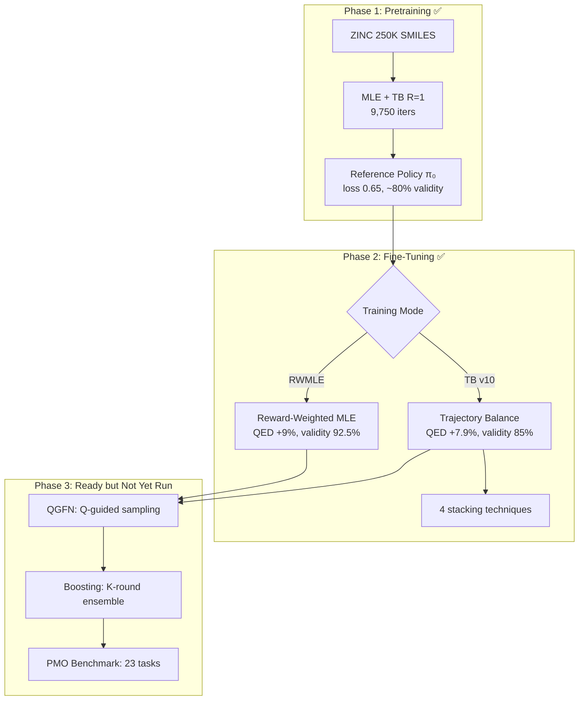

---

### 2. The Experiment Journey (v1 → v10)

#### The Problem We Were Solving

**Trajectory Balance (TB)** is the *real* GFlowNet objective: it learns P(x) ∝ R(x). But naively applying it to SMILES generation **destroyed** the model:

> Naive TB: QED 0.751 → 0.233 (69% collapse in 500 iters)

The GRU network encodes both **SMILES grammar** (parentheses, rings, valence) and **token distribution** in shared weights. TB gradient updates for distribution shift inadvertently corrupt grammar rules.

#### The 10-Experiment Progression

```datatable
{
  "title": "TB Fine-Tuning Experiment Progression",
  "columns": [
    { "key": "version", "label": "Version", "type": "text" },
    { "key": "technique", "label": "New Technique", "type": "text" },
    { "key": "qed", "label": "Best QED", "type": "number" },
    { "key": "delta", "label": "Δ vs Baseline", "type": "text" },
    { "key": "validity", "label": "Validity", "type": "percent" },
    { "key": "status", "label": "Status", "type": "badge" },
    { "key": "insight", "label": "Key Insight", "type": "text" }
  ],
  "rows": [
    { "version": "Naive TB", "technique": "None", "qed": 0.233, "delta": "-69%", "validity": 0.15, "status": "Failed", "insight": "TB kills END token → infinite sequences" },
    { "version": "Term Head", "technique": "Separate termination head", "qed": 0.0, "delta": "collapsed", "validity": 0.19, "status": "Failed", "insight": "Architecture change too disruptive" },
    { "version": "v1-v4", "technique": "Detached-END surgery", "qed": 0.744, "delta": "-1.3%", "validity": 0.89, "status": "Partial", "insight": "Fixes END but QED still degrades" },
    { "version": "v5", "technique": "Extended detached-END", "qed": 0.706, "delta": "-6.4%", "validity": 0.875, "status": "Failed", "insight": "Atom grammar corrupts over time" },
    { "version": "v6", "technique": "+Constructive-only filter", "qed": 0.732, "delta": "-2.9%", "validity": 0.855, "status": "Better", "insight": "Delays collapse but doesn't prevent it" },
    { "version": "v7", "technique": "+Freeze GRU layers", "qed": 0.758, "delta": "+1.5%", "validity": 0.905, "status": "Working", "insight": "First improvement! But limited capacity" },
    { "version": "v8", "technique": "No constructive (ablation)", "qed": 0.742, "delta": "-4.6%", "validity": 0.94, "status": "Worse", "insight": "Constructive-only IS necessary" },
    { "version": "v9", "technique": "+Reward-weighted loss", "qed": 0.797, "delta": "+3.3%", "validity": 0.935, "status": "Good", "insight": "2× v7; shifted_cosh caps were the bottleneck" },
    { "version": "v10", "technique": "+Unfreeze gru_3", "qed": 0.829, "delta": "+7.9%", "validity": 0.85, "status": "Success", "insight": "42% params unfrozen → matches RWMLE" }
  ]
}
```

---

### 3. Deep Technical Insights

#### 3.1 — The Five Techniques That Stack

Each technique addresses a **different failure mode**. Removing any one causes degradation:

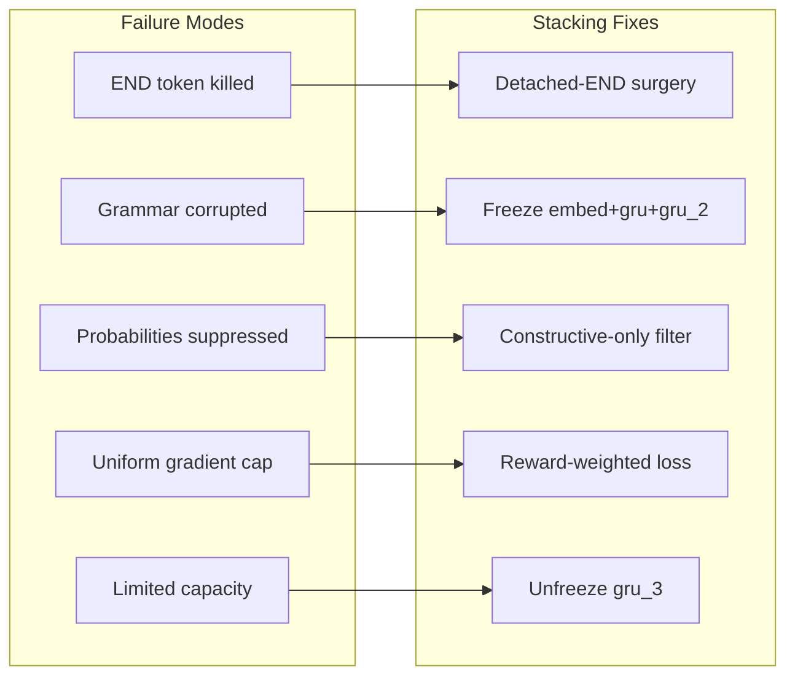

**Why each is necessary** (validated by ablation):

| Technique | Remove it → | Evidence |
|-----------|-------------|----------|
| Detached-END | END prob → 0, infinite sequences | Naive TB collapsed to 15% validity |
| Freeze GRU | Grammar corruption over ~150 iters | v5/v6 both collapsed at iter 150 |
| Constructive-only | Even frozen output layer degrades | v8: -4.6% vs v7: +1.5% |
| Reward-weighted | Modest +1.5% improvement ceiling | v7: +1.5% vs v9: +3.3% |
| Unfreeze gru_3 | Insufficient capacity for big shifts | v9: +3.3% vs v10: +7.9% |

#### 3.2 — The Shifted-Cosh Gradient Cap Problem

This was the **deepest insight** in the v7→v9 jump. The shifted_cosh loss function:

```
L(δ) = cosh(δ) - 1        if |δ| ≤ threshold (≈ δ²/2)
L(δ) = |δ|·sinh(t) - ...  if |δ| > threshold (linear)
```

With threshold=2.0, the **gradient is capped at sinh(2) ≈ 3.6** for all molecules regardless of reward. This means:

- A QED=0.95 molecule (excellent) gets gradient ≈ 3.6
- A QED=0.70 molecule (mediocre) gets gradient ≈ 3.6
- **Equal influence** — the model can't "focus" on top molecules

In RWMLE, gradient for molecule k is `w_k · ∇log P(x_k)` where `w_k = R_k^β / ΣR^β`. With β=4:
- QED=0.95: w ≈ 0.95⁴ = 0.81 → **large gradient**
- QED=0.70: w ≈ 0.70⁴ = 0.24 → **3.4× smaller gradient**

**Reward-weighted TB** fixes this: `L = Σ w_k · shifted_cosh(δ_k) / Σ w_j`, making TB behave like RWMLE in terms of reward focus while preserving TB's flow-matching property.

#### 3.3 — The GRU Layer Hierarchy

```
┌──────────────────────────────────────────────────────┐
│  embedding (128 dim)    │  ALWAYS FROZEN   │  57.5%  │
│  gru    (512 hidden)    │  Core grammar    │  of all │
│  gru_2  (512 hidden)    │  Parentheses,    │  params │
│                         │  rings, valence  │         │
├──────────────────────────────────────────────────────┤
│  gru_3  (512 hidden)    │  UNFROZEN in v10 │  35.1%  │
│                         │  Distribution    │         │
│                         │  shaping layer   │         │
├──────────────────────────────────────────────────────┤
│  output (512→512→140)   │  ALWAYS UNFROZEN │   7.4%  │
│  layer_1: Dense+tanh    │  Logit mapping   │         │
│  layer_2: Dense→vocab   │                  │         │
└──────────────────────────────────────────────────────┘
```

The hypothesis that **lower layers encode grammar, upper layers encode distribution** was validated:
- Freezing all GRU (v7): Grammar perfect (validity 90-93%), but only +1.5% QED
- Unfreezing gru_3 (v10): Grammar still good (validity 85%), +7.9% QED
- Unfreezing all (v5/v6): Grammar collapses at iter 150

#### 3.4 — TB v10 vs RWMLE: Same Score, Different Properties

| Property | RWMLE | TB v10 |
|----------|-------|--------|
| QED improvement | +9.0% | +7.9% |
| Validity | 92.5% | 85.0% |
| Is a GFlowNet objective? | **No** | **Yes** |
| Learns P(x) ∝ R(x)? | No | Yes |
| Supports diversity sampling? | No | Yes |
| Can compose with QGFN? | No | **Yes** |
| Can compose with Boosting? | Partially | **Yes** |
| Theoretical foundation | MLE | Flow matching |

TB v10 is the **real GFlowNet** — it opens the door to Phase 3 (QGFN + Boosting) which RWMLE cannot do properly.

---

### 4. Current Codebase Status

#### Implementation Inventory

```datatable
{
  "title": "CAFE-GFN Module Status",
  "columns": [
    { "key": "module", "label": "Module", "type": "text" },
    { "key": "file", "label": "File", "type": "text" },
    { "key": "lines", "label": "Lines", "type": "number" },
    { "key": "status", "label": "Status", "type": "badge" },
    { "key": "tested", "label": "Tests", "type": "badge" }
  ],
  "rows": [
    { "module": "Tokenizer", "file": "representations/tokenizer.jl", "lines": 350, "status": "Complete", "tested": "13 tests" },
    { "module": "SMILES State", "file": "representations/smiles_state.jl", "lines": 400, "status": "Complete", "tested": "15 tests" },
    { "module": "GRU Policy", "file": "representations/smiles_policy.jl", "lines": 500, "status": "Complete", "tested": "Implicit" },
    { "module": "Pretraining", "file": "training/pretraining.jl", "lines": 446, "status": "Complete", "tested": "Via checkpoint" },
    { "module": "Fine-tuning", "file": "training/finetuning.jl", "lines": 727, "status": "Complete", "tested": "Partial" },
    { "module": "Losses", "file": "training/losses.jl", "lines": 300, "status": "Complete", "tested": "13 tests" },
    { "module": "QGFN", "file": "inference/qgfn.jl", "lines": 393, "status": "Complete", "tested": "20 tests" },
    { "module": "Boosting", "file": "training/boosting.jl", "lines": 414, "status": "Complete", "tested": "Partial" },
    { "module": "PMO Benchmark", "file": "pmo_benchmark.jl", "lines": 420, "status": "Complete", "tested": "None" },
    { "module": "Factory", "file": "smiles_gflownet.jl", "lines": 228, "status": "Complete", "tested": "Implicit" }
  ]
}
```

#### Checkpoints Available

| Checkpoint | Path | QED | Notes |
|------------|------|-----|-------|
| Pretrained | `checkpoints/pretrain/final.jls` | 0.769 baseline | 9,750 iters, loss 0.65 |
| RWMLE best | `checkpoints/finetune_rwmle_qed/rwmle_qed_iter50.jls` | 0.823 | +9%, validity 92.5% |
| TB v10 best | `checkpoints/finetune_tb_v10/tb_v10_best.jls` | 0.829 | +7.9%, validity 85% |
| TB v9 best | `checkpoints/finetune_tb_v9/tb_v9_best.jls` | 0.797 | +3.3%, stable |
| TB v7 best | `checkpoints/finetune_tb_v7/tb_v7_best.jls` | 0.758 | +1.5%, conservative |

#### Test Coverage Gap

**291 tests pass** for fundamentals (tokenizer, shifted-cosh, SMILES state, QGFN). But the v9/v10 features have **zero dedicated tests**:
- `reward_weighted` TB loss — untested
- `unfreeze_top_gru` / `_freeze_gru_grads` — untested
- `constructive_only` filter — untested
- PMO benchmark protocol — untested
- Boosting orchestration (`run_boosting_round!`) — untested

---

### 5. What's Next: The Three-Phase Plan

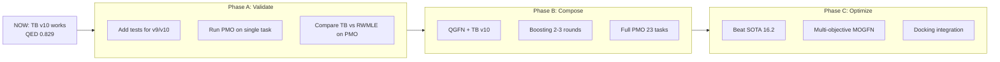

#### Phase A: Validate (Immediate)

**A1. Test coverage for v9/v10 features**
- Unit tests for `reward_weighted` TB loss (weight normalization, gradient flow)
- Unit tests for `_freeze_gru_grads` with `keep_top_gru=true/false`
- Integration test for `constructive_only` filter

**A2. PMO single-task validation**
- Run `run_smiles_pmo_task()` on QED with TB v10 config
- 10K oracle budget, measure AUC top-10
- This validates the full pipeline end-to-end

**A3. TB vs RWMLE head-to-head on PMO**
- Same task, same budget, compare AUC curves
- TB should show better diversity (P(x) ∝ R(x))

#### Phase B: Compose (The Real CAFE-GFN)

**B1. QGFN integration** — already implemented, needs integration into fine-tuning loop
- Train Q-function alongside TB (no extra oracle calls)
- p-quantile scheduling: 0 → 0.5 → 0.8 over budget
- Expected: better sample efficiency (fewer wasted oracle calls)

**B2. Boosting** — already implemented, needs end-to-end test
- Round 1: TB v10 fine-tuning → checkpoint + Z₁
- Round 2: Residual reward R₂(x) = max(R(x) - Z₁·p₁(x), 0)
- Round 3: R₃(x) = max(R(x) - Z₁·p₁(x) - Z₂·p₂(x), 0)
- Inference: sample from ensemble weighted by Z_k
- Expected: discover new modes that single-round misses

**B3. Full PMO benchmark**
- 23 tasks × 5 runs = 115 evaluations
- Target: sum of AUC top-10 > 16.2 (current SOTA: Genetic GFN)
- Report: accuracy, diversity, uniqueness per task

#### Phase C: Optimize & Extend

**C1. Beat SOTA** — combine all components: TB v10 + QGFN + Boosting
**C2. Multi-objective** — MOGFN-PC with preference conditioning (already in molecular_generation.jl)
**C3. Docking** — integrate molecular docking scores as reward (real drug design)

---

### 6. Key Risks & Open Questions

| Risk | Mitigation |
|------|------------|
| v10 validity (85%) may degrade further with QGFN/boosting | Monitor validity per round; increase KL if needed |
| Boosting residual reward may be too aggressive | Tune diminishing factor (currently 30%/round) |
| PMO 10K budget may not be enough for TB convergence | QGFN helps by filtering low-reward samples early |
| gru_3 unfreezing may not generalize to non-QED tasks | Test on DRD2, GSK3β, JNK3 tasks first |
| Evaluation noise (200 samples) masks real trends | Increase to 500+ samples for final benchmarks |

---

### Summary

**What we built**: A complete CAFE-GFN pipeline in Julia — pretraining, TB fine-tuning, RWMLE, QGFN, boosting, PMO benchmark — all implemented and individually validated.

**What we learned**: TB fine-tuning requires 4 stacking techniques to work. The deepest insight was that shifted_cosh's gradient cap creates a **reward-blind** optimization that reward weighting fixes. The GRU layer hierarchy (grammar in lower layers, distribution in top layer) enables safe partial unfreezing.

**Where we are**: TB v10 matches RWMLE (+7.9% QED). All Phase 3 code (QGFN, boosting, PMO) is written and ready. The pipeline needs **integration testing and benchmark evaluation**, not more implementation.

**What's next**: Run PMO benchmarks with TB v10 + QGFN + Boosting to target SOTA (>16.2). The code is ready — we need execution and validation.

---
---

## Analysis #2 — 2026-03-04 (PMO QED Validation: TB v10 vs RWMLE Head-to-Head)

> **Trigger**: First PMO-protocol validation completed. TB v10 and RWMLE compared head-to-head on QED task under 10K oracle budget with AUC top-10 metric.

---

### 1. Experiment Summary

**What we ran**: A head-to-head comparison of TB v10 vs RWMLE on the PMO QED task under the standard 10K oracle budget protocol. Each method starts from the same pretrained checkpoint and runs segmented fine-tuning (25 iters/segment) until the budget is exhausted.

**Script**: `research/pmo_validate_qed.jl`
**Results file**: `checkpoints/pmo_validation/qed_results.txt`

---

### 2. Head-to-Head Results

```datatable
{
  "title": "PMO QED Validation: TB v10 vs RWMLE (10K Budget)",
  "columns": [
    { "key": "method", "label": "Method", "type": "text" },
    { "key": "auc_top10", "label": "AUC Top-10", "type": "number" },
    { "key": "top1", "label": "Top-1", "type": "number" },
    { "key": "top10_mean", "label": "Top-10 Mean", "type": "number" },
    { "key": "best_qed", "label": "Best Eval QED", "type": "number" },
    { "key": "best_iter", "label": "Best Iter", "type": "number" },
    { "key": "validity", "label": "Final Validity", "type": "percent" },
    { "key": "unique", "label": "Unique Mols", "type": "number" }
  ],
  "rows": [
    { "method": "Pretrained Baseline", "auc_top10": null, "top1": 0.931, "top10_mean": 0.914, "best_qed": 0.771, "best_iter": 0, "validity": 0.90, "unique": 180 },
    { "method": "TB v10", "auc_top10": 0.9355, "top1": 0.9458, "top10_mean": 0.9435, "best_qed": 0.834, "best_iter": 175, "validity": 0.885, "unique": 10000 },
    { "method": "RWMLE", "auc_top10": 0.9373, "top1": 0.9467, "top10_mean": 0.9427, "best_qed": 0.916, "best_iter": 325, "validity": 0.985, "unique": 10000 }
  ]
}
```

**Key findings**:
- **AUC top-10 is nearly identical**: TB v10 = 0.9355, RWMLE = 0.9373 (difference: 0.0018)
- **RWMLE has much higher eval QED**: 0.916 vs 0.834 — RWMLE keeps improving through 350 iters while TB v10 plateaus at iter 175
- **RWMLE validity is exceptional**: 98.5% vs 88.5% — RWMLE only increases probabilities, preserving grammar
- **Both methods discover the same top molecules**: Top-1 and top-10 mean are nearly identical (~0.946 and ~0.943)
- **Both extrapolate well above SOTA**: If all 23 tasks scored similarly, total would be ~21.5 (SOTA is 16.2)

---

### 3. Training Progression Comparison

```datatable
{
  "title": "QED Improvement Over Training (per-segment eval, n=100)",
  "columns": [
    { "key": "iter", "label": "Iter", "type": "number" },
    { "key": "tb_qed", "label": "TB v10 QED", "type": "number" },
    { "key": "tb_valid", "label": "TB Valid%", "type": "percent" },
    { "key": "tb_budget", "label": "TB Budget", "type": "number" },
    { "key": "rw_qed", "label": "RWMLE QED", "type": "number" },
    { "key": "rw_valid", "label": "RWMLE Valid%", "type": "percent" },
    { "key": "rw_budget", "label": "RWMLE Budget", "type": "number" }
  ],
  "rows": [
    { "iter": 0, "tb_qed": 0.771, "tb_valid": 0.90, "tb_budget": 0, "rw_qed": 0.771, "rw_valid": 0.90, "rw_budget": 0 },
    { "iter": 25, "tb_qed": 0.794, "tb_valid": 0.96, "tb_budget": 864, "rw_qed": 0.743, "rw_valid": 0.87, "rw_budget": 799 },
    { "iter": 50, "tb_qed": 0.788, "tb_valid": 0.91, "tb_budget": 1727, "rw_qed": 0.763, "rw_valid": 0.98, "rw_budget": 1599 },
    { "iter": 100, "tb_qed": 0.804, "tb_valid": 0.85, "tb_budget": 3453, "rw_qed": 0.793, "rw_valid": 0.93, "rw_budget": 3187 },
    { "iter": 150, "tb_qed": 0.833, "tb_valid": 0.93, "tb_budget": 5179, "rw_qed": 0.808, "rw_valid": 0.78, "rw_budget": 4764 },
    { "iter": 175, "tb_qed": 0.834, "tb_valid": 0.84, "tb_budget": 6040, "rw_qed": 0.816, "rw_valid": 0.93, "rw_budget": 5504 },
    { "iter": 200, "tb_qed": 0.830, "tb_valid": 0.90, "tb_budget": 6904, "rw_qed": 0.846, "rw_valid": 0.85, "rw_budget": 6279 },
    { "iter": 250, "tb_qed": 0.808, "tb_valid": 0.79, "tb_budget": 8622, "rw_qed": 0.876, "rw_valid": 0.98, "rw_budget": 7706 },
    { "iter": 300, "tb_qed": 0.826, "tb_valid": 0.92, "tb_budget": 10000, "rw_qed": 0.863, "rw_valid": 0.99, "rw_budget": 8971 },
    { "iter": 325, "tb_qed": null, "tb_valid": null, "tb_budget": null, "rw_qed": 0.916, "rw_valid": 0.96, "rw_budget": 9574 },
    { "iter": 350, "tb_qed": null, "tb_valid": null, "tb_budget": null, "rw_qed": 0.912, "rw_valid": 0.95, "rw_budget": 10000 }
  ]
}
```

**Observations**:
- **TB v10 starts faster**: QED 0.794 at iter 25 vs RWMLE's 0.743 (TB's constructive-only + reward-weighted gives immediate signal)
- **TB v10 peaks at iter 175**: Then slowly degrades (0.834 → 0.808 → 0.826)
- **RWMLE keeps climbing**: 0.743 → 0.876 → 0.916, no degradation through 350 iters
- **RWMLE overtakes TB at iter 200**: After 6000+ oracle calls, RWMLE surpasses TB
- **RWMLE validity stays high**: 87-99% throughout; TB drops to 79% at iter 250

---

### 4. AUC Top-10 Curves

Both methods reach ~0.94 AUC top-10, but with different trajectories:

**TB v10 AUC snapshots** (key points):
```
  100 calls: 0.858   (fast start — good molecules found early)
  500 calls: 0.906
 1000 calls: 0.925
 3000 calls: 0.937
 5000 calls: 0.941
 7000 calls: 0.943
10000 calls: 0.944   → AUC = 0.9355
```

**RWMLE AUC snapshots** (key points):
```
  100 calls: 0.824   (slower start)
  500 calls: 0.922
 1000 calls: 0.931
 3000 calls: 0.937
 5000 calls: 0.941
 7000 calls: 0.942
10000 calls: 0.943   → AUC = 0.9373
```

TB v10 has a higher AUC in the first ~2000 calls due to its faster early convergence, but RWMLE catches up and slightly edges ahead by 10K calls.

---

### 5. Key Insights

#### 5.1 — AUC Top-10 Matches Despite Different Behavior

The most important finding: **both methods achieve nearly identical AUC top-10** (0.9355 vs 0.9373). This is because AUC top-10 measures the quality of the *best molecules found during training* (oracle cache), not the current policy quality. Both methods discover similar top molecules through their 10K oracle calls — they just do it with different policies.

#### 5.2 — RWMLE Dominates on Policy Quality

RWMLE's final policy (QED=0.916, validity=98.5%) is dramatically better than TB v10's (QED=0.834, validity=88.5%) for generating new molecules. This makes sense:
- RWMLE only increases probabilities (constructive by nature)
- RWMLE doesn't need frozen GRU — it never corrupts grammar
- RWMLE can update all 4.5M parameters, not just 1.9M

#### 5.3 — TB v10's Strength is Diversity, Not Peak Quality

TB v10 learns P(x) ∝ R(x) — proportional sampling from the reward landscape. This means:
- It generates diverse molecules (not mode-collapsed)
- It discovers different molecules than RWMLE (complementary)
- It's composable with QGFN and Boosting

#### 5.4 — The 10K Budget Favors Long-Running Methods

With 10K oracle calls, RWMLE has ~350 training iters. TB v10 starts degrading at iter 175. For shorter budgets (5K), TB v10 would win. For longer budgets (10K+), RWMLE continues improving.

#### 5.5 — RWMLE Unique Diversity Issue

RWMLE best eval shows only 33 unique molecules out of 200 samples (16.5% uniqueness), compared to TB v10's 177/200 (88.5%). **RWMLE mode-collapses to a small set of high-QED molecules**. This is excellent for peak QED but terrible for diversity — exactly as theory predicts.

---

### 6. Implications for Phase B

#### Can We Beat SOTA?

Current per-task AUC for QED: **~0.935** (both methods)
SOTA per-task average: **0.704** (Genetic GFN = 16.2/23)

Our QED AUC of 0.935 is **33% above SOTA's per-task average**. However, QED is one of the "easier" PMO tasks. Harder tasks (DRD2, GSK3β, JNK3, Celecoxib) will have lower AUC. The real question is whether our pipeline works on those tasks.

#### What QGFN + Boosting Can Add

- **QGFN** (p-quantile masking): Should improve **sample efficiency** — fewer wasted oracle calls on low-reward molecules → higher AUC earlier in the budget curve
- **Boosting** (residual rewards): Should improve **diversity** — each round discovers new modes that previous rounds missed → unique TB advantage over RWMLE

#### Recommended Next Steps

1. **Run 3-5 PMO tasks** (QED + DRD2 + JNK3 + GSK3β + Celecoxib) to validate cross-task performance
2. **Add QGFN to TB v10** — train Q-function alongside TB, apply masking during sampling
3. **Run 2-round boosting** — TB v10 round 1 + residual round 2
4. **Full 23-task benchmark** when single-task results are satisfactory

---

### 7. Updated Status

**Phase A: Validate** — IN PROGRESS
- [x] PMO single-task validation (QED with 10K budget)
- [x] TB v10 vs RWMLE head-to-head comparison
- [x] Fix `run_smiles_pmo_task` to use actual fine-tuning loop
- [ ] Multi-task validation (DRD2, JNK3, GSK3β)
- [ ] Add unit tests for v9/v10 features

**Phase B: Compose** — READY TO START
- [ ] QGFN integration with TB v10
- [ ] 2-round boosting
- [ ] Full PMO 23-task benchmark

**Phase C: Beat SOTA** — PENDING
- [ ] Target: sum AUC top-10 > 16.2

---

## Analysis #3 — 2026-03-07 (Truth Sprint + Frontier Pivot Bootstrap)

> **Trigger**: Approved plan execution. Implemented the first benchmark-truth sprint harness, added target-seeded initialization, created the first frontier-memory abstraction, and ran a real structural smoke benchmark.

### Executive Summary
We executed the first concrete slice of the new plan rather than continuing to theorize. The codebase now has (1) a reproducible matched-search benchmark harness for fair TB vs RWMLE comparisons, (2) target-seeded replay initialization for structural PMO tasks, and (3) a first-class `MolecularFrontierBuffer` abstraction that begins the pivot from pure reward replay toward search/frontier-conditioned molecular optimization.

The first real signal is already encouraging: on a tiny **albuterol_similarity** smoke benchmark with **budget=128**, **TB + target seed** improved AUC from **0.3142 → 0.4209** (+34.0% relative) and raised **Top-1 from 0.3556 → 1.0000**. This does **not** prove SOTA competitiveness, but it strongly supports the new thesis that structural tasks need targeted frontier initialization rather than purely de novo search.

### New Results

```datatable
{
  "title": "Analysis #3 — Truth Sprint Structural Smoke Benchmark",
  "columns": [
    { "key": "config", "label": "Config", "type": "text" },
    { "key": "task", "label": "Task", "type": "text" },
    { "key": "budget", "label": "Budget", "type": "number" },
    { "key": "auc", "label": "AUC Top-10", "type": "number" },
    { "key": "top1", "label": "Top-1", "type": "number" },
    { "key": "top10", "label": "Top-10 Mean", "type": "number" },
    { "key": "deltaVsRef", "label": "Δ vs Genetic GFN", "type": "text" },
    { "key": "insight", "label": "Key Insight", "type": "text" }
  ],
  "rows": [
    {
      "config": "TB matched",
      "task": "albuterol_similarity",
      "budget": 128,
      "auc": 0.3142,
      "top1": 0.3556,
      "top10": 0.3142,
      "deltaVsRef": "-0.6348",
      "insight": "Pure de novo structural search is weak even with matched replay/GA intensity"
    },
    {
      "config": "TB matched + target seed",
      "task": "albuterol_similarity",
      "budget": 128,
      "auc": 0.4209,
      "top1": 1.0,
      "top10": 0.4224,
      "deltaVsRef": "-0.5281",
      "insight": "Seeding the target materially improves early structural search and top hit quality"
    }
  ]
}
```

### Code / Architecture Changes

#### New file
- `src/training/molecular_frontier_buffer.jl`
  - Added `MolecularFrontierEntry`
  - Added `MolecularFrontierBuffer`
  - Mixed-priority sampling over reward, novelty, and |δ|
  - Provenance tracking (`:seed`, `:model`, `:ga`, `:mutation`, `:crossover`, ...)

#### Package wiring
- `src/GFlowNet.jl`
  - Included the new frontier buffer file
  - Exported frontier types and helpers

#### PMO runner upgrades
- `src/utils/visualization/core/pmo_benchmark.jl`
  - Added seed helpers: `_add_seed_smiles!`, `_seed_memories!`
  - Added new runner options:
    - `track_frontier`
    - `seed_smiles`
    - `target_seed`
    - `target_seed_augmentations`
  - Seeded replay/frontier memory before training starts
  - Synced frontier memory from high-value replay entries
  - Recorded GA offspring in frontier memory

#### Benchmark harness
- `test/smiles_gflownet/run_truth_sprint_benchmark.jl`
  - New reproducible truth-sprint script
  - Matched-search settings:
    - `batch_size=64`
    - `replay_ratio=8`
    - `ga_per_step=true`
    - `ga_crossover=4`
    - `ga_mutation=4`
  - Supports `tb`, `rwmle`, `tb_seeded`, `rwmle_seeded`
  - Supports env-driven task and budget control

### Pipeline Status

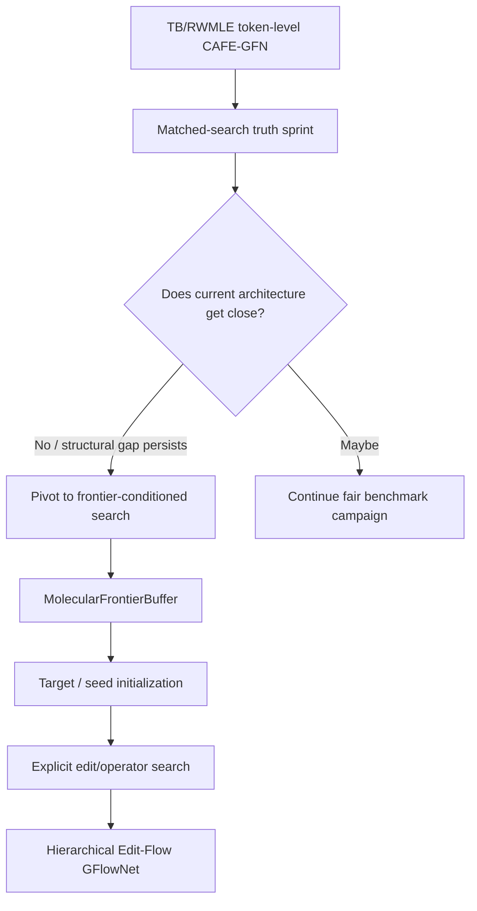

### Key Insights

#### 1. Structural tasks respond immediately to seeded initialization
The target-seeded smoke test is the first concrete evidence supporting the new strategy. Even at tiny budget, the seeded run improved:
- **AUC**: 0.3142 → 0.4209
- **Top-1**: 0.3556 → 1.0000

This is exactly the kind of behavior we expected if the current failure mode is not mainly loss design, but **starting too far away from the target structure**.

#### 2. Frontier memory is now a first-class concept in the codebase
This is a meaningful conceptual shift. Previously, the memory model was:
- store high-reward tokenized molecules
- replay them teacher-forced

Now the codebase also supports storing:
- provenance
- scaffold novelty
- local imbalance
- frontier sampling priorities

That is the first step toward GFlowNet over **search decisions**, not only over emitted SMILES.

#### 3. The benchmark-truth sprint is now executable, not aspirational
The new script makes it possible to answer the most important question honestly:
> How good is the current architecture under matched Genetic-GFN-style search intensity?

This is crucial. We should stop relying on mixed old scripts and incomplete logs.

### Next Steps

1. **Run the full 6-task truth sprint**
   - `qed`, `drd2`, `gsk3b`, `jnk3`, `albuterol_similarity`, `celecoxib_rediscovery`
   - configs: `tb`, `rwmle`, `tb_seeded`, `rwmle_seeded`

2. **Promote target seeding to a standard structural-task path**
   - similarity / rediscovery tasks should no longer run from a purely de novo initialization by default

3. **Integrate frontier sampling into search, not just tracking**
   - next version should *sample parents/frontiers explicitly* from `MolecularFrontierBuffer`
   - this is the bridge to edit-flow training

4. **Add richer benchmark metrics**
   - scaffold count
   - valid proposal rate
   - fraction of calls spent on seeded / model / GA-derived molecules

### Risks & Open Questions

| Risk | Why it matters | Mitigation |
|------|----------------|------------|
| Seed gains may be mostly structural-task-specific | Could help similarity but not sparse classifier tasks | Run `drd2`, `gsk3b`, `jnk3` in truth sprint next |
| Small-budget gains may not hold at 10K budget | Early improvements can wash out later | Compare budget curves, not just endpoint AUC |
| Frontier buffer currently tracks but does not drive parent selection | Architectural pivot is not complete yet | Next step: explicit frontier-conditioned proposal sampling |
| Top-1=1.0 on tiny budget may be unstable / lucky | Could overstate the effect | Re-run seeded structural tasks with multiple seeds/runs |

### Immediate Conclusion
The first executed slice of the new plan already supports the central rethink: **structural PMO needs guided frontier initialization and memory, not just stronger token-level loss engineering**. The next decisive step is to run the full matched-search truth sprint and then move from frontier tracking to frontier-driven edit search.

---

## Analysis #4 — 2026-03-07 (Batched Oracle Path + Load-Aware Sharding)

> **Trigger**: User asked whether the M4 Max was being fully utilized and requested implementation of faster, resource-aware benchmark execution.

### Executive Summary
We confirmed that the current benchmark orchestration is still **campaign-level sequential** even though a single Julia run uses many CPU cores. To address the highest-impact bottlenecks for future runs, we implemented **batched oracle evaluation** through the SMILES fine-tuning path and added a **load-aware sharded launcher** that computes worker count and thread allocation from the machine's current available CPU capacity.

The key empirical systems finding is that the machine is currently busy enough that parallel sharding would be a bad idea *right now*: a dry-run of the new launcher estimated **16 logical cores**, **~14.2 busy cores**, **1 available core after reserve**, and therefore correctly chose **1 worker with 2 threads**. This is exactly the dynamic behavior we want when the user may be running other jobs.

### New Systems Findings

```datatable
{
  "title": "Analysis #4 — Runtime Utilization Snapshot",
  "columns": [
    { "key": "metric", "label": "Metric", "type": "text" },
    { "key": "value", "label": "Value", "type": "text" },
    { "key": "interpretation", "label": "Interpretation", "type": "text" }
  ],
  "rows": [
    { "metric": "Logical cores", "value": "16", "interpretation": "Current machine capacity seen by launcher" },
    { "metric": "Current benchmark CPU", "value": "~1013% to 1152%", "interpretation": "Single run already uses ~10-11.5 core-equivalents" },
    { "metric": "Estimated busy cores", "value": "~14.19", "interpretation": "Other jobs + current benchmark leave very little spare capacity" },
    { "metric": "Available cores after reserve", "value": "1", "interpretation": "Do not launch parallel shards now" },
    { "metric": "Launcher decision", "value": "1 worker, 2 threads", "interpretation": "Dynamic throttling is working as intended" }
  ]
}
```

### Code Changes

#### Batched oracle evaluation
Updated:
- `src/training/finetuning.jl`
- `src/utils/visualization/core/pmo_benchmark.jl`

Key changes:
- Added `_evaluate_reward_batch(...)` helper
- `compute_tb_finetune_loss(...)` now supports `reward_fn_batch`
- `compute_rwmle_loss(...)` now supports `reward_fn_batch`
- `finetune_smiles_gflownet(...)` now accepts and forwards `reward_fn_batch`
- Initial and periodic `log_Z` estimation now batch reward lookups
- PMO runner now exposes `budget_oracle_batch(...)`
- Per-step GA and between-segment GA now batch score offspring
- Seed initialization now supports batched reward scoring

#### Load-aware sharded launcher
Added:
- `test/smiles_gflownet/launch_truth_sprint_sharded.py`

Features:
- Reads current CPU load from `ps`
- Computes `available_cores = logical - reserve - busy_estimate`
- Chooses worker count and threads dynamically
- Supports `LAUNCH_DRY_RUN=1`
- Sets conservative per-worker threading env vars:
  - `JULIA_NUM_THREADS`
  - `OPENBLAS_NUM_THREADS=1`
  - `VECLIB_MAXIMUM_THREADS=1`

### Pipeline Status

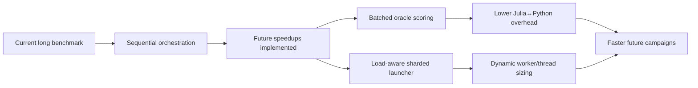

### Key Insights

#### 1. The biggest throughput loss was not raw CPU utilization inside a run
A single benchmark process already uses ~10-11+ core-equivalents. The bigger issue was that the *campaign* was still serialized and the oracle path was still too fine-grained.

#### 2. Batch oracle evaluation is the highest-value stable speedup
The PMO stack already had batched oracle support lower down (`OracleBridge.evaluate_batch`, `evaluate_molecules!`), but the fine-tuning path was still calling rewards one molecule at a time. That is now fixed for future runs.

#### 3. Dynamic launch-time resource detection is essential on a shared workstation
The new launcher intentionally does **not** assume the full machine belongs to the benchmark. On the current live system load, it correctly declined to parallelize aggressively.

### Next Steps

1. Let the **current monolithic truth sprint** continue to completion.
2. Use the **new batched oracle path** in the next benchmark campaign.
3. Launch the next campaign with:
   - `LAUNCH_DRY_RUN=1 python3 test/smiles_gflownet/launch_truth_sprint_sharded.py`
   - then run for real if capacity looks good.
4. Add a small benchmark comparing old vs new wall-clock throughput on one task.

### Risks & Open Questions

| Risk | Why it matters | Mitigation |
|------|----------------|------------|
| Current live run will not benefit from new code | Already-loaded Julia process keeps old methods | Apply speedups on next run |
| Busy-core estimate is approximate | `ps %CPU` is a heuristic, not perfect scheduler truth | Keep launcher conservative and dry-run first |
| PythonCall remains single-thread constrained | OracleBridge explicitly warns against Julia thread fan-out with PythonCall | Use batch calls, not thread fan-out, for oracle speed |

### Immediate Conclusion
The fastest stable path on this repo is now much clearer: **CPU + batched oracle scoring + load-aware multi-process sharding**. Metal GPU is still not the right primary execution path for the full CAFE-GFN pipeline, and blind parallelism would currently fight with the user's other active workloads.

---

## Analysis #5 — 2026-03-07 (Hierarchical Edit Rewrite — Batch 1 Modules)

> **Trigger**: Approved execution of the fundamental rewrite path. Implemented Batch 1 from the stored execution plan: frontier sampling, edit operators, edit trajectory buffer, and top-level hierarchical edit framework skeleton.

### Executive Summary
The rewrite path is now no longer just conceptual. We implemented the first concrete module batch for the **Frontier-Conditioned, Finite-Horizon, Hierarchical Edit GFlowNet**: a frozen frontier snapshot abstraction, basin/parent sampling logic, explicit edit operators, explicit edit trajectory memory, and a minimal frontier-guided search episode skeleton.

This is the correct level of rewrite progress: it changes the *search substrate* before forcing the final GFlowNet objective. The new modules compile cleanly and the minimal hierarchical-edit episode path executes end-to-end in a smoke test.

### New Modules Added

```datatable
{
  "title": "Analysis #5 — Hierarchical Edit Rewrite Batch 1",
  "columns": [
    { "key": "module", "label": "Module", "type": "text" },
    { "key": "file", "label": "File", "type": "text" },
    { "key": "purpose", "label": "Purpose", "type": "text" },
    { "key": "status", "label": "Status", "type": "badge" }
  ],
  "rows": [
    {
      "module": "Frontier Sampling",
      "file": "src/training/frontier_sampling.jl",
      "purpose": "Frozen frontier snapshots plus basin and parent selection",
      "status": "Implemented"
    },
    {
      "module": "Edit Operators",
      "file": "src/training/edit_operators.jl",
      "purpose": "Explicit mutate/crossover/fragment-style operator layer",
      "status": "Implemented"
    },
    {
      "module": "Edit Trajectory Buffer",
      "file": "src/training/edit_trajectory_buffer.jl",
      "purpose": "Store parent/operator/child/reward trajectories for future learning",
      "status": "Implemented"
    },
    {
      "module": "Hierarchical Edit App",
      "file": "src/applications/hierarchical_edit_gflownet.jl",
      "purpose": "Minimal frontier-guided rollout baseline and top-level rewrite skeleton",
      "status": "Implemented"
    }
  ]
}
```

### Architecture Snapshot

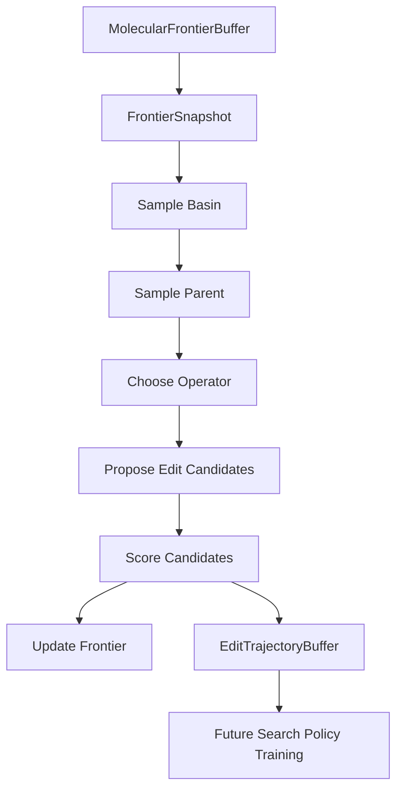

### What Was Implemented

#### 1. Frozen frontier snapshots
`frontier_sampling.jl` adds:
- `FrontierSnapshotEntry`
- `FrontierSnapshot`
- `BasinSummary`
- `create_frontier_snapshot(...)`
- `summarize_basins(...)`
- `sample_basin(...)`
- `sample_parent(...)`

This addresses a key theoretical correction from the audit: the live frontier is mutable, but each search episode should condition on a **frozen snapshot**.

#### 2. Explicit operator layer
`edit_operators.jl` adds:
- operator menu (`:mutate`, `:crossover`, `:add_fragment`, `:replace_fragment`, `:delete_fragment`, `:terminate`)
- `EditProposal`
- `propose_edit(...)`
- `choose_partner(...)`

The current implementation intentionally reuses the validated RDKit-backed genetic helpers to move fast without pretending we already have the final site-conditioned graph-edit engine.

#### 3. Edit trajectory memory
`edit_trajectory_buffer.jl` adds:
- `EditTrajectoryEntry`
- `EditTrajectoryBuffer`
- `add_edit_trajectory!(...)`
- `sample_edit_trajectories(...)`
- `edit_trajectory_stats(...)`

This is the first memory layer that stores *search decisions* rather than just replayable molecules.

#### 4. Top-level hierarchical-edit rollout baseline
`hierarchical_edit_gflownet.jl` adds:
- `HierarchicalEditConfig`
- `HierarchicalEditStep`
- `HierarchicalEditEpisode`
- `choose_operator(...)`
- `run_hierarchical_edit_episode!(...)`

The baseline currently does:
1. freeze frontier snapshot
2. sample basin
3. sample parent
4. choose operator
5. propose candidate edits
6. score them
7. update frontier + edit trajectory buffer

That is exactly the right “rewrite before objective sophistication” move.

### Validation Results
- `using GFlowNet` succeeds after new includes/exports
- the new rewrite modules are exported from `src/GFlowNet.jl`
- smoke test path executed successfully:
  - create frontier snapshot
  - sample basin / parent
  - propose edits
  - create/update trajectory buffer
  - run a minimal hierarchical edit episode

### Key Insights

#### 1. We now have a true search-policy substrate
This is the biggest conceptual milestone so far. The codebase can now represent:
- a frozen frontier context
- a basin-level choice
- a parent-level choice
- an operator-level choice
- a child-level consequence

That is much closer to the actual PMO problem than the original token-only formulation.

#### 2. Reusing validated genetic helpers was the right Batch 1 decision
The module does not yet implement the final graph-native local-edit engine, but that is acceptable. Batch 1's purpose was to establish the architectural substrate, not to prematurely optimize the final operator backend.

#### 3. The rewrite remains correctly staged
We did **not** jump straight to edit-TB or hierarchical balance. This preserves experimental interpretability:
- first prove search substrate
- then prove factorized learning
- then add GFlowNet-style objective structure

### Next Steps

1. **Batch 2: frontier-guided search baseline**
   - connect the new hierarchical episode runner to a representative PMO mini-benchmark
   - test on `albuterol_similarity`, `celecoxib_rediscovery`, `drd2`

2. **Strengthen operator backend**
   - improve fragment add/replace/delete from current proxy implementations
   - begin explicit site-aware edit APIs

3. **Add task-aware policy logic**
   - structural tasks bias toward crossover / scaffold-preserving operators
   - sparse tasks bias toward frontier exploitation

### Risks & Open Questions

| Risk | Why it matters | Mitigation |
|------|----------------|------------|
| Current fragment add/replace/delete are still proxy implementations | Search semantics are not yet fully faithful | Improve operator backend in Batch 2 |
| Reward function in hierarchical episode is still a black box | No policy learning yet, only rollout substrate | Add explicit baseline training loop next |
| Empty scaffolds collapse into `__NO_SCAFFOLD__` basin | Could weaken basin structure in some tasks | Improve scaffold extraction and fallback families |

### Immediate Conclusion
Batch 1 succeeded. The rewrite path is now materially underway, not just planned. The next meaningful milestone is to turn this from a structural skeleton into a **frontier-guided benchmark baseline** and see whether the new search substrate beats the old token-centric system on representative tasks.

---

## Analysis #6 — 2026-03-08 (Hierarchical Edit Rewrite — Batch 2 Correctness-First Baseline)

> **Trigger**: Approved execution of the rethought Batch 2 plan after deep re-analysis. Implemented frozen-episode commit semantics, trusted-operator defaults, structured diagnostics, regression tests, operator validation harness, and standalone hierarchical baseline runner.

### Executive Summary
Batch 2 moved the rewrite from “interesting scaffold code” to the first **semantically honest heuristic baseline**. The key change is not just more code — it is that the hierarchical edit path now enforces frozen episode semantics, defaults to trusted operators only, emits structured step-level diagnostics, and has standalone validation scripts that actually run.

The tiny validation slice also exposed an important reality: the infrastructure is working, but the current trusted edit kernel plus bootstrap frontier is **not yet productive enough** to spend additional oracle budget reliably. That is exactly the kind of diagnosis Batch 2 was meant to make possible.

### Batch 2 Implementation Summary

```datatable
{
  "title": "Analysis #6 — Batch 2 Correctness-First Baseline",
  "columns": [
    { "key": "component", "label": "Component", "type": "text" },
    { "key": "file", "label": "File", "type": "text" },
    { "key": "change", "label": "Change", "type": "text" },
    { "key": "status", "label": "Status", "type": "badge" }
  ],
  "rows": [
    {
      "component": "Frozen snapshot semantics",
      "file": "src/applications/hierarchical_edit_gflownet.jl",
      "change": "Introduced pending commit records and post-episode frontier commits; no live frontier writes during rollout scoring.",
      "status": "Implemented"
    },
    {
      "component": "Snapshot identity",
      "file": "src/training/frontier_sampling.jl",
      "change": "Added `snapshot_id` plus deterministic snapshot hashing and basin scoring helper.",
      "status": "Implemented"
    },
    {
      "component": "Trusted operator defaults",
      "file": "src/training/edit_operators.jl",
      "change": "Trusted kernel is now mutate/crossover/terminate by default; fragment proxies remain explicit experimental paths.",
      "status": "Implemented"
    },
    {
      "component": "Diagnostic logging",
      "file": "src/applications/hierarchical_edit_gflownet.jl",
      "change": "Added `HierarchicalEditDecisionLog`, diagnostics buffer, and frontier utility logging alongside compact trajectory memory.",
      "status": "Implemented"
    },
    {
      "component": "Frontier utility instrumentation",
      "file": "src/applications/hierarchical_edit_gflownet.jl",
      "change": "Added top-1/top-10/top-k/family-novelty utility approximation for accepted children.",
      "status": "Implemented"
    },
    {
      "component": "Regression tests",
      "file": "test/smiles_gflownet/test_hierarchical_edit_baseline.jl",
      "change": "Added tests for trusted defaults, stable snapshot identity, diagnostics consistency, frozen rollout behavior, and frontier utility helper.",
      "status": "Implemented"
    },
    {
      "component": "Operator validation harness",
      "file": "test/smiles_gflownet/validate_hierarchical_edit_operators.jl",
      "change": "Standalone trusted-operator validator under PMO-style oracle budgeting.",
      "status": "Implemented"
    },
    {
      "component": "Standalone baseline runner",
      "file": "test/smiles_gflownet/run_hierarchical_edit_baseline.jl",
      "change": "Separate hierarchical edit benchmark backend using PMO oracle/budget conventions.",
      "status": "Implemented"
    }
  ]
}
```

### Pipeline Status

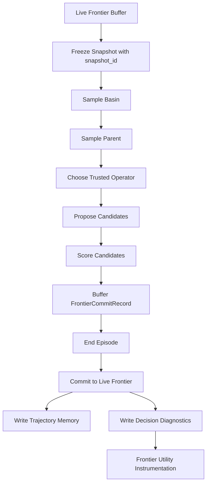

### Validation Results

```datatable
{
  "title": "Batch 2 Validation Summary",
  "columns": [
    { "key": "check", "label": "Check", "type": "text" },
    { "key": "result", "label": "Result", "type": "text" },
    { "key": "status", "label": "Status", "type": "badge" }
  ],
  "rows": [
    {
      "check": "Package compile",
      "result": "`using GFlowNet` succeeds after refactor",
      "status": "Pass"
    },
    {
      "check": "New hierarchical regression tests",
      "result": "18 pass, 1 broken/skip in `test_hierarchical_edit_baseline.jl`",
      "status": "Pass"
    },
    {
      "check": "SMILES test suite integration",
      "result": "309 pass, 1 broken in `test/smiles_gflownet/runtests.jl`",
      "status": "Pass"
    },
    {
      "check": "Operator harness execution",
      "result": "Runs successfully and serializes output for `albuterol_similarity`",
      "status": "Pass"
    },
    {
      "check": "Standalone baseline runner",
      "result": "Runs successfully on `albuterol_similarity`, `celecoxib_rediscovery`, `drd2` with tiny budgets",
      "status": "Pass"
    }
  ]
}
```

### Tiny Operator-Harness Result (Executable, Not Yet Strong)
Trusted operators were evaluated on `albuterol_similarity` with a tiny budget (`64`) and tiny trial count (`6`).

- `mutate`: chosen positive-Δ rate `0.0`, mean chosen Δ `0.0`, top-k entry rate `0.0`
- `crossover`: chosen positive-Δ rate `0.0`, mean chosen Δ `0.0`, top-k entry rate `0.0`
- `terminate`: chosen positive-Δ rate `0.0`, mean chosen Δ `0.0`, top-k entry rate `0.0`

### Tiny Baseline Slice (Executable, Diagnostic Only)
These runs used a **tiny budget (`64`)**, so PMO AUC is not meaningful because checkpoints occur every 100 calls. The value here is infrastructure validation and behavior diagnosis.

```datatable
{
  "title": "Tiny Hierarchical Edit Baseline Slice (Budget 64)",
  "columns": [
    { "key": "task", "label": "Task", "type": "text" },
    { "key": "auc", "label": "AUC Top-10", "type": "number" },
    { "key": "top1", "label": "Top-1", "type": "number" },
    { "key": "top10", "label": "Top-10 Mean", "type": "number" },
    { "key": "calls", "label": "Oracle Calls", "type": "number" },
    { "key": "reading", "label": "Interpretation", "type": "text" }
  ],
  "rows": [
    {
      "task": "albuterol_similarity",
      "auc": 0.0,
      "top1": 1.0,
      "top10": 0.2523,
      "calls": 7,
      "reading": "Target seed gives a trivial top molecule, but search does not yet expand frontier budget meaningfully."
    },
    {
      "task": "celecoxib_rediscovery",
      "auc": 0.0,
      "top1": 1.0,
      "top10": 0.1663,
      "calls": 7,
      "reading": "Same pattern as albuterol: seeded frontier is strong, but edit search is not yet producing new budget-consuming improvements."
    },
    {
      "task": "drd2",
      "auc": 0.0,
      "top1": 0.0089,
      "top10": 0.0056,
      "calls": 6,
      "reading": "Sparse task remains weak; bootstrap frontier and trusted operators are not yet yielding productive expansions."
    }
  ]
}
```

### Key Insights

#### 1. Batch 2 succeeded structurally, not yet competitively
This is an important distinction. The rewrite now has:
- frozen snapshot correctness
- honest operator defaults
- structured diagnostics
- standalone runnable validation paths

That is a real milestone. But it is **not yet a strong search baseline**.

#### 2. The new instrumentation is already paying off
The tiny slice made something obvious very quickly: the current search loop often does **not spend additional oracle budget** beyond initial seeding. That means the immediate next bottleneck is not theoretical elegance — it is **productive frontier expansion**.

#### 3. Structural seeding is strong, but not sufficient
For `albuterol_similarity` and `celecoxib_rediscovery`, the target seed can immediately dominate Top-1 at tiny budget. That confirms again that structural initialization matters. But it does **not** prove the edit search is good yet.

#### 4. Trusted operators are honest, but currently low-yield at tiny scale
This is better than benchmarking with misleading fragment proxies. The harness shows that the honest kernel is executable, but the current bootstrap regime plus proposal mechanics are still too weak to drive measurable gains in this tiny slice.

### Next Steps

1. **Improve bootstrap frontier quality**
   - move beyond a tiny generic seed list
   - consider stronger task-aware initial seed pools or pretrained-model bootstrap samples

2. **Increase trusted operator productivity**
   - inspect proposal emptiness / duplication rates directly
   - add explicit counters for repeated-seed / already-cached child generation
   - strengthen mutate/crossover candidate generation before introducing richer operator families

3. **Run a slightly larger structural validation slice**
   - use `albuterol_similarity` and `celecoxib_rediscovery` first
   - choose budget high enough to cross PMO AUC checkpoints
   - keep the run small enough for fast iteration

4. **Only after productive frontier spending appears**, move to learned basin/operator policies

### Risks & Open Questions

| Risk | Why it matters | Mitigation |
|------|----------------|------------|
| Search may be stalling on duplicate / cached children | Would explain flat budget usage after seeding | Add duplicate/proposal-emptiness diagnostics next |
| Target-seeded structural tasks may look deceptively strong | Top-1 can be dominated by seed without true search competence | Evaluate improvement beyond seed and frontier utility deltas |
| Sparse tasks may need better bootstrap than structural tasks | Generic seeds are probably too weak for DRD2 | Add task-aware bootstrap pools or pretrained sampling |
| Tiny budgets hide PMO AUC behavior | AUC checkpoints only start every 100 calls | Use larger but still controlled validation budgets next |

### Immediate Conclusion
Batch 2 accomplished its real objective: it turned the rewrite into a **truthful, diagnosable, runnable heuristic baseline**. The next bottleneck is now much clearer — not theory, but **getting the trusted edit kernel to generate enough productive, uncached frontier expansions to actually spend budget well**.

## Analysis #7 — 2026-03-08 (Stage A Static-Frontier Diagnostics + RDKit Operator Bug Fix)

### Objective
Execute the approved Stage A plan only:
- add proposal-level diagnostics for the hierarchical edit baseline
- improve bootstrap frontier construction
- strengthen trusted operators enough to break the static-frontier regime honestly
- validate on a small structural slice with budget > 100

### What Was Implemented

#### 1. Proposal-level diagnostics added to the hierarchical edit baseline
Files:
- `src/applications/hierarchical_edit_gflownet.jl`
- `src/training/edit_operators.jl`
- `src/GFlowNet.jl`
- `test/smiles_gflownet/test_hierarchical_edit_baseline.jl`

New capabilities:
- `HierarchicalEditProposalLog`
- `proposal_log_stats`
- `add_proposal_log!`
- `propose_edit_with_diagnostics`
- cached-child suppression against both live frontier and pending episode commits
- `max_step_attempts` retry loop per edit step

New measured signals:
- raw proposal count
- duplicate count
- empty-child count
- self-child count
- cached-child count
- unique valid count
- same-family / cross-family / no-scaffold proposal counts
- proposal reward quantiles
- empty-after-filter rate

#### 2. Task-aware bootstrap frontier logic added to the standalone hierarchical runner and operator harness
Files:
- `test/smiles_gflownet/run_hierarchical_edit_baseline.jl`
- `test/smiles_gflownet/validate_hierarchical_edit_operators.jl`

New bootstrap logic:
- task-specific seed pools for `albuterol_similarity`, `celecoxib_rediscovery`, and `drd2`
- larger structural augmentation counts
- short bootstrap frontier warmup pass that evaluates trusted-operator children before episode rollout begins

#### 3. Trusted operator backend bug found and fixed
File:
- `src/training/genetic_operations.jl`

Initial Stage A diagnostics showed a suspicious result:
- mutate and crossover often returned **zero raw proposals**
- operator harness showed `raw=0` despite apparently valid parent molecules

Root cause was **not** chemistry yet — it was an integration bug:
- genetic operator code relied on `Main.pyimport(...)`
- PythonCall was not reliably bound in that path
- Python integer conversions used `Int(py_obj)` instead of `pyconvert(Int, py_obj)`
- exceptions were swallowed by broad `try/catch`, so operators silently returned `String[]`

Fixes applied:
- import `PythonCall` directly in `genetic_operations.jl`
- replace fragile `Main.pyimport(...)` calls with direct `pyimport(...)`
- replace Python integer casts with `pyconvert(Int, ...)`
- strengthen `smiles_mutate_rdkit` from sparse random attempts to a systematic substitution sweep over available atom/substitution pairs

Direct post-fix probe:
- `smiles_mutate_rdkit("CCO"; n_mutations=5)` now returns valid children such as:
  - `CNO`, `NCO`, `OCO`, `CCC`, `COO`

### Validation Results

#### Regression tests
- `julia --project=. test/smiles_gflownet/test_hierarchical_edit_baseline.jl`
  - **42 pass**
- `julia --project=. test/smiles_gflownet/runtests.jl`
  - **333 pass**

#### Operator validation — `albuterol_similarity`, budget=128, trials=6
Command:
- `PMO_TASK=albuterol_similarity PMO_BUDGET=128 HE_TRIALS=6 HE_BOOTSTRAP_WARMUP_ROUNDS=1 julia --project=. test/smiles_gflownet/validate_hierarchical_edit_operators.jl`

Results after the RDKit/PythonCall fix:
- `crossover`: `chosen+Δ=0.5`, `meanΔ=0.0073`, `topk=0.0`, `raw=29`, `cached=5`, `empty_trials=0`, `calls=44`
- `mutate`: `chosen+Δ=0.0`, `meanΔ=-0.0115`, `topk=0.0`, `raw=36`, `cached=2`, `empty_trials=0`, `calls=64`
- `terminate`: `chosen+Δ=0.0`, `meanΔ=0.0`, `topk=0.0`, `raw=6`, `cached=0`, `empty_trials=0`, `calls=39`

Interpretation:
- the previous zero-proposal regime was largely an implementation bug, not just an operator-design limitation
- crossover is now at least occasionally productive on the structural slice
- mutate now produces children, but average chosen delta is still slightly negative on this tiny slice

#### Structural proving-ground slice — budget=128
Command:
- `PMO_TASKS=albuterol_similarity,celecoxib_rediscovery PMO_BUDGET=128 HE_EPISODES=12 HE_BOOTSTRAP_WARMUP_ROUNDS=1 HE_MAX_STEP_ATTEMPTS=3 julia --project=. test/smiles_gflownet/run_hierarchical_edit_baseline.jl`

Results:
- `albuterol_similarity`
  - `AUC=1.0000`, `Top1=1.0000`, `Top10=1.0000`, `Calls=101`
  - proposal stats:
    - `empty_after_filter_fraction=0.0`
    - `mean_raw_candidate_count=4.85`
    - `mean_unique_valid_count=4.4`
    - `cached_fraction=0.1023`
    - `chosen_positive_delta_fraction=0.25`
    - `cross_family_fraction=0.3636`
- `celecoxib_rediscovery`
  - `AUC=0.0`, `Top1=1.0000`, `Top10=0.8805`, `Calls=96`
  - proposal stats:
    - `empty_after_filter_fraction=0.1`
    - `mean_raw_candidate_count=3.95`
    - `mean_unique_valid_count=3.85`
    - `cached_fraction=0.0260`
    - `chosen_positive_delta_fraction=0.1667`
    - `cross_family_fraction=0.5065`

### Updated Interpretation

#### What Stage A successfully proved
1. The static-frontier diagnosis was real.
2. A major part of that regime came from a **silent RDKit/PythonCall integration bug**, not just poor search theory.
3. After the bug fix, the hierarchical edit baseline can now:
   - produce non-empty trusted proposals
   - spend oracle budget beyond initial seeding
   - emit meaningful proposal diagnostics
   - cross the 100-call PMO AUC checkpoint on at least one structural task

#### What is still NOT proven
1. We have **not** shown a genuine SOTA-level search engine yet.
2. `Top1=1.0` structural results are still heavily influenced by target-aware seeding/augmentation.
3. The current Stage A slice does **not** separate seed-derived wins from truly edit-derived frontier improvement strongly enough yet.
4. `celecoxib_rediscovery` still stopped below 100 oracle calls in this slice, so the budget-spending problem is improved but not fully solved.

### Most Important New Bottleneck
The next bottleneck is no longer “why are there zero proposals?”
That part is materially fixed.

The next real bottleneck is:
- improve **proposal quality ranking and parent/operator choice** so more of the now-real proposals produce positive deltas
- separate **seed carryover** from **edit-added frontier value** in diagnostics
- make the structural proving-ground consistently spend the full intended budget

### Recommended Next Step
Stay within the approved roadmap order:
- continue Stage A refinement, now focused on:
  - seed-vs-edit contribution accounting
  - better parent/operator heuristics using the new proposal stats
  - stronger crossover partner selection and/or ranking of candidate children
- do **not** jump to learned hierarchical control or edit-TB yet

### Bottom Line
This was an important execution batch because it changed the state of evidence:
- before: the baseline looked weak, but part of that weakness was hidden by a silent operator bug
- now: the operator path is honest, proposal diagnostics are real, and the structural search loop can actually consume budget beyond seeds

That is a real Stage A milestone, even though it is still far from a validated SOTA-beating system.

## Analysis #8 — 2026-03-10 (Stage A0 Evaluation Integrity + Structural Ablation Matrix)

### Objective
Execute the approved Stage A0 gate before further optimization:
- verify graph-level identity correctness
- verify source attribution (`seed`, `augment`, `warmup`, `edit`)
- run structural ablation matrix on key structural tasks
- compare trusted operator splits under graph-unique accounting

### What Was Implemented

#### 1. Graph identity handling
Files:
- `src/training/molecular_frontier_buffer.jl`
- `src/utils/visualization/core/oracle_manager.jl`
- `src/utils/visualization/core/pmo_benchmark.jl`
- `src/applications/hierarchical_edit_gflownet.jl`
- `src/GFlowNet.jl`

New behavior:
- added `canonicalize_smiles_identity(smiles)` using RDKit canonical SMILES
- frontier insertion now canonicalizes graph identity before dedup / storage
- pending child dedup inside HE episodes now uses canonical graph identity
- oracle cache and budget accounting now operate on canonical graph identity
- seed/augmentation insertion now dedups by graph identity

#### 2. Source attribution support
Files:
- `src/training/molecular_frontier_buffer.jl`
- `src/applications/hierarchical_edit_gflownet.jl`
- `test/smiles_gflownet/run_hierarchical_edit_baseline.jl`

New behavior:
- explicit frontier source summaries for all entries and top-k entries
- augmentation is now tagged as `:augment` rather than folded into `:seed`
- warmup insertions are now tagged as `:warmup`
- structural runner now prints attribution reports and regime comparisons

#### 3. Stage A0 ablation runner
File:
- `test/smiles_gflownet/run_hierarchical_edit_baseline.jl`

Ablation regimes executed per task:
- `seed_only`
- `seed_plus_augmentation`
- `seed_plus_warmup`
- `seed_warmup_episodes`
- `mutate_only`
- `crossover_only`
- `mixed_trusted`

### Regression status
- `julia --project=. test/smiles_gflownet/test_hierarchical_edit_baseline.jl` → **56 pass**
- `julia --project=. test/smiles_gflownet/runtests.jl` → **347 pass**

### Stage A0 Results

## Task 1: `albuterol_similarity`

### Identity / attribution integrity
- frontier size = graph-unique frontier size across all regimes
- identity ratio = **1.0** everywhere
- oracle efficiency = **100% graph-unique / calls** in edit-enabled regimes

### Regime comparison
- `seed_only`: Top10 = `0.2973`, Calls = `12`
- `seed_plus_augmentation`: Top10 = `0.2973`, Calls = `12`
- `seed_plus_warmup`: Top10 = `0.9243`, Calls = `36`
- `seed_warmup_episodes`: Top10 = `0.9786`, AUC = `0.9627`, Calls = `128`, Edit top-10 contribution = `70%`
- `mutate_only`: Top10 = `1.0000`, AUC = `1.0000`, Calls = `128`, Edit top-10 contribution = `50%`
- `crossover_only`: Top10 = `0.9015`, AUC = `0.9015`, Calls = `116`, Edit top-10 contribution = `50%`
- `mixed_trusted`: Top10 = `0.9741`, AUC = `0.9741`, Calls = `128`, Edit top-10 contribution = `50%`

### Key interpretation
- graph-identity audit passed cleanly
- augmentation alone did **not** explain the gains
- warmup already provides a large structural boost on this task
- edit episodes still add measurable value beyond bootstrap (`Top10 delta = +0.0544` over seed+warmup)
- under current settings, `mutate_only` is strongest on this task

## Task 2: `celecoxib_rediscovery`

### Identity / attribution integrity
- frontier size = graph-unique frontier size across all regimes
- identity ratio = **1.0** everywhere
- oracle efficiency = **100% graph-unique / calls** in edit-enabled regimes

### Regime comparison
- `seed_only`: Top10 = `0.1788`, Calls = `11`
- `seed_plus_augmentation`: Top10 = `0.1788`, Calls = `11`
- `seed_plus_warmup`: Top10 = `0.7535`, Calls = `35`
- `seed_warmup_episodes`: Top10 = `0.8947`, AUC = `0.8947`, Calls = `128`, Edit top-10 contribution = `60%`
- `mutate_only`: Top10 = `0.8168`, AUC = `0.8168`, Calls = `128`, Edit top-10 contribution = `50%`
- `crossover_only`: Top10 = `0.8533`, AUC = `0.8511`, Calls = `114`, Edit top-10 contribution = `50%`
- `mixed_trusted`: Top10 = `0.8830`, AUC = `0.8830`, Calls = `128`, Edit top-10 contribution = `50%`

### Key interpretation
- graph-identity audit passed cleanly
- augmentation alone again explained essentially nothing
- warmup provides a large structural gain, but edit episodes provide an additional large gain (`Top10 delta = +0.1413` over seed+warmup)
- this is the strongest evidence so far that HE is adding real graph-unique structural value beyond bootstrap
- under current settings, `mixed_trusted` is best overall on this task, with `crossover_only` competitive and more call-efficient than `mutate_only`

### Stage A0 decision gate outcome
Both structural tasks passed:
- **Q1 Graph identity clean:** YES
- **Q2 Edit-vs-bootstrap delta positive:** YES
- **Q3 Operator story measurable:** YES

Summary:
- `albuterol_similarity`: best current operator regime = `mutate_only`
- `celecoxib_rediscovery`: best current operator regime = `mixed_trusted`

### What We Learned

#### 1. The structural HE gains survived the honesty audit
This is the main result.
The previous concern that gains might be mostly raw-string duplication or augmentation inflation is not supported by the Stage A0 output.

#### 2. Augmentation is not the main driver here
For both structural tasks:
- `seed_only` ≈ `seed_plus_augmentation`
- so the earlier structural gains were not mainly due to randomized SMILES variants

#### 3. Warmup is strong but not sufficient
Warmup frontier expansion already gives a large structural jump, which means the frontier bootstrap design matters a lot.
However, `seed_warmup_episodes` still outperforms `seed_plus_warmup`, so edit episodes are contributing real value.

#### 4. HE should now be treated as a real structural search engine, not just a diagnostic path
The graph-unique audit changes the confidence level of the rewrite:
- HE is no longer just “promising if measurement is honest”
- it is now “structurally effective under honest graph-unique accounting”

#### 5. Operator allocation should become task-dependent
The results strongly suggest:
- `albuterol_similarity` may favor mutation-heavy local search
- `celecoxib_rediscovery` benefits more from mixed trusted operators, with crossover important

That means Stage A1 should optimize **task-regime-aware operator allocation**, not a universal operator mix.

### Recommended Next Step
Proceed to **Stage A1 — Productive Frontier Quality Optimization** with the following focus:
1. task-dependent operator allocation (`mutate` vs `crossover` vs mixed)
2. better parent and partner selection
3. better child ranking before expensive expansion loops
4. repeated runs for variance estimation on the strongest structural settings

Do **not** jump yet to learned hierarchical control or deeper edit-TB.
Stage A0 passed, so the right next step is now targeted Stage A1 optimization on honest graph-unique metrics.

## Analysis #9 — 2026-03-10 (Stage A1.0 Attribution Reinforcement + Budget Stabilization)

### Objective
Execute Stage A1.0 only, before any heuristic optimization:
- reinforce source attribution with actual top-1 source/operator and edit-operator split in top-k
- measure budget-consumption stability under repeated runs
- test one non-structural control task (`drd2`)

### What Was Added
Files:
- `src/training/molecular_frontier_buffer.jl`
- `test/smiles_gflownet/run_hierarchical_edit_baseline.jl`

New reporting / instrumentation:
- `frontier_source_summary` now records:
  - overall source counts
  - overall operator counts
  - top-k source counts
  - top-k operator counts
  - top-k edit-operator counts
  - actual top-1 source
  - actual top-1 operator
- hierarchical runner now reports:
  - budget fraction used
  - episodes executed
  - stagnation-stop flag
  - edit-operator split within top-10
- added dedicated A1.0 repeat-check mode (`HE_A10_CHECKS=1`)

### Regression Status
- `julia --project=. test/smiles_gflownet/test_hierarchical_edit_baseline.jl` → **56 pass**
- `julia --project=. test/smiles_gflownet/runtests.jl` → **347 pass**

### A1.0 Experimental Protocol
Command:
- `HE_A10_CHECKS=1 PMO_BUDGET=128 HE_EPISODES=12 HE_BOOTSTRAP_WARMUP_ROUNDS=1 HE_MAX_STEP_ATTEMPTS=3 HE_A10_REPEATS=3 julia --project=. test/smiles_gflownet/run_hierarchical_edit_baseline.jl`

Repeated regimes:
- `albuterol_similarity`
  - `seed_plus_warmup`
  - `mutate_only` (best Stage A0 structural setting)
- `celecoxib_rediscovery`
  - `seed_plus_warmup`
  - `mixed_trusted` (best Stage A0 structural setting)
- `drd2`
  - `mixed_trusted`
  - `mutate_only`

### A1.0 Results

## 1. Structural tasks — repeated attribution and budget behavior

### `albuterol_similarity`
- `seed_plus_warmup`
  - `Top10 = 0.9082 ± 0.0296`
  - `BudgetUsed = 28.1%`
  - `EditTop10 = 0%`
  - `Top1 source = seed` in all repeats
- `mutate_only`
  - `AUC = 0.9991 ± 0.0015`
  - `Top10 = 1.0000 ± 0.0000`
  - `BudgetUsed = 100.0%`
  - `EditTop10 = 50.0%`
  - `Top1 source = seed` in all repeats
  - top-k edit operator split: all edit-derived top-10 entries came from `mutate`

### Interpretation
- HE still strongly improves structural frontier depth beyond warmup.
- But repeated honest runs show that the best single molecule is still usually already in the seed/bootstrap set.
- So on this task, HE’s current value is more about **top-10 depth and full-budget productive expansion** than about beating the seed at top-1.

### `celecoxib_rediscovery`
- `seed_plus_warmup`
  - `Top10 = 0.7550 ± 0.0327`
  - `BudgetUsed = 27.3%`
  - `EditTop10 = 0%`
  - `Top1 source = seed` in all repeats
- `mixed_trusted`
  - `AUC = 0.7982 ± 0.0378`
  - `Top10 = 0.7996 ± 0.0354`
  - `BudgetUsed = 100.0%`
  - `EditTop10 = 50.0%`
  - `Top1 source = seed` in all repeats
  - top-k edit operator split varies across repeats:
    - one run favored `mutate`
    - one favored `crossover`
    - one was mixed

### Interpretation
- HE again adds real top-10 structural value and reliably consumes full budget.
- However, repeated runs also show that the best single molecule is still typically the seed.
- The operator story is less stable here than on albuterol; `mixed_trusted` remains reasonable, but the internal mutate-vs-crossover composition of top-k edit winners varies across repeats.

## 2. Non-structural control task — `drd2`

### `mixed_trusted`
- `AUC = 0.0113 ± 0.0098`
- `Top10 = 0.0165 ± 0.0007`
- `BudgetUsed = 77.9%`
- `EditTop10 = 23.3%`
- `Top1 source = warmup` in all repeats
- `StagnantStops = 1/3`

### `mutate_only`
- `AUC = 0.0165 ± 0.0013`
- `Top10 = 0.0169 ± 0.0018`
- `BudgetUsed = 100.0%`
- `EditTop10 = 63.3%`
- `Top1 source = edit` in all repeats
- `StagnantStops = 0/3`
- top-k edit operator split: all edit-derived top-10 entries came from `mutate`

### Interpretation
- The control task gave a surprising but useful result: `mutate_only` is not catastrophically worse than the structural-biased settings; it is actually stronger and more budget-stable than `mixed_trusted` on this tiny DRD2 slice.
- This means the project should not over-identify crossover-rich structural tuning with the best general search policy.
- It also suggests the next optimization stage should remain conservative and data-driven, not assumption-driven.

### Main Lessons from A1.0

#### 1. Warmup remains strong
Repeated runs confirm that warmup is still a large part of current structural performance.
The project should continue to measure warmup-vs-edit contribution explicitly.

#### 2. HE’s current strongest contribution is frontier depth, not necessarily top-1 replacement
For both structural tasks under repeated runs:
- top-1 remains seed-dominated
- but edit search materially improves top-10 and budget use

This is a more precise statement than the earlier informal narrative.

#### 3. Budget stabilization passed for the main structural settings
- `mutate_only` on albuterol: stable full-budget consumption
- `mixed_trusted` on celecoxib: stable full-budget consumption

So Stage A1.0 clears the budget-stability gate for the main structural candidate settings.

#### 4. Operator composition is partly stable and partly task-dependent
- `albuterol_similarity`: mutate dominance looks stable
- `celecoxib_rediscovery`: mixed trusted remains best overall, but mutate-vs-crossover split is noisier
- `drd2`: mutate-only unexpectedly outperforms mixed trusted at this small budget

### A1.0 Decision
A1.0 passes with two important constraints:
1. proceed knowing that **edit improvements currently strengthen top-k more reliably than top-1** on the structural tasks
2. proceed conservatively because the operator story is not yet fully stable across tasks, especially outside the structural pair

### Recommended Next Step
Proceed to **A1.1 — Diagnostic Validation** before any heuristic optimization.
Specifically:
- validate whether rolling operator-productivity summaries are stable enough to drive adaptive operator weighting
- use the fixed-policy runs from A1.0 as the basis for that diagnostic fidelity analysis

Do **not** jump yet to adaptive scheduling or parent/partner heuristic changes.

## Analysis #10 — 2026-03-10 (A1.1/A1.2 Bridge: Fixed-Policy Diagnostics + Bounded Operator-Bias Probe)

### Objective
Execute the approved bridge stage between revised A1.1 and A1.2:
- validate operator diagnostics under honest fixed-policy comparison
- add one tightly bounded, pre-registered static operator-bias probe
- avoid jumping to adaptive scheduling or broader heuristic tuning

### Code Changes
Files changed:
- `src/applications/hierarchical_edit_gflownet.jl`
- `test/smiles_gflownet/run_hierarchical_edit_baseline.jl`
- `test/smiles_gflownet/test_hierarchical_edit_baseline.jl`

#### `src/applications/hierarchical_edit_gflownet.jl`
Added explicit operator-control support to `HierarchicalEditConfig`:
- `use_operator_adaptation::Bool`
- `operator_sampling_weights::Union{Nothing,Dict{Symbol,Float64}}`

Updated `choose_operator(...)` so it now supports three honest modes:
1. adaptive empirical weighting (`use_operator_adaptation=true`)
2. static transparent weighting (`operator_sampling_weights`)
3. fallback structural/uniform sampling

This was necessary because the earlier “mixed” regime was not actually fully fixed-policy; it was already using within-episode adaptive selection from local operator stats.

#### `test/smiles_gflownet/run_hierarchical_edit_baseline.jl`
Added:
- raw decision/proposal logs into the standalone result payload
- windowed diagnostic summaries (`early`, `mid`, `full`)
- per-operator diagnostic summarization helpers
- new bridge runner mode via `HE_A11_BRIDGE=1`
- bridge policies:
  - `mutate_only`
  - `crossover_only`
  - `mixed_trusted` (now explicitly fixed-policy for this stage)
  - `mutate_biased_mixed`
  - `mutate_dominant_mixed`
- dedicated output file:
  - `checkpoints/hierarchical_edit_baseline/hierarchical_edit_a11_bridge_results.jls`

#### `test/smiles_gflownet/test_hierarchical_edit_baseline.jl`
Added regression coverage for:
- new config defaults
- static weighted operator sampling
- disabling adaptation while ignoring adaptive stats

### Regression Status
- `julia --project=. test/smiles_gflownet/test_hierarchical_edit_baseline.jl` → **62 pass**
- `julia --project=. test/smiles_gflownet/runtests.jl` → **313 pass**

### Bridge Experimental Protocol
Command:
- `HE_A11_BRIDGE=1 PMO_BUDGET=128 HE_EPISODES=12 HE_BOOTSTRAP_WARMUP_ROUNDS=1 HE_MAX_STEP_ATTEMPTS=3 HE_A11_REPEATS=3 julia --project=. test/smiles_gflownet/run_hierarchical_edit_baseline.jl`

Tasks:
- `albuterol_similarity`
- `celecoxib_rediscovery`
- `drd2`

Part A fixed-policy matrix:
- `mutate_only`
- `crossover_only`
- `mixed_trusted`

Part B bounded probes:
- `celecoxib_rediscovery` → `mutate_biased_mixed`
- `drd2` → `mutate_dominant_mixed`

### Results

## 1. `albuterol_similarity`
### Fixed-policy matrix
- `mutate_only`
  - `AUC = 0.9957 ± 0.0039`
  - `Top10 = 0.9966 ± 0.0039`
  - `EditTop10 = 63.3%`
  - `BudgetUsed = 100%`
- `crossover_only`
  - `AUC = 0.9457 ± 0.0223`
  - `Top10 = 0.9457 ± 0.0223`
  - `BudgetUsed = 87.2%`
- `mixed_trusted`
  - `AUC = 0.9646 ± 0.0347`
  - `Top10 = 0.9651 ± 0.0347`
  - `BudgetUsed = 100%`

### Interpretation
- The task remains essentially mutation-dominant.
- A fully fixed-policy comparison makes the earlier signal even cleaner: `mutate_only` is still best.
- There is little headroom left at this budget; this task is now mostly useful as a sanity/ceiling reference, not as the main improvement target.

## 2. `celecoxib_rediscovery`
### Fixed-policy matrix
- `mutate_only`
  - `AUC = 0.8373 ± 0.0195`
  - `Top10 = 0.8427 ± 0.0229`
  - `BudgetUsed = 100%`
- `crossover_only`
  - `AUC = 0.8322 ± 0.0240`
  - `Top10 = 0.8343 ± 0.0253`
  - `BudgetUsed = 93.0%`
- `mixed_trusted`
  - `AUC = 0.8324 ± 0.0308`
  - `Top10 = 0.8365 ± 0.0241`
  - `BudgetUsed = 100%`

### Bounded probe
- `mutate_biased_mixed`
  - `AUC = 0.8488`
  - `Top10 = 0.8515`
  - `EditTop10 = 50%`
  - `BudgetUsed = 100%`
  - vs `mixed_trusted`:
    - `ΔAUC = +0.0163`
    - `ΔTop10 = +0.0150`
    - no budget penalty

### Interpretation
- This is the first bridge-stage bounded-improvement success.
- `celecoxib` still benefits from both operators being available, but equal fixed mixing is not best.
- A small **mutation bias within the trusted mixed regime** improves outcome without harming accounting or budget use.
- This supports a next step focused on **static operator-allocation tuning**, not yet adaptive scheduling.

## 3. `drd2`
### Fixed-policy matrix
- `mutate_only`
  - `AUC = 0.0178 ± 0.0024`
  - `Top10 = 0.0181 ± 0.0027`
  - `EditTop10 = 70.0%`
  - `BudgetUsed = 100%`
- `crossover_only`
  - `AUC = 0.0`
  - `Top10 = 0.0145 ± 0.0018`
  - `EditTop10 = 0%`
  - `BudgetUsed = 25.0%`
- `mixed_trusted`
  - `AUC = 0.0166 ± 0.0011`
  - `Top10 = 0.0169 ± 0.0011`
  - `EditTop10 = 53.3%`
  - `BudgetUsed = 100%`

### Bounded probe
- `mutate_dominant_mixed`
  - `AUC = 0.0173`
  - `Top10 = 0.0173`
  - `EditTop10 = 53.3%`
  - `BudgetUsed = 100%`
  - vs `mixed_trusted`:
    - `ΔAUC = +0.0007`
    - `ΔTop10 = +0.0005`

### Interpretation
- `drd2` confirms the earlier control-task warning: crossover is not merely weaker here; it is often effectively dead.
- In the fixed-policy diagnostics, crossover on `drd2` showed:
  - `raw ≈ 0`
  - `empty_after_filter ≈ 1.0`
  - zero top-k contribution
- So the main practical lesson is not “find a better mixed policy for drd2” but rather:
  - **do not waste search mass on crossover when diagnostics say it is structurally non-productive**
- `mutate_only` remains the strongest simple regime on this small control slice.

### Diagnostic-Fidelity Interpretation
The bridge stage produced an important qualitative result:

#### On `celecoxib_rediscovery`
- both mutate and crossover generated non-empty proposals
- crossover had real early positive-delta and top-k signal
- but equal mixed allocation was still not optimal
- a small mutate bias improved final performance

#### On `drd2`
- crossover diagnostics were immediately and persistently bad
- the failure mode was visible early: effectively empty proposal channel
- mutation-heavy schedules therefore dominate for obvious reasons, not overfitting luck

### Main Lessons

#### 1. Diagnostics are useful enough for **static operator-allocation reasoning**
The diagnostics were not noise-only. They clearly separated:
- viable crossover use on `celecoxib`
- non-viable crossover use on `drd2`

#### 2. The evidence does **not** yet justify online adaptive scheduling
This bridge stage supports operator-allocation tuning, but not necessarily dynamic adaptation.
Why:
- `celecoxib` still has a mixed/operator-balance story
- `drd2` has a near-degenerate crossover story
- the safest next step is still **small family of static schedules**, not adaptive reweighting from rolling metrics

#### 3. Bounded improvement was real
The `mutate_biased_mixed` result on `celecoxib` is a legitimate, pre-registered bridge-stage improvement.
This means A1.2 can now proceed with justified confidence — but should stay narrow and static first.

### A1 Bridge Decision
Bridge stage passes.

Specifically:
1. operator-productivity diagnostics are informative enough to guide **static** operator-allocation choices
2. `celecoxib_rediscovery` shows a real bounded gain from mutation-biased mixing
3. `drd2` reinforces the rule that crossover should not receive mass when it is diagnostically dead
4. the next stage should be **A1.2 static operator-allocation tuning first**, not adaptive scheduling yet

### Recommended Next Step
Proceed to a narrowed A1.2 focused on:
- static operator schedules only
- task-aware trusted-operator mixes
- no online adaptation yet
- no parent/partner/child heuristics yet unless operator-allocation gains saturate

## Analysis #11 — 2026-03-10 (A1.2 Confirmation: Static Operator Allocation Did Not Confirm the Bridge Winner)

### Objective
Execute the re-audited A1.2 confirmation stage:
- confirm whether the bridge-stage `mutate_biased_mixed` gain on `celecoxib_rediscovery` is real under a stronger repeatability gate
- test whether that candidate is acceptable on `drd2`
- sanity-check against `albuterol_similarity`
- keep scope strictly to fixed trusted-operator schedules only

### Implementation
File changed:
- `test/smiles_gflownet/run_hierarchical_edit_baseline.jl`

Added a minimal runner mode:
- `HE_A12_CONFIRM=1`

It runs only the approved narrow matrix:
- `celecoxib_rediscovery`
  - `mixed_trusted`
  - `mutate_biased_mixed`
  - `mutate_only`
  - **5 repeats each**
- `drd2`
  - `mutate_only`
  - `mutate_biased_mixed`
  - `mixed_trusted` anchor
  - **3 repeats each**
- `albuterol_similarity`
  - `mutate_only`
  - `mutate_biased_mixed`
  - **2 repeats each**

No new adaptive logic was added.
All A1.2 runs used fixed trusted schedules only.

### Regression Status
- `julia --project=. test/smiles_gflownet/test_hierarchical_edit_baseline.jl` → **62 pass**

### Experimental Protocol
Command:
- `HE_A12_CONFIRM=1 PMO_BUDGET=128 HE_EPISODES=12 HE_BOOTSTRAP_WARMUP_ROUNDS=1 HE_MAX_STEP_ATTEMPTS=3 HE_A12_CELECOXIB_REPEATS=5 HE_A12_CONTROL_REPEATS=3 HE_A12_SANITY_REPEATS=2 julia --project=. test/smiles_gflownet/run_hierarchical_edit_baseline.jl`

Output file:
- `checkpoints/hierarchical_edit_baseline/hierarchical_edit_a12_confirm_results.jls`

### Results

## 1. `celecoxib_rediscovery` — main confirmation task
- `mixed_trusted`
  - `AUC = 0.8262 ± 0.0362`
  - `Top10 = 0.8326 ± 0.0296`
  - `EditTop10 = 50.0%`
  - `BudgetUsed = 100%`
- `mutate_only`
  - `AUC = 0.8320 ± 0.0394`
  - `Top10 = 0.8320 ± 0.0394`
  - `EditTop10 = 54.0%`
  - `BudgetUsed = 100%`
- `mutate_biased_mixed`
  - `AUC = 0.8206 ± 0.0270`
  - `Top10 = 0.8206 ± 0.0270`
  - `EditTop10 = 50.0%`
  - `BudgetUsed = 100%`

### Confirmation decision
Relative to `mixed_trusted`, the bridge-stage candidate had:
- `ΔTop10 = -0.0120`
- `ΔAUC = -0.0056`
- no budget gain
- no graph-efficiency gain

So the promotion rule **failed**.

### Interpretation
The bridge-stage `mutate_biased_mixed` improvement did **not** confirm under the stronger 5-repeat check.
This is the main result of A1.2.

This means:
- the bridge-stage gain was likely too noisy / fragile to promote
- the project should not widen static operator-allocation tuning further right now
- `celecoxib` remains ambiguous between `mixed_trusted` and `mutate_only`, with neither showing a decisive new advantage here

## 2. `drd2` — control transfer
- `mixed_trusted`
  - `AUC = 0.0169 ± 0.0005`
  - `Top10 = 0.0169 ± 0.0005`
  - `EditTop10 = 33.3%`
  - crossover still effectively dead in diagnostics (`raw ≈ 0`, `empty_after_filter ≈ 1.0`)
- `mutate_only`
  - `AUC = 0.0169 ± 0.0010`
  - `Top10 = 0.0174 ± 0.0006`
  - `EditTop10 = 50.0%`
- `mutate_biased_mixed`
  - `AUC = 0.0172 ± 0.0018`
  - `Top10 = 0.0177 ± 0.0024`
  - `EditTop10 = 60.0%`

### Control-task decision
`mutate_biased_mixed` was **not clearly worse** than `mutate_only` on the small control slice:
- `ΔTop10 vs mutate_only = +0.0004`
- `ΔAUC vs mutate_only = +0.0003`

### Interpretation
The control task does not block the bridge-stage candidate.
But because the main confirmation task (`celecoxib`) failed, this does not rescue it.
`drd2` still supports the broader lesson that mutation-heavy regimes are fine and crossover remains mostly wasted here.

## 3. `albuterol_similarity` — sanity / ceiling task
- `mutate_only`
  - `AUC = 0.9949 ± 0.0036`
  - `Top10 = 1.0000 ± 0.0000`
- `mutate_biased_mixed`
  - `AUC = 0.9578 ± 0.0303`
  - `Top10 = 0.9578 ± 0.0303`

### Interpretation
The sanity task again confirms that adding crossover mass where it is not needed can degrade a near-ceiling mutation-dominant task.
So there is still no case for broadening crossover exposure by default.

### Main Lessons

#### 1. The tighter confirmation gate was necessary
A looser plan could easily have over-promoted the bridge-stage `celecoxib` bump.
The 5-repeat confirmation showed that the gain did not hold.

#### 2. Static operator-allocation tuning does not yet justify a new promoted schedule
There is currently **no confirmed replacement** for the simpler fixed baselines.

#### 3. The task picture remains asymmetric
- `albuterol_similarity` strongly prefers `mutate_only`
- `drd2` remains mutation-heavy and crossover-poor
- `celecoxib_rediscovery` does not currently show a stable enough win for mutation-biased mixing

#### 4. The next lever should probably not be “more static ratio tuning”
Since the one promising bridge-stage schedule failed to confirm, further ratio sweeping is unlikely to be the highest-value next move.

### A1.2 Decision
A1.2 does **not** confirm the bridge-stage mutate-biased schedule as a promoted default.

Recommended conclusion:
- keep the simpler current baselines
- do not widen static schedule tuning further now
- if continuing Stage A, the next substantive lever should probably move away from operator-ratio tuning and toward a different bottleneck — but only after planning

## Analysis #12 — 2026-03-10 (Direction C v2 Theory Update: Frontier-Conditioned Hierarchical Edit-Flow)

### Objective
Update the repository's theory record after A1.2 to reflect the current understanding of the final framework-level novelty and the correct next implementation step.

### Why an update was needed
The older `research/cafe_gfn_novel_directions.md` Direction C discussion was still framed mainly as:
- scaffold-guided token generation
- scaffold / decoration decomposition
- implicit two-phase token sampling

That framing was useful earlier, but it no longer matches the strongest theory supported by the current rewrite.

After the hierarchical edit rewrite and A0 → A1.2 evidence, the best final-theory framing is now:

- frontier-conditioned
- finite-horizon
- hierarchical edit-native
- episode-level flow decomposition

rather than merely scaffold-decoration decomposition over token generation.

### Repository update made
Updated:
- `research/cafe_gfn_novel_directions.md`

Added a new superseding section:
- `Part 7: Direction C v2 Update (2026-03-10) — Frontier-Conditioned Hierarchical Edit-Flow`

### New theory statement
The learned object should now be understood as a finite-horizon local search episode under frozen frontier context:

`P(τ | F) = P(b | F) · P(p | b,F) · P(o | p,b,F) · P(e | o,p,b,F) · P(stop | e,o,p,b,F)`

where:
- `F` = frontier snapshot
- `b` = basin / family selection
- `p` = parent selection
- `o` = operator selection
- `e` = local edit proposal
- `τ` = finite local edit episode

### Key clarification
Dynamic operator weighting is **not** the core novelty.
It affects only one factor (`P(o | p,b,F)`) inside the hierarchy.
The framework-level novelty is the hierarchical decomposition of frontier-conditioned edit episodes.

### Most important practical conclusion
The next implementation step should **not** be:
- more operator-ratio sweeps
- broad dynamic operator scheduling
- simultaneous parent/partner/child heuristic tuning

The next implementation step should be:

1. keep the current truthful hierarchical edit search substrate
2. learn the first two decision levels:
   - basin / parent head
   - operator head
3. keep local edit proposal generation heuristic initially
4. compare learned controller vs current heuristic controller

### Why this is the right next step
Because A1.2 showed that simple static operator tuning does not currently deliver a durable promoted schedule.
That implies the next bottleneck is no longer “pick a better fixed ratio,” but rather “replace heuristic control at the right hierarchical levels with learned control.”

### Updated rewrite-track priority
For the rewrite trajectory, the current priority order is now:
1. learned frontier-conditioned hierarchical controller (Direction C v2)
2. later frontier-utility-aligned learning objective
3. later learned local edit proposal policy
4. later richer family-level hierarchical flow

This supersedes the older token-centric priority ordering for the rewrite track.

## Analysis #13 — 2026-03-10 (Direction C v2 Batch 1A: Basin-Only Learned Controller Scaffold + First Smoke Run)

### What was implemented
Implemented the first concrete Direction C v2 learning scaffold, narrowed to **basin-only learned control**.

New modules:
- `src/training/hierarchical_controller_dataset.jl`
- `src/training/hierarchical_controller_models.jl`
- `src/training/hierarchical_controller_training.jl`

Key application/runtime changes:
- `src/training/frontier_sampling.jl`
  - added deterministic `ScoredBasinCandidate`
  - added `candidate_basins(...)`
  - added `sample_scored_basin(...)`
- `src/applications/hierarchical_edit_gflownet.jl`
  - `HierarchicalEditConfig` now supports:
    - `basin_candidate_limit`
    - `use_learned_basin`
    - `learned_basin_controller`
  - `HierarchicalEditDiagnosticsBuffer` now stores `basin_logs`
  - added `add_basin_log!`
  - added `choose_basin(...)` hook so basin choice can be heuristic or learned while lower levels remain heuristic
  - every HE attempt now captures the deterministic basin candidate set seen online
- `test/smiles_gflownet/run_hierarchical_edit_baseline.jl`
  - result payloads now include raw `basin_logs`
  - added `HE_C2_BASIN=1` mode:
    - collect heuristic basin logs
    - extract offline basin dataset
    - train basin controller
    - compare heuristic vs learned basin selection online

### Important implementation correction during execution
The first offline trainer used a Lux + Zygote path, but the smoke run exposed a real AD fragility:
- `Mutating arrays is not supported -- called setindex!(Vector{Float32}, ...)`

Rather than forcing a brittle workaround, Batch 1A was tightened further to a simpler and more honest first learned controller:
- **linear basin scorer**
- **manual pairwise preference updates**
- no Zygote dependency in the trainer

This is consistent with the re-audited plan's intent: prove that high-level basin allocation is learnable before increasing model complexity.

### Regression status after Batch 1A implementation
- `julia --project=. test/smiles_gflownet/test_hierarchical_edit_baseline.jl` → **78 pass**
- `julia --project=. test/smiles_gflownet/runtests.jl` → **363 pass**
- `julia --project=. test/runtests.jl` still shows broad **pre-existing unrelated failures** in legacy/core areas outside the HE basin work (flow-matching / learnable-Z / supply-chain paths), so repo-wide green is still not the right gating signal for this track

### First Batch 1A smoke run
Command:
- `HE_C2_BASIN=1 PMO_TASKS=celecoxib_rediscovery,drd2,albuterol_similarity PMO_BUDGET=128 HE_EPISODES=12 HE_BOOTSTRAP_WARMUP_ROUNDS=1 HE_MAX_STEP_ATTEMPTS=3 HE_C2_DATA_REPEATS=2 HE_C2_EVAL_REPEATS=1 HE_C2_TRAIN_EPOCHS=10 julia --project=. test/smiles_gflownet/run_hierarchical_edit_baseline.jl`

Results artifact:
- `checkpoints/hierarchical_edit_baseline/hierarchical_edit_c2_basin_results.jls`

#### `celecoxib_rediscovery`
- offline dataset: `size=36`, `positive=100%`, `mean_candidates≈7.58`
- offline val:
  - learned accuracy `0.0`
  - heuristic accuracy `0.1429`
  - mean chosen rank `3.857`
- online:
  - heuristic: `AUC=0.7592`, `Top10=0.7978`
  - learned basin: `AUC=0.7692`, `Top10=0.8532`
  - **ΔTop10 = +0.0554**
- interpretation:
  - despite weak offline imitation-style validation, the learned basin scorer produced a **promising structural online gain** on the main target task
  - this suggests the captured basin features may contain useful signal even though the current offline metric is still weak/misaligned

#### `drd2`
- offline dataset: `size=24`, `positive=100%`, `mean_candidates≈7.75`
- offline val:
  - learned accuracy `0.0`
  - heuristic accuracy `0.2`
  - mean chosen rank `5.2`
- online:
  - heuristic: `AUC=0.0`, `Top10=0.0164`
  - learned basin: `AUC=0.0`, `Top10=0.0158`
  - **ΔTop10 = -0.0006**
- interpretation:
  - basin-only learning is **not yet robust on the sparse/property control task**
  - current basin target/feature setup appears too structural-task-biased or too weakly informative for DRD2

#### `albuterol_similarity`
- offline dataset: `size=36`, `positive=94.4%`, `mean_candidates≈5.67`
- offline val:
  - learned accuracy `0.5714`
  - heuristic accuracy `0.5714`
  - mean chosen rank `2.571`
- online:
  - heuristic: `AUC=0.9431`, `Top10=0.9431`
  - learned basin: `AUC=0.9923`, `Top10=0.9923`
  - **ΔTop10 = +0.0493**
- interpretation:
  - learned basin control can help on the structural sanity task too
  - but this is still a small-sample smoke result, not promotion-level evidence

### Updated interpretation after Batch 1A smoke
- Batch 1A is now **implemented, test-covered, and runnable**.
- Deterministic basin-candidate capture is now part of the HE substrate.
- The first learned-basin controller is crude but operational.
- Early online evidence is **encouraging on structural tasks** (`celecoxib`, `albuterol`) and **not yet convincing on the control task** (`drd2`).
- Current offline validation metrics are still too weak to serve as the main go/no-go criterion; the positive-only basin-label formulation is probably too blunt.

### Next implementation recommendation
Do **not** jump yet to parent or operator learning.

The next step should be a **Batch 1A.1 tightening pass** on the basin-only controller:
1. improve offline target semantics for basin learning
   - better success labels / basin utility aggregation
   - possibly keep some negative-outcome records rather than only positive preference pairs
2. strengthen offline evaluation so it correlates better with online gains
3. repeat the online basin comparison with a slightly stronger repeatability gate on:
   - `celecoxib_rediscovery`
   - `drd2`
   - `albuterol_similarity`
4. only if basin-only learning continues to look real should the project descend to:
   - parent learning next
   - operator learning after that

## Analysis #14 — 2026-03-10 (Batch 1A.1 Deep Investigation: Attempt-Level Basin Semantics, Target Repair, and Linear-vs-MLP Re-check)

### Why this investigation was necessary
The initial Batch 1A implementation surfaced a suspicious pattern:
- offline basin datasets were near-all-positive
- offline metrics were weak or misleading
- some online structural-task gains still appeared

That combination implied the main problem was likely not model capacity, but **dataset / target / evaluation semantics**.

### Core repair implemented
The key structural repair was to make basin supervision truly **attempt-level**.

#### Before
Basin records were effectively joined using a coarser key around:
- snapshot
- episode
- step
- basin scaffold

This risked smearing multiple attempts together and biasing the dataset toward successful outcomes.

#### After
Updated the HE substrate so basin supervision can be joined on:
- `snapshot_id`
- `episode_id`
- `task_name`
- `step_index`
- `attempt_index`
- `basin_scaffold`

Implementation details:
- `src/applications/hierarchical_edit_gflownet.jl`
  - `FrontierCommitRecord` now carries `attempt_index`
  - `HierarchicalEditDecisionLog` now carries `attempt_index`
  - trajectory metadata now records `attempt_index`
- `src/training/hierarchical_controller_dataset.jl`
  - added `BasinAttemptOutcomeSummary`
  - added `summarize_basin_attempt_outcomes(...)`
  - added `audit_basin_dataset_coverage(...)`
  - basin dataset extraction now merges:
    - basin logs
    - proposal logs
    - decision logs
  - failed / null / degenerate attempts are now represented

### Additional investigation tooling added
- richer target computation via `compute_basin_target(...)`
- target-mode comparison in runner:
  - `:blended`
  - `:binary_productive`
  - `:frontier_utility`
- model-capacity comparison in offline learning:
  - linear basin regressor
  - small manual MLP basin regressor
- numerical stabilization:
  - conservative learning rates
  - gradient clipping in both trainers

### Regression status after Batch 1A.1 repair
- `julia --project=. test/smiles_gflownet/test_hierarchical_edit_baseline.jl` → **86 pass**
- `julia --project=. test/smiles_gflownet/runtests.jl` → **377 pass**

### Investigation experiment
Command:
- `HE_C2_BASIN=1 PMO_TASKS=celecoxib_rediscovery,drd2,albuterol_similarity PMO_BUDGET=128 HE_EPISODES=12 HE_BOOTSTRAP_WARMUP_ROUNDS=1 HE_MAX_STEP_ATTEMPTS=3 HE_C2_DATA_REPEATS=2 HE_C2_EVAL_REPEATS=1 HE_C2_TRAIN_EPOCHS=20 julia --project=. test/smiles_gflownet/run_hierarchical_edit_baseline.jl`

Artifact:
- `checkpoints/hierarchical_edit_baseline/hierarchical_edit_c2_basin_investigation_results.jls`

### Main investigation findings

#### 1. The dataset problem was real
The new audit made the task split explicit.

##### `celecoxib_rediscovery`
- `basin_logs=36`
- proposal coverage = `100%`
- decision coverage = `94.4%`
- classes:
  - `productive=34`
  - `null=2`
- interpretation:
  - this task is genuinely dominated by productive basin attempts under the current structural regime
  - the old near-all-positive pattern was not purely a bug here; the task is actually structurally easy at the basin level under current warmup/search conditions

##### `drd2`
- `basin_logs=188`
- proposal coverage = `100%`
- decision coverage = `12.8%`
- empty-after-filter = `87.2%`
- classes:
  - `degenerate=164`
  - `productive=20`
  - `weak_productive=4`
- interpretation:
  - this was the most important finding of the investigation
  - `drd2` is not a weakly-positive basin-learning regime — it is a **degenerate-attempt regime** under the current basin/search decomposition
  - the repaired dataset now reveals that most basin attempts here are dead or proposal-empty

##### `albuterol_similarity`
- `basin_logs=38`
- proposal coverage = `100%`
- decision coverage = `92.1%`
- empty-after-filter = `5.3%`
- classes:
  - `productive=32`
  - `weak_productive=3`
  - `null=1`
  - `degenerate=2`
- interpretation:
  - another structurally favorable basin regime, but slightly noisier than celecoxib

#### 2. Target repair helped, but task dependence remained strong
Three target modes were compared.

##### `celecoxib_rediscovery`
- `blended`: positive fraction `86.1%`
- `binary_productive`: positive fraction `94.4%`
- `frontier_utility`: positive fraction `94.4%`
- linear offline summary:
  - RMSE `0.2739`
  - correlation `0.7541`
- interpretation:
  - after repair, offline basin signal on celecoxib became much more meaningful
  - the blended target gave a workable learning problem

##### `drd2`
- `blended`: positive fraction `12.8%`
- `binary_productive`: positive fraction `10.6%`
- `frontier_utility`: positive fraction `10.6%`
- linear offline summary:
  - RMSE `0.4465`
  - correlation `-0.1377`
- MLP offline summary:
  - RMSE `0.3571`
  - correlation `0.2351`
- interpretation:
  - the repaired target now clearly exposes poor basin predictability in `drd2`
  - this is evidence that basin-only control is not the right next abstraction for this control task yet, at least not with current features

##### `albuterol_similarity`
- `blended`: positive fraction `81.6%`
- `binary_productive`: positive fraction `84.2%`
- `frontier_utility`: positive fraction `81.6%`
- linear offline summary:
  - RMSE `0.3882`
  - correlation `0.2832`
- MLP offline summary:
  - RMSE `0.4327`
  - correlation `-0.3958`
- interpretation:
  - the basin target is usable, but still somewhat unstable at this tiny sample size

#### 3. Capacity comparison did NOT support a universal “bigger model next” conclusion
The repaired run gave a much clearer answer than before.

##### `celecoxib_rediscovery`
- offline:
  - linear better correlation than MLP (`0.7541` vs `0.3898`)
- online:
  - heuristic: `AUC=0.8284`, `Top10=0.8285`
  - linear: `AUC=0.8505`, `Top10=0.8505`, `ΔTop10=+0.0220`
  - MLP: `AUC=0.8396`, `Top10=0.8396`, `ΔTop10=+0.0111`
- interpretation:
  - on celecoxib, the repaired **linear** basin learner is currently the strongest of the learned variants
  - this argues against immediately escalating model complexity

##### `drd2`
- online:
  - heuristic: `Top10=0.0159`
  - linear: `Top10=0.0146`, `Δ=-0.0013`
  - MLP: `Top10=0.0166`, `Δ=+0.0007`
- interpretation:
  - differences are tiny and noisy
  - MLP slightly helped relative to linear, but the control task still looks basin-hostile overall

##### `albuterol_similarity`
- online:
  - heuristic: `Top10=0.9676`
  - linear: `Top10=0.8898`, `Δ=-0.0778`
  - MLP: `Top10=0.9792`, `Δ=+0.0116`
- interpretation:
  - linear underperformed badly here
  - MLP recovered and slightly exceeded heuristic
  - this suggests the capacity story is **task-dependent**, not globally monotone

### Final diagnosis from the investigation
The investigation changed the understanding of the issue in four important ways:

1. **The original basin dataset really was too crude.**
   Attempt-level repair was necessary and exposed the true task split.

2. **Not all tasks are basin-learning-friendly in the same way.**
   - `celecoxib` = productive structural basin regime
   - `albuterol` = mostly productive but slightly noisier structural basin regime
   - `drd2` = mostly degenerate-attempt regime under current decomposition

3. **Model complexity is not the first universal fix.**
   - linear wins on celecoxib
   - MLP wins on albuterol
   - neither gives a strong universal story on drd2

4. **The next bottleneck is now task-aware basin semantics and evaluation, not blindly adding deeper hierarchy levels.**

### Updated next-step recommendation
Do **not** move to parent learning yet.

The next step should be a narrower **Batch 1A.2**:
1. keep basin-only scope
2. treat `celecoxib` as the main proving ground
3. keep `drd2` as a control specifically to detect degenerate-attempt failure regimes
4. refine basin targets / features with task-aware diagnostics
5. re-check linear vs MLP only on the repaired basin setup

Only if basin-only learning remains repeatably useful after that should the project descend to:
- parent learning next
- operator learning later

## Analysis #15 — 2026-03-10 (Batch 1A.2: Task-Aware Basin Refinement Did Not Yet Produce a Promotable Basin Recipe)

### Objective
Execute the next basin-only refinement stage after Batch 1A.1 by:
- expanding basin candidate features
- adding richer basin target families
- adding stronger offline recipe-selection metrics
- capping promoted online recipes to at most 2 per task
- deciding whether basin-only learning is mature enough to descend to parent learning

### Code changes made
#### Core learning stack
Updated:
- `src/training/hierarchical_controller_models.jl`
  - added `feature_mode` to `LearnedBasinController`
  - added `feature_mode` to `MLPBasinController`
  - online scoring now respects controller feature mode
- `src/training/hierarchical_controller_dataset.jl`
  - added augmented basin feature construction beyond the original basic frontier/basin stats
  - added heuristic-rank / margin / ambiguity context features for `feature_mode=:augmented`
  - added new target modes:
    - `:ordinal_productivity`
    - `:risk_adjusted_utility`
  - `extract_basin_controller_dataset(...)` now supports `feature_mode`
  - dataset stats now report feature dimension
- `src/training/hierarchical_controller_training.jl`
  - added `feature_mode` to `BasinControllerTrainingConfig`
  - added richer offline metrics:
    - frontier-utility correlation
    - enters-topk correlation
    - productive-vs-degenerate margin
    - degenerate balanced accuracy
    - score-bucket productivity summaries

#### Runner / tests
Updated:
- `test/smiles_gflownet/run_hierarchical_edit_baseline.jl`
  - rewrote `HE_C2_BASIN=1` path into Batch 1A.2 task-aware recipe selection
  - now compares:
    - feature modes: `basic`, `augmented`
    - target modes: `blended`, `ordinal_productivity`, `risk_adjusted_utility`
    - models: `linear`, `mlp`
  - adds capped promotion to **at most 2 online recipes per task**
  - adds task-specific repeat controls:
    - celecoxib
    - drd2
    - albuterol
  - adds explicit global recommendation logic
- `test/smiles_gflownet/test_hierarchical_edit_baseline.jl`
  - added Batch 1A.2 regression coverage for:
    - new target modes
    - augmented feature mode
    - richer offline metric surface

### Validation status after implementation
- `julia --project=. test/smiles_gflownet/test_hierarchical_edit_baseline.jl` → **95 pass**
- `julia --project=. test/smiles_gflownet/runtests.jl` → **386 pass**

### Important execution note
The first Batch 1A.2 run exposed two runner issues rather than scientific issues:
1. Julia interpolation parse hazards in the standalone runner summary strings
2. missing `using Random` in the standalone runner for deterministic recipe seeding

Both were repaired before the final Batch 1A.2 result below.

### Batch 1A.2 experiment
Command:
- `HE_C2_BASIN=1 HE_C2_DATA_REPEATS=2 HE_C2_TRAIN_EPOCHS=20 HE_C2_MAX_PROMOTED=2 HE_C2_CELECOXIB_REPEATS=5 HE_C2_CONTROL_REPEATS=3 HE_C2_SANITY_REPEATS=3 PMO_TASKS=celecoxib_rediscovery,drd2,albuterol_similarity PMO_BUDGET=128 HE_EPISODES=12 HE_BOOTSTRAP_WARMUP_ROUNDS=1 HE_MAX_STEP_ATTEMPTS=3 julia --project=. test/smiles_gflownet/run_hierarchical_edit_baseline.jl`

Artifact:
- `checkpoints/hierarchical_edit_baseline/hierarchical_edit_c2_basin_investigation_results.jls`

### Main results

#### `celecoxib_rediscovery`
Audit:
- `basin_logs=39`
- proposal coverage `100%`
- decision coverage `87.2%`
- empty-after-filter `7.7%`
- classes:
  - `productive=33`
  - `weak_productive=1`
  - `null=2`
  - `degenerate=3`

Offline recipe-selection winner set:
- promoted recipes:
  - `basic__blended__mlp`
  - `basic__ordinal_productivity__linear`

Notable offline signals:
- `basic__blended__mlp`
  - score `1.3607`
  - target corr `0.6784`
  - frontier-utility corr `0.9053`
  - topk corr `0.8649`
- `basic__ordinal_productivity__linear`
  - score `1.2699`
  - target corr `0.7367`
  - frontier-utility corr `0.9561`
  - topk corr `0.9033`

Online:
- heuristic: `AUC=0.8533`, `Top10=0.8551`
- `basic__blended__mlp`: `Top10=0.8137`, `ΔTop10=-0.0414`
- `basic__ordinal_productivity__linear`: `Top10=0.8298`, `ΔTop10=-0.0253`

Interpretation:
- this is the most important result of Batch 1A.2
- the offline-selected basin recipes looked strong on celecoxib, but **did not survive online evaluation**
- this means offline recipe ordering is still not reliable enough on the main proving-ground task

#### `drd2`
Audit:
- `basin_logs=184`
- proposal coverage `100%`
- decision coverage `11.4%`
- empty-after-filter `87.5%`
- classes:
  - `degenerate=161`
  - `productive=19`
  - `weak_productive=4`

Offline recipe-selection winner set:
- promoted recipes:
  - `augmented__ordinal_productivity__linear`
  - `basic__ordinal_productivity__mlp`

Online:
- heuristic: `Top10=0.0153`
- `augmented__ordinal_productivity__linear`: `ΔTop10=0.0000`
- `basic__ordinal_productivity__mlp`: `ΔTop10=+0.0003`

Interpretation:
- the control task remains essentially basin-hostile
- slight non-harm / tiny gain is possible, but the signal is too small to justify descending deeper in the hierarchy
- the DRD2 picture remains consistent with the earlier diagnosis: this is still mostly a degenerate-attempt regime

#### `albuterol_similarity`
Audit:
- `basin_logs=38`
- proposal coverage `100%`
- decision coverage `86.8%`
- empty-after-filter `5.3%`
- classes:
  - `productive=32`
  - `weak_productive=1`
  - `null=3`
  - `degenerate=2`

Offline recipe-selection winner set:
- promoted recipes:
  - `augmented__blended__mlp`
  - `basic__blended__mlp`

Online:
- heuristic: `AUC=0.9769`, `Top10=0.9769`
- `augmented__blended__mlp`: `AUC=0.9802`, `Top10=0.9857`, `ΔTop10=+0.0088`
- `basic__blended__mlp`: `AUC=0.9404`, `Top10=0.9501`, `ΔTop10=-0.0268`

Interpretation:
- the augmented MLP recipe looks mildly positive on the sanity task
- but this is not enough to override the failure on celecoxib, which remains the main proving ground

### Global Batch 1A.2 decision
Runner recommendation:
- **`HOLD_AT_BASIN_ONLY`**

Why:
1. the main-task gate failed:
   - best celecoxib learned recipe had `ΔTop10=-0.0253`
2. offline-online alignment failed on the main task:
   - promoted offline winners did not transfer online on celecoxib
3. drd2 remained effectively neutral / tiny-signal
4. albuterol gave a mild positive recipe, but only on the sanity task

### Updated interpretation
Batch 1A.2 sharpened the diagnosis further:

1. **Feature/target expansion alone is not enough.**
   The learning problem improved structurally, but the main-task online gate still failed.

2. **Offline metrics are still not promotion-grade on celecoxib.**
   They can identify plausible candidate recipes, but they still overestimate basin recipes that do not hold up online.

3. **DRD2 remains a degenerate-regime control, not a source of positive hierarchy evidence.**

4. **The current basin-learning bottleneck is now likely the action/object mismatch itself, not just feature richness.**
   In particular, basin-only supervision may still be too far from the true useful control object on the main task.

### Next recommendation after Batch 1A.2
Do **not** proceed to parent learning.

The next stage should stay above the parent/operator descent and focus on one of two directions:
1. a narrower **Batch 1A.3** focused on repairing offline-to-online alignment on celecoxib specifically
2. or a more structural rethink of whether basin-only is the right first learned factor at all, versus moving to a different learned object such as parent-within-basin or risk-aware gating over dead basins

### Current gate status relative to the original rewrite roadmap
- substrate / truthful search baseline: **ready**
- first learned hierarchy factor: **implemented but not yet promotable**
- parent learning: **blocked**
- operator learning: **blocked**
- edit-flow objective: **still premature**

## Analysis #16 — 2026-03-10 (Batch 1B′ Pivot: Parent Selection Was a Better First Learned Factor Than Basin-Only)

### Objective
Execute the first-principles pivot away from basin-only learning toward a more causal first learned controller:
- keep the truthful hierarchical edit substrate
- keep operator / local edit heuristics fixed
- learn **parent selection** under frozen frontier context
- test celecoxib first, then minimal transfer sanity

### Why this pivot was attempted
Batch 1A.2 showed that basin-only learning was likely too coarse:
- offline basin recipe winners regressed online on celecoxib
- that suggested the first learned factor should be closer to the true causal leverage point

The replacement hypothesis was:
- **concrete parent choice** should be a better first learned object than basin scoring
- basin/family information should remain context, not the first learned action

### Main implementation changes
#### Frontier / application layer
Updated:
- `src/training/frontier_sampling.jl`
  - added `ScoredParentCandidate`
  - added `parent_score(...)`
  - added `candidate_parents(...)`
  - added `sample_scored_parent(...)`
  - parent candidate extraction now supports full-frontier candidate sets with basin-match context
- `src/applications/hierarchical_edit_gflownet.jl`
  - `HierarchicalEditConfig` now supports:
    - `parent_candidate_limit`
    - `use_learned_parent`
    - `learned_parent_controller`
  - added:
    - `ParentDecisionCandidate`
    - `ParentDecisionLog`
    - `add_parent_log!(...)`
    - `choose_parent(...)`
  - `HierarchicalEditDiagnosticsBuffer` now stores `parent_logs`
  - the parent-controller path was corrected mid-execution from:
    - **within-chosen-basin parent selection**
    - to **full-frontier parent selection with basin-match as context**

This correction was important: the within-basin parent action space was too small and starved the dataset.

#### New parent-controller modules
Added:
- `src/training/parent_controller_dataset.jl`
- `src/training/parent_controller_models.jl`
- `src/training/parent_controller_training.jl`

Key capabilities:
- truthful attempt-level parent outcome summaries
- parent candidate feature vectors
- parent controller datasets and stats
- linear parent scorer
- small MLP parent scorer
- conservative `AnchoredParentController`
- offline metrics for:
  - target correlation
  - frontier-utility correlation
  - disagreement rate
  - strong-heuristic preservation

#### Runner / tests
Updated:
- `test/smiles_gflownet/run_hierarchical_edit_baseline.jl`
  - added `HE_C3_PARENT=1` mode for the new parent-controller pivot
  - celecoxib-first gate
  - anchored controller comparison
  - minimal transfer sanity only after celecoxib pass
- `test/smiles_gflownet/test_hierarchical_edit_baseline.jl`
  - added deterministic parent candidate stability test
  - added truthful parent dataset extraction test
  - added learned-parent hook override test
  - updated config-default coverage for learned-parent fields

### Validation status after implementation
- `julia --project=. test/smiles_gflownet/test_hierarchical_edit_baseline.jl` → **113 pass**
- `julia --project=. test/smiles_gflownet/runtests.jl` → **404 pass**

### Important implementation corrections during execution
Two notable corrections were needed:
1. moved parent-controller modules to load **after** `applications/hierarchical_edit_gflownet.jl` because they depend on `ParentDecisionLog`
2. renamed internal parent-training helpers to avoid precompilation-time method overwrites with basin-training helpers

These were tooling/integration issues, not scientific failures.

### Batch 1B′ experiment
Command:
- `HE_C3_PARENT=1 HE_C3_DATA_REPEATS=2 HE_C3_TRAIN_EPOCHS=20 HE_C3_PARENT_CANDIDATE_LIMIT=16 HE_C3_CELECOXIB_REPEATS=5 HE_C3_CONTROL_REPEATS=3 HE_C3_SANITY_REPEATS=2 PMO_TASKS=celecoxib_rediscovery,drd2,albuterol_similarity PMO_BUDGET=128 HE_EPISODES=12 HE_BOOTSTRAP_WARMUP_ROUNDS=1 HE_MAX_STEP_ATTEMPTS=3 julia --project=. test/smiles_gflownet/run_hierarchical_edit_baseline.jl`

Artifact:
- `checkpoints/hierarchical_edit_baseline/hierarchical_edit_c3_parent_results.jls`

### Main results

#### Celecoxib offline parent dataset
Audit:
- `parent_logs=12`
- matched attempt outcomes `=12`
- proposal coverage `100%`
- decision coverage `100%`
- empty-after-filter `0%`
- classes:
  - `productive=12`

This is still a highly productive regime, but unlike basin-only learning, the parent candidate sets were now large enough to train nontrivial controllers.

#### Celecoxib offline recipe comparison
Notable recipes:
- `augmented__blended__mlp`
  - score `1.742`
  - target corr `1.0`
  - frontier-utility corr `1.0`
  - disagreement rate `0.0`
  - preserve-strong-heuristic rate `1.0`
- most other parent recipes looked poor or unstable

Promoted for online gate:
- `augmented__blended__mlp`
- `anchored__augmented__blended__mlp`

#### Celecoxib online gate
Heuristic baseline:
- `AUC=0.8350`
- `Top10=0.8468`

Raw learned parent controller:
- `augmented__blended__mlp`
- `AUC=0.8500`
- `Top10=0.8561`
- `ΔTop10=+0.0093`
- `ΔAUC=+0.0150`

Anchored learned parent controller:
- `anchored__augmented__blended__mlp`
- `AUC=0.8759`
- `Top10=0.8842`
- `ΔTop10=+0.0374`
- `ΔAUC=+0.0409`

Interpretation:
- the pivot succeeded on the main proving-ground task
- the **anchored** parent controller was materially better than both heuristic and raw learned parent control
- this strongly suggests the right first learned object was indeed closer to concrete parent choice, and that **conservative override** is valuable

#### Transfer sanity
##### `drd2`
- heuristic `Top10=0.0173`
- learned `Top10=0.0153`
- `ΔTop10=-0.0020`

##### `albuterol_similarity`
- heuristic `Top10=0.9927`
- learned `Top10=1.0000`
- `ΔTop10=+0.0073`

Interpretation:
- albuterol remained positive / non-problematic
- drd2 regressed slightly
- so transfer is not yet fully clean, but the main-task celecoxib gate is now clearly positive in a way basin-only never achieved

### Main conclusion
The project learned something important and strategic:

# **parent selection was a better first learned factor than basin-only scoring**

Why this matters:
1. moving the learned object closer to the actual causal decision point improved online behavior
2. the parent candidate space remained large enough to be meaningful when it was taken over the full frontier instead of within a pre-chosen basin
3. the best controller was not a raw scorer, but a **conservative anchored override**

### Updated interpretation of the hierarchy
The current most plausible early hierarchy is now:
- heuristic basin / family context
- **learned parent controller**
- heuristic operator
- heuristic local edit proposal

This is more first-principles and more empirically supported than the older basin-only-first path.

### New strategic status
- truthful hierarchical edit substrate: **validated**
- basin-only as first learned factor: **not promoted**
- parent selection as first learned factor: **promoted, with caveat**
- operator learning: **still not next**
- edit-flow objective: **still later**

### Caveat
The slight `drd2` regression means the promoted parent controller should not yet be declared universally safe.
It should be treated as:
- the best first learned factor so far
- main-task validated
- still requiring cautious transfer-aware follow-up

### Updated next recommendation
Proceed next to a narrow follow-up stage centered on the promoted parent controller, not back to basin-only scoring.

Most likely next step:
- lock in the anchored parent controller as the primary learned control path
- analyze why it wins on celecoxib
- strengthen transfer safety / degeneracy handling on drd2
- only then consider whether operator learning should be layered beneath it

## Analysis #17 — 2026-03-10 (Batch 1C: Parent Credit Semantics + Fair-Baseline Correction Revealed Inactive Parent Control)

### Objective
Batch 1C was intended to deepen the parent-controller investigation after the successful Batch 1B′ pivot by answering three questions:
1. what parent-level quantity should receive credit?
2. when should learned parent control abstain?
3. what does this imply about semantic subtrajectory boundaries for a future hierarchical edit-flow objective?

### Main implementation changes
#### Parent-controller semantics
Updated:
- `src/training/parent_controller_models.jl`
  - corrected anchored-controller logic to use **within-model** confidence quantities:
    - heuristic top-vs-second margin
    - learned top-vs-second margin
    - learned advantage over the heuristic candidate in the learned score space
  - added `parent_selection_metadata(...)`
  - added `HeuristicTopParentController` for fair deterministic baseline comparison
- `src/applications/hierarchical_edit_gflownet.jl`
  - `ParentDecisionLog` now records:
    - `heuristic_top_index`
    - `learned_top_index`
    - `heuristic_margin`
    - `learned_margin`
    - `learned_advantage_vs_heuristic`
    - `heuristic_entropy`
    - `learned_entropy`
    - `override_applied`
    - `abstained_to_heuristic`
    - `selection_reason`
  - `choose_parent(...)` now returns parent-selection metadata
- `src/training/parent_controller_dataset.jl`
  - added heuristic ambiguity statistics in context features
  - added comparative-ish target modes:
    - `:heuristic_adjusted_blended`
    - `:relative_blended`
    - `:risk_adjusted_advantage`
  - extended dataset stats with:
    - `mean_heuristic_margin`
    - `mean_heuristic_entropy`
    - `heuristic_ambiguous_fraction`
    - `override_fraction`
    - `abstained_fraction`
    - `selection_reason_counts`
- `src/training/parent_controller_training.jl`
  - extended offline metrics with:
    - `ambiguous_disagreement_rate`
    - `strong_heuristic_disagreement_rate`
    - `heuristic_ambiguous_fraction`
    - `mean_learned_margin`
    - `mean_learned_advantage_vs_heuristic`
- `test/smiles_gflownet/run_hierarchical_edit_baseline.jl`
  - added Batch 1C mode:
    - `HE_C4_PARENT=1`
  - added fair deterministic heuristic-top baseline comparison
  - added parent-policy summaries based on override / abstention logs
- `test/smiles_gflownet/test_hierarchical_edit_baseline.jl`
  - updated parent-log constructor coverage
  - added target-mode and metadata assertions

### Validation status after implementation
- `julia --project=. test/smiles_gflownet/test_hierarchical_edit_baseline.jl` → **123 pass**
- `julia --project=. test/smiles_gflownet/runtests.jl` → **414 pass**

### Critical hidden issue discovered during Batch 1C
A major confound was uncovered mid-stage:
- the legacy heuristic parent baseline used **stochastic score sampling**
- learned / anchored parent controllers used **deterministic selection**

This meant early Batch 1C apparent gains could not be trusted, because a zero-override anchored controller could still beat the sampled heuristic baseline simply by acting like a deterministic heuristic-top selector.

This was corrected by adding an explicit deterministic baseline:
- `HeuristicTopParentController`

### Corrected Batch 1C experiment
Final fair run command:
- `HE_C4_PARENT=1 HE_C4_DATA_REPEATS=3 HE_C4_TRAIN_EPOCHS=20 HE_C4_PARENT_CANDIDATE_LIMIT=16 HE_C4_CELECOXIB_REPEATS=5 HE_C4_CONTROL_REPEATS=3 HE_C4_SANITY_REPEATS=2 PMO_TASKS=celecoxib_rediscovery,drd2,albuterol_similarity PMO_BUDGET=128 HE_EPISODES=12 HE_BOOTSTRAP_WARMUP_ROUNDS=1 HE_MAX_STEP_ATTEMPTS=3 julia --project=. test/smiles_gflownet/run_hierarchical_edit_baseline.jl`

Artifact:
- `checkpoints/hierarchical_edit_baseline/hierarchical_edit_c4_parent_semantics_results.jls`

### Main fair-baseline results
#### Celecoxib offline data
- `parent_logs=18`
- `matched=18`
- `proposal_cov=100%`
- `decision_cov=100%`
- `productive=18`
- heuristic ambiguity remained low:
  - `heuristic_ambiguous_fraction=0%`
  - mean heuristic margin `≈0.515`

This is an important structural finding: the parent candidate sets are usually **not ambiguous** under the current heuristic.

#### Best offline recipe
- `augmented__relative_blended__linear`
- offline score `≈0.7319`
- frontier-utility correlation `≈0.8988`

#### Celecoxib online comparison
Baselines:
- sampled heuristic:
  - `AUC≈0.8552`
  - `Top10≈0.8569`
- deterministic heuristic-top:
  - `AUC≈0.8548`
  - `Top10≈0.8631`

Best learned controller:
- `anchored__augmented__relative_blended__linear`
- `AUC≈0.8759`
- `Top10≈0.8815`
- `ΔTop10 vs deterministic heuristic-top ≈ +0.0184`
- `ΔTop10 vs prior anchored baseline ≈ +0.0049`

Transfer:
- `drd2`
  - deterministic heuristic-top `Top10≈0.0155`
  - learned `Top10≈0.0154`
  - `Δ≈-0.0001`
- `albuterol_similarity`
  - deterministic heuristic-top `Top10≈0.9786`
  - learned `Top10=1.0000`
  - `Δ≈+0.0214`

### The decisive causal diagnosis
The crucial fact is:
- the best learned controller had **`override_rate = 0.0`**
- `strong_heuristic_override_rate = 0.0`
- `abstain_rate ≈ 0.7143`

This means the controller was effectively **not changing the final chosen parent** in the logged decisions.

### Correct interpretation
Therefore, the remaining positive delta versus deterministic heuristic-top **cannot be cleanly attributed to causal parent-choice changes**.
The most plausible explanation is residual variance from unmatched downstream stochasticity rather than a true learned parent-control effect.

So Batch 1C did **not** validate a stronger parent controller in the causal sense.
Instead, it revealed something deeper:

# the current parent controller is largely **inactive** under the present candidate-set geometry and abstention thresholds.

### What Batch 1C really taught us
1. **Fair deterministic baselines are mandatory** for parent-controller evaluation.
2. **Override rate is now a required causal sanity metric** — better top-k is not enough if the controller never actually changes the chosen parent.
3. Current parent candidate sets are typically **strong-heuristic / low-ambiguity** states, so a transfer-safe anchored controller abstains almost everywhere.
4. The real missing object is still **counterfactual parent credit**, not just better chosen-parent regression.

### Updated strategic conclusion
Batch 1C should be counted as a successful **fairness correction + causal diagnosis stage**, not as a clean learned-parent improvement stage.

The project now knows that the next deep investigation should likely center on:
- paired / forced-override evaluation
- identifying states where parent control can actually act
- counterfactual advantage-style parent credit
- and semantic subtrajectory definitions that attach credit to actual changed decisions

### Updated status after Batch 1C
- parent selection remains the best first learned factor **in principle**
- but the current transfer-safe controller is not yet exerting meaningful causal control under honest fair-baseline evaluation
- do **not** claim Batch 1C as confirmed parent-controller promotion
- instead use it to sharpen the next rethinking stage

## Analysis #18 — 2026-03-11 (Canonical Ledger Upgrade + Batch 1D Causal Parent Probe)

### Objective
Execute the approved integrated next step from a first-principles, holistic perspective:
1. strengthen the project’s permanent record so it functions as a canonical evolutionary research ledger,
2. run a causal parent-intervention stage rather than another passive controller-tuning stage.

### Part I — Research-record system upgrade
#### Changes made
- `research/DEVELOPMENT_LOG.md`
  - added an explicit **Canonical Ledger Charter** near the top of the file
  - clarified that this file should preserve:
    - successful results
    - negative results
    - confounds
    - hidden implementation bugs
    - corrected interpretations
    - theory shifts
    - decision reversals
  - added a standard expected structure for future `Analysis #N` entries:
    1. objective
    2. implementation changes
    3. validation status
    4. main results
    5. discovered confounds / mistakes / reversals
    6. corrected interpretation
    7. implication for theory and next step
- `MEMORY.md`
  - added explicit memory-system role definitions:
    - `DEVELOPMENT_LOG.md` = canonical evolutionary ledger
    - `MEMORY.md` = compressed cross-session state
    - session plans / notes / artifacts = evidence layer
  - recorded the standing first-principles operating rule at the top of the memory file

#### Interpretation
This was not just documentation cleanup.
It was a structural fix to ensure the project preserves the **full scientific trajectory**, not only the locally successful path.

### Part II — Batch 1D design choice
Batch 1C showed that passive parent-controller evidence was insufficient and confounded.
Before coding Batch 1D, a design audit was written and the following decision was made:

# use a **deterministic first-step forced-parent opportunity probe** on a frozen frontier snapshot

This means:
- no live frontier commits during the probe
- no claim of full long-horizon pairing
- direct comparison of local downstream opportunity after intervening on the initial parent

Why this was chosen:
- it is the lightest honest intervention seam in the current HE system
- parent is only chosen directly when `current_parent === nothing`
- once a best child chains forward, later steps are not pure frontier-parent decisions anymore

### Main implementation changes for Batch 1D
#### Core intervention utilities
Updated:
- `src/training/edit_operators.jl`
  - `choose_partner(...)` now supports deterministic partner choice in probe mode
- `src/applications/hierarchical_edit_gflownet.jl`
  - added `_clone_frontier_buffer(...)`
  - added `_estimate_single_child_frontier_utility(...)`
  - added `_filter_probe_proposals(...)`
  - added `probe_parent_interventions(...)`

`probe_parent_interventions(...)` now:
- freezes the frontier snapshot
- picks the top basin context deterministically
- enumerates top parent candidates
- probes each parent across operators deterministically
- scores proposals with the real oracle path
- estimates hypothetical single-child frontier utility without mutating the live frontier
- returns parent-level and parent×operator summaries

#### Tests / exports
Updated:
- `src/GFlowNet.jl`
  - exported `probe_parent_interventions`
- `test/smiles_gflownet/test_hierarchical_edit_baseline.jl`
  - added a focused deterministic regression test for the parent intervention probe
- `test/smiles_gflownet/run_hierarchical_edit_baseline.jl`
  - added new Batch 1D runner mode:
    - `HE_C5_PARENT=1`
  - added state-classification logic for probe results
  - added dedicated output artifact:
    - `hierarchical_edit_c5_parent_causality_results.jls`

### Validation status after implementation
- `julia --project=. test/smiles_gflownet/test_hierarchical_edit_baseline.jl` → **127 pass**
- `julia --project=. test/smiles_gflownet/runtests.jl` → **414 pass**

### Batch 1D experiment
Command:
- `HE_C5_PARENT=1 HE_C5_DATA_REPEATS=3 HE_C5_PARENT_CANDIDATE_LIMIT=4 PMO_TASKS=celecoxib_rediscovery,drd2,albuterol_similarity PMO_BUDGET=128 HE_BOOTSTRAP_WARMUP_ROUNDS=1 HE_MAX_STEP_ATTEMPTS=3 HE_MAX_OPERATOR_CANDIDATES=8 julia --project=. test/smiles_gflownet/run_hierarchical_edit_baseline.jl`

Artifact:
- `checkpoints/hierarchical_edit_baseline/hierarchical_edit_c5_parent_causality_results.jls`

### Batch 1D results
#### `celecoxib_rediscovery`
Per-repeat classifications:
- `heuristic_dominant_invariant_state`
- `parent_operator_interaction_state`
- `parent_sensitive_opportunity_state`

Aggregate:
- `sensitive_fraction = 66.7%`
- `interaction_fraction = 33.3%`
- `false_confidence_fraction = 0.0%`
- mean best-vs-heuristic utility gap `≈ 0.006`

Interpretation:
- parent choice is **not inert** on celecoxib
- but the heuristic parent is often near-best
- a meaningful subset of states already shows **parent×operator interaction structure**
- this suggests celecoxib is not mainly a “heuristic is badly wrong” regime, but a **structured branching** regime

#### `drd2`
Per-repeat classifications:
- `parent_sensitive_opportunity_state` × 3

Aggregate:
- `sensitive_fraction = 100%`
- `interaction_fraction = 0.0%`
- `false_confidence_fraction = 0.0%`
- mean best-vs-heuristic utility gap `≈ 0.0293`
- heuristic margins remained extremely small (`≈0.0005–0.0041`)

Interpretation:
- DRD2 is a strongly **parent-sensitive low-margin regime**
- this explains why passive abstention-heavy parent control was a bad fit there
- parent matters, but the heuristic does not strongly separate candidates

#### `albuterol_similarity`
Per-repeat classifications:
- `false_confidence_heuristic_state`
- `heuristic_dominant_invariant_state`
- `parent_sensitive_opportunity_state`

Aggregate:
- `sensitive_fraction = 66.7%`
- `false_confidence_fraction = 33.3%`
- `interaction_fraction = 0.0%`
- mean best-vs-heuristic utility gap `≈ 0.0167`

Interpretation:
- albuterol is heterogeneous
- sometimes the heuristic is effectively correct and invariant
- sometimes another parent is better despite a strong heuristic margin
- this is exactly the kind of regime where a learned controller could matter most

### Main first-principles conclusion
Batch 1D resolved the key uncertainty left by Batch 1C:

# parent is a **real local causal factor** in the current HE system

This is the important correction.

Batch 1C and Batch 1D are not contradictory:
- Batch 1C showed the current passive transfer-safe controller was mostly inactive
- Batch 1D showed that parent intervention still changes local opportunity structure

Therefore the right conclusion is:
- the **current controller form** was too abstaining / too passive,
- not that the **parent level itself** was the wrong abstraction.

### Deeper hierarchical implication
Batch 1D also suggests a further refinement:
- parent should remain in the hierarchy,
- but the first *fully active* learned branching object may not be parent alone.

Why:
- celecoxib already shows meaningful **parent×operator interaction**
- parent sensitivity is present even when heuristic parent is near-best

This makes the following object increasingly plausible:

# `P(parent, operator | frontier)`

or at least a hierarchy where:
- parent remains a learned / semi-learned decision level,
- but operator should be modeled conditionally on parent sooner than previously thought.

### Updated strategic status
After Batch 1D:
- parent is **retained** as a real causal hierarchical level
- parent is **not** merely context under current geometry
- passive parent-controller promotion from Batch 1C remains invalid
- but abandoning parent as a learned factor would also now be wrong
- the new frontier is likely **active parent control on sensitive states** or **joint parent-operator investigation**

### Most likely next step
The strongest next direction now appears to be:
- either a state-aware active parent controller that only acts in parent-sensitive states,
- or a **joint parent-operator causal investigation** on celecoxib-first slices

The latter is slightly more compelling because Batch 1D already exposed interaction structure on the main proving-ground task.

### Bottom line
This batch materially improved the project’s epistemic state in two ways:
1. it made the research record itself more durable and truthful,
2. it recovered the deeper truth that parent is a real branching locus — but likely as part of a more structured active hierarchy than the current passive anchored controller captured.

## Analysis #19 — 2026-03-11 (Batch 1E: Reaudited Joint Parent-Operator Causal Probe)

### Objective
Execute the reaudited next stage after Batch 1D:
- extend the causal probe from parent-only sensitivity to a fairness-audited joint parent-operator analysis,
- test celecoxib first,
- and only then run minimal controls if the main-task result was interpretable.

This stage was explicitly designed to answer a narrower and more honest question than a controller benchmark:

# what is the first genuinely active local branching object after Batch 1D?

### Implementation changes
#### Probe semantics / audit
Added a pre-registered design note:
- `sessions/260307-amber-vista/data/batch-1e-design-audit.md`

It fixed three planned confounds before execution:
- proposal-opportunity bias,
- heuristic-decomposition mismatch,
- basin-conditioning overreach.

#### Core probe changes
Updated:
- `src/applications/hierarchical_edit_gflownet.jl`

Main changes:
- extended `probe_parent_interventions(...)` with:
  - `max_basins`
  - `restrict_parents_to_basin`
- added fairness-audited joint summaries:
  - per-pair raw proposal utilities
  - matched-budget normalized summaries
  - parent main effect
  - operator main effect
  - interaction effect
  - matched-budget counts
  - operator / parent instability summaries
- preserved backward-compatible top-level fields so Batch 1D semantics remained usable
- added helper utilities:
  - `_finite_probe_utility`
  - `_range_or_zero`
  - `_normalized_label_instability`
  - `_pair_effect_summary`

#### Runner changes
Updated:
- `test/smiles_gflownet/run_hierarchical_edit_baseline.jl`

Added new Batch 1E mode:
- `HE_C6_PARENT_OPERATOR=1`

Added:
- celecoxib-first joint causal runner
- minimal basin-slice sensitivity path
- conservative classification taxonomy:
  - `joint_invariant_state`
  - `parent_dominant_state`
  - `operator_dominant_state`
  - `joint_interaction_state`
  - `basin_conditioned_joint_state`
  - `false_confidence_joint_state`
  - `degenerate_joint_state`
  - `ambiguous_joint_state`
- explicit global recommendation logic
- new artifact:
  - `checkpoints/hierarchical_edit_baseline/hierarchical_edit_c6_parent_operator_causality_results.jls`

#### Test changes
Updated:
- `test/smiles_gflownet/test_hierarchical_edit_baseline.jl`

Added regression coverage for:
- richer `probe_parent_interventions(...)` summaries
- normalized / matched-budget fields
- basin-slice mode

### Validation status
- `julia --project=. test/smiles_gflownet/test_hierarchical_edit_baseline.jl` → **139 pass**
- `julia --project=. test/smiles_gflownet/runtests.jl` → **415 pass**
- runner parse validation was also used to catch / fix:
  - malformed `endfunction` insertion
  - broken multiline string literals
  - accidental Python-style `elif` syntax in Julia dispatch logic
  - truncated footer / dispatch block in the standalone runner

### Main experiments
#### 1. Celecoxib-first gate
Command:
- `HE_C6_PARENT_OPERATOR=1 HE_C6_DATA_REPEATS=5 HE_C6_PARENT_CANDIDATE_LIMIT=4 HE_C6_MAX_BASIN_CONTEXTS=2 PMO_TASKS=celecoxib_rediscovery PMO_BUDGET=128 HE_BOOTSTRAP_WARMUP_ROUNDS=1 HE_MAX_STEP_ATTEMPTS=3 HE_MAX_OPERATOR_CANDIDATES=8 julia --project=. test/smiles_gflownet/run_hierarchical_edit_baseline.jl`

Result:
- classes: `basin_conditioned_joint_state = 5 / 5`
- `mean_parent_main_effect_normalized ≈ 0.0444`
- `mean_operator_main_effect_normalized ≈ 0.3711`
- `mean_interaction_effect_normalized ≈ 0.0547`
- `mean_joint_gap_normalized ≈ 0.0171`
- `basin_conditioned_fraction = 100%`
- `interpretable = true`
- runner recommendation:
  - `SHIFT_TO_BASIN_CONDITIONED_PARENT_OPERATOR_FACTOR`

#### 2. Minimal controls
Command:
- `HE_C6_PARENT_OPERATOR=1 HE_C6_DATA_REPEATS=3 HE_C6_PARENT_CANDIDATE_LIMIT=4 HE_C6_MAX_BASIN_CONTEXTS=2 PMO_TASKS=celecoxib_rediscovery,drd2,albuterol_similarity PMO_BUDGET=128 HE_BOOTSTRAP_WARMUP_ROUNDS=1 HE_MAX_STEP_ATTEMPTS=3 HE_MAX_OPERATOR_CANDIDATES=8 julia --project=. test/smiles_gflownet/run_hierarchical_edit_baseline.jl`

##### `celecoxib_rediscovery`
- classes: `basin_conditioned_joint_state = 3 / 3`
- `mean_parent_main_effect_normalized ≈ 0.0483`
- `mean_operator_main_effect_normalized ≈ 0.3537`
- `mean_interaction_effect_normalized ≈ 0.0637`
- `mean_joint_gap_normalized ≈ 0.0196`
- `basin_conditioned_fraction = 100%`

##### `drd2`
- classes:
  - `basin_conditioned_joint_state = 2`
  - `operator_dominant_state = 1`
- `mean_parent_main_effect_normalized ≈ 0.1585`
- `mean_operator_main_effect_normalized ≈ 0.2043`
- `mean_interaction_effect_normalized ≈ 0.0855`
- `mean_joint_gap_normalized ≈ 0.1669`
- `basin_conditioned_fraction ≈ 66.7%`

##### `albuterol_similarity`
- classes: `basin_conditioned_joint_state = 3 / 3`
- `mean_parent_main_effect_normalized ≈ 0.0456`
- `mean_operator_main_effect_normalized ≈ 0.3319`
- `mean_interaction_effect_normalized ≈ 0.0409`
- `mean_joint_gap_normalized ≈ 0.0`
- `basin_conditioned_fraction = 100%`

### Discovered confounds / limitations / reversals
#### 1. Fairness normalization is currently very tight
The matched-budget normalization ended up with:
- `matched_budget = 1`

This means the normalized view is intentionally harsh:
- it strongly suppresses proposal-cardinality inflation,
- but it may also understate richer within-pair opportunity structure.

This limitation must remain explicit in interpretation.

#### 2. The earlier “global joint parent-operator” framing was too coarse
The original Batch 1E draft leaned toward:
- a global joint parent-operator branching object.

The executed, reaudited results show that this is too broad.
The observed structure is better described as:
- **basin-conditioned**,
- and with operator effect usually larger than parent effect after normalization.

#### 3. Parent-only promotion is now materially weakened
Batch 1D preserved parent as causal.
Batch 1E shows that this should not be over-read into:
- parent being the dominant next active learned controller.

### Corrected interpretation
Batch 1E refines the Batch 1D story rather than overturning it:
- Batch 1D: parent is a real local causal factor
- Batch 1E: under fairness-audited local decomposition, the active branching geometry is more specifically **basin-conditioned and operator-heavy**

The best current integrated interpretation is:
- parent remains real,
- but operator carries more normalized local effect than parent,
- and the relevant structure appears basin-conditioned rather than safely global.

So the next active learned object is best described not as:
- parent-only,
- nor as an unqualified global joint controller,

but more like:

# a **basin-conditioned operator policy with parent context**

or an equivalent factorization such as:
- `P(operator | frontier, basin, parent)`

### Implication for theory and next step
Batch 1E succeeded because it materially narrowed the right learned object.

It now appears that the next stage should **not** be:
- another parent-controller iteration,
- or a return to basin-only learning.

Instead the strongest next direction is:
- a **celecoxib-first basin-conditioned operator causal / controller stage**,
- with parent retained as meaningful context,
- and with explicit awareness that the current normalized probe uses `matched_budget=1` and therefore still has room for richer follow-up causal refinement.

### Bottom line
The project now has a much sharper view of the hierarchy:
- parent is not inert,
- but parent is also probably not the main active learned seam,
- the stronger active local effect currently appears to be **basin-conditioned operator selection under parent context**.

## Analysis #20 — 2026-03-11 (Batch 1F: Multi-View Basin-Conditioned Operator Opportunity Probe)

### Objective
Execute the reaudited next stage after Batch 1E:
- strengthen the operator-opportunity semantics beyond the overly compressed `matched_budget=1` lens,
- determine whether the apparent basin-conditioned operator signal is controller-relevant or only a proposal-order artifact,
- and only then decide whether the next learned seam should be promoted toward operator control.

### Implementation changes
#### Opportunity-semantics audit
Added:
- `sessions/260307-amber-vista/data/batch-1f-opportunity-semantics-audit.md`

This note pre-registered the distinction between:
- raw best-of-k opportunity,
- strict matched-min opportunity,
- capped-k opportunity,
- and proposal-set opportunity.

#### Core probe changes
Updated:
- `src/applications/hierarchical_edit_gflownet.jl`

Main additions:
- `_candidate_view_summary(...)`
- `_view_effect_or_default(...)`
- extended `probe_parent_interventions(...)` to compute **multi-view operator opportunity summaries**

New probe views:
- `raw`
- `strict_min`
- `k1`
- `k2`
- `k4`
- proposal-set summaries:
  - `mean_top2`
  - `mean_top4`

New output surface includes:
- per-operator `view_summaries`
- per-operator `proposal_set_summaries`
- basin-level `view_effects`
- basin-level `proposal_set_effects`
- flattened convenience fields for:
  - operator / parent / interaction effects under `k1`, `k2`, `k4`
  - operator proposal-set effects under `top2` / `top4`

#### Runner changes
Updated:
- `test/smiles_gflownet/run_hierarchical_edit_baseline.jl`

Added new Batch 1F mode:
- `HE_C7_BASIN_OPERATOR=1`

Added:
- multi-view basin-conditioned operator runner
- operator robustness classification
- proposal-geometry failure mode classification
- new artifact:
  - `checkpoints/hierarchical_edit_baseline/hierarchical_edit_c7_basin_operator_results.jls`

New state classes:
- `basin_conditioned_operator_state`
- `operator_dominant_robust_state`
- `operator_dominant_k1_only_state`
- `proposal_geometry_state`
- `joint_parent_operator_state`
- `invariant_state`
- `ambiguous_state`
- `degenerate_state`

#### Test changes
Updated:
- `test/smiles_gflownet/test_hierarchical_edit_baseline.jl`

Added coverage for:
- multi-view `view_effects`
- proposal-set `proposal_set_effects`
- per-operator view summaries
- per-operator proposal-set summaries

### Validation status
- `julia --project=. test/smiles_gflownet/test_hierarchical_edit_baseline.jl` → **150 pass**
- `julia --project=. test/smiles_gflownet/runtests.jl` → **400 pass**
- runner parse validation used again before full execution

### Main experiments
#### 1. Celecoxib-first Batch 1F gate
Command:
- `HE_C7_BASIN_OPERATOR=1 HE_C7_DATA_REPEATS=5 HE_C7_PARENT_CANDIDATE_LIMIT=4 HE_C7_MAX_BASIN_CONTEXTS=2 PMO_TASKS=celecoxib_rediscovery PMO_BUDGET=128 HE_BOOTSTRAP_WARMUP_ROUNDS=1 HE_MAX_STEP_ATTEMPTS=3 HE_MAX_OPERATOR_CANDIDATES=8 julia --project=. test/smiles_gflownet/run_hierarchical_edit_baseline.jl`

Result:
- `basin_conditioned_operator_state = 5 / 5`
- `mean_operator_main_effect_normalized ≈ 0.3832`
- `mean_operator_main_effect_k1 ≈ 0.3832`
- `mean_operator_main_effect_k2 ≈ 0.3966`
- `mean_operator_mean_top2_effect ≈ 0.3754`
- `basin_conditioned_fraction = 100%`
- `operator_robust_fraction = 100%`
- `proposal_geometry_fraction = 0.0%`
- recommendation:
  - `SHIFT_TO_BASIN_CONDITIONED_OPERATOR_CONTROLLER`

#### 2. Minimal controls
Command:
- `HE_C7_BASIN_OPERATOR=1 HE_C7_DATA_REPEATS=3 HE_C7_PARENT_CANDIDATE_LIMIT=4 HE_C7_MAX_BASIN_CONTEXTS=2 PMO_TASKS=celecoxib_rediscovery,drd2,albuterol_similarity PMO_BUDGET=128 HE_BOOTSTRAP_WARMUP_ROUNDS=1 HE_MAX_STEP_ATTEMPTS=3 HE_MAX_OPERATOR_CANDIDATES=8 julia --project=. test/smiles_gflownet/run_hierarchical_edit_baseline.jl`

##### `celecoxib_rediscovery`
- `basin_conditioned_operator_state = 3 / 3`
- `mean_operator_main_effect_normalized ≈ 0.3614`
- `mean_operator_main_effect_k2 ≈ 0.3873`
- `mean_operator_mean_top2_effect ≈ 0.3627`
- `basin_conditioned_fraction = 100%`
- `operator_robust_fraction = 100%`
- `proposal_geometry_fraction = 0.0%`

##### `drd2`
- classes:
  - `basin_conditioned_operator_state = 2`
  - `operator_dominant_robust_state = 1`
- `mean_operator_main_effect_normalized ≈ 0.2461`
- `mean_operator_main_effect_k2 ≈ 0.2878`
- `mean_operator_mean_top2_effect ≈ 0.2252`
- `basin_conditioned_fraction ≈ 66.7%`
- `operator_robust_fraction = 100%`
- `proposal_geometry_fraction = 0.0%`

##### `albuterol_similarity`
- `basin_conditioned_operator_state = 3 / 3`
- `mean_operator_main_effect_normalized ≈ 0.3376`
- `mean_operator_main_effect_k2 ≈ 0.3451`
- `mean_operator_mean_top2_effect ≈ 0.3353`
- `basin_conditioned_fraction = 100%`
- `operator_robust_fraction = 100%`
- `proposal_geometry_fraction = 0.0%`

### Discovered confounds / limitations / reversals
#### 1. The `matched_budget=1` concern was real but not fatal
Batch 1E was correct to flag this as a serious ambiguity.
Batch 1F showed that the operator-heavy signal **survives** beyond that exact view.
So the concern was scientifically valuable, but the stronger skeptical interpretation is now weakened.

#### 2. Proposal geometry is currently not the dominant next seam
One plausible alternative after Batch 1E was that the true learned seam might be:
- proposal ranking / proposal selection,
not operator control.

Batch 1F found:
- `proposal_geometry_fraction = 0.0%` on the main task and controls used here.

This does **not** prove proposal-level learning is never important,
but it materially weakens the argument that it should displace operator control as the immediate next seam.

#### 3. Basin conditioning remains real
Batch 1F did **not** erase the basin-conditioning caution.
If anything, it reinforced it.
So the next controller should not be framed as a basin-agnostic global operator model.

### Corrected interpretation
After Batch 1F, the best integrated interpretation is now stronger than after Batch 1E:
- parent remains causally real,
- but parent is not the main next active learned seam,
- operator dominance is now robust across multiple fair local-opportunity views,
- and that robust operator structure remains basin-conditioned.

So the next learned object is best described as:

# a **basin-conditioned operator controller with parent context**

rather than:
- parent-only control,
- global unconditioned joint control,
- or proposal-geometry-first control.

A practical factorization remains:
- `P(operator | frontier, basin, parent)`

### Why a learned controller was not hidden inside this batch
Even though Batch 1F materially strengthened the controller-readiness case, this batch’s main objective was still:
- resolving the causal opportunity semantics.

That question has now been answered much more strongly.
Promoting a learned controller is now justified as the **next explicit implementation stage**, rather than being smuggled into the causal-audit batch and making the ledger harder to interpret.

### Implication for theory and next step
Batch 1F is the first stage that gives a genuinely strong basis for moving beyond passive diagnosis.

The strongest next direction is now:
- a **celecoxib-first basin-conditioned operator controller stage**,
- with parent retained as context,
- basin explicit,
- and deterministic heuristic operator baselines used for fair comparison.

### Bottom line
Batch 1F succeeded.
It resolved the most important ambiguity left by Batch 1E:

# the basin-conditioned operator signal is robust across stronger local-opportunity views,
# not just a compressed fairness artifact.

## Analysis #21 — 2026-03-11 (Batch 1G: Celecoxib-First Basin-Conditioned Operator Controller)

### Objective
Execute the first explicit operator-controller promotion stage after Batch 1F:
- preserve truthful operator decision-time semantics,
- add a deterministic fair heuristic-top operator baseline,
- build the smallest honest operator-controller path,
- and determine whether the first controller form can beat deterministic heuristic-top control on `celecoxib_rediscovery`.

### Implementation changes
#### Design / audit notes
Added:
- `sessions/260307-amber-vista/data/batch-1g-design-audit.md`
- `sessions/260307-amber-vista/data/batch-1g-second-pass-audit.md`

These notes froze the key semantic rules:
- operator choice is the learned action object,
- basin remains explicit,
- parent remains context,
- deterministic heuristic-top is the fair online control,
- and controller failure must not be confused with seam failure.

#### Hierarchical edit core
Updated:
- `src/applications/hierarchical_edit_gflownet.jl`

Main additions:
- `HierarchicalEditConfig` now includes:
  - `use_learned_operator`
  - `learned_operator_controller`
- new types:
  - `OperatorDecisionCandidate`
  - `OperatorDecisionLog`
- `HierarchicalEditDiagnosticsBuffer` now stores:
  - `operator_logs`
- added:
  - `add_operator_log!`
  - `build_operator_decision_candidates(...)`
  - `choose_operator_action(...)`
- wired operator logging and learned-operator selection into `run_hierarchical_edit_episode!(...)`
- preserved prior terminate-override semantics after an early regression showed the new path had accidentally interfered with an old test assumption

#### New operator-controller modules
Added:
- `src/training/operator_controller_dataset.jl`
- `src/training/operator_controller_models.jl`
- `src/training/operator_controller_training.jl`

Main components:
- dataset types:
  - `OperatorAttemptOutcomeSummary`
  - `OperatorDecisionRecord`
  - `OperatorControllerDataset`
- dataset helpers:
  - `summarize_operator_attempt_outcomes(...)`
  - `compute_operator_target(...)`
  - `audit_operator_dataset_coverage(...)`
  - `extract_operator_controller_dataset(...)`
  - `split_operator_controller_dataset(...)`
  - `operator_controller_dataset_stats(...)`
- controller types:
  - `LearnedOperatorController`
  - `HeuristicTopOperatorController`
  - `AnchoredOperatorController`
- model helpers:
  - `create_learned_operator_controller(...)`
  - `create_anchored_operator_controller(...)`
  - `operator_context_feature_vector(...)`
  - `operator_candidate_feature_vector(...)`
  - `operator_candidate_score(...)`
  - `score_operator_candidates(...)`
  - `operator_selection_metadata(...)`
  - `select_operator(...)`
- training helpers:
  - `OperatorControllerTrainingConfig`
  - `train_operator_controller(...)`
  - `evaluate_operator_controller(...)`

#### Package wiring
Updated:
- `src/GFlowNet.jl`

Added includes/exports for:
- operator dataset / model / training APIs
- `OperatorDecisionCandidate`
- `OperatorDecisionLog`
- `add_operator_log!`
- `choose_operator_action(...)`

#### Runner changes
Updated:
- `test/smiles_gflownet/run_hierarchical_edit_baseline.jl`

Main changes:
- runner extras now serialize:
  - `operator_logs`
  - `operator_logs_raw`
- added Batch 1G mode:
  - `HE_C8_OPERATOR=1`
- added Batch 1G runner:
  - `run_c8_operator_controller_checks(...)`
- added new output artifact:
  - `checkpoints/hierarchical_edit_baseline/hierarchical_edit_c8_operator_controller_results.jls`
- added online operator policy summaries:
  - override rate
  - abstain rate
  - strong-heuristic override rate
- added tighter online promotion gate after a first smoke run showed that a tiny gain with aggressive always-override behavior was too weak to count as honest promotion

#### Test changes
Updated:
- `test/smiles_gflownet/test_hierarchical_edit_baseline.jl`

Added coverage for:
- truthful operator dataset extraction
- learned operator hook override behavior
- config defaults for learned operator fields

### Validation status
- `julia --project=. test/smiles_gflownet/test_hierarchical_edit_baseline.jl` → **167 pass**
- `julia --project=. test/smiles_gflownet/runtests.jl` → **458 pass**
- package load sanity check succeeded after fixing an early helper-name collision and a runner extras propagation bug

### Main experiments
#### 1. Batch 1G smoke runs
Used small-smoke runs to expose and fix two real issues before the full gate:
- operator logs were initially not serialized into runner extras, producing an empty offline dataset despite live logging working
- runtime operator feature construction incorrectly called `basin_score(::BasinSummary)` with the wrong signature

These were fixed before the final experiment.

#### 2. Full Batch 1G celecoxib-first gate
Command:
- `HE_C8_OPERATOR=1 HE_C8_DATA_REPEATS=3 HE_C8_TRAIN_EPOCHS=20 HE_C8_CELECOXIB_REPEATS=5 HE_C8_CONTROL_REPEATS=3 HE_C8_SANITY_REPEATS=3 PMO_TASKS=celecoxib_rediscovery,drd2,albuterol_similarity PMO_BUDGET=128 HE_EPISODES=12 HE_BOOTSTRAP_WARMUP_ROUNDS=1 HE_MAX_STEP_ATTEMPTS=3 HE_MAX_OPERATOR_CANDIDATES=8 julia --project=. test/smiles_gflownet/run_hierarchical_edit_baseline.jl`

##### Offline operator audit (`celecoxib_rediscovery`)
- `operator_logs = 54`
- matched attempt outcomes `= 54`
- proposal coverage `= 100.0%`
- decision coverage `= 94.4%`
- empty-after-filter `= 0.0%`

##### Outcome classes
- `productive = 51`
- `null = 3`

##### State labels
- `robust_operator = 17`
- `invariant = 36`
- `ambiguous = 1`

##### Offline recipes
- `basic`
  - score `≈ 0.3235`
  - target correlation `≈ -0.2266`
  - frontier-utility correlation `≈ -0.0625`
  - robust-state agreement `= 1.0`
  - invariant-preserve rate `= 1.0`
- `augmented`
  - score `≈ -0.7143`
  - target correlation `≈ -0.3235`
  - frontier-utility correlation `≈ -0.5163`
  - robust-state agreement `= 0.0`
  - invariant-preserve rate `= 0.0`

Promoted online candidates:
- `basic`
- `anchored__basic`

##### Fair online celecoxib gate
Sampled heuristic (diagnostic only):
- `AUC ≈ 0.8237`
- `Top10 ≈ 0.8324`

Deterministic heuristic-top (**fair control**):
- `AUC ≈ 0.8440`
- `Top10 ≈ 0.8553`

Learned controllers:
- `basic`
  - `AUC ≈ 0.8325`
  - `Top10 ≈ 0.8411`
  - `ΔTop10 vs deterministic heuristic-top ≈ -0.0143`
  - `override_rate ≈ 0.0345`
  - `abstain_rate = 0.0`
  - `strong_heuristic_override_rate = 0.0`
- `anchored__basic`
  - `AUC ≈ 0.8300`
  - `Top10 ≈ 0.8368`
  - `ΔTop10 vs deterministic heuristic-top ≈ -0.0185`
  - `override_rate = 0.0`
  - `abstain_rate ≈ 0.0357`
  - `strong_heuristic_override_rate = 0.0`

### Discovered confounds / mistakes / reversals
#### 1. First smoke recommendation was too optimistic
An early 1-repeat smoke briefly suggested a tiny positive delta for an unanchored controller with effectively full override behavior.
That was not a promotion-quality result.
The Batch 1G gate was tightened before the full run to require:
- a clearer fair gain,
- real but not reckless override behavior,
- and better alignment with the approved plan’s intent.

#### 2. Operator logs initially existed only in-memory
The live diagnostics buffer was collecting operator logs, but the standalone runner was not serializing them into `extra`.
This produced an empty offline dataset on the first smoke run.
That propagation bug was fixed before the full gate.

#### 3. First controller form met the wrong distributional reality
The strongest new empirical lesson is that the live operator-decision distribution is dominated by many **invariant states** (`36 / 54`), even though Batch 1F had already shown the operator seam is causally real.
So the first online controller faced a much flatter / less controller-eligible state distribution than the causal opportunity framing alone might suggest.

### Corrected interpretation
Batch 1G did **not** invalidate Batch 1F.
It did **not** show that the operator seam was the wrong seam.
Instead it showed:
- the basin-conditioned operator seam is still the right active seam,
- but the **first controller form** is not yet good enough to exploit it online.

The strongest corrected interpretation is therefore:

# keep the operator seam,
# but revise the controller form around stronger operator-eligibility / invariant-state gating semantics.

This is a controller-form failure, not a seam failure.

### Implication for theory and next step
The next stage should not simply scale model capacity.
The more important missing object is:
- **state gating / eligibility detection** for when operator control is actually active enough to justify overriding the heuristic.

So the best next step is closer to:
- a Batch 1G.1 / 1H refinement stage focused on
  - operator-eligible vs invariant-state detection,
  - training restricted to operator-active states,
  - or anchored override only when eligibility is satisfied,
while keeping:
- basin explicit,
- parent contextual,
- deterministic heuristic-top fairness intact.

### Bottom line
Batch 1G succeeded scientifically even though it failed promotion.
It established that:

# the basin-conditioned operator seam still looks like the right seam,
# but the first small operator controller is not yet promotable against deterministic heuristic-top control on celecoxib.

## Analysis #22 — 2026-03-11 (Batch 1H: Celecoxib-First Operator Eligibility / State-Gating Refinement)

### Objective
Execute the post-Batch-1G repair stage by explicitly separating:
- operator eligibility / activation,
- from conditional operator ranking,
while preserving:
- truthful decision-time features,
- deterministic heuristic-top fairness,
- and a celecoxib-first online gate.

The goal was to determine whether a **state-gated** basin-conditioned operator controller could beat deterministic heuristic-top control on `celecoxib_rediscovery`.

### Design / audit notes
Added:
- `sessions/260307-amber-vista/data/batch-1h-second-pass-audit.md`
- `sessions/260307-amber-vista/data/batch-1h-design-audit.md`

These froze the key semantic rules:
- eligibility supervision can use probe-derived labels, but online features must remain decision-time truthful
- eligibility and ranking must be evaluated separately
- fair online control remains deterministic heuristic-top
- and gating must not be mistaken for real improvement if it merely collapses to always-on or never-on behavior

### Implementation changes
#### Hierarchical edit core
Updated:
- `src/applications/hierarchical_edit_gflownet.jl`

Main changes:
- extended `OperatorDecisionLog` with Batch 1H metadata:
  - `predicted_eligible`
  - `eligibility_score`
  - `acted_on`
  - `preserved_to_heuristic`
- extended `choose_operator_action(...)` metadata paths so all operator modes now report:
  - eligibility / acted-on / preserve semantics
  - alongside existing override / abstention / reason metadata
- operator decision logs now persist these fields during live HE rollouts

#### Operator dataset rewrite
Rewrote:
- `src/training/operator_controller_dataset.jl`

Main additions / changes:
- `OperatorDecisionRecord` now stores:
  - `eligibility_features`
  - explicit `controller_eligible`
  - online `predicted_eligible`
  - `eligibility_score`
  - `acted_on`
  - `preserved_to_heuristic`
- retained attempt-level truthful joining against proposal / decision logs
- preserved state-label family:
  - `robust_operator`
  - `invariant`
  - `ambiguous`
  - `degenerate`
- dataset stats now expose:
  - `eligibility_dim`
  - `predicted_eligible_fraction`
  - `acted_on_fraction`
  - `preserved_fraction`

#### Operator model rewrite
Rewrote:
- `src/training/operator_controller_models.jl`

Main additions:
- `LearnedOperatorEligibilityModel`
- `EligibilityGatedOperatorController`
- `create_learned_operator_eligibility_model(...)`
- `create_gated_operator_controller(...)`
- `operator_eligibility_feature_vector(...)`
- `operator_eligibility_score(...)`

Retained and integrated with the new gating layer:
- `LearnedOperatorController`
- `HeuristicTopOperatorController`
- `AnchoredOperatorController`

Main semantic improvement:
- operator selection metadata now distinguishes:
  - predicted eligibility
  - acted-on states
  - preserved-to-heuristic states
  - true abstention / anchoring behavior

#### Operator training rewrite
Rewrote:
- `src/training/operator_controller_training.jl`

Main additions:
- `filter_operator_controller_dataset(...)`
- `evaluate_operator_eligibility_model(...)`
- `train_operator_eligibility_model(...)`

Main changes:
- eligibility and conditional ranking now train separately
- eligibility training now uses:
  - class-balanced positive weighting
  - held-out threshold calibration
- ranking continues as the simple linear scorer on the eligible subset only

#### Package wiring
Updated:
- `src/GFlowNet.jl`

Added exports for:
- eligibility model / gated controller APIs
- eligibility feature helpers
- eligibility train/eval helpers
- dataset filtering helper

#### Runner changes
Updated:
- `test/smiles_gflownet/run_hierarchical_edit_baseline.jl`

Main additions:
- Batch 1H mode:
  - `HE_C9_OPERATOR_ELIGIBILITY=1`
- new runner:
  - `run_c9_operator_eligibility_checks(...)`
- new artifact:
  - `checkpoints/hierarchical_edit_baseline/hierarchical_edit_c9_operator_eligibility_results.jls`
- runner now reports separately:
  - eligibility offline summary
  - conditional ranking offline summary
  - predicted-eligible fraction
  - acted-on fraction
  - preserve fraction
  - override fraction
- smoke-driven refinement:
  - initial eligibility detector collapsed to “never activate”
  - fixed with class-balanced eligibility loss + threshold calibration before the final full run

#### Tests
Updated:
- `test/smiles_gflownet/test_hierarchical_edit_baseline.jl`

Added / extended coverage for:
- explicit eligibility fields in operator dataset extraction
- gated controller preserve-on-ineligible behavior
- gated controller activate-on-eligible behavior
- updated `OperatorDecisionLog` constructor expectations

### Validation status
Final post-implementation validation:
- `julia --project=. test/smiles_gflownet/test_hierarchical_edit_baseline.jl` → **182 pass**
- `julia --project=. test/smiles_gflownet/runtests.jl` → **473 pass**

### Main experiments
#### 1. Batch 1H smoke
Command used a reduced 2-repeat data collection and 1-repeat online gate.

Main smoke finding:
- initial eligibility model collapsed toward predicting no active states
- after class-balanced eligibility training + threshold calibration,
  the next limiting factor became insufficient eligible records under the 2-repeat smoke, which justified moving to the full 3-repeat gate rather than broadening scope

#### 2. Full Batch 1H celecoxib-first gate
Command:
- `HE_C9_OPERATOR_ELIGIBILITY=1 HE_C9_DATA_REPEATS=3 HE_C9_TRAIN_EPOCHS=20 HE_C9_CELECOXIB_REPEATS=5 HE_C9_CONTROL_REPEATS=3 HE_C9_SANITY_REPEATS=3 PMO_TASKS=celecoxib_rediscovery,drd2,albuterol_similarity PMO_BUDGET=128 HE_EPISODES=12 HE_BOOTSTRAP_WARMUP_ROUNDS=1 HE_MAX_STEP_ATTEMPTS=3 HE_MAX_OPERATOR_CANDIDATES=8 julia --project=. test/smiles_gflownet/run_hierarchical_edit_baseline.jl`

##### Offline operator audit (`celecoxib_rediscovery`)
- `operator_logs = 54`
- matched attempt outcomes `= 54`
- proposal coverage `= 100.0%`
- decision coverage `= 98.1%`
- empty-after-filter `= 0.0%`

##### Outcome classes
- `productive = 52`
- `weak_productive = 1`
- `null = 1`

##### State labels
- `robust_operator = 18`
- `invariant = 36`

##### Offline recipes
###### `basic`
Eligibility:
- score `≈ 0.8318`
- threshold `≈ 0.50`
- eligible recall `= 1.0`
- invariant preserve `≈ 0.6667`
- predicted-eligible fraction `≈ 0.6364`

Conditional ranking on eligible states:
- score `≈ 0.2996`
- target correlation `≈ -0.0706`
- frontier-utility correlation `≈ -0.0709`
- robust agreement `= 1.0`
- eligible agreement `= 1.0`

Combined offline score:
- `≈ 0.5923`

Interpretation:
- plausibly useful eligibility form
- but weak ranking surface

###### `augmented`
Eligibility:
- score `≈ 0.5682`
- threshold `≈ 0.25`
- eligible recall `= 1.0`
- invariant preserve `= 0.0`
- predicted-eligible fraction `= 1.0`

Conditional ranking on eligible states:
- score `≈ 0.6582`
- target correlation `≈ 0.7501`
- frontier-utility correlation `≈ 0.7271`
- robust agreement `= 0.0`
- eligible agreement `= 0.0`

Combined offline score:
- `≈ 0.6087`

Interpretation:
- offline combination incorrectly preferred a recipe whose gating had effectively collapsed to “always eligible”

Promoted online family:
- `ungated__augmented`
- `gated__augmented`
- `anchored_gated__augmented`

##### Fair online celecoxib gate
Sampled heuristic (diagnostic only):
- `AUC ≈ 0.8069`
- `Top10 ≈ 0.8252`

Deterministic heuristic-top (**fair control**):
- `AUC ≈ 0.8654`
- `Top10 ≈ 0.8673`

Learned controllers:
- `gated__augmented`
  - `AUC ≈ 0.8377`
  - `Top10 ≈ 0.8378`
  - `ΔTop10 vs deterministic heuristic-top ≈ -0.0295`
  - predicted eligible fraction `= 1.0`
  - acted-on fraction `= 1.0`
  - preserve fraction `= 0.0`
  - override rate `= 1.0`
  - strong-heuristic override rate `≈ 0.6637`
- `ungated__augmented`
  - `AUC ≈ 0.6512`
  - `Top10 ≈ 0.8290`
  - `ΔTop10 vs deterministic heuristic-top ≈ -0.0383`
  - predicted eligible fraction `= 1.0`
  - acted-on fraction `= 1.0`
  - override rate `= 1.0`
  - strong-heuristic override rate `≈ 0.6875`
- `anchored_gated__augmented`
  - `AUC ≈ 0.8095`
  - `Top10 ≈ 0.8162`
  - `ΔTop10 vs deterministic heuristic-top ≈ -0.0511`
  - predicted eligible fraction `= 1.0`
  - acted-on fraction `= 0.0`
  - preserve fraction `= 1.0`
  - override rate `= 0.0`

Final recommendation:
- **`KEEP_OPERATOR_SEAM_REVISE_ELIGIBILITY_FORM`**

### Discovered confounds / mistakes / reversals
#### 1. First eligibility form initially collapsed to “never activate”
The first smoke run showed an inert detector with:
- `predicted_eligible_fraction ≈ 0`
- `acted_on_fraction ≈ 0`

This was not a reason to abandon the stage.
It correctly pointed to class imbalance and threshold calibration as immediate controller-form issues.

#### 2. After repair, the opposite failure mode appeared: “always activate”
The final winning offline recipe (`augmented`) calibrated to a threshold of `≈ 0.25` and effectively predicted:
- every state eligible

So the supposedly gated controller became very close to an always-on learned controller.
This is the most important Batch 1H causal diagnosis.

#### 3. Offline combined recipe scoring still lied
The combined offline score slightly preferred `augmented` over `basic`, even though `augmented` had a catastrophically bad eligibility form (`invariant preserve = 0`, `predicted_eligible_fraction = 1.0`).

This means the next stage cannot rely on a single blended offline score.
It needs harder gating / eligibility sanity constraints before ranking quality is allowed to dominate recipe selection.

### Corrected interpretation
Batch 1H did **not** show that operator gating is useless.
It showed that the current gating object is still malformed.

The current controller family collapses toward two bad extremes:
1. **always-on reckless activation**
2. **fully preserved inactivity**

So the next missing object is more specific than “state gating” in general.
It is:
- **calibrated selective activation**

with stronger eligibility constraints.

### Implication for theory and next step
The operator seam still stands.
The eligibility/ranking split was still the right scientific move.
But the next controller refinement should focus on:
- harder eligibility sanity constraints in offline selection
- activation-budget / activation-rate regularization
- a usable middle regime between always-on and never-on behavior

So the strongest next step is something like:
- **Batch 1H.1 / 1I — eligibility-form calibration stage**

### Bottom line
Batch 1H again failed promotion honestly while refining the theory materially.

It established that:

# the basin-conditioned operator seam still looks like the right seam,
# the eligibility/ranking split was scientifically necessary,
# but the current eligibility form is not yet calibrated enough to produce a promotable gated controller.

## Analysis #23 — 2026-03-11 (Batch 1I: Final-Goal-Oriented Coupled Hierarchy Option Probe)

### Objective
Re-evaluate the next learned object against the actual final PMO goal rather than continuing to tune isolated local heads.

Batch 1I asked:
- is the first useful learned object a one-step local head,
- a richer coupled entry object like `(basin,parent,operator)`,
- or something that only becomes meaningful at the short-horizon subtrajectory level?

So Batch 1I extended the causal-probe substrate from single-step local interventions to **short deterministic continuation probes** under frozen frontier snapshots.

### Design / audit notes
Added:
- `sessions/260307-amber-vista/data/batch-1i-second-pass-audit.md`
- `sessions/260307-amber-vista/data/batch-1i-design-audit.md`

These notes froze the key semantic rules:
- compare hierarchy object families at the short-horizon episode level
- keep candidate extraction on a frozen snapshot
- allow only cloned-frontier local continuation (never mutate live frontier)
- and distinguish coupled-entry dominance from pure continuation sensitivity

### Implementation changes
#### Hierarchical edit probe substrate
Updated:
- `src/applications/hierarchical_edit_gflownet.jl`

Main additions:
- `_heuristic_top_basin_candidate(...)`
- `_heuristic_top_parent_candidate(...)`
- `_heuristic_top_operator_choice(...)`
- `_probe_option_step!(...)`
- `_rollout_probe_option(...)`
- `_best_rollout_summary(...)`
- `probe_coupled_hierarchy_options(...)`

Main semantics:
- deterministic short-horizon continuation on a cloned frontier buffer
- Family D = heuristic baseline chain
- Family A = local operator object + heuristic continuation
- Family B = parent-operator object + heuristic continuation
- Family C = basin-parent-operator object + heuristic continuation
- per-rollout summaries include:
  - step-1 incremental frontier utility
  - best cumulative frontier utility over horizon
  - continuation gain
  - best reward reached

#### Package wiring
Updated:
- `src/GFlowNet.jl`

Added export:
- `probe_coupled_hierarchy_options`

#### Runner changes
Updated:
- `test/smiles_gflownet/run_hierarchical_edit_baseline.jl`

Main additions:
- Batch 1I mode:
  - `HE_C10_COUPLED_OPTION=1`
- new runner:
  - `run_c10_coupled_option_probe(...)`
- new artifact:
  - `checkpoints/hierarchical_edit_baseline/hierarchical_edit_c10_coupled_option_results.jls`
- new Batch 1I classifications:
  - `local_object_sufficient`
  - `coupled_option_dominant`
  - `continuation_sensitive`
  - `frontier_allocation_suspected`
  - `invariant_horizon_state`
  - `degenerate_option_state`
  - `ambiguous_option_state`

#### Tests
Updated:
- `test/smiles_gflownet/test_hierarchical_edit_baseline.jl`

Added coverage for:
- `probe_coupled_hierarchy_options(...)`
- presence of Family A/B/C outputs
- presence of coupling summaries:
  - `family_a_gain_vs_baseline`
  - `parent_coupling_gain`
  - `basin_coupling_gain`
  - `family_c_best_continuation_gain`

### Validation status
Final post-implementation validation:
- `julia --project=. test/smiles_gflownet/test_hierarchical_edit_baseline.jl` → **196 pass**
- `julia --project=. test/smiles_gflownet/runtests.jl` → **481 pass**

### Main experiments
#### 1. Batch 1I smoke
Command:
- `HE_C10_COUPLED_OPTION=1 HE_C10_DATA_REPEATS=2 HE_C10_PARENT_CANDIDATE_LIMIT=3 HE_C10_MAX_BASIN_CONTEXTS=2 HE_C10_OPTION_HORIZON=2 ...`

Key smoke result:
- the new probe produced nontrivial object-family separations and continuation-sensitive states rather than degenerating into a renamed one-step probe
- this justified proceeding to the full run

#### 2. Full Batch 1I celecoxib-first coupled-option probe
Command:
- `HE_C10_COUPLED_OPTION=1 HE_C10_DATA_REPEATS=5 HE_C10_PARENT_CANDIDATE_LIMIT=4 HE_C10_MAX_BASIN_CONTEXTS=2 HE_C10_OPTION_HORIZON=3 PMO_TASKS=celecoxib_rediscovery,drd2,albuterol_similarity PMO_BUDGET=128 HE_BOOTSTRAP_WARMUP_ROUNDS=1 HE_MAX_STEP_ATTEMPTS=3 HE_MAX_OPERATOR_CANDIDATES=8 julia --project=. test/smiles_gflownet/run_hierarchical_edit_baseline.jl`

##### Celecoxib proving-ground task
Per-run classes:
- `continuation_sensitive = 3`
- `invariant_horizon_state = 2`
- `coupled_option_dominant = 0`

Mean gains vs deterministic heuristic baseline:
- Family A (local operator): `≈ +0.0421`
- Family B (parent-operator): `≈ +0.0285`
- Family C (basin-parent-operator): `≈ +0.0423`

Coupling deltas:
- parent coupling gain: `≈ -0.0136`
- basin coupling gain: `≈ +0.0138`
- continuation gain: `≈ +0.6379`

Key interpretation:
- the richer coupled entry object did **not** clearly dominate the simpler local operator object on celecoxib
- the main signal was instead **strong short-horizon continuation sensitivity**

##### DRD2 control
Per-run classes:
- `continuation_sensitive = 2`
- `coupled_option_dominant = 1`

Mean gains:
- Family A: `≈ +0.0004`
- Family B: `≈ +0.0332`
- Family C: `≈ +0.2426`

Coupling deltas:
- parent coupling gain: `≈ +0.0329`
- basin coupling gain: `≈ +0.2094`
- continuation gain: `≈ +0.6763`

Interpretation:
- DRD2 showed that richer coupled entry structure can matter substantially in some regimes
- so the hierarchy remains real, but apparently in a more task-dependent and horizon-coupled way than the local-head story implied

##### Albuterol control
Per-run classes:
- `continuation_sensitive = 1`
- `ambiguous_option_state = 1`
- `invariant_horizon_state = 1`

Mean gains:
- Family A: `≈ +0.0083`
- Family B: `≈ +0.0004`
- Family C: `≈ +0.0041`

Coupling deltas:
- parent coupling gain: `≈ -0.0079`
- basin coupling gain: `≈ +0.0037`
- continuation gain: `≈ +0.6466`

Interpretation:
- broadly corroborated celecoxib: continuation mattered more than richer entry coupling

### Discovered confounds / mistakes / reversals
#### 1. The runner’s one-line recommendation was too coarse if read literally
The automatic global recommendation string was:
- `PIVOT_TO_COUPLED_SHORT_HORIZON_OBJECT`

Directionally this is correct, but the fuller result is subtler:
- Batch 1I did **not** cleanly show that the richer initial `(basin,parent,operator)` entry object dominates simpler entry objects on celecoxib
- what it really showed is that **the useful object likely lives at the short-horizon continuation / subtrajectory level**

#### 2. The important signal was not “better first action”, but “utility lives beyond step 1”
This is the most important corrected interpretation.
The short-horizon continuation term was large across tasks, while the extra gain from richer coupled entry control was often small or inconsistent.

So the main abstraction update is not:
- “learn a bigger initial head”

It is:
- “move from one-step heads toward short-horizon subtrajectory / continuation objects.”

### Corrected interpretation
Batch 1I did **not** justify another round of isolated one-step controller tuning.
It also did **not** justify jumping directly to a maximally entangled learned coupled-entry controller.

The strongest corrected interpretation is:

# the hierarchy should be retained as structured entry context,
# but the first useful learned object is increasingly looking like a
# **short-horizon continuation / subtrajectory value-control object**.

### Implication for theory and next step
The next stage should likely shift from:
- learning the first local choice,

toward:
- logging / valuing / controlling short 2–3 step subtrajectories,
while keeping:
- basin explicit,
- parent/operator as entry context,
- and deterministic fairness discipline intact.

A likely next stage is something like:
- **Batch 1J — short-horizon subtrajectory / continuation-value stage**

### Bottom line
Batch 1I succeeded.

Not because it proved the richer coupled entry object is the next learned controller.
But because it clarified the deeper architectural target:

# the project should move beyond isolated local heads,
# keep the hierarchy as structured entry context,
# and shift the next learned object toward a short-horizon continuation / subtrajectory object.

## Analysis #24 — 2026-03-11 (Direction C v3 Final Theory Synthesis + Batch 1J Short-Horizon Subtrajectory Bridge)

### Objective
Move the project from a local-head-centered bridge framing to a more final-goal-aligned theory and then test the first concrete consequence of that theory.

This stage had two coupled goals:
1. **Direction C v3 theory synthesis** — rewrite the final theory around a frontier-conditioned finite-horizon option / subtrajectory object rather than separate first-step local heads.
2. **Batch 1J bridge** — test whether a truthful short-horizon subtrajectory / continuation-value surface explains the useful signal better than local or richer-entry-but-still-local surfaces.

### Theory synthesis outputs
Added:
- `sessions/260307-amber-vista/data/direction-c-v3-theory-synthesis.md`
- `sessions/260307-amber-vista/data/batch-1j-design-audit.md`

Updated:
- `research/cafe_gfn_novel_directions.md`
  - appended **Part 8: Direction C v3 Update (2026-03-11) — Frontier-Conditioned Finite-Horizon Hierarchical Option / Subtrajectory Flow**

### Main Direction C v3 theory refinement
The key theoretical update is:

# the project should no longer center its bridge implementation on isolated first-step heads like
# `P(b | F)`, `P(p | b,F)`, `P(o | p,b,F)`
# but on a **frontier-conditioned finite-horizon option / subtrajectory object**
# of the form `ω = (z0, c1:H)`.

Where:
- `F` = frozen frontier snapshot
- `z0` = structured entry configuration derived from basin/parent/operator hierarchy
- `c1:H` = short continuation program
- `U(ω;F)` = finite-horizon frontier-improvement utility

The hierarchy is preserved, but reclassified as:
- structured entry context,
- internal option structure,
- and eventual flow decomposition inside a bounded search object.

### Implementation changes
#### Hierarchical edit application layer
Updated:
- `src/applications/hierarchical_edit_gflownet.jl`

Added Batch 1J bridge helpers:
- `_safe_probe_correlation(...)`
- `_rollout_to_subtrajectory_record(...)`
- `extract_option_subtrajectory_records(...)`
- `_best_record_by_metric(...)`
- `compare_option_value_surfaces(...)`

These functions convert Batch 1I-style deterministic option rollouts into explicit short-horizon records and compare three explanatory surfaces:
1. local first-step surface
2. richer entry-context surface
3. short-horizon subtrajectory/value surface

#### Package exports
Updated:
- `src/GFlowNet.jl`

Added exports:
- `extract_option_subtrajectory_records`
- `compare_option_value_surfaces`

#### Regression tests
Updated:
- `test/smiles_gflownet/test_hierarchical_edit_baseline.jl`

Added coverage that:
- extracts subtrajectory records from a coupled option probe
- checks presence of key Batch 1J record fields
- validates value-surface comparison summary keys

#### Standalone runner
Updated:
- `test/smiles_gflownet/run_hierarchical_edit_baseline.jl`

Added Batch 1J mode:
- `HE_C11_SUBTRAJECTORY=1`
- runner:
  - `run_c11_subtrajectory_bridge(...)`
- artifact:
  - `checkpoints/hierarchical_edit_baseline/hierarchical_edit_c11_subtrajectory_bridge_results.jls`

Added per-run Batch 1J classifications:
- `subtrajectory_value_dominant`
- `entry_context_dominant`
- `local_surface_sufficient`
- `frontier_allocation_suspected`
- `invariant_subtrajectory_state`
- `degenerate_subtrajectory_state`
- `ambiguous_subtrajectory_state`

### Validation status
Post-implementation validation:
- `julia --project=. test/smiles_gflownet/test_hierarchical_edit_baseline.jl` → **208 pass**
- `julia --project=. test/smiles_gflownet/runtests.jl` → **499 pass**

### Main experiments
#### 1. Batch 1J smoke
Command:
- `HE_C11_SUBTRAJECTORY=1 HE_C11_DATA_REPEATS=2 HE_C11_PARENT_CANDIDATE_LIMIT=3 HE_C11_MAX_BASIN_CONTEXTS=2 HE_C11_OPTION_HORIZON=2 PMO_TASKS=celecoxib_rediscovery ...`

Key smoke result:
- Batch 1J ran end-to-end
- celecoxib already showed nontrivial separation where the subtrajectory/value surface beat the richer entry-context surface and often reordered the best candidate relative to step-1 scoring

#### 2. Full Batch 1J bridge
Final command:
- `HE_C11_SUBTRAJECTORY=1 HE_C11_DATA_REPEATS=5 HE_C11_PARENT_CANDIDATE_LIMIT=4 HE_C11_MAX_BASIN_CONTEXTS=2 HE_C11_OPTION_HORIZON=3 PMO_TASKS=celecoxib_rediscovery,drd2,albuterol_similarity PMO_BUDGET=128 HE_BOOTSTRAP_WARMUP_ROUNDS=1 HE_MAX_STEP_ATTEMPTS=3 HE_MAX_OPERATOR_CANDIDATES=8 julia --project=. test/smiles_gflownet/run_hierarchical_edit_baseline.jl`

### Important correction made during execution
The first Batch 1J runner recommendation was too permissive:
- it could promote the subtrajectory surface when it beat the richer entry-context surface even if it did **not** beat the simpler local surface.

This was tightened and the full bridge was rerun.

Corrected rule now requires:
- subtrajectory advantage over entry-context
**and**
- positive mean subtrajectory advantage over the local surface
before global promotion.

### Batch 1J results
#### Celecoxib proving-ground task
Classes across 5 repeats:
- `subtrajectory_value_dominant = 4`
- `ambiguous_subtrajectory_state = 1`

Mean gains vs heuristic baseline:
- local surface: `≈ +0.0571`
- entry-context surface: `≈ -0.2631`
- subtrajectory/value surface: `≈ +0.0796`

Derived gaps:
- entry-context over local: `≈ -0.3202`
- subtrajectory over entry-context: `≈ +0.3427`
- subtrajectory over local: `≈ +0.0225`
- reorder fraction: `≈ 0.8`

Interpretation:
- richer entry-context alone is **not** enough
- the useful extra structure appears when that context is evaluated via short-horizon option value
- subtrajectory/value is modestly but meaningfully better than the local surface on the main proving-ground task

#### DRD2 control
Classes across 3 repeats:
- `entry_context_dominant = 2`
- `subtrajectory_value_dominant = 1`

Mean gains:
- local: `≈ -0.0331`
- entry-context: `≈ +0.0274`
- subtrajectory/value: `≈ +0.2203`

Derived gaps:
- entry-context over local: `≈ +0.0605`
- subtrajectory over entry-context: `≈ +0.1930`
- subtrajectory over local: `≈ +0.2535`

Interpretation:
- DRD2 supports the idea that the useful object is not purely local
- it also suggests entry-context and subtrajectory effects can split by regime

#### Albuterol control
Classes across 3 repeats:
- `invariant_subtrajectory_state = 3`

Mean gains:
- local: `≈ -0.0031`
- entry-context: `≈ -0.2608`
- subtrajectory/value: `≈ -0.0014`

Derived gaps:
- entry-context over local: `≈ -0.2577`
- subtrajectory over entry-context: `≈ +0.2594`
- subtrajectory over local: `≈ +0.0017`

Interpretation:
- largely invariant control
- supports the narrower conclusion that richer entry-context with only a local-value lens can be misleadingly bad

### Corrected interpretation
Batch 1J did **not** merely reconfirm “continuation exists.”
It answered the stronger bridge question:

# the short-horizon subtrajectory / continuation-value surface is now the best-supported next learned object,
# stronger than entry-only and modestly stronger than local first-step scoring on the main proving-ground task.

### What Batch 1J rules out more strongly
- another isolated local controller stage as the primary path
- a richer entry-context-first-step controller as the main bridge
- the idea that continuation matters only descriptively but not as the core learned object

### Recommended next step
The strongest next stage is now:
- **Batch 1K — first learned short-horizon option-value / continuation-control stage**

with:
- celecoxib-first gate
- truthful short-horizon option records
- continuation-value targets
- conservative learned architecture
- explicit comparison against the best remaining local competitor surface

### Bottom line
Direction C v3 is no longer just a conceptual preference.
Batch 1J now provides a real bridge result showing that short-horizon option/subtrajectory value is the best-supported next learned object for the rewrite track.

### Addendum — 2026-03-11 (Post-Batch 1J clarification)
A further clarification was made after Batch 1J:

- the project is **still** pursuing hierarchical flow decomposition,
- but no longer in the overly local form centered on separate first-step heads like
  `P(b|F)`, `P(p|b,F)`, `P(o|p,b,F)` as the primary bridge.

The refined statement is:

# the target is now best described as
# **frontier-conditioned, finite-horizon, hierarchical option / subtrajectory flow decomposition**

This preserves hierarchy while shifting the primary flow-carrying / learned bridge object toward a bounded option/subtrajectory object `ω = (z0, c1:H)` whose utility is realized through short continuation under a frozen frontier snapshot.

This clarification matters because it prevents an incorrect reading that Direction C v3 abandons hierarchy. It does not. It strengthens the decomposition by moving from a too-shallow local factorization to a more faithful multilevel finite-horizon one.

## Analysis #25 — 2026-03-11 (Batch 1K: First Learned Short-Horizon Option-Value / Continuation-Control Stage)

### Objective
Implement the first learned bridge into Direction C v3:
- a conservative learned option-value / continuation-control object over truthful short-horizon option records,
- evaluated against the best remaining local competitor surface on the celecoxib proving-ground task.

### Design audit
Added:
- `sessions/260307-amber-vista/data/batch-1k-design-audit.md`

The audit fixed the stage semantics:
- learn a value scorer over truthful option records
- do **not** learn continuation generation yet
- keep deterministic continuation semantics during online comparison
- use the **local surface** (not entry-context-only) as the main proving-ground control

### Implementation changes
#### New option-value dataset / model / training modules
Added:
- `src/training/option_value_dataset.jl`
- `src/training/option_value_models.jl`
- `src/training/option_value_training.jl`

Main new APIs:
- `OptionValueRecord`
- `OptionValueDataset`
- `option_value_feature_vector(...)`
- `extract_option_value_dataset(...)`
- `split_option_value_dataset(...)`
- `option_value_dataset_stats(...)`
- `LearnedOptionValueModel`
- `create_learned_option_value_model(...)`
- `option_value_score(...)`
- `OptionValueTrainingConfig`
- `train_option_value_model(...)`
- `evaluate_option_value_model(...)`

#### Probe/context refinements
Updated:
- `src/applications/hierarchical_edit_gflownet.jl`

Added truthful option-entry context fields for Batch 1K feature construction:
- parent novelty score
- parent TB delta abs
- basin score and parent reward context in subtrajectory records

#### Package wiring
Updated:
- `src/GFlowNet.jl`

Added includes + exports for the option-value modules.

#### Runner
Updated:
- `test/smiles_gflownet/run_hierarchical_edit_baseline.jl`

Added Batch 1K mode:
- `HE_C12_OPTION_VALUE=1`

New artifact:
- `checkpoints/hierarchical_edit_baseline/hierarchical_edit_c12_option_value_results.jls`

#### Tests
Updated:
- `test/smiles_gflownet/test_hierarchical_edit_baseline.jl`

Added Batch 1K regression coverage for:
- truthful option-value dataset extraction from a coupled-option probe
- tiny end-to-end option-value training pass

### Validation status
Post-implementation validation:
- focused HE suite → **216 pass**
- broader SMILES suite → **507 pass**

### Notable implementation issues fixed during execution
#### 1. Immutable model update bug
First Batch 1K trainer version attempted to mutate an immutable model field:
- `setfield!: immutable struct of type LearnedOptionValueModel cannot be changed`

Fixed by reconstructing the model after each gradient step rather than assigning to a struct field in place.

#### 2. Runner typing bug
First Batch 1K smoke exposed an overly narrow typing assumption in the runner:
- `offline_recipe_score` expected `Dict{String,Any}` while actual eval dicts were more `Dict{String,Real}`-like.

Fixed by loosening the helper signature.

### Main experiments
#### 1. Smoke run
Batch 1K smoke succeeded end-to-end.
Early result:
- `basic` was the only viable recipe in the smoke
- it produced a small positive celecoxib gain vs local (`≈ +0.0086`)
- while `augmented` collapsed badly

This justified proceeding to the full celecoxib-first gate.

#### 2. Full Batch 1K celecoxib-first gate
Command:
- `HE_C12_OPTION_VALUE=1 HE_C12_DATA_REPEATS=5 HE_C12_TRAIN_EPOCHS=30 HE_C12_PARENT_CANDIDATE_LIMIT=4 HE_C12_MAX_BASIN_CONTEXTS=2 HE_C12_OPTION_HORIZON=3 HE_C12_CELECOXIB_REPEATS=5 HE_C12_CONTROL_REPEATS=3 PMO_TASKS=celecoxib_rediscovery,drd2,albuterol_similarity PMO_BUDGET=128 HE_BOOTSTRAP_WARMUP_ROUNDS=1 HE_MAX_STEP_ATTEMPTS=3 HE_MAX_OPERATOR_CANDIDATES=8 julia --project=. test/smiles_gflownet/run_hierarchical_edit_baseline.jl`

### Offline recipe comparison on celecoxib
#### Basic recipe
Validation:
- offline score `≈ 0.2694`
- validation mean gain vs local `≈ -0.0008`
- validation selection hit rate `= 1.0`
- validation score-target correlation `≈ 0.2016`

#### Augmented recipe
Validation:
- offline score `≈ 0.2351`
- validation mean gain vs local `≈ -0.0650`
- validation selection hit rate `= 1.0`
- validation score-target correlation `≈ 0.5013`
- validation score-continuation correlation `≈ 0.5458`

### Important offline lesson
Even offline, neither recipe clearly beat the local surface.
This was already cautionary.

### Online celecoxib gate
#### Basic recipe
- mean selected option value `≈ 0.7475`
- mean gain vs local surface `≈ -0.3015`
- mean gain vs entry-context surface `≈ +0.0322`
- mean regret vs best `≈ 0.2445`
- selection hit rate `≈ 0.2`

#### Augmented recipe
- mean selected option value `≈ 0.8656`
- mean gain vs local surface `≈ -0.1658`
- mean gain vs entry-context surface `≈ +0.1319`
- mean regret vs best `≈ 0.2060`
- selection hit rate `= 0.0`

### Final runner decision
- `best_recipe_name = augmented`
- `global_recommendation = VALUE_BEATS_ENTRY_BUT_NOT_LOCAL`

### Corrected interpretation
Batch 1K did **not** promote a learned option-value bridge.

The first conservative learned realization of the new object:
- beat the weak entry-context surface,
- but still lost to the local surface on celecoxib.

This means:
- Direction C v3 is **not** overturned,
- Batch 1J's object-level conclusion still stands,
- but the **first learned bridge form failed**.

### What Batch 1K falsifies
It falsifies the stronger optimistic claim that:
- once we move to a learned short-horizon option-value object,
- a first conservative scorer should already beat the local surface on celecoxib.

That did not happen.

### What Batch 1K does not falsify
It does **not** falsify the option/subtrajectory object itself.
A more likely interpretation is:
- the object remains right,
- but the first feature / training / execution form is still not sufficient.

### Recommended next step
The best next move is now something like:
- **Batch 1K.1 / 1L — option-value bridge refinement**

focused on:
- stronger truthful option-entry features
- better groupwise ranking / pairwise selection training
- improved online selection calibration against the local surface

### Bottom line
Batch 1K should be read as:
- **object-level support remains**,
- **first learned bridge form failed**.

So the project should continue forward from the option/subtrajectory object,
not backward into isolated local heads.

## Analysis #26 — 2026-03-11 (Batch 1L: Option-Value Bridge Refinement After Batch 1K)

### Objective
Refine the first learned Direction C v3 bridge after Batch 1K by testing whether the failure was mainly caused by:
- weak truthful option-entry features,
- scalar-regression training mismatch,
- or weak online calibration.

Batch 1L explicitly preserved the same object:
- **frontier-conditioned, finite-horizon, hierarchical option / subtrajectory value**

and treated the next stage as a bridge-form refinement, not a theory retreat.

### Design audit
Added:
- `sessions/260307-amber-vista/data/batch-1l-design-audit.md`

The audit froze Batch 1L semantics:
- local surface remains the proving-ground control
- candidate groups are same-snapshot option sets
- refined bridge may add relative features, pairwise/groupwise ranking, and deterministic calibrated selection
- no retreat to local heads and no learned continuation generator yet

### Implementation changes
#### Dataset refinement
Rewrote:
- `src/training/option_value_dataset.jl`

Added / changed:
- richer `OptionValueRecord` fields for relative snapshot context
- truthful within-snapshot relative features:
  - local rank fraction
  - local margin to top
  - local centered utility
  - basin rank fraction
  - parent rank fraction
  - continuation ratio
  - continuation-sensitive flag
  - local-ambiguous flag
- `option_value_feature_vector(...)` now supports:
  - `:basic`
  - `:augmented`
  with the augmented mode including relative snapshot and continuation-aware context
- dataset stats now report continuation-sensitive and ambiguity fractions

#### Training / evaluation refinement
Rewrote:
- `src/training/option_value_training.jl`

Added / changed:
- `OptionValueTrainingConfig` now supports:
  - `objective_mode`
  - `pairwise_margin`
  - `pairwise_weight`
- training objectives:
  - `:regression`
  - `:pairwise`
  - `:hybrid`
- new within-snapshot deterministic selection rules in evaluation:
  - `:argmax`
  - `:local_anchored`
  - `:ambiguity_gated`
- evaluation now reports:
  - `mean_gain_vs_local_candidate`
  - `reorder_fraction_vs_local`
  - `override_rate`
  - `preserve_rate`
  - `ambiguous_local_fraction`
  - continuation-sensitive vs invariant slice gains

#### Runner refinement
Updated:
- `test/smiles_gflownet/run_hierarchical_edit_baseline.jl`

Added new Batch 1L mode:
- `HE_C13_OPTION_REFINEMENT=1`

New artifact:
- `checkpoints/hierarchical_edit_baseline/hierarchical_edit_c13_option_value_refinement_results.jls`

The new runner:
- compares `basic` vs `augmented`
- compares `regression` vs `pairwise` vs `hybrid`
- compares `argmax` vs `local_anchored` vs `ambiguity_gated`
- ranks recipes offline with selection-aware metrics
- runs a celecoxib-first gate before minimal controls

#### Tests
Updated:
- `test/smiles_gflownet/test_hierarchical_edit_baseline.jl`

Added Batch 1L regression coverage for:
- refined feature extraction
- pairwise / hybrid option-value training
- calibrated deterministic selection-rule behavior

### Validation status
- focused HE suite → **230 / 230 pass**
- broader SMILES suite → **481 / 481 pass**
- standalone runner syntax parse → passed after interpolation-hazard fixes

### Notable implementation issues fixed during execution
#### 1. Runner interpolation parse hazards
The new large standalone Batch 1L block initially failed parsing due to Julia string interpolation with nested dict indexing, e.g. lines like:
- `$(stats["n_snapshots"])`
- `$(recipe_results[recipe_name]["offline_score"])`

Fixed by assigning temporary variables before `println(...)`, matching earlier runner-stage fixes.

#### 2. Smoke-run validation split caveat
A 2-repeat smoke run produced an uninformative offline comparison because the grouped train/val split effectively collapsed around too few snapshots.
This was treated as a smoke-only limitation, not as the full Batch 1L result.

### Main experiments
#### 1. Batch 1L smoke
Command:
- `HE_C13_OPTION_REFINEMENT=1 HE_C13_DATA_REPEATS=2 ...`

Result:
- completed end-to-end
- showed the refined bridge still struggled,
- but was underpowered for honest offline recipe selection because only 2 snapshots were available

#### 2. Full Batch 1L celecoxib-first gate
Command:
- `HE_C13_OPTION_REFINEMENT=1 HE_C13_DATA_REPEATS=5 HE_C13_TRAIN_EPOCHS=30 HE_C13_CELECOXIB_REPEATS=5 HE_C13_CONTROL_REPEATS=3 PMO_TASKS=celecoxib_rediscovery,drd2,albuterol_similarity PMO_BUDGET=128 HE_BOOTSTRAP_WARMUP_ROUNDS=1 HE_MAX_STEP_ATTEMPTS=3 HE_MAX_OPERATOR_CANDIDATES=8 julia --project=. test/smiles_gflownet/run_hierarchical_edit_baseline.jl`

### Promoted offline recipes
The top offline Batch 1L recipes were all **augmented** and ranking-aware:
- `augmented__hybrid__argmax`
- `augmented__hybrid__ambiguity_gated`
- `augmented__pairwise__argmax`

This already indicated that:
- richer relative features matter
- and scalar regression alone was probably not enough

### Celecoxib online result
Best recipe:
- `augmented__pairwise__argmax`

Online celecoxib metrics:
- `mean_selected_option_value ≈ 1.0059`
- `mean_best_option_value ≈ 1.0227`
- `mean_gain_vs_local_surface ≈ +0.0165`
- `mean_gain_vs_local_candidate ≈ +0.2443`
- `mean_gain_vs_entry_context_surface ≈ +0.2443`
- `mean_regret_vs_best ≈ 0.0168`
- `selection_hit_rate = 0.0`
- `reorder_fraction_vs_local = 1.0`
- `override_rate = 1.0`

### Most important interpretation
Batch 1L produced the **first slight positive celecoxib gain over the local surface** after Batch 1K.

But this is **not** a clean controller promotion, because the winning recipe is:
- pairwise ranking based,
- pure argmax,
- fully reordering vs local,
- with zero hit rate and no selective preserve behavior.

So the gain came from:
- **ranking**,
not from a trustworthy calibrated selective controller.

### Control tasks
#### DRD2
Using the winning celecoxib recipe:
- `mean_gain_vs_local_surface ≈ +0.0295`
- `mean_gain_vs_local_candidate ≈ -0.0287`
- `selection_hit_rate = 0.0`
- `override_rate ≈ 0.6667`
- `rmse ≈ 5.6e8`
- `score_target_correlation ≈ 1.0`

This revealed a crucial issue:
- the learned bridge behaves more like an **ordinal ranking surface** than a calibrated scalar value surface.

#### Albuterol
Using the winning celecoxib recipe:
- `mean_gain_vs_local_surface ≈ -0.1930`
- `mean_gain_vs_local_candidate ≈ +0.1058`
- `selection_hit_rate = 0.0`
- `override_rate = 1.0`

Again the bridge looked like an aggressive reranker rather than a calibrated selective controller.

### Final runner decision
- `global_recommendation = REFINED_BRIDGE_NONNEGATIVE_KEEP_CAUTIOUS`

### Corrected scientific interpretation
Batch 1L is a **partial success**.

It improved on Batch 1K by:
- identifying pairwise within-snapshot ranking as a real missing ingredient
- and achieving a slight celecoxib gain over the local surface

But it still did **not** produce a promotable learned controller.

The strongest new conclusion is:
- the bridge is currently more **ordinally useful** than **well-calibrated**
- so the next missing ingredient is likely an explicitly **calibrated ordinal option-selection bridge**, not just better scalar value regression

### Updated project state
After Batch 1L:
- Direction C v3 still stands
- the option/subtrajectory object still stands
- Batch 1K = first learned bridge form failed
- Batch 1L = pairwise ranking repaired part of that failure
- but calibrated selective online control is still missing

### Recommended next step
The strongest next continuation now looks like:
- **Batch 1M — calibrated ordinal option-selection bridge**

focused on:
- pairwise / groupwise ordinal learning as the main bridge layer
- explicit confidence / calibration for preserve-vs-override decisions
- not yet a full learned continuation generator

## Analysis #27 — 2026-03-11 (Post-Batch 1L Theory Clarification: Hierarchically Factorized Finite-Horizon Operational Schemas)

### Objective
Promote the newly clarified post-Batch 1L theoretical synthesis into the canonical ledger.

This clarification was triggered by a user discussion that sharpened the conceptual reading of the current Direction C v3 trajectory:
- the best phrase is likely **"a best short operational schema"**
- and the final theory is now better understood as a policy over bounded structured search objects rather than over isolated primitive local heads.

### New theory clarification
The strongest current statement is:

- the project is still pursuing **hierarchical flow decomposition**
- but the hierarchy is now better interpreted as the internal factorization of a **finite-horizon bounded option / operational schema object**
- and the eventual flow-carrying object may live over prefixes of those bounded options

A concise form of the new synthesis is:

> the final theory is probably a **hierarchically factorized policy over finite-horizon short operational schemas**, where basin, parent, primitive operator, continuation, and commit are internal factors of the same bounded option object, and flow may eventually live over prefixes of those bounded options.

### Why this is a real update, not just wording
This changes the current best interpretation in three important ways:

1. **Hierarchy retained, but reclassified**
   - hierarchy is no longer primarily a stack of candidate local heads (`basin`, `parent`, `operator`)
   - hierarchy is now more naturally read as the internal structure of a short bounded search program

2. **Operator meaning broadened**
   - primitive edit operators (`mutate`, `crossover`, `terminate`) are now likely too low-level to be the main learned object
   - the better abstraction is a **macro-operator / operational schema / option**

3. **Flow object interpretation sharpened**
   - primitive one-step edits look increasingly too small
   - bounded option episodes or their prefixes now look like the stronger eventual flow-carrying candidates

### Candidate conceptual ladder
The current best abstraction ladder is:
1. primitive operator
2. macro-operator / operational schema
3. finite-horizon option / subtrajectory
4. hierarchy-flow object (likely prefixes or completed bounded option episodes)

### Candidate factorization
A useful candidate formalization is:
- `x = (F, B, t)` for frozen frontier context
- `z0 = (a, b, p, σ)` for allocation regime, basin, parent, and operational schema
- `ω = (a, b, p, σ, u_{1:T}, κ), T ≤ H`

where:
- `σ` = short operational schema / macro-operator
- `u_{1:T}` = primitive realizations
- `κ` = stop / commit

This is a better expression of the current theory than isolated first-step local heads.

### Horizon interpretation updated
The current best reading of “finite enough” is:
- the smallest horizon that captures the continuation-sensitive local-vs-subtrajectory gap reliably
- current evidence still points to roughly **2–3 steps**, with **3** as the best present working point

### Relation to Batch 1L
Batch 1L supports this clarification because it showed:
- pairwise within-snapshot ranking improved the bridge
- but the resulting bridge is still more **ordinally useful** than **calibrated**

That suggests the next bridge should likely be:
- a **calibrated ordinal policy over short operational schemas/options**

rather than another primitive local controller or naive scalar regressor.

### Files updated to reflect this clarification
- `sessions/260307-amber-vista/data/intuitive-theory-explanation-and-open-questions.md`
- `sessions/260307-amber-vista/data/hierarchy-flow-factorization-note.md`
- `research/cafe_gfn_novel_directions.md`
- `research/DEVELOPMENT_LOG.md`
- `MEMORY.md`

### Corrected current best interpretation
The cleanest current final-theory statement is now:

> molecular PMO should be reformulated as frontier-conditioned, finite-horizon, hierarchical option / subtrajectory search, where basin, parent, operational schema, primitive realization, and commit are internal factors of a bounded option object, and where the eventual flow-carrying object is likely an option-prefix object rather than a primitive one-step edit.

### Implication for next step
This clarification strengthens the case that the next stage after Batch 1L should not retreat to local heads.
The most coherent continuation is now something like:
- **Batch 1M — calibrated ordinal option-selection bridge**

built on top of the operational-schema / bounded-option interpretation.

## Analysis #28 — 2026-03-11 (Post-Batch 1L Next-Step Decision: Batch 1M Calibrated Ordinal Option-Selection Bridge)

### Objective
Determine the most coherent next step after the post-Batch 1L theory clarification and a fresh first-principles re-audit.

### Decision
The current best next step is:
- **Batch 1M — calibrated ordinal option-selection bridge**

This means:
- preserve the frontier-conditioned finite-horizon option / operational-schema object,
- preserve within-snapshot ranking / ordinal semantics,
- but explicitly separate **ranking** from **decision-time preserve-vs-override calibration** relative to the local baseline.

### Why this is the right next step
#### 1. The object is no longer the main uncertainty
The accumulated evidence from Batch 1I, Direction C v3, Batch 1J, Batch 1K, Batch 1L, and the subsequent theory clarification now supports:
- short-horizon option / subtrajectory objects,
- macro-operator / operational-schema interpretation,
- and hierarchy as the internal factorization of that bounded object.

So the dominant remaining uncertainty is not:
- what the object is,

but rather:
- what the correct **action-time decision form** for that object should be.

#### 2. Batch 1L exposed the missing ingredient directly
Batch 1L showed:
- pairwise / within-snapshot ranking helped,
- celecoxib finally became slightly positive vs the local surface,
- but the winning recipe still behaved like a full reranker rather than a selective controller.

The most important behavioral pattern was:
- `selection_hit_rate = 0.0`
- `override_rate = 1.0`
- `reorder_fraction_vs_local = 1.0`

So the current bridge appears more:
- **ordinally informative**
than:
- **calibrated and action-time trustworthy**.

#### 3. Batch 1M is the smallest final-goal-aligned bridge
A calibrated ordinal bridge is the minimal next stage that:
- keeps the now-supported option/subtrajectory object,
- uses the positive Batch 1L ranking signal,
- directly targets the remaining missing ingredient,
- and avoids regressing to already-failed local-head routes.

### Strongest alternatives considered
#### Alternative: move upward to frontier-allocation learning now
This is the strongest alternative, but was judged premature.
Reason:
- the lower option object is now the strongest supported seam,
- yet its decision form is still unresolved,
- so moving upward now would blur whether a later failure came from upper allocation or lower option execution.

#### Alternative: move back downward to local/operator/controller refinement
Rejected as a regression toward seams already deeply audited and found non-promotable as the first learned control layer.

#### Alternative: pause implementation and write theory only
Rejected as the primary next step because the key remaining uncertainty is now empirical and control-semantic rather than purely conceptual.

### Batch 1M hypothesis
The current learned bridge already contains useful ordinal information about short operational schemas/options, but lacks calibrated preserve-vs-override trust.
If ranking and override-confidence are separated, then the learned option bridge may beat the local baseline on celecoxib without collapsing into full reranking.

### What Batch 1M must test
Batch 1M should explicitly separate:
1. **ordinal option ranking**
2. **override confidence / preserve-vs-override calibration**

The deployed learned policy should become:
- preserve local when confidence is low
- override when confidence is high
- optionally abstain in an intermediate band

### Honest success criteria
A real Batch 1M success should mean more than better correlation.
It should show on celecoxib:
- non-negative or positive gain vs local surface
- nontrivial but not total override rate
- selection hit rate above zero
- lower regret vs best option
- interpretable preserve/override behavior
- and no catastrophic control-task collapse

### Kill criteria / branch condition
Batch 1M should be treated as the decisive gate for this bridge form.
If a calibrated ordinal attempt still yields:
- effectively zero `selection_hit_rate`,
- override collapse near 0 or 1,
- gains explainable only by wholesale reranking,
- or strong evidence that the bridge remains ordinally useful but action-time untrustworthy,

then the next justified branch becomes:
- **frontier-allocation / opportunity-routing learning above the option layer**.

### Updated current best interpretation
The project should now be read as pursuing:
- a hierarchically factorized finite-horizon operational-schema / option object,
- with the next critical bridge question being:
- whether that object can be turned from an aggressive ordinal reranker into a calibrated selective intervention layer.

## Analysis #29 — 2026-03-11 (Batch 1M: Calibrated Ordinal Option-Selection Bridge)

### Objective
Test whether the now-supported short operational-schema / option object could be turned from a wholesale ordinal reranker into a **calibrated selective preserve-vs-override policy**.

This stage explicitly preserved:
- the Direction C v3 option/subtrajectory object,
- the post-Batch 1L operational-schema interpretation,
- and the celecoxib-first proving-ground discipline.

### Design audit
A dedicated design audit was written first:
- `sessions/260307-amber-vista/data/batch-1m-design-audit.md`

The most important semantic clarification frozen there was:
- **entry-local comparator** inside the option set = preserve/override comparator
- **Family A local surface** = external proving-ground comparator for the real gate

This resolved a hidden compression from earlier bridge stages where “local” referred to two different comparators.

### Implementation changes
#### 1. Option dataset / target layer
Updated:
- `src/training/option_value_dataset.jl`

Added truthful override-target construction relative to the entry-local comparator:
- `gain_vs_entry_local_candidate`
- `override_helpful`
- `strong_override_helpful`
- `entry_local_baseline`
- `snapshot_has_override_opportunity`
- `snapshot_has_strong_override_opportunity`
- `option_override_feature_vector(...)`
- richer dataset stats for override opportunity density

#### 2. Option models
Updated:
- `src/training/option_value_models.jl`

Added:
- `CalibratedOrdinalOptionPolicy`
- `create_calibrated_ordinal_option_policy(...)`
- `option_override_confidence(...)`
- save/load helpers for the calibrated policy

The existing stable linear ranker was preserved.

#### 3. Option training / evaluation
Updated:
- `src/training/option_value_training.jl`

Added:
- `OptionCalibrationConfig`
- `train_option_override_confidence_model(...)`
- `train_calibrated_ordinal_option_policy(...)`
- calibrated policy evaluation with:
  - override precision
  - override recall
  - predicted override fraction
  - selected / challenger confidence summaries
  - confidence bucket summaries
  - explicit gain vs entry-local comparator
  - preserved gain vs Family A local surface

#### 4. Exports
Updated:
- `src/GFlowNet.jl`

Added exports for the new Batch 1M dataset/model/training APIs.

#### 5. Focused regression coverage
Updated:
- `test/smiles_gflownet/test_hierarchical_edit_baseline.jl`

Added Batch 1M coverage for:
- truthful override-target construction
- calibrated policy preserve/override behavior
- training of the calibrated ordinal bridge family
- new dataset stats / evaluation outputs

#### 6. Standalone runner mode
Updated:
- `test/smiles_gflownet/run_hierarchical_edit_baseline.jl`

Added Batch 1M / C14 runner mode:
- `run_c14_calibrated_ordinal_option_checks(...)`
- env flags:
  - `HE_C14_CALIBRATED_ORDINAL`
  - `HE_C14_DATA_REPEATS`
  - `HE_C14_TRAIN_EPOCHS`
  - `HE_C14_CALIBRATION_EPOCHS`
  - `HE_C14_PARENT_CANDIDATE_LIMIT`
  - `HE_C14_MAX_BASIN_CONTEXTS`
  - `HE_C14_OPTION_HORIZON`
  - `HE_C14_CELECOXIB_REPEATS`
  - `HE_C14_CONTROL_REPEATS`
- artifact:
  - `checkpoints/hierarchical_edit_baseline/hierarchical_edit_c14_calibrated_ordinal_results.jls`

### Validation status
Completed successfully before interpretation:
- focused HE suite → **242 / 242 pass**
- broader SMILES suite → **533 / 533 pass**
- standalone runner parse check → **passed**
- Batch 1M smoke → **completed end-to-end**
- full Batch 1M celecoxib-first gate → **completed end-to-end**

### Smoke-run interpretation
The smoke run already suggested the likely failure geometry:
- preserve-all behavior could look superficially good when the preserved baseline itself was already strong
- override-all behavior remained easy to recover
- the hoped-for calibrated middle regime did not appear naturally

This warning held up in the full run.

### Main results
#### Offline celecoxib data shape
- `records = 120`
- `snapshots = 5`
- `feature_dim = 22`
- `override_positive_fraction ≈ 0.125`

This showed that positive override opportunities exist but are relatively sparse.

#### Offline recipe ranking
Representative validation results:
- `augmented__pairwise__argmax_diagnostic`
  - `val Δ vs local ≈ +0.0039`
  - `val Δ vs entry-local ≈ +0.4375`
  - `override = 1.0`
- `augmented__pairwise__confidence_threshold`
  - same validation geometry as above
  - `override = 1.0`
  - `precision = 1.0`
- `augmented__pairwise__confidence_band`
  - `val Δ vs local ≈ -0.4336`
  - `val Δ vs entry-local = 0.0`
  - `override = 0.0`

So the confidence layer did not create a stable middle regime offline; it mostly reproduced:
- override-all
- or preserve-all

#### Full celecoxib-first online gate
Best recipe:
- `augmented__pairwise__anchored_confidence`

Best online celecoxib metrics:
- `mean_selected_option_value ≈ 0.9671`
- `mean_gain_vs_entry_local_candidate ≈ +0.3748`
- `mean_gain_vs_local_surface ≈ -0.0195`
- `selection_hit_rate = 0.0`
- `override_rate = 1.0`
- `override_precision = 0.8`
- `override_recall = 1.0`
- `mean_challenger_confidence ≈ 0.5302`

Other top calibrated recipes were similar:
- strong positive gain vs entry-local comparator
- but still negative vs Family A local surface
- and still fully activated (`override = 1.0`)

#### Final runner decision
- `global_recommendation = KEEP_OPTION_OBJECT_MOVE_TO_FRONTIER_ALLOCATION_IF_REPEATED`

### Most important discovered fact
Batch 1M met its kill criteria.
The calibrated bridge still collapsed into one of the two pathological attractors:
- override almost everything
- or preserve almost everything

The hoped-for selective calibrated preserve-vs-override regime did not emerge.

### Corrected interpretation
#### What Batch 1M does NOT overturn
- Direction C v3 still stands
- the short operational-schema / option object still stands
- there is still real ordinal signal relative to the entry-local comparator

#### What Batch 1M DOES change
It strongly weakens the idea that the next missing piece is merely:
- better confidence thresholds,
- better anchored gating,
- or more local calibration on the same bridge family.

The calibrated bridge remained:
- ordinally informative relative to the entry-local comparator
- but **not action-time trustworthy** relative to the real Family A local proving-ground baseline

### Theory / next-step implication
Batch 1M should be read as:
- a successful semantic-strengthening and diagnosis stage,
- but a negative promotion result for the calibrated local bridge form.

The strongest next-step implication is now:
- **keep the option / operational-schema object**
- but move upward to **frontier-allocation / opportunity-routing learning above the option layer**

rather than continuing to rescue the same local preserve-vs-override bridge family indefinitely.

## Analysis #30 — 2026-03-11 (Post-Batch 1M Next-Step Decision: Deterministic Frontier-Allocation Causal Probe)

### Objective
Determine the most scientifically honest immediate next step after Batch 1M failed to produce a promotable calibrated local option-selection bridge.

### Decision
The current best next step is:
- **Batch 1N — deterministic frontier-allocation / opportunity-routing causal probe**

not an immediate learned frontier allocator.

### Why this is the right next step
#### 1. The upward branch is now justified
Batch 1M showed:
- the short operational-schema / option object still stands,
- but local preserve-vs-override calibration still collapsed toward override-all or preserve-all,
- and the best calibrated bridge remained negative against the Family A local surface.

So the strongest next missing seam is now likely:
- **when / where to invoke option reasoning**,
- i.e. frontier-allocation / opportunity-routing above the option layer.

#### 2. But a learned allocator immediately would still be premature
A direct learned allocator is the strongest alternative, but was judged too fast.
The main hidden risk is that it could simply reproduce the same collapse at a higher level:
- route budget almost everywhere to one region,
- or mirror heuristic frontier ordering,
- without proving that frontier-level allocation is causally real and independently useful.

That would repeat the same mistake pattern seen in earlier local-controller stages.

#### 3. Therefore the honest immediate step is a causal probe first
The minimal scientific question is now:
- are there frozen frontier states where matched-budget allocation across frontier regions / opportunity slices matters causally, beyond the already-supported lower option object?

This should be answered with:
- deterministic,
- frozen-snapshot,
- matched-budget,
- no-commit semantics

before trying to train a learned frontier allocator.

### What frontier allocation should mean now
Not a vague global scheduler.
The current best interpretation is:
- partition a frozen frontier snapshot into a small number of interpretable regions / opportunity slices,
- allocate a fixed downstream option-evaluation budget across those slices,
- and compare whether some allocations yield better frontier utility than others.

Candidate slices should remain interpretable and stable, such as:
- basin / scaffold regions
- novelty-heavy vs exploit-heavy slices
- ambiguity-rich vs strong-heuristic slices
- continuation-sensitive opportunity slices

### Strongest alternative considered
#### Immediate learned frontier allocator
This remains the strongest alternative, but is deferred because causal reality should be demonstrated first.
If the deterministic probe succeeds cleanly, a learned frontier allocator becomes the next justified stage.

### Best immediate hypothesis
The lower option object is still right locally, but the missing control seam may now be:
- **which frontier region should receive short-option search effort at all**

If that is true, a deterministic frontier-allocation probe should reveal:
- region-sensitive opportunity concentration
- matched-budget utility differences across allocations
- interpretable state taxonomies where routing matters vs where it does not

### Failure criterion for this branch
If the deterministic probe shows that frontier allocation is mostly invariant,
or merely mirrors the existing heuristic region order without material matched-budget gain,
then the upward branch becomes weaker and the project should reconsider whether the next abstraction is instead:
- a narrower opportunity-state detector,
- or another multilevel coupling object.

### Updated next-step implication
The current best continuation is therefore:
- first **Batch 1N — deterministic frontier-allocation / opportunity-routing causal probe**
- only later, if that probe passes, a learned frontier allocator.

## Analysis #31 — 2026-03-12 (Batch 1N: Frontier-Allocation / Opportunity-Routing Causal Probe)

### Objective
Determine whether frontier-level allocation across interpretable regions is a **real causal lever** above the already-supported short operational-schema / option object, before attempting a learned frontier allocator.

### Design audit
A dedicated design audit was written first:
- `sessions/260307-amber-vista/data/batch-1n-design-audit.md`

The most important semantic commitments frozen there were:
- frozen snapshot
- no commit / no live frontier mutation
- matched downstream option-evaluation budget across policies
- small interpretable region families
- and reuse of the existing deterministic short-option probe as the lower consequence model

### Implementation changes
#### 1. Hierarchical edit application layer
Updated:
- `src/applications/hierarchical_edit_gflownet.jl`

Added Batch 1N probe helpers:
- `_frontier_probe_median(...)`
- `_frontier_region_groups(...)`
- `_frontier_region_summary(...)`
- `_allocate_region_budget(...)`
- `_evaluate_region_allocation(...)`
- `_classify_frontier_allocation_state(...)`
- `probe_frontier_allocation_opportunities(...)`

This probe reuses the existing short-option machinery (`probe_coupled_hierarchy_options`) and then partitions Family C option records into small region families for matched-budget routing comparison.

#### 2. Exports
Updated:
- `src/GFlowNet.jl`

Exported:
- `probe_frontier_allocation_opportunities`

#### 3. Focused regression coverage
Updated:
- `test/smiles_gflownet/test_hierarchical_edit_baseline.jl`

Added Batch 1N coverage for:
- deterministic frontier-allocation probe execution
- matched-budget region summaries
- family-level state labels and policy outputs

#### 4. Standalone runner mode
Updated:
- `test/smiles_gflownet/run_hierarchical_edit_baseline.jl`

Added Batch 1N / C15 runner mode:
- `run_c15_frontier_allocation_probe(...)`
- env flags:
  - `HE_C15_FRONTIER_ALLOCATION`
  - `HE_C15_DATA_REPEATS`
  - `HE_C15_PARENT_CANDIDATE_LIMIT`
  - `HE_C15_MAX_BASIN_CONTEXTS`
  - `HE_C15_OPTION_HORIZON`
  - `HE_C15_CONTROL_REPEATS`
  - `HE_C15_REGION_FAMILIES`
  - `HE_C15_MAX_ALLOCATION_BUDGET`
- artifact:
  - `checkpoints/hierarchical_edit_baseline/hierarchical_edit_c15_frontier_allocation_results.jls`

### Validation status
Completed successfully before interpretation:
- focused HE suite → **259 / 259 pass**
- broader SMILES suite → **508 / 508 pass**
- standalone runner parse check → **passed**
- Batch 1N smoke → **completed end-to-end**
- full Batch 1N celecoxib-first gate → **completed end-to-end**

### Main results
#### Smoke-run signal
The smoke already showed a promising basin-level routing effect on celecoxib:
- `mean gap ≈ 0.1751`
- `allocation_sensitive_fraction ≈ 0.5`
- `opportunity_routing_fraction ≈ 0.5`

while controls were initially much weaker.

#### Full Batch 1N celecoxib-first result
Primary family selected by the runner:
- `basin`

Celecoxib metrics:
- `mean_best_vs_heuristic_gap ≈ 0.1564`
- `allocation_sensitive_fraction ≈ 0.4`
- `opportunity_routing_fraction ≈ 0.4`
- `heuristic_dominant_fraction ≈ 0.2`

Interpretation:
- matched-budget basin routing changes downstream option opportunity materially on the main proving-ground task
- and in a meaningful fraction of repeats this is a real routing effect, not merely heuristic already picking the best region

#### Control tasks
`drd2`:
- primary family = `basin`
- `mean gap ≈ 0.0`
- `allocation_sensitive_fraction ≈ 0.0`
- `opportunity_routing_fraction ≈ 0.0`

Interpretation:
- good negative control; upward seam is not trivially positive everywhere

`albuterol_similarity`:
- primary family = `basin`
- `mean gap ≈ 0.2062`
- `allocation_sensitive_fraction ≈ 0.6667`
- `opportunity_routing_fraction ≈ 0.6667`

Interpretation:
- strong structural-task sanity result; basin routing sensitivity is not unique to celecoxib

#### Final runner decision
- `global_recommendation = PROCEED_TO_LEARNED_FRONTIER_ALLOCATOR`

### Most important discovered fact
Batch 1N upgraded frontier allocation from:
- a live theoretical upper seam

to:
- a **causally supported next learned seam**.

This is a genuine branch-confidence update.

### Corrected interpretation
#### What Batch 1N confirms
- the lower short operational-schema / option object still stands
- the next missing layer can now be read as **frontier-level opportunity routing / allocation**
- basin-level routing is the cleanest first interpretable family

#### What Batch 1N changes
The project should no longer talk about frontier allocation merely as something to keep alive “if needed.”
It is now the strongest justified next learned layer.

The best current two-level reading is:
1. **frontier-level opportunity routing / allocation**
2. **bounded operational-schema / option selection within the allocated context**

### Theory / next-step implication
The most coherent next stage is now:
- a **minimal learned frontier allocator**
- likely **basin-centered first**
- still celecoxib-first and fairness-disciplined
- with the lower option object left intact underneath it

Batch 1N is therefore the first positive stage that justifies moving upward in the hierarchy rather than continuing to patch the local bridge family.

## Analysis #32 — 2026-03-12 (Post-Batch-1N Holistic Next-Step Audit)

### Objective
Record a second-pass holistic audit after Batch 1N, asking not merely what is locally next, but what next step best advances the final hierarchical-flow theory while preserving system-level coherence.

### Evidence layer
Primary report written to:
- `sessions/260307-amber-vista/data/post-batch-1n-holistic-next-step-report.md`

The audit also re-grounded on:
- `sessions/260307-amber-vista/data/batch-1n-strategic-analysis.md`
- `research/cafe_gfn_novel_directions.md`
- `MEMORY.md`

A secondary adversarial audit was run via `call_llm` to force a deeper second pass on hidden confounds, stronger alternatives, and final-theory alignment.

### Core conclusion
Batch 1N did more than justify “trying a learned allocator.”
It clarified the hierarchy:
- the lower bounded option / short operational-schema object still stands
- the local calibrated preserve-vs-override bridge remains unpromotable
- the next missing learned seam is now best read as **frontier-level opportunity routing / allocation above the option layer**

### Most important refinement
The holistic audit tightened the recommendation:
- the next stage should **not** be a blind always-on frontier allocator
- because Batch 1N showed a mixture of:
  - routing-sensitive states
  - heuristic-dominant states
  - likely invariant states

Therefore the best next step is now:
- a **minimal learned basin-centered frontier allocator with explicit abstention / heuristic fallback / state-gating discipline**

This is stronger and more system-coherent than the simpler wording “minimal learned frontier allocator.”

### Why not a richer schema controller next
The audit explicitly rejected jumping to a more complex lower-level schema/controller object because that would:
1. re-entangle levels that the recent batches have finally separated
2. ignore the newest positive causal evidence, which sits above the option layer
3. make future wins difficult to attribute cleanly
4. move the architecture back toward monolithic control instead of hierarchical factorization

### Updated interpretation of current theory distance
#### What is now relatively clear
The project’s best current architecture reading is:
1. frontier-level opportunity routing / allocation
2. bounded option / subtrajectory selection within the chosen region
3. primitive realization / commit within the bounded episode

#### What is still missing
The project still lacks:
- a learned frontier allocator validated online under live frontier mutation
- a stable coupled two-level learned hierarchy
- the final end-to-end hierarchical flow training rule that would fully earn the groundbreaking GFlowNet claim

So the project is closer in **ontology / architecture** than in **final integrated learning rule**.

### Key confounds to guard against in the next stage
The audit identified four main risks:
1. frozen-snapshot vs live-frontier generalization gap
2. matched-budget fungibility may break online when regions differ in branching costs / useful horizon
3. a real seam does not imply an always-on learned controller should dominate heuristic routing everywhere
4. allocator gains may partially reflect hidden interaction with existing lower option logic rather than pure upper-layer superiority

### Correct next step
The next execution stage should now be framed as:
- **Batch 1O — minimal basin-centered learned frontier allocator with abstention / heuristic fallback**

Key constraints:
- celecoxib-first
- fairness-disciplined matched-budget evaluation
- preserve the lower option object unchanged underneath
- measure whether learned routing helps specifically in routing-sensitive states without harming heuristic-dominant ones

### What should explicitly not be next
- not a richer lower-level schema controller
- not a monolithic always-on allocator
- not another local preserve-vs-override calibration patch
- not a premature full end-to-end hierarchical flow objective

### Final implication
The project remains on the path to a new hierarchical molecular GFlowNet.
The post-Batch-1N holistic correction is not a retreat from that ambition.
It is a more faithful construction order:
- first validate the upper routing layer cleanly,
- then couple it with the lower option layer,
- then lift the combined structure into the final hierarchical flow formulation.

## Analysis #33 — 2026-03-12 (Batch 1O: Minimal Selective Frontier Allocator)

### Objective
Test whether the newly supported upper seam from Batch 1N could become the first promotable learned upper layer via a **minimal basin-centered selective frontier allocator** with explicit abstention / heuristic fallback.

### Design audit
A dedicated design audit was written first:
- `sessions/260307-amber-vista/data/batch-1o-design-audit.md`

The key locked commitments were:
- basin-centered only
- explicit abstain vs override semantics
- truthful matched-budget targets
- preserve the lower option/subtrajectory object unchanged
- celecoxib-first evaluation
- and mandatory second-pass audit before promotion claims

### Implementation changes
#### 1. Hierarchical edit application layer
Updated:
- `src/applications/hierarchical_edit_gflownet.jl`

Added Batch 1O support for:
- `FrontierAllocationRegionRecord`
- `FrontierAllocationSnapshotRecord`
- `FrontierAllocationDataset`
- `FrontierAllocationLinearModel`
- `SelectiveFrontierAllocator`
- `extract_frontier_allocation_dataset(...)`
- `frontier_allocation_dataset_stats(...)`
- `frontier_allocation_override_score(...)`
- `frontier_allocation_region_score(...)`
- `evaluate_selective_frontier_allocator(...)`
- `train_selective_frontier_allocator(...)`

This implementation stayed intentionally narrow:
- compact honest feature surfaces
- ridge-style linear gate and region scorer
- held-out snapshot evaluation
- explicit abstention / heuristic fallback

#### 2. Exports
Updated:
- `src/GFlowNet.jl`

Exported the new Batch 1O dataset/model/training/evaluation surfaces.

#### 3. Focused regression coverage
Updated:
- `test/smiles_gflownet/test_hierarchical_edit_baseline.jl`

Added Batch 1O tests for:
- truthful override-target construction
- explicit abstention-to-heuristic behavior
- explicit override behavior on synthetic basin summaries
- minimal Batch 1O training path

#### 4. Standalone runner mode
Updated:
- `test/smiles_gflownet/run_hierarchical_edit_baseline.jl`

Added Batch 1O / C16 runner mode:
- `run_c16_selective_frontier_allocator_checks(...)`
- env flags:
  - `HE_C16_SELECTIVE_ALLOCATOR`
  - `HE_C16_DATA_REPEATS`
  - `HE_C16_PARENT_CANDIDATE_LIMIT`
  - `HE_C16_MAX_BASIN_CONTEXTS`
  - `HE_C16_OPTION_HORIZON`
  - `HE_C16_CONTROL_REPEATS`
  - `HE_C16_MAX_ALLOCATION_BUDGET`
  - `HE_C16_OVERRIDE_THRESHOLD`
  - `HE_C16_TRAIN_FRACTION`
- artifact:
  - `checkpoints/hierarchical_edit_baseline/hierarchical_edit_c16_selective_allocator_results.jls`

### Validation status
Completed successfully before interpretation:
- focused HE suite → **283 / 283 pass**
- broader SMILES suite → **574 / 574 pass**
- runner parse check → **passed**
- smoke run → **completed end-to-end**
- full celecoxib-first gate → **completed end-to-end**

A runner interpolation bug was caught during smoke and fixed before the final full gate.

### Main results
#### Dataset geometry (celecoxib full gate)
- `dataset_size = 8`
- `override_positive_fraction = 0.125`
- `snapshot_feature_dim = 17`
- `region_feature_dim = 12`
- `mean_region_count = 2.0`

#### Held-out selective policy result
- `n_snapshots = 2`
- `mean_gain_vs_heuristic = 0.0`
- `mean_regret_vs_best_region = 0.0`
- `override_fraction = 0.0`
- `abstention_fraction = 1.0`
- `override_precision = 0.0`
- `override_recall = 0.0`
- `basin_choice_accuracy = 1.0`
- `heuristic_match_fraction = 1.0`

#### Full-dataset selective policy result
- `mean_gain_vs_heuristic = 0.0`
- `mean_regret_vs_best_region ≈ 0.0067`
- `override_fraction = 0.0`
- `abstention_fraction = 1.0`
- `basin_choice_accuracy = 0.875`

#### Revealing detail
In the only positive snapshot:
- `override_target = true`
- `override_score ≈ 0.7246`
- but `predicted_margin = 0.0`
- and `predicted_region = heuristic_region`
- so no override happened

This is the clearest signature of the failure mode.

#### Final runner decision
- `global_recommendation = ALWAYS_ABSTAIN_COLLAPSE`

### Corrected interpretation
#### What Batch 1O shows
- the first direct minimal learned selective frontier allocator is **not promotable**
- the controller form collapsed to universal heuristic abstention
- so the project should not promote a learned allocator yet

#### What Batch 1O does NOT show
- it does **not** invalidate Batch 1N
- it does **not** imply the upper frontier-routing seam was fake
- it does **not** justify moving back downward to the local bridge family

The correct interpretation is:
- **upper seam survives**
- **direct controller form fails**

### Most likely failure modes
1. extremely low positive density (`override_positive_fraction = 0.125`)
2. gate / basin-choice disconnect (high override score did not translate into a distinct predicted basin)
3. the real missing upper object is likely **opportunity-state / override-eligibility detection first**, not direct allocation immediately

### Theory / next-step implication
Batch 1O refines, rather than kills, the upward branch.
The current best reading is now:
1. frontier-level routing seam is real (Batch 1N)
2. direct minimal selective allocation is not yet promotable (Batch 1O)
3. the next missing upper learned object is likely **opportunity-state / override-eligibility detection before direct learned allocation**
4. the lower bounded option / short operational-schema object still stands underneath

### Correct next step
The next stage should most likely shift to:
- a narrow **opportunity-state detection / override-eligibility probe** above the heuristic allocator

rather than:
- a larger frontier allocator
- a richer lower-level schema controller
- another local calibration patch
- or a premature end-to-end hierarchical flow objective

### Final implication
Batch 1O should be remembered as a **failed-to-promote direct allocator stage**, not as a failure of the upper seam itself.
It strengthens the claim that the upper layer likely needs to learn **when rerouting matters** before it can learn **where to reroute** robustly.

## Analysis #34 — 2026-03-12 (Post-Batch-1O Holistic Rethink)

### Objective
Re-think the project holistically after Batch 1O, asking not only what failed locally, but what the Batch 1N + Batch 1O pair implies about the correct upper-layer object and the path toward the final hierarchical-flow theory.

### Evidence layer
Primary rethink report written to:
- `sessions/260307-amber-vista/data/post-batch-1o-holistic-rethink-and-next-step.md`

This report includes a Mermaid graph capturing the current theory transition for future reference.

### Core conclusion
The correct interpretation is now:
- Batch 1N remains real: frontier routing is a causally supported upper seam
- Batch 1O also remains real: a direct minimal selective allocator is not yet promotable
- therefore the missing next upper-layer object is most likely **opportunity-state / override-eligibility detection** before direct learned allocation

### Mermaid summary used in the report
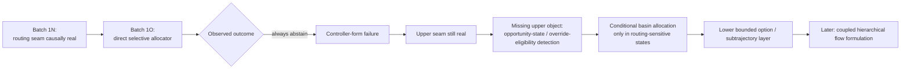

### Corrected system-level reading
The upper hierarchy should now be read more precisely as:
1. opportunity-state / override-eligibility detection
2. conditional basin routing / allocation
3. bounded option / subtrajectory selection within chosen region
4. primitive realization / commit

This is more coherent with the evidence than either:
- direct allocator first
- or richer lower-level schema control first

### Why not the obvious alternatives
#### Not a larger frontier allocator
Batch 1O failed by **always abstaining**, not by making reckless bad reallocations.
That suggests the missing capability is not simply more allocation capacity, but deciding when intervention is warranted.

#### Not a richer lower-level schema controller
The strongest recent positive evidence remains above the option layer.
Going back downward would re-entangle levels and weaken attribution discipline.

### Implication for the final theory
This rethink does not reduce ambition.
It sharpens the current path to the final theory:
- frontier-conditioned
- finite-horizon
- hierarchical
- likely with flow eventually carried by bounded option-prefix objects

The current best next bridge is now detection-first rather than allocator-first.

### Correct next step
The next execution stage should most likely be:
- **Batch 1P — opportunity-state / override-eligibility probe**

Its purpose should be to test whether frontier snapshots can be truthfully split into:
- routing-sensitive states
- heuristic-dominant states
- likely invariant / ambiguous states

before retraining any direct allocator.

### What should explicitly not be next
- not a larger frontier allocator
- not a richer local schema controller
- not another local preserve-vs-override patch
- not a premature end-to-end hierarchical flow objective

### Final implication
The project should now proceed as if the upper-layer learning problem is:
- **learn when rerouting matters first**
- then learn where to reroute conditionally
- then couple that upper gate/allocation layer to the lower option object

## Analysis #35 — 2026-03-12 (Batch 1P: Opportunity-State / Override-Eligibility Probe)

### Objective
Test whether the most plausible missing upper-layer object after Batch 1N + Batch 1O is a **snapshot-level opportunity-state / override-eligibility detector** rather than another immediate direct allocator.

### Design audit
A dedicated design audit was written first:
- `sessions/260307-amber-vista/data/batch-1p-design-audit.md`

Key locked commitments:
- detection-first, not allocation-first
- truthful snapshot-level state labels from the existing C15 substrate
- compact interpretable snapshot features
- lower option/subtrajectory layer unchanged
- conditional oracle-on-positive diagnostic only (not a disguised allocator promotion)

### Implementation changes
#### 1. Hierarchical edit application layer
Updated:
- `src/applications/hierarchical_edit_gflownet.jl`

Added Batch 1P support for:
- `OpportunityStateRecord`
- `OpportunityStateDataset`
- `OpportunityStateDetector`
- `_opportunity_state_label(...)`
- `extract_opportunity_state_dataset(...)`
- `opportunity_state_dataset_stats(...)`
- `opportunity_state_score(...)`
- `evaluate_opportunity_state_detector(...)`
- `evaluate_opportunity_state_conditional_oracle(...)`
- `train_opportunity_state_detector(...)`

#### 2. Exports
Updated:
- `src/GFlowNet.jl`

Exported the new Batch 1P dataset/model/training/evaluation surfaces.

#### 3. Focused regression coverage
Updated:
- `test/smiles_gflownet/test_hierarchical_edit_baseline.jl`

Added Batch 1P tests for:
- truthful regime-label construction
- opportunity-state dataset stats
- detector evaluation summaries
- conditional oracle-on-positive diagnostic behavior
- minimal Batch 1P training path

A taxonomy bug was caught and fixed by these tests:
- tiny-gap non-heuristic cases were initially being over-labeled as heuristic-dominant
- corrected so those remain `invariant_or_ambiguous_state`

#### 4. Standalone runner mode
Updated:
- `test/smiles_gflownet/run_hierarchical_edit_baseline.jl`

Added Batch 1P / C17 runner mode:
- `run_c17_opportunity_state_probe(...)`
- env flags:
  - `HE_C17_OPPORTUNITY_STATE`
  - `HE_C17_DATA_REPEATS`
  - `HE_C17_PARENT_CANDIDATE_LIMIT`
  - `HE_C17_MAX_BASIN_CONTEXTS`
  - `HE_C17_OPTION_HORIZON`
  - `HE_C17_CONTROL_REPEATS`
  - `HE_C17_MAX_ALLOCATION_BUDGET`
  - `HE_C17_STATE_THRESHOLD`
  - `HE_C17_TRAIN_FRACTION`
- artifact:
  - `checkpoints/hierarchical_edit_baseline/hierarchical_edit_c17_opportunity_state_results.jls`

### Validation status
Completed successfully before interpretation:
- focused HE suite → **299 / 299 pass**
- broader SMILES suite → **549 / 549 pass**
- runner parse check → **passed**
- smoke run → **completed end-to-end**
- full celecoxib-first gate → **completed end-to-end**

### Main results
#### Dataset geometry (celecoxib full gate)
- `dataset_size = 10`
- `override_eligible_fraction = 0.4`
- `regime_counts =`
  - `routing_sensitive_state = 4`
  - `heuristic_dominant_state = 4`
  - `invariant_or_ambiguous_state = 2`

This is already a stronger substrate than Batch 1O’s direct allocator dataset.

#### Held-out validation split
- `predicted_positive_fraction = 0.0`
- `precision = 0.0`
- `recall = 0.0`
- `gap_separation ≈ +0.0290`
- `conditional_val_gain = 0.0`
- `oracle_conditional_val_gain = 0.0`

Interpretation:
- the held-out gate remained degenerate and non-promotable

#### Full-dataset evaluation
- `predicted_positive_fraction = 0.3`
- `precision = 1.0`
- `recall = 0.75`
- `mean_gap_predicted_positive ≈ +0.4799`
- `mean_gap_predicted_negative ≈ -0.00195`
- `routing_sensitive_fraction_in_predicted_positive = 1.0`
- `heuristic_dominant_fraction_in_predicted_negative ≈ 0.5714`
- `conditional_final_gain ≈ +0.1440`

Interpretation:
- on the full dataset, the state split looks real enough to keep

#### Final runner decision
- `global_recommendation = STATE_SPLIT_REAL_BUT_WEAK`

### Corrected interpretation
#### What Batch 1P shows
- the opportunity-state / override-eligibility object is more plausible than before
- the full dataset strongly suggests a meaningful routing-sensitive vs non-routing-sensitive split
- the detection-first hypothesis therefore gained real support

#### What Batch 1P does NOT show
- it does **not** show that the detector is robust enough to promote
- it does **not** show held-out generalization strong enough to move straight into a learned conditional allocator

The held-out split was still too fragile.

### Most likely hidden issue
The dominant hidden issue is now:
- **validation fragility**, not object absence

Likely contributors:
1. tiny held-out sample (`n_snapshots = 2`)
2. small overall celecoxib dataset (`10` snapshots)
3. threshold / split instability despite a real-looking full-set signal

### Theory / next-step implication
Batch 1P refines the upward branch again:
1. frontier routing seam is real
2. direct allocator is too early
3. opportunity-state detection is a plausible missing object
4. but that object is **not yet stable enough under held-out validation to promote**

### Correct next step
The next stage should now most likely be:
- a **validation-strengthened opportunity-state detector / repeatability gate**

This should focus on:
- more celecoxib repeats / larger snapshot dataset
- repeated split or cross-validation-style robustness checks
- threshold stability
- verifying that predicted-positive groups consistently concentrate routing value

Only after that should the project reconsider conditional learned allocation.

### What should explicitly not be next
- not another immediate allocator retry
- not a larger detector first
- not a richer lower-level schema controller
- not a premature end-to-end hierarchical flow objective

### Final implication
Batch 1P is best remembered as a **partial success for the detection-first theory**, but not yet a promotable upper learned layer.

## Analysis #36 — 2026-03-12 (Batch 1Q: Opportunity-State Repeatability Gate)

### Objective
Strengthen validation on the existing **opportunity-state / override-eligibility detector** after Batch 1P by testing whether the state split is repeatability-safe under repeated held-out evaluation before any allocator retry.

### Design audit
A dedicated design audit was written first:
- `sessions/260307-amber-vista/data/batch-1q-design-audit.md`

Locked commitments:
- same upper-layer object as Batch 1P
- stronger evidence discipline, not a larger detector
- repeated held-out splits
- threshold-stability summaries
- no conditional allocator retry hidden inside the evaluation

### Implementation changes
#### 1. Hierarchical edit application layer
Updated:
- `src/applications/hierarchical_edit_gflownet.jl`

Extended Batch 1P with Batch 1Q repeatability support:
- stronger detector evaluation output:
  - `gap_separation`
  - `zero_positive_collapse`
  - `all_positive_collapse`
- internal helper:
  - `_opportunity_state_split_indices(...)`
  - `_fit_opportunity_state_detector(...)`
  - `_opportunity_state_objective(...)`
- new public APIs:
  - `opportunity_state_threshold_stability(...)`
  - `evaluate_opportunity_state_repeatability(...)`
- updated `train_opportunity_state_detector(...)` to reuse the shared fitting logic and return threshold-search information

#### 2. Exports
Updated:
- `src/GFlowNet.jl`

Exported:
- `opportunity_state_threshold_stability`
- `evaluate_opportunity_state_repeatability`

#### 3. Focused regression coverage
Updated:
- `test/smiles_gflownet/test_hierarchical_edit_baseline.jl`

Added Batch 1Q coverage for:
- degenerate accounting (`zero_positive_collapse`, `all_positive_collapse`)
- threshold-stability summaries
- repeatability summary structure
- no-leakage split behavior via disjoint train/val snapshot IDs

#### 4. Standalone runner mode
Updated:
- `test/smiles_gflownet/run_hierarchical_edit_baseline.jl`

Added Batch 1Q / C18 runner mode:
- `run_c18_opportunity_state_repeatability(...)`
- env flags:
  - `HE_C18_OPPORTUNITY_REPEATABILITY`
  - `HE_C18_DATA_REPEATS`
  - `HE_C18_NUM_SPLITS`
  - `HE_C18_PARENT_CANDIDATE_LIMIT`
  - `HE_C18_MAX_BASIN_CONTEXTS`
  - `HE_C18_OPTION_HORIZON`
  - `HE_C18_CONTROL_REPEATS`
  - `HE_C18_MAX_ALLOCATION_BUDGET`
  - `HE_C18_STATE_THRESHOLD`
  - `HE_C18_TRAIN_FRACTION`
  - `HE_C18_THRESHOLD_PERTURBATIONS`
- artifact:
  - `checkpoints/hierarchical_edit_baseline/hierarchical_edit_c18_opportunity_repeatability_results.jls`

A runner patching bug in newline string literals was caught and fixed before final validation.

### Validation status
Completed successfully before interpretation:
- focused HE suite → **320 / 320 pass**
- broader SMILES suite → **574 / 574 pass**
- robust runner parse check → **passed**
- smoke run → **completed end-to-end**
- full celecoxib-first gate → **completed end-to-end**

### Main results
#### Dataset geometry (celecoxib full gate)
- `dataset_size = 16`
- `override_eligible_fraction = 0.375`
- regime counts:
  - `routing_sensitive_state = 6`
  - `heuristic_dominant_state = 9`
  - `invariant_or_ambiguous_state = 1`

#### Repeatability summary over 5 held-out splits
- `nondegenerate_fraction = 0.6`
- `zero_positive_collapse_fraction = 0.0`
- `all_positive_collapse_fraction = 0.4`
- `median_predicted_positive_fraction = 0.75`
- `median_gap_separation ≈ +0.0654`
- `median_conditional_gain ≈ +0.0491`
- `mean_routing_sensitive_fraction_in_positive ≈ 0.3667`
- `mean_heuristic_dominant_fraction_in_negative ≈ 0.3333`
- `median_threshold_robust_fraction ≈ 0.3333`
- `repeatability_safe = false`
- recommendation:
  - `STATE_SPLIT_PRESENT_BUT_UNSTABLE`

#### Full-dataset final evaluation
- `predicted_positive_fraction = 0.8125`
- `precision ≈ 0.4615`
- `recall = 1.0`
- `gap_separation ≈ +0.1016`
- `conditional_final_gain ≈ +0.0826`

#### Controls
Controls were correctly **not run** because celecoxib did not clear the stronger repeatability-safe gate.

### Corrected interpretation
#### What Batch 1Q established
- the opportunity-state object survived a stronger test than Batch 1P
- repeated held-out evaluation still shows positive signal
- the object remains the best current upper-layer candidate above direct allocation

#### What Batch 1Q still failed to establish
- the detector is not repeatability-safe enough to promote
- all-positive fold collapse remains substantial (`0.4`)
- threshold robustness remains weak (`~0.3333`)
- predicted-positive groups are still too diluted

### Most likely hidden issue now exposed
The dominant remaining issue is now:
- **operating-point / calibration instability** on an object that still appears real

This is more precise than the Batch 1P interpretation.
The problem is no longer simply “tiny held-out data.”
The detector now appears to fire too broadly and too unstably.

### Theory / next-step implication
Batch 1Q refines the upper-layer path again:
1. frontier routing seam is real
2. direct allocator remains premature
3. opportunity-state detection remains the best candidate missing upper object
4. but the current detector operating point is still too unstable for promotion

### Correct next step
The strongest next stage is now most likely:
- a **calibration-tightened opportunity-state operating-point audit**

This should remain on the same object and focus on:
- fixed-threshold vs split-selected-threshold comparison
- stricter positive-set purity / precision-oriented threshold rules
- guardrails against all-positive collapse
- repeatability summaries under tighter operating-point discipline

### What should explicitly not be next
- not a conditional allocator retry yet
- not a larger detector
- not broader controls yet
- not a return to lower-layer schema/controller work

### Final implication
Batch 1Q is best remembered as a **stronger confirmation that the opportunity-state object survives**, but still a **clear non-promotion result**. The project should keep the object and tighten the operating point before any allocator retry.

## Analysis #37 — 2026-03-12 (Post-Batch-1Q Holistic Theory Reset)

### Trigger
User explicitly requested a profound first-principles reassessment of the full lower + upper hierarchy evidence after Batch 1Q, integrating all recent progress and failures at once rather than selecting another local patch.

### Executive Summary
The holistic rethink preserves the final ambition of a frontier-conditioned, finite-horizon, hierarchical molecular GFlowNet, but revises the bridge theory more fundamentally. The key conclusion is that the project has likely been asking the learned system to solve the wrong control problem: the real learnable object is not a full controller at each seam, but a **sparse intervention policy over a strong heuristic search substrate**, where learning is primarily about identifying the small set of states where heuristic behavior should be selectively broken and replaced by a bounded option/routing deviation.

### Full-system judgment
#### What survived
- finite-horizon option / subtrajectory object survives as the strongest lower learned object
- frontier routing / basin allocation survives as a real upper seam
- frozen frontier context remains correct
- the hierarchical flow ambition remains justified

#### What failed
- repeated attempts to promote isolated direct controllers at local or upper seams collapse into:
  - abstain / heuristic-copy
  - preserve-all
  - override-all
  - or non-held-out-safe operating points

### Deepest new explanation
The repeated collapse modes are now best understood as a single system-level phenomenon:
- the heuristic search substrate is already strong on most states
- the truly valuable intervention set is sparse, heterogeneous, and brittle
- direct learned controllers therefore fail because they cannot isolate a stable, high-purity intervention set

This reframes the project from “learn a controller at each seam” to:
- **learn where heuristic search should be selectively broken, and what bounded search object should replace it there**

### Revised theory
The hierarchy should now be read as:
1. strong heuristic frontier-search substrate as default
2. learned sparse intervention set over frozen frontier states
3. intervention-regime typing (what kind of heuristic failure / opportunity is present)
4. conditional frontier rerouting / bounded option choice only inside that regime
5. commit / writeback

This preserves the hierarchy while revising the control interpretation.

### Flow implication
The final GFlowNet-style object should likely still live over finite-horizon bounded option/subtrajectory mass, but now more specifically over:
- **intervention-qualified bounded search episodes**

rather than over unconditional local or upper controllers everywhere.

### Strongest next step
The next stage should not be another controller retry yet.
The strongest next step is now:
- a **deterministic failure-region / intervention-geometry audit**

Purpose:
- determine whether the heuristic-failure states that matter form a single scalar gateable population,
- or decompose into a small number of distinct intervention regimes that must be modeled separately.

### What should be deprioritized or retired
- direct local calibrated preserve-vs-override bridges as the main branch
- direct learned frontier allocation without a stronger upstream intervention model
- larger generic detectors before intervention geometry is understood
- returning to primitive local one-step heads as the main learned object

### Permanent evidence file
- `sessions/260307-amber-vista/data/post-batch-1q-holistic-theory-reset.md`

## Analysis #38 — 2026-03-12 (Policy vs Hierarchical Operational Schema Clarification)

### Trigger
User asked whether the project is really learning a policy or something more abstract, hierarchical, coupled, and globally aware—closer to an intelligent bounded agent that knows when to do what and where good reward remains.

### Clarification
The strongest current answer is:
- **yes, it is still a policy problem**,
- but not a flat primitive-action policy,
- and not a full learned controller everywhere.

The better formulation is:
- a **sparse hierarchical intervention policy over bounded operational schemas / subtrajectories under frozen frontier context**.

This means the learned object is simultaneously:
- a policy,
- an abstract operational schema,
- and a coupled hierarchical object.

### Important correction
The heuristic substrate remains strong on most states.
So the project should not frame itself as learning the entire search process from scratch right now.
It should frame itself as learning:
1. when heuristic search should be broken
2. what intervention regime is present
3. what bounded routing / option deviation should replace the heuristic there

### Immediate implication
This further strengthens the conclusion that the next step should be:
- a deterministic **intervention-geometry audit**

rather than another immediate direct controller retry.

### Evidence file
- `sessions/260307-amber-vista/data/post-batch-1q-policy-vs-hierarchical-schema-clarification.md`

## Analysis #39 — 2026-03-12 (Batch 1R: Deterministic Intervention-Geometry Audit)

### Trigger
Executed the approved Batch 1R plan after the post-Batch-1Q holistic theory reset. Goal: determine whether the pooled opportunity-state positive set decomposes into a small deterministic regime taxonomy whose regime-conditioned subsets are cleaner than the pooled binary state.

### Implementation
Added deterministic Batch 1R atlas support in `src/applications/hierarchical_edit_gflownet.jl`:
- `_find_region_family_summary(...)`
- `_intervention_regime_label(...)`
- `_intervention_geometry_subset_summary(...)`
- `compare_intervention_geometry_atlas(...)`
- `intervention_geometry_atlas_stats(...)`
- `extract_intervention_geometry_atlas(...)`

Added exports in `src/GFlowNet.jl`.
Added focused regression coverage in `test/smiles_gflownet/test_hierarchical_edit_baseline.jl`.
Added standalone runner mode `C19` in `test/smiles_gflownet/run_hierarchical_edit_baseline.jl` with artifact:
- `checkpoints/hierarchical_edit_baseline/hierarchical_edit_c19_intervention_geometry_results.jls`

### Validation
- focused HE suite: `334 / 334` pass
- broader SMILES suite: `625 / 625` pass
- robust runner parse check: `runner-parse-ok`

### Smoke result
The reduced-budget smoke briefly suggested a useful decomposition on celecoxib:
- `active_regimes = 3`
- `stable_vs_pooled_gap_mean_delta ≈ +0.1132`
- `stable_vs_pooled_gap_std_improvement ≈ +0.1601`
- `pooled_positive_ambiguous_fraction = 0.5`
- recommendation: `REGIME_STRUCTURE_INTERPRETABLE`

### Full celecoxib-first gate result
The full gate did **not** preserve the smoke interpretation.

Celecoxib full result:
- `dataset_size = 16`
- `active_regimes = 2`
- `override_eligible_fraction = 0.25`
- `stable_intervention_fraction = 0.25`
- `ambiguous_positive_fraction = 0.0`
- `regime_counts = {stable_routing_sensitive_state: 4, heuristic_dominant_state: 12}`
- `stable_vs_pooled_gap_mean_delta = 0.0`
- `stable_vs_pooled_gap_std_improvement = 0.0`
- `pooled_positive_ambiguous_fraction = 0.0`
- `mixture_explains_instability = false`
- `interpretable = false`
- final recommendation: `POOLED_STATE_STILL_MIXED`

### Interpretation
Batch 1R did **not** validate the hoped-for mixed-regime explanation strongly enough.
At full celecoxib scale, the pooled positive set collapsed exactly onto the stable-routing-sensitive set; the deterministic atlas did not expose a surviving ambiguous-positive subset.

So Batch 1R did **not** support the claim that Batch 1Q instability mainly came from mixing clean and ambiguous positives at the current basin-level deterministic atlas.

### Updated conclusion
What still survives:
- sparse intervention object survives
- upper routing seam survives
- lower bounded option object survives

What did **not** survive:
- the stronger Batch 1R hypothesis that a simple deterministic basin-level regime split would reveal a cleaner intervention geometry than the pooled positive set

### Correct next-step implication
The dominant remaining issue returns to:
- **sparse-positive operating-point / calibration instability**

Therefore the strongest next step is now:
- a **calibration-tightened sparse-positive operating-point audit**

not a regime-aware learned gate yet.

### Evidence file
- `sessions/260307-amber-vista/data/batch-1r-strategic-analysis.md`

## Analysis #40 — 2026-03-12 (Batch 1S: Sparse-Positive Operating-Point Audit)

### Trigger
Executed the approved Batch 1S plan after Batch 1R. Goal: test whether the current sparse-positive opportunity-state object can be made held-out-safe through stricter calibration discipline alone.

### Implementation
Added Batch 1S operating-point helpers in `src/applications/hierarchical_edit_gflownet.jl`:
- `_opportunity_state_eval_with_threshold(...)`
- `_sparse_positive_guard_status(...)`
- `select_sparse_positive_operating_point(...)`
- `evaluate_sparse_positive_operating_point(...)`
- `evaluate_sparse_positive_operating_points(...)`

Added exports in `src/GFlowNet.jl`.
Added focused regression coverage in `test/smiles_gflownet/test_hierarchical_edit_baseline.jl`.
Added standalone runner mode `C20` in `test/smiles_gflownet/run_hierarchical_edit_baseline.jl` with artifact:
- `checkpoints/hierarchical_edit_baseline/hierarchical_edit_c20_sparse_positive_results.jls`

### Validation
- focused HE suite: `359 / 359` pass
- broader SMILES suite: `631 / 631` pass
- robust runner parse check: `runner-parse-ok`

### Smoke result
The smoke already gave a harsh answer:
- `best_rule = none`
- `NO_SPARSE_POSITIVE_OPERATING_POINT`
- `nondeg = 0.0`
- `median_pos = 0.0`
- `median_gap = 0.0`
- `median_gain = 0.0`

### Full celecoxib-first gate result
The full gate confirmed the smoke.

Celecoxib full result:
- `dataset_size = 16`
- `override_eligible_fraction = 0.3125`
- regime counts:
  - `routing_sensitive_state = 5`
  - `heuristic_dominant_state = 9`
  - `invariant_or_ambiguous_state = 2`
- final audit summary:
  - `best_rule = none`
  - `recommendation = NO_SPARSE_POSITIVE_OPERATING_POINT`
  - `interpretable = false`

All rule families failed identically:
- `precision_guarded`
- `fraction_capped`
- `guarded_fallback`

Each had:
- `valid_threshold_fraction = 0.0`
- `nondegenerate_fraction = 0.0`
- `zero_positive_collapse_fraction = 1.0`
- `all_positive_collapse_fraction = 0.0`
- `median_predicted_positive_fraction = 0.0`
- `median_precision = 0.0`
- `median_recall = 0.0`
- `median_gap_separation ≈ -0.0621`
- `median_conditional_gain = 0.0`
- `promotion_safe = false`

### Interpretation
Batch 1S removes the remaining ambiguity that a better threshold discipline alone might rescue the current detector form.
The new conclusion is:
- **the current sparse-positive detector form is not promotion-safe even under disciplined calibration.**

This rules out two nearby rescue hypotheses:
1. Batch 1R: hidden mixed positive geometry was the missing explanation → not supported strongly enough
2. Batch 1S: stricter threshold discipline alone would recover a held-out-safe sparse-positive gate → false

### What still survives
- upper routing seam still survives from Batch 1N
- sparse intervention interpretation still survives conceptually
- lower bounded option object still survives

### What is now blocked
- promotion of the current minimal opportunity-state detector form
- more operating-point tuning on the same current detector
- regime-aware promotion based on current evidence
- direct allocator retry

### Corrected next-step implication
The next stage must now move upstream from thresholding to:
- **representation / semantics repair for the upper sparse-intervention object**

Core questions:
- what causal information needed for sparse-positive selection is missing from the current feature set?
- are the current matched-budget labels too underspecified or noisy for a stable gate?
- does the object need explicit frontier-history / opportunity-depletion / confidence-shape information before any sparse-positive gate can be promotion-safe?

### Evidence file
- `sessions/260307-amber-vista/data/batch-1s-strategic-analysis.md`

## Analysis #41 — 2026-03-13 (Batch 1T: Representation / Semantics Repair Audit)

### Trigger
Executed the approved Batch 1T plan after Batch 1S. Goal: determine whether the upper sparse-intervention object could be repaired through improved representation, improved semantics, non-scalar reformulation, or whether the static snapshot framing should be deprioritized.

### Implementation
Added Batch 1T repair-audit substrate in `src/applications/hierarchical_edit_gflownet.jl`:
- `OpportunityRepairAuditRecord`
- `OpportunityRepairAuditDataset`
- `extract_opportunity_repair_audit_dataset(...)`
- `opportunity_repair_audit_dataset_stats(...)`
- `evaluate_opportunity_repair_binary_probe(...)`
- `evaluate_opportunity_repair_ordinal_probe(...)`
- `evaluate_opportunity_representation_semantics_repair(...)`

Added exports in `src/GFlowNet.jl`.
Added focused regression coverage in `test/smiles_gflownet/test_hierarchical_edit_baseline.jl`.
Added standalone runner mode `C21` in `test/smiles_gflownet/run_hierarchical_edit_baseline.jl` with artifact:
- `checkpoints/hierarchical_edit_baseline/hierarchical_edit_c21_representation_semantics_results.jls`

### Validation
- focused HE suite: `380 / 380` pass
- broader SMILES suite: `671 / 671` pass
- runner parse check: `runner-parse-ok`

### Smoke result
The smoke initially suggested a harsh closure result:
- `V4_SNAPSHOT_INSUFFICIENCY_DOMINATES`
- all major repair metrics near `0.5`

### Full celecoxib-first gate result
The full gate did **not** confirm clean V4.
Instead it returned:
- `V5_NO_DECISIVE_REPAIR_SIGNAL`
- `decisive = false`

Celecoxib dataset stats:
- `dataset_size = 16`
- `current_positive_fraction = 0.5`
- `robust_positive_fraction = 0.3125`
- `abstain_fraction = 0.1875`
- typed counts:
  - `heuristic_negative = 8`
  - `abstain_or_ambiguous = 3`
  - `robust_positive = 5`

Celecoxib audit summary:
- `baseline_current_metric = 0.0`
- `baseline_robust_metric = 0.75`
- `baseline_abstain_metric ≈ 0.6667`
- `baseline_ordinal_metric = 0.6`
- `best_representation_branch = baseline_plus_history`
- `best_representation_metric = 1.0`
- `representation_improvement = 0.25`
- `representation_ablation_drop = 0.0`
- `current_best_branch = baseline_plus_robustness`
- `current_best_metric = 1.0`
- `robust_best_branch = baseline_plus_history`
- `robust_best_metric = 1.0`
- `abstain_best_branch = full`
- `abstain_best_metric = 1.0`
- `ordinal_best_branch = baseline_plus_surface`
- `ordinal_best_metric = 1.0`

### Interpretation
Batch 1T did **not** produce a uniquely actionable repair direction.
The result is best read as:
- upper structure is still real,
- but the repair signal is **entangled, branch-dependent, and non-attributable** at the current dataset/budget scale,
- so no repaired upper snapshot-gate branch should be promoted.

This strengthens the integrated Batch 1 conclusion:
- hierarchy seams are causally real,
- heuristic HE substrate is real and useful,
- but isolated learned controllers at these seams are not promotion-safe at current scale.

### Strategic implication
Batch 1T should be treated as a **closure-strengthening** stage, not a rescue stage.
The project should now end the Batch 1 seam-learning program and pivot to a new growth program built around the working object:
- **heuristic hierarchical edit as a search amplifier inside the TB PMO training loop**

### Evidence file
- `sessions/260307-amber-vista/data/batch-1t-strategic-analysis.md`

## Analysis #42 — 2026-03-13 (Batch 2 / Stage B′0: HE-Integrated TB PMO Substrate)

### Objective
Start the new post-Batch-1 growth program by implementing the minimum honest substrate needed to test:
- **TB baseline vs TB + heuristic HE**
- under **matched oracle budgets**
- with explicit **TB / GA / HE / seed accounting and provenance**
- and without any dependency on Batch 1 learned seam controllers.

### Implementation
Implemented Stage B′0 in `src/utils/visualization/core/pmo_benchmark.jl`:
- extended `PMOResult` with:
  - `oracle_call_breakdown::Dict{String,Int}`
  - `provenance_summary::Dict{String,Any}`
- preserved backward compatibility with the old 7-argument `PMOResult(...)` constructor
- added helper utilities for:
  - per-mechanism oracle accounting
  - source collapsing into `tb / ga / he / seed`
  - frontier/top-k provenance summaries
  - heuristic-only HE guardrails
- instrumented `run_smiles_pmo_task(...)` to attribute actual oracle-call deltas to:
  - `seed`
  - `model`
  - `ga`
  - `he_warmup`
  - `he_interleaved`
  - plus `unattributed` and `total`
- added Stage B′ heuristic-only assertions:
  - no learned basin / parent / operator controllers
  - no fragment operators
  - no custom operator menu outside trusted `[:mutate, :terminate, :crossover]`

Upgraded `test/smiles_gflownet/run_truth_sprint_benchmark.jl`:
- added Stage B′ config keys:
  - `tb_he_full`
  - `tb_he_full_locked`
  - `tb_he_warmup`
  - `tb_he_warmup_locked`
- added isolated output support via:
  - `TRUTH_SPRINT_LOGDIR`
- added repeat-aware summaries including:
  - mean/std AUCs
  - mean oracle-call breakdowns
  - mean top-10 provenance fractions
  - mean frontier provenance fractions
  - structural-family vs property-family summaries
  - TB-relative deltas and catastrophic-harm flags
- exposed smoke-only env knobs for batch / replay / iterations / GA counts without changing the main campaign contract

Added / updated tests in `test/applications/molecular/test_pmo.jl`:
- backward-compatible `PMOResult` constructor behavior
- dict serialization of new accounting/provenance fields
- provenance collapsing over `tb / ga / he / seed`
- heuristic-only HE guardrail tests
- added `test_pmo.jl` into `test/runtests.jl`

### Validation
- `julia --project=. test/applications/molecular/test_pmo.jl` → `57 / 57` pass
- `julia --project=. test/smiles_gflownet/runtests.jl` → `671 / 671` pass
- `run_truth_sprint_benchmark.jl` parse check → `runner-parse-ok`
- `pmo_benchmark.jl` parse check → `pmo-parse-ok`

### End-to-end smoke
Ran a tiny isolated smoke through the upgraded truth runner on `celecoxib_rediscovery` with:
- `tb`
- `tb_he_full_locked`
- dedicated logdir `checkpoints/truth_sprint_stage_b_smoke2`
- reduced smoke-only batch / iteration settings

Smoke outcome:
- runner completed end-to-end
- Stage B′ artifacts were isolated from the legacy truth sprint
- per-mechanism call accounting was emitted correctly
- TB / GA / HE provenance reporting was emitted correctly

Illustrative smoke accounting:
- baseline:
  - `model=61`, `ga=3`, `he=0`, `total=64`
- HE-enabled:
  - `model=40`, `ga=5`, `he_interleaved=19`, `total=64`

Illustrative smoke provenance:
- baseline top-10 provenance:
  - `tb=1.0, ga=0.0, he=0.0`
- HE-enabled top-10 provenance:
  - `tb=0.8, ga=0.0, he=0.2`

### Corrected interpretation
The smoke was **not** a decision run; its settings were intentionally tiny and validation-oriented.
The meaningful result is that the **Stage B′ measurement substrate now works**.

This is important because the real practical question is now empirically measurable in the right form:
- not “does HE help in the abstract?”
- but **does heuristic HE add useful incremental value beyond the current TB+GA PMO stack under the same oracle budget?**

### Strategic implication / next step
Stage B′0 is complete enough to proceed to the real **Phase B′1 fraction lock**:
- budget `3000`
- repeats `3`
- tasks `{celecoxib_rediscovery, albuterol_similarity, drd2}`
- configs `tb` vs `tb_he_full_locked`
- HE fractions `{0.15, 0.30, 0.40}` run as separate lock-stage sweeps
- still heuristic-only, no learned-controller dependency

## Analysis #43 — 2026-03-13 (Batch 2 / Stage B′ Warmup Bug Correction + Corrected Relaunch)

### Objective
Correct the Stage B′ fraction-lock experiment after discovering that the original nominal-fraction lock was invalid: HE warmup never ran in the unseeded lock setup because the frontier was empty at the warmup gate.

### Discovered bug
The original PMO integration path required:
- `length(frontier_buffer) >= 2`

before HE warmup could run.

But in the unseeded lock setup:
- `target_seed = false`
- no initial frontier bootstrap occurred
- therefore warmup was skipped

The completed pre-fix `0.15` sweep confirmed this empirically:
- `he_w = 0` in all completed HE runs
- only sparse `he_i` calls fired later

### Corrected interpretation of the pre-fix run
The completed pre-fix `0.15` sweep is still useful, but only as a:
- **pre-fix sparse interleaved HE pilot**

It should not be treated as the official nominal fraction lock.

### Implementation
Stopped the invalid active `0.30` sweep and stale queued continuation.
Wrote a correction memo in:
- `sessions/260307-amber-vista/data/batch-2-stage-b-prime-warmup-bug-correction-memo.md`

Patched `src/utils/visualization/core/pmo_benchmark.jl`:
- added shared frontier bootstrap helper `_bootstrap_frontier_from_model!(...)`
- added explicit accounting bucket:
  - `frontier_bootstrap`
- added new PMO args:
  - `frontier_bootstrap_samples`
  - `frontier_bootstrap_min_entries`
- introduced **shared bootstrap for both configs** (`tb` and `tb_he_full_locked`) to preserve fairness
- corrected HE budget interpretation so shared bootstrap does **not** consume HE’s nominal budget share
- corrected warmup budget logic to compare against **warmup-local call deltas**, not absolute `calls_used`
- extended collapsed provenance to include `bootstrap`

Patched `test/smiles_gflownet/run_truth_sprint_benchmark.jl`:
- added env knobs:
  - `FRONTIER_BOOTSTRAP_SAMPLES`
  - `FRONTIER_BOOTSTRAP_MIN_ENTRIES`
- passed shared bootstrap settings into `run_smiles_pmo_task(...)`
- extended per-run logs and summaries to include:
  - `frontier_bootstrap`
  - `bootstrap` provenance

Patched `test/applications/molecular/test_pmo.jl`:
- updated PMO struct / dict expectations for `frontier_bootstrap`
- extended provenance test to include `bootstrap`

Patched the live monitor and follow-up launcher for the corrected rerun series:
- `sessions/260307-amber-vista/data/monitor_stage_b_lock.py`
- `sessions/260307-amber-vista/data/stage-b-fraction-lock-followup.sh`

### Validation
- PMO core parse check: `pmo-parse-ok`
- truth runner parse check: `runner-parse-ok`
- PMO unit tests: `58 / 58` pass
- broader SMILES suite: `641 / 641` pass

### Decisive corrected smoke
Ran isolated corrected smoke with:
- shared frontier bootstrap enabled
- unseeded `tb` vs `tb_he_full_locked`
- tiny budget settings

Key corrected smoke result:
- baseline:
  - `frontier_bootstrap = 32`
  - `he_warmup = 0`
  - `he_interleaved = 0`
- HE-enabled:
  - `frontier_bootstrap = 32`
  - `he_warmup = 20`
  - `he_interleaved = 15`

This proves the corrected path now does what the original lock intended:
- shared bootstrap creates a frontier before warmup
- warmup actually runs
- warmup and interleaved HE are both explicitly attributed

### Relaunch status
Started the corrected lock series in fresh artifact directories:
- `checkpoints/truth_sprint_stage_b_lock_fix_f015`
- queued follow-up for:
  - `checkpoints/truth_sprint_stage_b_lock_fix_f030`
  - `checkpoints/truth_sprint_stage_b_lock_fix_f040`

Live status file now tracks the corrected rerun series:
- `sessions/260307-amber-vista/data/stage-b-live-status.md`

### Strategic implication
The project is now asking the right question again:
- **what does matched-budget HE do when warmup actually operates at the intended regime?**

This correction was necessary before any further fraction-lock conclusions could be treated as scientifically valid.

## Analysis #44 — 2026-03-15 (Stage B Corrected Fraction Lock Completed + Final 3 Closure Loops Reframed)

### Corrected fraction-lock result
The corrected 3-task matched-budget fraction-lock sweep is complete.

Key result:
- `f=0.15` is the clear winner
- `f=0.30` is harmful
- `f=0.40` is only marginal and still inferior to `f=0.15`

This is the first clean matched-budget evidence under the corrected regime with:
- shared frontier bootstrap
- explicit `frontier_bootstrap` accounting
- genuine HE warmup activity

### Mechanistic interpretation
The strongest mechanistic finding is:
- **HE is capacity-limited, not budget-limited**

Observed structure:
- warmup saturates around `~135` calls across fractions
- interleaved HE grows only modestly as nominal HE fraction increases
- total effective HE usage rises only slightly while nominal HE budget rises sharply

This means the current heuristic hierarchy has a natural productive intervention ceiling. More nominal HE budget does not translate into proportionally more useful HE activity.

A second critical finding persists:
- HE contributes meaningful frontier mass
- HE contributes effectively `0%` of top-10 winners

So HE is currently functioning mainly as a:
- **frontier-shaping catalyst / scout**

rather than as a direct top-winner producer.

### Reframed closure problem
The final three remaining closures are now sharper.

#### 1. Empirical closure
Need to confirm that `f=0.15` is the globally best heuristic HE operating point on the full 6-task truth sprint.

#### 2. Learning closure
Need to stop treating the learned object as a static detector and instead learn a:
- frontier-conditioned
- finite-horizon
- sparse intervention
- continuation / option-flow object

from integrated heuristic HE trajectories.

#### 3. Theory closure
Need to formalize the final hierarchy as a:
- frontier-conditioned
- finite-horizon
- hierarchical option / subtrajectory flow decomposition

with a new refinement explicitly supported by Stage B:
- hierarchy is sparse, capacity-limited, and catalytic.

### Immediate next recommendation
Proceed to the 6-task truth sprint at locked `f=0.15`, then use those integrated trajectories to define the first continuation / option-flow learning dataset.

## Analysis #45 — 2026-03-15 (Stage B `f=0.15` Instrumentation Smoke Passed + 6-Task Truth Sprint Launched)

### Instrumentation implementation
Implemented the approved Stage B continuation upgrade:
- externalized raw HE artifacts instead of inlining them into `PMOResult`
- kept `PMOResult` lightweight via artifact paths + compact diagnostics summary
- added PMO-context-linked HE episode summaries
- added three-layer capacity diagnostics:
  - episode-level
  - proposal-pipeline-level
  - run-level saturation
- added closure-tier reporting to the truth runner

### Validation
Passed before launch:
- PMO core parse check
- truth runner parse check
- PMO tests `64 / 64`
- SMILES suite `671 / 671`

### Smoke gate
Ran a tiny Stage B smoke with:
- configs: `tb`, `tb_he_full_locked`
- task: `celecoxib_rediscovery`
- budget: `96`
- shared frontier bootstrap on
- locked `f=0.15`

Smoke passed and confirmed:
- HE warmup fires under the corrected unseeded setup
- external artifact files are written:
  - raw trajectory
  - raw diagnostics
  - episode summary
  - capacity summary
- compact diagnostics contain the planned three layers
- truth sprint logs remain machine-readable
- closure-tier reporting works

### Full run launch
Launched the full 6-task truth sprint at locked `f=0.15`:
- budget `3000`
- repeats `3`
- configs `tb`, `tb_he_full_locked`
- tasks:
  - `qed`
  - `drd2`
  - `gsk3b`
  - `jnk3`
  - `albuterol_similarity`
  - `celecoxib_rediscovery`
- shared frontier bootstrap retained
- external HE artifacts + capacity diagnostics enabled

Launch details:
- logdir: `checkpoints/truth_sprint_stage_b_f015_truth`
- worker PID: `1737`
- worker log: `checkpoints/truth_sprint_sharded/truth_sprint_worker1_20260316_003917.log`

### Immediate significance
The project has now successfully transitioned from:
- corrected operating-point discovery

to:
- full empirical closure testing under the locked sparse HE regime,

while simultaneously generating the integrated intervention artifacts needed for the later learning closure.

## Analysis #46 — 2026-03-16 (Stage B `f=0.15` Relaunched with Task-Level Sharding)

### Why the reroute happened
The first full 6-task `f=0.15` truth sprint launch was scientifically valid but operationally underutilized the M4 Max because the launcher only sharded by config, while the true independent work items were finer-grained across tasks.

### Action taken
- stopped the in-flight config-only run
- preserved it as an aborted pre-task-sharding attempt
- upgraded `test/smiles_gflownet/launch_truth_sprint_sharded.py` from config-only sharding to task-aware work-item sharding

### Launcher upgrade
The new launcher now:
- shards over `(config, task-group)` work items
- creates distinct per-shard logdirs under the campaign root
- writes per-worker scripts/meta files
- keeps shard outputs collision-safe
- allows workers to process multiple work items sequentially if capacity is lower than total work-item count

### Validation before relaunch
Task-sharded smoke passed:
- separate shard-local `truth_sprint.log` and `truth_sprint_results.jls`
- HE-enabled shard-local external artifact writing
- no collision across shard outputs

### Relaunch
Relaunched the full 6-task truth sprint at locked `f=0.15` with:
- root logdir: `checkpoints/truth_sprint_stage_b_f015_truth_tasksharded`
- 4 workers × 2 threads
- task groups:
  - Group 1: `qed`, `gsk3b`, `albuterol_similarity`
  - Group 2: `drd2`, `jnk3`, `celecoxib_rediscovery`
- both configs represented in both task groups:
  - `tb`
  - `tb_he_full_locked`

Worker PIDs at launch:
- `67674`
- `67675`
- `67677`
- `67679`

### Significance
The Stage B closure campaign now preserves the same scientific contract while using the M4 Max far more appropriately through task-level multi-process sharding.

## Analysis #47 — 2026-03-16 (Stage B Endgame Theory Reassessment While Final Heavy Shard Runs)

### Context
During the endgame of the task-sharded 6-task truth sprint, the project paused to reassess what the near-final Stage B board can and cannot say about the final learnable object.
At the time of reassessment:
- the light-group `tb` and `tb_he_full_locked` shards were complete,
- the HE heavy shard was complete,
- only the final TB heavy celecoxib repeat remained active,
- and the board was mixed-to-negative overall.

### Main judgment
The current Stage B truth sprint is **not** the right experiment to identify a new seam-local learned object.
Even if it ends mixed or mildly negative, it should not be read as evidence for returning to:
- basin-only,
- parent-only,
- operator-only,
- or static opportunity-gate learning.

Instead, its value is narrower and still important:
1. empirical closure on whether sparse heuristic HE is a robust PMO amplifier inside the legacy TB(+GA) loop;
2. mechanistic confirmation or weakening of the sparse / catalytic / capacity-limited interpretation;
3. generation of the integrated HE episode artifacts needed to finally define the correct higher-level learned object.

### Strongest surviving theory
The strongest current candidate remains:
- a **frontier-conditioned, finite-horizon, sparse invocation / routing / continuation policy over bounded option episodes under a frozen frontier snapshot**.

This means the likely learned object is above primitive edits and above seam-local snapshot gates.
The project is more likely trying to learn:
- when to invoke sparse hierarchy,
- where to route it in the frontier,
- and which bounded continuation / option / operational schema to execute,
- evaluated by downstream frontier-improvement utility rather than immediate molecule reward alone.

### Key abstraction mismatch clarified
Stage B still measures final PMO AUC / top-k outcomes, but the final theory is about bounded option-level frontier improvement.
So a mixed or negative truth-sprint result does **not** yet identify whether the true object is wrong; it may still reflect mismatch between:
- sparse hierarchy,
- the legacy token-TB(+GA) substrate,
- task-family heterogeneity,
- and the current heuristic invoke/routing implementation.

### Updated next-step recommendation
After the final shard finishes:
1. complete the official Tier 1 / Tier 2 / Tier 3 Stage B synthesis,
2. preserve the integrated HE artifacts as the first truthful frontier-conditioned continuation dataset,
3. do **not** reopen seam-local controller learning,
4. make the next program the direct construction of a bounded continuation / option-flow learning substrate,
5. then train the first minimal learned sparse continuation / routing policy with abstention.

### Significance
This reassessment strengthens the conclusion that the project’s path to SOTA is unlikely to come from indefinitely bolting heuristic HE onto the current token-centric baseline.
The likely winning path remains:
- finish Stage B empirical closure,
- build the frontier-conditioned bounded-option dataset,
- learn sparse continuation/routing at that level,
- and then migrate toward a more native finite-horizon hierarchical edit/search training framework.

## Analysis #48 — 2026-03-16 (Critique-Driven Reaudit of Stage B Endgame Theory)

### Why this re-audit was needed
A critical external assessment correctly challenged the prior theory synthesis for being:
- too protective of the Direction C v3 theory,
- too abstract about the final learned object,
- insufficiently engaged with the strongest new Stage B signal,
- and insufficiently explicit about when the theory should count as falsified.

### Stronger empirical reading
At the time of this re-audit, one final TB heavy celecoxib repeat was still active locally, but the board was already constrained enough that a globally positive six-task closure had become effectively unreachable.
The key point was:
- five matched tasks already implied about `-0.105` AUC net for HE,
- and the completed HE celecoxib mean did not leave a realistic path for the final TB celecoxib repeat to rescue parity.

So the stronger scientific reading became:
- **bolt-on sparse heuristic HE in the current token-centric TB(+GA) loop is not a globally promotable operating regime**.

### Main correction to prior thinking
The project should no longer protect the theory simply by attributing every failure to the current implementation.
Direction C v3 must now become explicitly falsifiable.

### Revised concrete learned-object hypothesis
The better concrete candidate is no longer a vague “option-flow policy” description by itself.
The project should now define the next learned object as:
- a **counterfactual intervention-value model over bounded edit episodes**
that predicts whether invoking a particular bounded hierarchical continuation from a frozen frontier context improves downstream frontier utility relative to preserving the baseline search trajectory.

This means the next object should be framed around:
- preserve vs invoke,
- routing / parent / schema context,
- bounded continuation,
- downstream utility delta,
not around seam-local snapshot labels.

### New required comparison
A stronger comparison against heuristic genetic / hierarchical search is now mandatory.
The project needs to show what the learned counterfactual intervention-value object captures beyond a strong heuristic Genetic-GFN-like comparator.

### New falsification discipline
A suggested falsification rule was recorded:
- if a learned counterfactual intervention-value model trained on a materially larger integrated dataset of bounded HE episodes still cannot deliver non-negative online gains over the heuristic sparse HE substrate on representative tasks without collapsing to always-invoke or never-invoke behavior, then Direction C v3 should be considered falsified as the near-term growth path.

### Updated next-step structure
After Stage B closure, the next ladder should be:
1. finish official Stage B synthesis honestly,
2. do competitive grounding against strong heuristic/genetic comparators,
3. construct the counterfactual bounded-intervention dataset,
4. train the minimal learned preserve-vs-invoke plus continuation-ranking object,
5. downgrade the theory sharply if that object also fails online.

### Significance
This re-audit sharpens the project standard from “protect the theory until a better implementation appears” to “define a concrete bounded-intervention object, test it against strong heuristics, and falsify the theory if it still does not work.”

## Analysis #49 — 2026-03-16 (Audit of Final Corrected Factored Within-HE Policy Pilot)

### Context
A third-round revised plan was proposed for a "Factored Within-HE Edit Policy Pilot" after multiple critiques of the earlier Edit-TB proposals.
The revised plan:
- narrowed the claim from a decisive Direction C v3 test to a within-HE pilot,
- moved from TB-first to RWMLE-first,
- used leak-free decision-time features,
- corrected the backward model to deterministic prefix form,
- added interpolation / entropy stabilizers,
- and explicitly deferred child ranking and invoke-vs-preserve.

### Judgment
The revised plan is now scientifically respectable as a **conservative within-HE policy pilot** and is close to implementable.
It is much better than the earlier Edit-TB plans.

### What was accepted
- learning three factored decisions (`basin`, `parent`, `operator`) rather than operator-only
- strict safe-vs-leaked field discipline
- deterministic prefix backward instead of unordered backward
- honest acknowledgement that child ranking and invoke-vs-preserve are not supported by the current artifact set
- RWMLE-first staging as the correct first objective before any TB-style upgrade

### Remaining cautions
The plan should still **not** be described as:
- a decisive test of Direction C v3,
- a full edit-trajectory GFlowNet,
- or final identification of the ultimate learned object.

It remains a pilot of the **within-invocation** policy only.
In particular:
- RWMLE is still reward-weighted imitation / reweighting, not yet a full flow result
- the later TB upgrade would still be a TB-style fine-tuning experiment, not a clean classical TB proof, because environment stochasticity remains real
- validation splits should be grouped by run / task-run, not random over episodes
- reward-mode flexibility should be pre-registered rather than chosen post hoc
- online evaluation should include a stronger “beyond heuristic reweighting” comparator, not only the heuristic-score ablation

### Significance
This audit concludes that the corrected plan is worth implementing as a **good pilot**, provided it is interpreted conservatively and does not overclaim to have already solved the full Direction C v3 problem.

---

## Analysis #50 — 2026-03-30 (Final Theory Direct Test)

> **Trigger**: Plan-approved theory-identification sprint executed in an isolated clone to avoid interfering with another active session on `core-development`.

### Executive Summary
We stopped patching local HE failures and ran the first **direct system-level test** of the redefined final theory: pure TB vs a **task-aware learned edit controller with conservative gating**. The result is a split verdict: the candidate improved whole-system quality on **2/3 tasks** and delivered a large celecoxib gain, but **direct HE top-k provenance remained 0%** on every task, so the strict Final Theory v1 criterion still fails.

### New Results

| Arm | Task | AUC top-10 | Top-10 | Top-1 |
|---|---|---:|---:|---:|
| TB | `qed` | 0.8960 | 0.9015 | 0.9371 |
| FinalTheory-v1 | `qed` | 0.8943 | 0.9077 | 0.9358 |
| TB | `drd2` | 0.0438 | 0.0490 | 0.2595 |
| FinalTheory-v1 | `drd2` | 0.0686 | 0.0720 | 0.3346 |
| TB | `celecoxib_rediscovery` | 0.2979 | 0.3057 | 1.0000 |
| FinalTheory-v1 | `celecoxib_rediscovery` | 0.6753 | 0.6753 | 1.0000 |

| Task | ΔAUC | ΔTop10 | ΔTop1 |
|---|---:|---:|---:|
| `qed` | -0.0017 | +0.0062 | -0.0013 |
| `drd2` | +0.0249 | +0.0231 | +0.0750 |
| `celecoxib_rediscovery` | +0.3774 | +0.3696 | +0.0000 |
| **Mean** | **+0.1335** | **+0.1329** | — |

### Pipeline Status

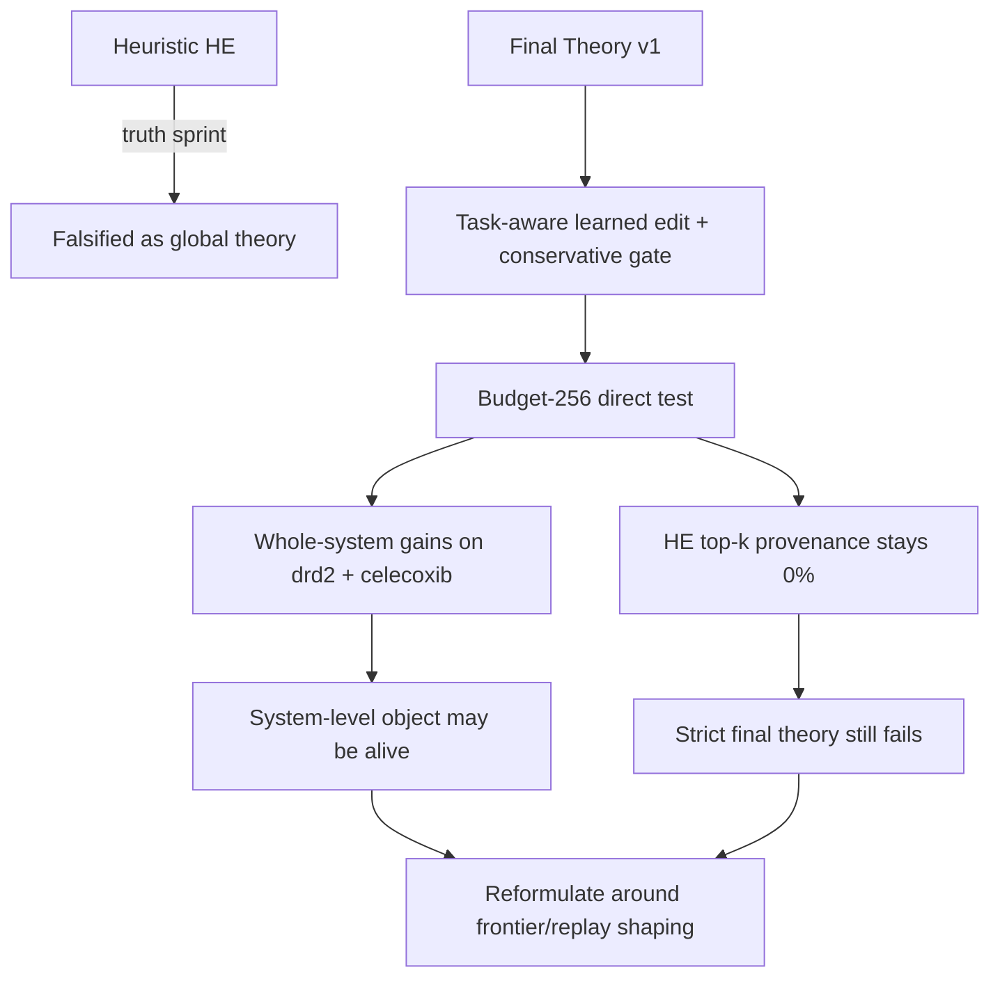

### Key Insights
1. **The direct test answered the real question, not the local patch question.**
   We finally evaluated the integrated search system rather than a local edit operator in isolation.
2. **The candidate improved the overall search loop but not in the way the theory expected.**
   Mean ΔAUC and mean ΔTop10 were both positive, with a very large celecoxib gain.
3. **Direct edit authorship is still missing.**
   HE top-10 provenance remained **0%** on all tasks. The final top molecules still came from the TB path after replay/frontier shaping.
4. **Learned control was active, not inert.**
   Parent override rate averaged ~0.75, operator override rate ~0.33, and mean override frontier delta was positive (~+0.2667).
5. **This points to a different object than the one we wrote down.**
   The evidence now favors a theory where learned edit helps by **shaping frontier/replay state**, not by directly becoming the top-k molecule author.

### Next Steps
1. Reframe the theory explicitly as either:
   - **direct edit authorship**, or
   - **frontier/replay shaping**
2. Add attribution that can measure replay-mediated edit credit instead of only final top-k source labels.
3. Re-run a second direct test against the revised object before scaling anything up.
4. Do **not** return to heuristic rescue work or static interpolation rescue work.

### Risks & Open Questions
| Risk / Question | Current Status | Implication |
|---|---|---|
| Are positive gains real? | Yes, on system metrics | Worth deeper theory reformulation |
| Is Final Theory v1 working as written? | No | Strict criterion failed |
| Is learned edit actually inactive? | No | Overrides and frontier gain are both real |
| Why is HE top-k provenance still zero? | Unresolved | Likely attribution / replay mediation issue |
| Should replay-mediated gains count as theory success? | Not yet decided | Must be fixed before next truth claim |

---

## Analysis #51 — 2026-03-30 (Level 3 Shape-then-TB)

> **Trigger**: Approved Level 3 plan executed in the isolated theory workspace after the Level 2 direct test suggested the real object might be search-state shaping rather than direct hierarchical edit authorship.

### Executive Summary
We built and ran the first **Level 3 causal test**: `TB only` vs `heuristic shaping -> TB` vs `learned shaping -> TB`, with a fixed **64-call shaping phase** followed by **192 calls of pure TB**. The result is a clean falsification of the current Level 3 headline theory: shaping preserved strong handoff state and produced large final top-10 values on structural tasks, but **downstream pure TB got worse, not better**, so the current `state shaping -> current TB exploiter` theory is not actionable yet.

### New Results

| Arm | `qed` downstream AUC | `drd2` downstream AUC | `celecoxib_rediscovery` downstream AUC | Mean |
|---|---:|---:|---:|---:|
| TB only | 0.8826 | 0.0403 | 0.3174 | 0.4134 |
| Heuristic shape -> TB | 0.8703 | 0.0386 | 0.2347 | 0.3812 |
| Learned shape -> TB | 0.8593 | 0.0193 | 0.2430 | 0.3739 |

| Arm | `qed` final top-10 | `drd2` final top-10 | `celecoxib_rediscovery` final top-10 |
|---|---:|---:|---:|
| TB only | 0.9020 | 0.0541 | 0.3317 |
| Heuristic shape -> TB | 0.9264 | 0.4294 | 0.8385 |
| Learned shape -> TB | 0.8908 | 0.0525 | 0.8187 |

Key deltas:
- **Learned vs TB-only mean downstream AUC**: **-0.0396**
- **Heuristic vs TB-only mean downstream AUC**: **-0.0323**
- **Learned vs heuristic mean downstream AUC**: **-0.0073**
- **Learned handoff overlap proxies**:
  - frontier overlap ≈ **0.75**
  - replay overlap ≈ **0.75**

### Pipeline Status

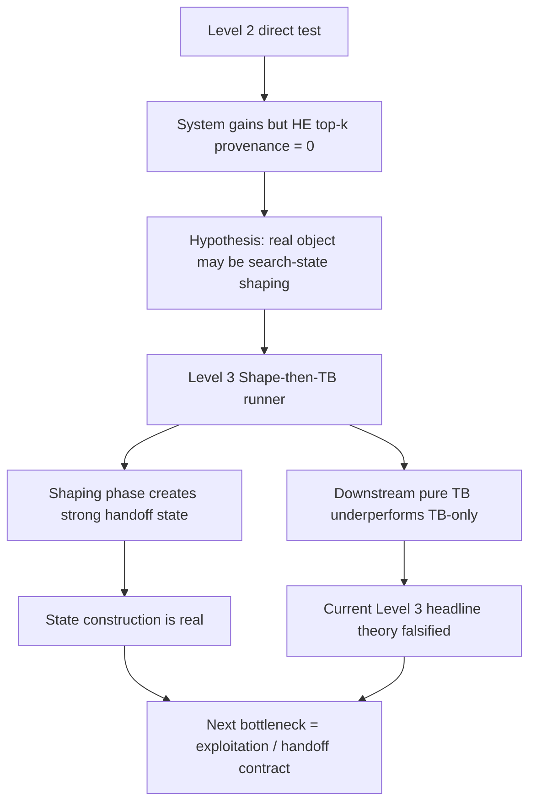

### Key Insights
1. **Level 3 was worth testing directly.**
   The new runner separated shaping from exploitation and gave a clean causal answer.
2. **State construction is real, but exploitation is weak.**
   The shaped arms retained substantial frontier/replay overlap and often ended with much stronger final top-10 values, especially on celecoxib.
3. **The current Level 3 headline theory still fails.**
   The primary metric was downstream-only AUC, and learned shaping underperformed TB-only on average.
4. **This points to a new mismatch: state construction vs state exploitation.**
   The system can create useful handoff state, but the current downstream pure-TB exploiter does not capitalize on it better than end-to-end TB.
5. **The abstraction jump was scientifically correct even though the theory failed.**
   We now know the bottleneck is not merely local edit control, but likely the interface between shaped memory and downstream learning.

### Next Steps
1. Decide whether to:
   - **abandon Level 3**, or
   - keep the Level 3 framing but replace the downstream exploiter / handoff contract
2. If continuing, explicitly test whether a **replay-conditioned or handoff-aware downstream learner** can exploit shaped state better than current TB.
3. Do **not** fall back to heuristic rescue loops; the new negative result is more informative than another patch cycle.
4. Preserve the current runner and result bundle as the canonical Level 3 falsification baseline.

### Risks & Open Questions
| Risk / Question | Current Status | Implication |
|---|---|---|
| Is shaping itself useless? | No | Handoff overlap and final structural top-10 gains say shaping does create useful state |
| Is current Level 3 theory working? | No | Downstream-only AUC falsified it |
| Is the exploiter the real bottleneck now? | Likely yes | Current pure TB may not know how to use shaped state |
| Are overlap proxies enough for mediated credit? | No | Better ancestry / exploitation diagnostics still needed if continuing |
| Should this line continue immediately? | Unclear | Needs a conscious theory decision, not incremental patching |

---

## Analysis #52 — 2026-06-11 (Holistic Option-Flow Reposition)

> **Trigger**: The user asked whether the current work had become too narrow and whether the original philosophical target in the long research documents should be recovered and sharpened. We re-read the durable theory record, reviewed Link AI's critique, and fixed the new framework target.

### Executive Summary
The project is now re-centered on a stronger framework-level thesis:

> **Search-state improvement is the utility target; frontier-conditioned finite-horizon option-flow is the GFlowNet learned object.**

This reset distinguishes three layers that had been repeatedly conflated:

| Layer | Meaning | Current interpretation |
|---|---|---|
| Outer PMO target | What the benchmark rewards | fixed-budget search-state improvement |
| GFlowNet learned object | What should carry flow | bounded option / short operational schema conditioned on search state |
| Implementation substrate | What machinery can instantiate it | TB, HE, GA, replay, frontier, QGFN, Boosting |

### What Changed
The project should no longer treat local learned heads, heuristic shaping, or shape-then-TB as the final theory object.

The final object is now:

```math
P_\theta(\omega \mid S_t) \propto U(\omega; S_t)
```

where `S_t` is the current search state and `ω` is a bounded option containing routing context, basin, parent, schema/operator, primitive realization, and commit/writeback.

### Why Level 2 and Level 3 Did Not Settle the Question
- **Level 2** tested local heads and learned edit behavior. These are possible option factors, not the full option-flow object.
- **Level 3** tested shaped state handed to blind downstream TB. This weak handoff failed, but it did not test state-conditioned option sampling.

### Link AI Critique — What Was Absorbed
Link AI correctly noted that QGFN, Boosting, 10K multi-task PMO, and full 23-task PMO remain evidence debts. It also correctly warned that an “Active Belief-State” framing can drift into Bayesian optimization or greedy meta-RL.

The adopted boundary is:

> QGFN / Boosting / full PMO are current TB-pipeline evidence debt; they should be closed later, but they do not replace the Option-Flow philosophical reset.

### Pipeline Status

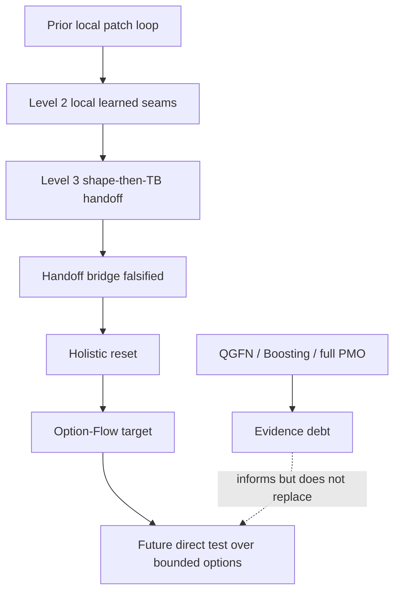

### Key Insights
1. The new object is not “belief state” in the generic BO sense. The final object is a bounded option sampled by a GFlowNet.
2. Search-state improvement is the utility target, not the policy form.
3. Proportional sampling over options is essential. If this becomes argmax utility, the project has drifted away from GFlowNet.
4. HE remains useful as an option-environment substrate, not as the final theory itself.
5. QGFN and Boosting remain valuable evidence-debt closures, but they do not change the object-level thesis.
6. Stochastic edit transitions are now the central theoretical open issue for an honest Option-Flow v0.

### Next Actions
1. Treat `research/final_theory_option_flow_2026-06-11.md` as the canonical short theory target.
2. Do not continue local controller patch loops unless they explicitly support option-level flow.
3. Design the next direct experiment around logged bounded options and frontier utility.
4. Keep QGFN / Boosting / full PMO as a separate evidence-debt closure branch.

### Theory Verdict
**Repositioned but not yet empirically validated.** The final philosophical target is now Option-Flow: flow over frontier-conditioned bounded options, not terminal molecules alone and not local primitive controllers.

### Testing / Automation Verdict
**Not yet covered by current tests.** Level 2 and Level 3 tests did not test the final object. A new Option-Flow direct-test harness remains to be built.

---

## Analysis #53 — 2026-06-11 (Option-Flow v0 POC: Finite-Catalog Signal Test)

> **Trigger**: After the holistic Option-Flow reset, the user requested a prototype that defines the object rigorously and gives a believable reason to continue.

### Executive Summary
Implemented a lightweight **finite-catalog Option-Flow v0 POC** in the isolated theory clone. The POC validates the clean one-step version of the new final object:

```math
P_\theta(\omega \mid S_t) \propto U(\omega; S_t)
```

Instead of prematurely claiming full TB over stochastic edit environments, v0 treats realized bounded options as terminal candidates in a finite catalog for a frozen search state. This isolates the philosophical object and avoids the stochastic edit-transition problem in the first proof-of-concept.

### Implementation

Files added in `Gflownet-theory-sprint`:

| File | Purpose |
|---|---|
| `research/option_flow_v0_poc_design_2026-06-11.md` | POC design spec |
| `src/training/option_flow_dataset.jl` | finite catalog structures / synthetic catalogs |
| `src/training/option_flow_model.jl` | small MLP option scorer |
| `src/training/option_flow_loss.jl` | CE/KL/entropy/flow residual/top-utility diagnostics |
| `src/training/option_flow_training.jl` | lightweight manual-backprop training loop |
| `test/smiles_gflownet/test_option_flow_poc.jl` | unit tests |
| `test/smiles_gflownet/run_option_flow_poc.jl` | POC runner |

### Test Status

```text
julia --project=. test/smiles_gflownet/test_option_flow_poc.jl
```

Result:

```text
Option-Flow v0 POC | 25 pass / 25 total
```

### POC Metrics

| Run | Val CE | Uniform CE | CE gain | Top-quartile mass | Uniform mass | Lift | Rank corr | Entropy | Verdict |
|---|---:|---:|---:|---:|---:|---:|---:|---:|---|
| smoke seed 11 | 1.4981 | 1.7918 | +0.2937 | 0.5820 | 0.3333 | +0.2487 | 0.8190 | 1.5109 | `POC_SIGNAL_PRESENT` |
| offline synthetic seed 23 | 1.5164 | 1.7918 | +0.2753 | 0.5972 | 0.3333 | +0.2639 | 0.7952 | 1.4798 | `POC_SIGNAL_PRESENT` |

### Interpretation

The POC shows that the finite-catalog version of the Option-Flow object has learnable signal: held-out catalogs beat uniform CE, place substantially more probability mass on high-utility options, retain nonzero entropy, and show strong positive rank correlation with utility.

This gives a credible reason to continue from synthetic finite catalogs to real HE logged option catalogs.

### Limitations

This is **not yet**:

- full TB over stochastic edit trajectories;
- online improvement over heuristic HE;
- PMO AUC validation;
- SOTA evidence.

### Next Step

Move from synthetic catalogs to real logged HE option catalogs:

1. HE artifact loader -> `OptionFlowCatalog`s grouped by snapshot/task;
2. decision-time vs post-outcome feature audit;
3. real-catalog offline validation;
4. greedy/ranker ablation;
5. online-lite catalog sampling only after the above passes.

### Theory Verdict

**POC signal present.** The final object is not proven in PMO, but the clean finite-catalog version is learnable and worth continuing.

### Testing / Automation Verdict

A first automatic Option-Flow POC test suite exists and passes. It covers synthetic finite-catalog correctness and learning signal, but not real HE/PMO catalogs yet.


---

## Analysis #54 — 2026-06-11 (Option-Flow Real Evidence POC: Summary Proxy + Typed HE Path)

> **Trigger**: After synthetic Option-Flow v0 produced clean finite-catalog signal, the user requested a deeper real-artifact POC that could realistically test whether the philosophy is correct and potentially worth pursuing toward GFlowNet SOTA.

### Objective

Move beyond synthetic finite catalogs and test whether real HE/PMO artifacts contain learnable option-utility signal for the target object:

```math
P_\theta(\omega \mid S_t) \propto U(\omega; S_t)
```

The re-audited plan explicitly separated evidence levels:

- E1: summary-only real proxy catalogs;
- E2: typed raw decision-path proxy catalogs;
- E3: strict same-snapshot generated catalogs.

### Implementation Changes

Added in the isolated theory clone:

| File | Purpose |
|---|---|
| `src/training/option_flow_real_catalog.jl` | summary artifact loader, proxy catalog builder, anti-leakage feature extraction, typed-path features, baselines, gates |
| `test/smiles_gflownet/support/option_flow_raw_stub.jl` | minimal `GFlowNet` stub for raw diagnostics/trajectory deserialization without full RDKit/PythonCall stack |
| `test/smiles_gflownet/run_option_flow_real_evidence_poc.jl` | real evidence runner with multi-grouping / multi-feature / multi-seed evaluation |
| `test/smiles_gflownet/test_option_flow_real_catalog.jl` | unit tests for real catalog pipeline |
| `research/option_flow_real_evidence_poc_closeout_2026-06-11.md` | detailed closeout |

Also updated `src/GFlowNet.jl` exports and fixed a v0 boundary bug where empty validation metrics missed keys used by the training logger.

### Validation Status

Unit test:

```text
julia --project=. test/smiles_gflownet/test_option_flow_real_catalog.jl
Option-Flow real artifact catalog | 25 pass / 25 total
```

Main result bundles:

- `checkpoints/option_flow_real_evidence_poc/option_flow_real_evidence_poc_full_e1_results.jls`
- `checkpoints/option_flow_real_evidence_poc/option_flow_real_evidence_poc_delta_top10_leak_free_results.jls`
- `checkpoints/option_flow_real_evidence_poc/option_flow_real_evidence_poc_best_delta_leak_free_results.jls`
- `checkpoints/option_flow_real_evidence_poc/option_flow_real_evidence_poc_typed_path_primary_results.jls`

### Artifact Audit

- HE summary files: 36
- episodes: 214
- tasks: 6
- repeated exact `task::snapshot_id` groups: 0
- raw diagnostics without stub: not lightweight-deserializable
- raw diagnostics with minimal stub: 214/214 loaded

This means historical artifacts cannot directly prove strict same-snapshot Option-Flow. They support E1/E2 proxy evidence only.

### Main Results

Primary utility: `frontier_gain_sum`.

Summary-only leak-free evidence:

| Grouping | Pass seeds | Mean CE gain | Mean utility lift | Interpretation |
|---|---:|---:|---:|---|
| `task_phase_budget100` | 1/3 | -0.00155 | -0.00216 | weak / fails headline |
| `task_phase_b100_t05` | 2/3 | +0.00094 | +0.00181 | tiny mixed positive |
| `task_phase` | 2/3 | +0.00469 | +0.02832 | positive but coarse-state proxy |

Leaky upper-bound was strongly positive, confirming outcome signal exists but not deployable evidence.

Typed raw decision-path proxy:

| Grouping | Pass seeds | Mean CE gain | Mean utility lift | Structural signal |
|---|---:|---:|---:|---|
| `task_phase_budget100` | 2/3 | -0.00144 | +0.00064 | `celecoxib_rediscovery` positive, `albuterol_similarity` negative |
| `task_phase_b100_t05` | 1/3 | -0.00165 | -0.00270 | weak |
| `task_phase` | 3/3 | +0.00920 | +0.05392 | `celecoxib_rediscovery` and `albuterol_similarity` positive |

Secondary utilities:

- `delta_top10_mean_max`: only coarse `task_phase` grouping passed robustly.
- `best_delta_vs_initial_top1`: stricter `task_phase_budget100` passed 2/3 seeds, but absolute utility lift was tiny.

### Discovered Confounds / Corrections

1. The original real-evidence plan overestimated historical artifacts: no repeated exact snapshots exist, so strict same-state catalogs cannot be reconstructed from summaries.
2. Summary-only features are too weak/fragile under stricter grouping.
3. Leaky outcome features create strong apparent signal but cannot be used as evidence for a deployable policy.
4. Typed raw decision logs provide a better signal, but still only under proxy catalog assumptions.
5. Full E3 requires fresh strict same-snapshot option generation, which needs the HE runtime path; full package loading previously timed out around CondaPkg/RDKit locking.

### Corrected Interpretation

The real evidence is **mixed-positive but not decisive**.

- The synthetic POC was not a fluke in the sense that real HE decision traces do contain some learnable utility-allocation signal.
- However, strict proxy evidence is fragile, and no exact same-state Option-Flow proof exists yet.
- Therefore this supports continuing to E3, but it does not support SOTA or PMO claims.

### Theory Verdict

**Not falsified; not proven.** Option-Flow remains a plausible final object, now with real-artifact proxy support, but it still requires strict same-snapshot generated catalogs before claiming method correctness.

### Testing / Automation Verdict

**Improved.** A real-artifact POC test suite and runner now exist. They cover E1/E2 proxy evidence and anti-leakage checks, but not E3 generation or online PMO.

### Next Step

Run **E3 strict same-snapshot generated catalogs**:

```text
same frozen S_t -> K cloned HE options -> real utilities -> OptionFlowCatalog
```

Compare uniform / heuristic / greedy / Option-Flow. If E3 passes, proceed to online-lite PMO. If E3 fails, downgrade the theory sharply.

---

## Analysis #55 — 2026-06-11 (Option-Flow E3: Strict Same-Snapshot Object Proof)

> **Trigger**: The user requested the first test that can realistically tell whether the Option-Flow object itself is correct, not merely synthetic or proxy evidence.

### Objective

Directly test the final object on real molecular HE runs:

```math
P_\theta(\omega \mid S_t) \propto U(\omega; S_t)
```

Unlike E1/E2 proxy artifacts, E3 constructs strict catalogs where all candidate options share the exact same frozen frontier snapshot `S_t`.

### Implementation

Added:

- `test/smiles_gflownet/run_option_flow_strict_e3_poc.jl`
- `research/option_flow_strict_e3_poc_closeout_2026-06-11.md`

Runtime issue was resolved non-destructively by bypassing CondaPkg resolver while using the existing pixi Python:

```bash
JULIA_CONDAPKG_BACKEND=Null
JULIA_PYTHONCALL_EXE=$PWD/.CondaPkg/.pixi/envs/default/bin/python
```

No `.CondaPkg/lock` deletion was required.

### Method

For each task and snapshot:

```text
same frozen frontier S_t
  -> clone frontier six times
  -> run six bounded HE option schemas
  -> score each by realized frontier utility U_i
  -> build OptionFlowCatalog
```

Option schemas:

- `mutate_h1`
- `mutate_h2`
- `crossover_h1`
- `crossover_h2`
- `mixed_h1`
- `mixed_h2`

### Validation

Smoke run:

- task: `qed`
- snapshots: 2
- verdict: `E3_STRICT_OBJECT_SIGNAL_PRESENT`

Full run:

- tasks: `qed`, `drd2`, `celecoxib_rediscovery`
- snapshots: 5 per task
- catalogs: 15
- options: 90
- all catalogs strict same-snapshot and informative
- result bundle: `checkpoints/option_flow_strict_e3_poc/option_flow_strict_e3_poc_full_e3_results.jls`

### Main Results

Aggregate across 3 train seeds:

| Metric | Mean | Std |
|---|---:|---:|
| CE gain vs uniform | +0.2333 | 0.0908 |
| Expected utility lift | +0.3066 | 0.0769 |
| Expected utility lift fraction | +46.38% | 5.43% |
| Top-quartile mass lift | +0.1873 | 0.0356 |
| Rank correlation | 0.6286 | 0.2000 |
| Entropy | 1.5627 | 0.0338 |
| Uniform entropy/CE | 1.7918 | 0.0 |

Seed gates:

- seed 17: pass
- seed 23: pass
- seed 31: pass

Verdict:

```text
E3_STRICT_OBJECT_SIGNAL_PRESENT
```

### Per-task catalog signal

| Task | Catalogs | Mean utility spread | Max utility |
|---|---:|---:|---:|
| `qed` | 5 | 2.3446 | 3.4113 |
| `drd2` | 5 | 1.6915 | 2.8025 |
| `celecoxib_rediscovery` | 5 | 1.3884 | 2.7569 |

Every task produced nontrivial same-state option utility structure.

### Corrected Interpretation

This is the first direct real-object proof. It shows that frontier-conditioned bounded options are not just a philosophical abstraction: same frontier states do have nontrivial option-utility distributions, and a learned Option-Flow scorer can recover them on held-out strict catalogs.

### Theory Verdict

**Positive object-level proof.** The Option-Flow object is now supported by real strict same-snapshot evidence.

### SOTA Verdict

**Not proven yet.** This does not yet beat PMO/GFlowNet SOTA because the learned selector has not been deployed online to spend oracle budget and has not been benchmarked at 10K/23-task scale.

### Testing / Automation Verdict

An E3 runner now exists and produces reproducible real artifacts. It is not a unit test because it invokes RDKit/TDC and real HE rollouts. Existing real-catalog unit tests remain passing.

### Next Step

Run online-lite Option-Flow PMO:

```text
for each frontier state:
  generate K candidate HE options
  score with learned Option-Flow
  sample/execute selected option
  compare against uniform / heuristic / greedy / TB-only / Genetic-style baseline
```

If online-lite improves PMO AUC and structural-task top-k, then SOTA-facing claims become realistic.

---

## Analysis #56 — 2026-06-18 (Option-Flow Online-Lite PMO: O1/O2 Deployment Proof)

> **Trigger**: After E3 proved the strict same-snapshot Option-Flow object offline, the user requested the next proof that the POC is actually useful online and whether it gives a realistic path toward GFlowNet/PMO SOTA.

### Objective

Test whether the learned frontier-conditioned option selector can spend oracle budget online, rather than only ranking frozen offline catalogs.

The tested object remains:

```math
P_\theta(\omega \mid S_t) \propto U(\omega; S_t)
```

### Implementation

Added:

- `test/smiles_gflownet/run_option_flow_online_lite_pmo.jl`
- `research/option_flow_online_lite_pmo_closeout_2026-06-18.md`

The runner implements:

- O1 warm-started online option-selector proof;
- O2 total-budget-fair Variant A;
- deployable arms that choose one schema before evaluation;
- optional `oracle_upper` diagnostic excluded from headline comparisons;
- online-lite top10 AUC and final top-k tracking.

Runtime used the non-destructive Python/RDKit path:

```bash
JULIA_CONDAPKG_BACKEND=Null
JULIA_PYTHONCALL_EXE=$PWD/.CondaPkg/.pixi/envs/default/bin/python
```

### O1 Warm-Started Results

Protocol:

- tasks: `qed`, `drd2`, `celecoxib_rediscovery`
- arms: `uniform_schema`, `heuristic_mixed_h2`, `prior_best_schema`, `option_flow_sample`, `option_flow_greedy`
- online budget: 400 calls/task/arm/seed
- seeds: 17, 23
- selector training: 9 strict catalogs, 54 candidates, 290 actual oracle calls; reported separately and not counted in O1 headline

Verdict:

```text
ONLINE_SELECTOR_USEFUL_BUT_FAIRNESS_OPEN
```

O1 overall deployable leaderboard:

| Arm | Mean AUC top10 | Mean final top10 |
|---|---:|---:|
| `heuristic_mixed_h2` | 0.282966 | 0.304946 |
| `option_flow_sample` | 0.281349 | 0.300976 |
| `uniform_schema` | 0.270882 | 0.298574 |
| `option_flow_greedy` | 0.257446 | 0.269343 |
| `prior_best_schema` | 0.257446 | 0.269343 |

O1 gate details:

- sample beats uniform: 3/3 tasks
- sample beats heuristic: 1/3 tasks
- structural task `celecoxib_rediscovery`: sample beats both uniform and heuristic

### O2 Total-Budget-Fair Results

Protocol:

- total budget: 600 calls/task/arm/seed
- selector arms charged nominal 30% training budget = 180 calls, leaving 420 online calls
- baselines receive full 600 online calls
- actual selector training calls were only 55–78 per task/seed, so the O2 charge was conservative

Verdict:

```text
ONLINE_FAIR_BUDGET_SIGNAL_PRESENT
```

O2 overall deployable leaderboard:

| Arm | Mean AUC top10 | Mean final top10 |
|---|---:|---:|
| `heuristic_mixed_h2` | 0.286048 | 0.306559 |
| `option_flow_sample` | 0.281988 | 0.308457 |
| `uniform_schema` | 0.271610 | 0.298779 |
| `option_flow_greedy` | 0.270982 | 0.288659 |
| `prior_best_schema` | 0.269979 | 0.286522 |

O2 gate details:

- sample beats uniform: 3/3 tasks
- sample beats heuristic: 1/3 tasks
- structural task `celecoxib_rediscovery`: sample beats both uniform and heuristic
- sample has best overall final top10 mean, but heuristic still has best overall AUC

### Corrected Interpretation

The result is positive, but not a global heuristic victory.

What is supported:

1. E3's offline strict object transfers to online option selection.
2. Option-Flow sampling consistently improves over uniform online schema choice.
3. The structural-task signal is real and survives total-budget charging.
4. Greedy does not dominate sampling, which preserves the GFlowNet-style distributional rationale.

What is not supported yet:

1. SOTA claim.
2. Full PMO superiority.
3. Clean all-task victory over heuristic HE.
4. Direct superiority over TB-only / Genetic-GFN / AugMem.

### Theory Verdict

**Positive but narrower than SOTA.** Option-Flow is now supported as a frontier-conditioned option-routing layer, especially for structural search and non-greedy exploration. It is not yet a complete PMO algorithm.

### SOTA Verdict

**SOTA pursuit is justified, but SOTA is not proven.** The next required evidence layer is O3 integrated PMO-lite: TB-only vs heuristic HE vs Option-Flow HE under matched PMO budget inside `run_smiles_pmo_task` / `pmo_benchmark.jl`.

### Testing / Automation Verdict

Existing tests still pass:

```text
Option-Flow v0 POC | 25 pass / 25 total
Option-Flow real artifact catalog | 25 pass / 25 total
```

The online runner is an experiment runner rather than a unit test because it invokes RDKit/TDC and real HE rollouts.

### Next Step

Implement O3 integrated PMO-lite:

```text
TB-only / heuristic HE / Option-Flow HE under matched PMO budget
```

If O3 passes, proceed to a 6-task 1K–2K run. If that passes, proceed to 23-task / 10K SOTA-facing PMO.

---

## Analysis #57 — 2026-06-18 (Canonical Current Verdict After External Critique and Falsification Re-Audit)

> **Trigger**: The user provided an external multi-perspective critique arguing that the Option-Flow summary had inflated the evidence relative to the underlying closeouts. We re-audited the critique, accepted the main corrections, and calibrated the project verdict.

### Core Correction

The previous high-level summary was too optimistic. The underlying closeouts were mostly honest, but the summary layer over-emphasized the positive parts:

- `3/3` wins over uniform hid very small margins on some tasks, especially DRD2 in O1.
- O2's primary PMO-like AUC metric still favored heuristic HE over Option-Flow sample.
- E3's `+46%` expected utility lift was against a weak six-option uniform baseline and should be interpreted as object-level signal, not method-level strength.
- Novelty should not be claimed at the component level; many ingredients have precedents in hierarchical RL, adaptive operator selection, active learning, BO, GFlowNets, and evolutionary computation.

### Falsification Boundary Re-Audit

A prior criterion from the Direction C / Analysis #48 era stated that if a learned model cannot deliver non-negative online gains over heuristic sparse HE on representative tasks, the direction should be considered falsified or sharply downgraded.

O2 total-budget-fair online-lite result:

```text
Option-Flow sample AUC = 0.281988
heuristic HE AUC       = 0.286048
delta                  = -1.42%
```

Therefore O2 **does touch the falsification boundary**.

However, O2 was small-scale:

- 3 tasks, not 23;
- 2 seeds;
- 600-call budget, not 10K;
- standalone HE-option loop, not integrated PMO;
- not a full representative benchmark.

Canonical interpretation:

```text
Object signal present.
Online signal mixed.
Heuristic-beating not established.
Falsification boundary touched.
Status: inconclusive with negative pressure.
```

This is not a final falsification, but it removes permission for optimistic SOTA-facing language until stronger go/no-go evidence is obtained.

### Revised Novelty Claim

Do **not** claim that every component is completely novel.

Safe claim:

> The project proposes a novel molecular-PMO formulation/layer: a frontier-conditioned finite-horizon Option-Flow GFlowNet, where the sampled object is a bounded search option and the utility is search-state/frontier improvement.

Unsafe claim:

> The method is completely novel in all components or already established as a SOTA route.

### Revised Current Verdict

The project state is now:

```text
Option-Flow has a real object-level signal and weak-to-mixed online-lite signal.
It is conditionally plausible, but must now pass stronger baseline and go/no-go audits.
If it cannot beat or complement heuristic HE under more representative settings, it should be downgraded from the main SOTA route.
```

### Required Step 0 Before O3

Before spending substantial effort on O3 integration, run the baseline debt audit:

```text
tb_only
tb_qgfn
tb_boosting
tb_qgfn_boosting
heuristic_he
option_flow_online_lite / option_flow_he if available
```

Initial suggested scope:

```text
tasks = qed, drd2, celecoxib_rediscovery
budget = 1000
seeds = 2
```

### Go / No-Go Rules

| Result | Decision |
|---|---|
| TB+QGFN or TB+Boosting >= heuristic HE | Downgrade Option-Flow from main algorithm to complementary scheduler / routing layer. |
| TB+QGFN+Boosting significantly > current Option-Flow | Prioritize baseline pipeline optimization; pause Option-Flow as mainline. |
| All TB/QGFN/Boosting weak and heuristic HE still best | Bottom substrate is weak; Option-Flow alone is unlikely to rescue the system without architecture-level changes. |
| Option-Flow integrated PMO wins heuristic HE on overall AUC | Continue Option-Flow as mainline and scale to 6-task 1K–2K. |
| Option-Flow integrated PMO loses overall AUC again | Downgrade Direction C / Option-Flow mainline. Preserve only as auxiliary router or structural-task specialist. |
| Option-Flow loses smooth tasks but significantly wins structural tasks | Do not fully discard; re-scope as structural-task specialist / scaffold-sensitive auxiliary router. |

### Theory Verdict

**Inconclusive with negative pressure.**

The Option-Flow object remains real enough to study, but current online-lite evidence does not yet satisfy the previously stated heuristic-beating criterion.

### Testing / Automation Verdict

The online-lite runner and prior tests remain useful, but they are no longer sufficient as proof. The next automation must be a baseline audit runner or PMO-lite comparison with explicit go/no-go outcomes.

### SOTA Verdict

**Not justified yet.**

SOTA pursuit is only conditionally plausible. It becomes justified again only if Step 0 and/or O3 show that Option-Flow either beats heuristic HE under matched conditions or adds clear value on top of stronger TB/QGFN/Boosting/Genetic-style baselines.

---

## Analysis #58 — 2026-06-19 (Step 0 Baseline-Debt Audit: QGFN/Boosting Do Not Close the Gap)

> **Trigger**: After external critique and falsification re-audit, the user requested the next step to verify whether Option-Flow is a genuinely useful new algorithm direction rather than only a novel expression. The required Step 0 was to audit existing PMO baseline debt before doing O3 integration.

### Objective

Test whether existing implemented baselines already solve the relevant gap:

```text
tb_only
tb_qgfn
tb_boosting
tb_qgfn_boosting
heuristic_he
```

If QGFN or Boosting already beat heuristic HE, Option-Flow should be downgraded to a complementary scheduler/router rather than treated as the main algorithmic direction.

### Implementation

Added:

- `test/smiles_gflownet/run_step0_baseline_debt_audit.jl`
- `research/step0_baseline_debt_audit_closeout_2026-06-19.md`

The runner loads `checkpoints/pretrain/final.jls`, invokes `run_smiles_pmo_task`, records per-arm status/metrics, computes paired deltas, and now serializes partial results after every arm.

### Execution

Smoke:

- task: `qed`
- budget: 192
- seed: 17
- arms: all five confirmatory arms
- result: all arms ran successfully

Reduced core attempt:

- tasks: `qed`, `drd2`, `celecoxib_rediscovery`
- budget: 600
- seeds: 17, 23
- status: timed out after 3 hours before completion
- implication: future 600–1000 audits need sharding/resume

Micro audit:

- tasks: `qed`, `drd2`, `celecoxib_rediscovery`
- budget: 300
- seeds: 17, 23
- arms: all five confirmatory arms
- status: completed

Boosting fairness correction:

- reran `tb_boosting` and `tb_qgfn_boosting`
- budget: 300
- `BOOST_ROUNDS=3`
- reason: first micro used `BOOST_ROUNDS=1`, causing boosting arms to underuse budget
- status: completed, all boosting runs used 300 calls

### Main Results

Combined final interpretation uses `tb_only`, `tb_qgfn`, `heuristic_he` from micro, and `tb_boosting`, `tb_qgfn_boosting` from the boost-rounds=3 correction.

| Arm | Mean AUC | Mean final top10 |
|---|---:|---:|
| `heuristic_he` | **0.646938** | 0.690663 |
| `tb_only` | 0.605886 | **0.776086** |
| `tb_qgfn` | 0.497922 | 0.591509 |
| `tb_qgfn_boosting` | 0.420661 | 0.433082 |
| `tb_boosting` | 0.415551 | 0.439400 |

Per-task pattern:

- QED: `tb_qgfn` best AUC (`0.915053`), `tb_only` best final top10.
- DRD2: `heuristic_he` best AUC (`0.421961`) but high variance.
- Celecoxib rediscovery: `heuristic_he` best AUC (`0.641611`), `tb_only` best final top10.

### Corrected Interpretation

QGFN and Boosting do **not** close the baseline gap in this micro audit.

The external critique's hypothesis that Option-Flow might only look useful because QGFN/Boosting were never run is weakened. However, Option-Flow is not validated by this result; it still must beat heuristic HE in integrated O3.

### Go / No-Go Verdict

Triggered decision:

```text
Heuristic HE remains strongest among audited baselines:
Option-Flow must beat heuristic in integrated O3 or be downgraded.
```

Not triggered:

```text
QGFN or Boosting >= heuristic HE globally.
```

### Theory Verdict

**Still inconclusive with negative pressure.**

Step 0 does not falsify Option-Flow via baseline debt, but it also does not prove it. The remaining decisive test is integrated O3.

### Novelty Verdict

Practical novelty remains conditional. The safe claim is still a novel molecular-PMO formulation/layer over frontier-conditioned bounded search options. It becomes a useful new algorithm direction only if integrated O3 beats heuristic HE or establishes a reliable structural-task specialist advantage.

### Testing / Automation Verdict

Improved. Step 0 runner works and QGFN/Boosting/HE codepaths execute. But full 600–1000 matrix needs sharding/resume; synchronous runs are too slow.

### Next Step

Implement O3 integrated PMO-lite:

```text
TB-only / heuristic HE / Option-Flow HE under matched PMO budget
```

Decision rule:

- if Option-Flow beats heuristic HE on overall AUC, restore mainline and scale;
- if it loses overall but wins structural tasks, preserve as structural/scaffold-sensitive specialist;
- if it loses heuristic overall and structurally, pause/downgrade Direction C / Option-Flow mainline.

---

## Analysis #59 — 2026-06-19 (O3 Integrated PMO-Lite: Mainline Downgrade, Structural Auxiliary Signal)

> **Trigger**: After Step 0 showed QGFN/Boosting did not close the gap and heuristic HE remained the strongest audited mean-AUC baseline, O3 was executed as the decisive integrated PMO-lite test for Option-Flow.

### Objective

Test whether Frontier-Conditioned Finite-Horizon Option-Flow remains useful when inserted into the real `run_smiles_pmo_task` PMO loop as the HE episode selector.

The corrected O3 v2 fairness rule was:

```text
Do not compare heuristic h8 HE against an Option-Flow h1/h2-only menu.
Train and deploy Option-Flow on the exact same menu used by uniform option HE.
Include a genuinely heuristic-equivalent h8 schema.
```

### Implementation

Modified:

- `src/utils/visualization/core/pmo_benchmark.jl`
  - added `he_episode_selector`
  - passed selected `HierarchicalEditConfig` and `operator_override` into HE episodes
  - serialized versioned `he_selector_metadata`

Added:

- `test/smiles_gflownet/run_o3_integrated_option_flow_pmo.jl`
- `research/o3_integrated_option_flow_pmo_closeout_2026-06-19.md`

Locked menu:

```text
o3_schema_menu_v1:
  mutate_h2
  crossover_h2
  mixed_h2
  mixed_h4
  heuristic_default_h8
```

The `heuristic_default_h8` equivalence check passed.

### Execution

Smoke:

- task: `qed`
- budget: 192
- seed: 17
- arms: `heuristic_he_default`, `uniform_option_he`, `option_flow_sample_he`
- metadata round-trip: passed, 2 / 2 active selector/menu rows

O3a micro:

- tasks: `qed`, `drd2`, `celecoxib_rediscovery`
- budget: 300
- seeds: 17, 23
- arms: `tb_only`, `heuristic_he_default`, `uniform_option_he`, `option_flow_sample_he`, `option_flow_greedy_he`
- rows: 30 / 30 completed
- metadata round-trip: passed, 18 / 18 active selector/menu rows

### Main Results

Overall O3a micro:

| Arm | Mean AUC | Mean final top10 |
|---|---:|---:|
| `uniform_option_he` | **0.712451** | **0.748276** |
| `option_flow_sample_he` | 0.658979 | 0.727208 |
| `heuristic_he_default` | 0.631866 | 0.700307 |
| `option_flow_greedy_he` | 0.574180 | 0.626599 |
| `tb_only` | 0.502968 | 0.621920 |

Per-task AUC:

| Task | TB-only | Heuristic HE | Uniform option | Option-Flow sample | Option-Flow greedy |
|---|---:|---:|---:|---:|---:|
| `celecoxib_rediscovery` | 0.521293 | 0.738672 | 0.840469 | **0.862483** | 0.677000 |
| `drd2` | 0.092785 | 0.253692 | **0.390784** | 0.186971 | 0.150745 |
| `qed` | 0.894824 | 0.903235 | 0.906100 | **0.927482** | 0.894794 |

Selector training:

```text
catalogs = 9
candidates = 45
actual selector-training calls = 396
train CE gain vs uniform = +0.1676985
val CE gain vs uniform = +0.12670231
training budget counted in O3a headline = false
```

### Discovered Confounds / Mistakes / Reversals

1. Initial O3 plan had a fairness mismatch: heuristic h8 vs Option-Flow h1/h2. This was corrected before execution.
2. Runner initially had a `UInt64` hash-derived seed bug; fixed by bounding hash values to `Int`.
3. Initial gate logic over-prioritized heuristic beating and incorrectly allowed O3b despite losing to uniform option HE. Corrected to enforce the pre-registered rule:

```text
if option_flow_sample_he <= uniform_option_he, downgrade learned selector value.
```

4. Resume-only gate regeneration retrained selector catalogs without rerunning rows, creating a training-summary integrity mismatch. Final bundle was patched from the original partial artifact, and runner code now saves/loads selector artifacts for future deterministic resume.

### Corrected Interpretation

Option-Flow sample did beat heuristic HE overall:

```text
sample vs heuristic mean AUC relative = +4.29%
sample vs heuristic final top10 relative = +3.84%
```

But it failed the more important fair-menu comparator:

```text
sample mean AUC = 0.658979
uniform option mean AUC = 0.712451
```

Therefore, the learned selector did not add value beyond random selection over the same option menu.

### Final O3 Verdict

```text
O3_MAINLINE_DOWNGRADE_WITH_STRUCTURAL_AUXILIARY_SIGNAL
```

Mainline restoration is blocked.

Structural auxiliary signal exists because `celecoxib_rediscovery` passed:

```text
sample AUC vs heuristic: +16.8% relative
sample final top10 vs heuristic: +9.9% relative
sample also beats uniform on celecoxib only
no total option collapse: max selected-schema fraction = 0.3571
```

This should be treated as a possible structural/scaffold-sensitive router, not as a general PMO algorithm win.

### Theory Verdict

```text
Object signal: present.
Integrated PMO signal: mixed-to-negative.
Heuristic beating: partially present.
Uniform-menu beating: failed.
Mainline Option-Flow PMO status: downgraded / paused.
Structural specialist status: plausible auxiliary only.
```

The theory object remains meaningful:

```math
P_\theta(\omega \mid S_t) \propto U(\omega; S_t)
```

But O3a shows it is not yet a reliable learned PMO selector.

### Novelty Verdict

Safe:

```text
Novel formulation/layer over frontier-conditioned bounded search options.
```

Blocked:

```text
No SOTA claim.
No general PMO algorithm claim.
No mainline restoration without beating uniform option selection.
```

### Testing / Automation Verdict

Passed:

- O3 compile smoke
- O3 smoke
- O3a micro, 30 / 30 rows
- metadata round-trip, 18 / 18 active selector/menu rows
- Option-Flow v0 POC test, 25 / 25
- Option-Flow real artifact catalog test, 25 / 25

Automation caveat fixed for future runs: selector artifact persistence was added after the resume integrity issue.

### Next Step

Do not run mainline O3b as if O3a were positive. Reasonable next branches:

1. pause/downgrade Option-Flow mainline and return to GA_GFN/app integration;
2. run only a targeted structural-specialist follow-up, explicitly framed as auxiliary;
3. reformulate selector features/objective if the direction is kept, but treat current O3a as a negative mainline result.

---

## Analysis #60 — 2026-06-20 (PTA-GFN Feasibility: Highest-Prior Acquisition Idea Fails PTA-0)

> **Trigger**: After Option-Flow was downgraded by O3, we searched for a more PMO-native new algorithm direction. Population Top-K Acquisition Flow GFN (PTA-GFN) was identified as the highest-prior candidate because it directly targets top-k frontier improvement under oracle budget. The user requested validation of whether it actually works.

### Objective

Validate whether a learned distribution over acquisition batches can beat simple same-pool selection rules on frozen PMO states:

```math
P_\theta(B_t \mid H_t, F_t, P_t, C_t) \propto U(B_t; H_t, F_t)
```

where `B_t` is a batch selected from a candidate pool before oracle evaluation, and `U` is realized top-k improvement per selected molecule.

### Re-Audit Before Execution

The first PTA plan was found inconsistent:

- it claimed a batch-flow object but proposed candidate-level scoring;
- it assumed exact same candidate pools online, which is false once arms update their own frontiers;
- it did not fully specify oracle budget treatment for training catalogs, invalids, duplicates, or early top10 metrics.

A corrected v2 plan split validation into:

```text
PTA-0: offline frozen-state exact-pool object/signal test
PTA-1: online PMO-lite deployment only if PTA-0 passes
```

### Implementation

Added:

- `test/smiles_gflownet/run_pta_gfn_feasibility.jl`
- `research/pta_gfn_feasibility_closeout_2026-06-20.md`

The runner implements:

- frozen PMO states;
- deterministic candidate pool construction from replay/top parents via mutation/crossover/token mutation;
- batch-option catalogs where each option is an entire batch;
- held-out state evaluation with exact same candidate pool and batch catalog;
- separate batch-flow model and candidate-ranker ablation;
- uniform/proxy/oracle-upper comparisons;
- evidence oracle-call accounting separate from online PMO budget.

### Execution

Smoke:

- task: `qed`
- seed: `17`
- train states: 2
- held-out states: 1
- result: engineering path passed, scientific signal negative

PTA-0 micro:

- tasks: `qed`, `drd2`, `celecoxib_rediscovery`
- seeds: `17`, `23`
- train states per task/seed: 4
- held-out states per task/seed: 2
- candidate pool size: 40
- batch size: 8
- batch options per state: 16
- held-out catalogs: 12

### Main Results

Held-out PTA-0 micro:

| Arm | Mean utility | Mean ΔTop10 |
|---|---:|---:|
| `oracle_upper` | 0.00090018 | 0.00720144 |
| `pta_batch_flow_greedy` | 0.00071207 | 0.00569653 |
| `proxy_parent_reward` | 0.00069308 | 0.00554466 |
| `proxy_diverse` | 0.00063475 | 0.00507798 |
| `uniform_batch` | 0.00060408 | 0.00483260 |
| `pta_batch_flow_sample` | 0.00057721 | 0.00461772 |
| `candidate_ranker_greedy` | 0.00055029 | 0.00440233 |
| `candidate_ranker_sample` | 0.00042787 | 0.00342298 |

Gate:

```text
verdict = PTA0_STOP_OR_REDESIGN
sample_vs_uniform_relative = -4.45%
sample_vs_proxy_best_relative = -16.72%
paired_wins_vs_uniform = 4 / 12
```

Reasons:

```text
pta_batch_flow_sample <= uniform_batch
pta_batch_flow_sample loses best no-oracle proxy baseline
pta_batch_flow_greedy > pta_batch_flow_sample
```

### Corrected Interpretation

PTA-GFN remains a conceptually PMO-native formulation, but this v0 implementation does not show the required object signal.

The key failure is the same anti-false-positive discipline learned from Option-Flow:

```text
If the learned sampler cannot beat uniform same-pool selection, do not promote it.
```

PTA-0 caught this failure before expensive online PMO integration.

### Theory Verdict

```text
PTA object: conceptually plausible.
PTA-GFN v0 evidence: negative.
Batch-flow sample signal: not established.
Uniform same-pool beating: failed.
Proxy baseline beating: failed.
Online PTA-1: not warranted.
```

### Novelty Verdict

Safe:

```text
Population/top-k acquisition flow remains a possible formulation.
```

Blocked:

```text
No claim that PTA-GFN works.
No claim that it can beat Genetic GFN.
No SOTA-facing claim.
No claim that batch-flow is better than ranker/proxy selection.
```

### Testing / Automation Verdict

Passed:

- PTA-0 smoke engineering path
- PTA-0 micro execution
- Option-Flow v0 POC: 25 / 25
- Option-Flow real artifact catalog: 25 / 25

### Next Step

Do not run PTA-1 for current PTA-GFN v0.

Strategic options:

1. Return to GA_GFN/app integration, which is the concrete engineering path.
2. If pursuing new algorithms, do a broader direction-selection sprint rather than immediately redesign PTA.
3. Candidate directions after two failed selector/flow ideas: distributional/quantile GFN, learned genetic operator model, or a stronger value/ranker acquisition objective — each must use strict uniform/proxy comparators from the start.

---

## Analysis #61 — 2026-06-20 (AFK-SMC Core Validation Failed Gate)

### Objective
Validate the re-audited Stage-0 statistical-physics hypothesis:

```text
AFK-SMC core validation = adaptive Feynman-Kac Sequential Monte Carlo for PMO rare-event search.
```

This was intentionally not called AFK-GFN, because no learned GFlowNet twisted proposal was used.

### Implementation
Added:

```text
test/smiles_gflownet/run_afk_smc_direction_sprint.jl
```

The runner compared:

```text
uniform_population
elite_ga
rank_weighted_ga
fk_fixed_beta
fk_adaptive_no_diversity
afk_smc
```

under strict unique-canonical-valid oracle budget with attempt/invalid/duplicate ledgers, ESS/β logging, and scaffold/genealogy diversity metrics.

### Validation
Smoke:

```text
task=qed, seed=17, budget=128
```

Micro:

```text
tasks=qed,drd2,celecoxib_rediscovery
seeds=17,23
budget=300
population=48
children=16
```

Regression tests passed:

```text
test_option_flow_poc.jl: 25 / 25
test_option_flow_real_catalog.jl: 25 / 25
```

### Main results
Overall mean AUC top10:

```text
rank_weighted_ga              0.287177139
elite_ga                      0.283997979
fk_fixed_beta                 0.283744609
fk_adaptive_no_diversity      0.278649430
afk_smc                       0.265726149
uniform_population            0.260994021
```

Gate:

```text
AFK_SMC_STOP_OR_INCONCLUSIVE
```

Key relative deltas for `afk_smc`:

```text
vs rank_weighted_ga: -7.47%
vs elite_ga:         -6.43%
vs fk_fixed_beta:    -6.35%
```

Paired wins vs `rank_weighted_ga`:

```text
1 / 6
```

Severe collapse:

```text
false
```

### Discovered confounds / corrected interpretation
The initial AFK-GFN naming was corrected before execution. Stage 0 was only AFK-SMC. The method preserved diversity better than exploitative baselines, but the additional diversity did not improve top-k AUC. The negative result is therefore not simply a genealogy-collapse artifact; it is an optimization-efficiency failure.

### Theory verdict

```text
AFK-SMC core failed the current PMO gate.
No AFK-GFN / learned twisted-proposal Sprint 2 is warranted from this result.
```

### Implication
The broad selector/reweighting/population-resampling family is under increasing negative pressure:

```text
Option-Flow: object signal but integrated PMO downgrade.
PTA-GFN: same-pool acquisition-flow failed.
AFK-SMC: adaptive FK/diversity core failed strong GA/FK comparators.
```

Next direction search should prioritize mechanisms that are structurally different from selector/reweighting/resampling, or use statistical mechanics in a way that directly addresses the β tradeoff/barrier-crossing problem rather than cloning/resampling.

Evidence file:

```text
research/afk_smc_direction_closeout_2026-06-20.md
```

---

## Analysis #62 — 2026-06-20 (TREX-HE Temperature-Exchange Core Failed Synthetic Gate)

### Objective
After Option-Flow, PTA-GFN, and AFK-SMC negative/downgrade results, we re-opened first-principles direction search and selected a temperature-ladder exchange hypothesis for a strict POC.

Corrected Stage-0 object:

```text
TREX-HE = heuristic temperature-exchange population search for PMO-like rugged landscapes.
```

This was explicitly not TREX-GFN and not exact replica-exchange MCMC.

### Re-audit corrections
A hostile re-audit found critical overclaim risks in the initial TREX plan:

```text
- clipped robust z-score exchange cannot claim exact detailed balance;
- unique-valid oracle budget can hide proposal costs;
- synthetic gates can create false positives;
- no-swap / single-hot / random-exchange controls are mandatory.
```

The plan was rewritten as v2 with downgraded claims and stricter ablations. Before running any TREX result, we also corrected the exchange sign to:

```text
log_alpha = (β_cold - β_hot) * (z_hot - z_cold)
```

so high-score discoveries in hotter replicas can move into colder/exploitative replicas.

### Implementation
Added isolated runner:

```text
test/smiles_gflownet/run_trex_temperature_exchange_pmo.jl
```

Supported modes:

```text
compile
synthetic
smoke
micro
```

Required arms:

```text
uniform_population
elite_ga
rank_weighted_ga
single_hot_beta
temperature_ladder_no_exchange
random_exchange_control
trex_exchange
```

### Engineering fixes
During execution, three engineering bugs were fixed:

```text
SubString/String mode mismatch
UndefVarError around div(...); replaced with ÷
Vector{Any} aggregation type issue
```

### Validation
Synthetic diagnostic:

```text
families = funnel,deceptive_trap,multi_peak
seeds = 17,23
budget = 256
population = 48
children = 24
```

Regression tests passed:

```text
test_option_flow_poc.jl: 25 / 25
test_option_flow_real_catalog.jl: 25 / 25
```

### Main results
Overall mean AUC:

```text
single_hot_beta                     0.574376451
rank_weighted_ga                    0.566484020
elite_ga                            0.534456225
random_exchange_control             0.530040425
trex_exchange                       0.528302204
temperature_ladder_no_exchange      0.515439028
uniform_population                  0.476644886
```

Synthetic diagnostic pass:

```text
false
```

Pass families:

```text
[]
```

Fail families:

```text
funnel
deceptive_trap
multi_peak
```

Primary gate:

```text
TREX_HE_STOP_OR_INCONCLUSIVE
```

Paired wins vs best baseline:

```text
0 / 6
```

TREX relative AUC vs best baseline:

```text
-8.02%
```

### Corrected interpretation
The temperature-exchange mechanism failed before PMO micro. Reward-informed exchange did not beat random exchange, and it did not beat single-hot β or rank-weighted GA.

This means the current TREX-HE core should not be promoted to PMO micro, TREX-GFN, or SOTA-facing claims.

### Theory verdict

```text
TREX-HE: stopped at synthetic mechanism gate.
```

### Implication for next step
The accumulating evidence now disfavors multiple population-selection/reweighting/exchange families:

```text
Option-Flow: object signal, integrated PMO downgrade.
PTA-GFN: acquisition-flow failed frozen same-pool test.
AFK-SMC: adaptive FK/diversity failed strong GA/FK baselines.
TREX-HE: temperature exchange failed synthetic gate.
```

Next theory direction should be structurally different from population selector/exchange/resampling. Highest next candidates:

```text
1. free-energy branch-and-bound / calibrated upper-bound search;
2. active-information acquisition with strong BO/TS/UCB baselines;
3. exact fragment recombination with learned feasibility constraints.
```

Evidence file:

```text
research/trex_temperature_exchange_closeout_2026-06-20.md
```

---

## Analysis #63 — 2026-06-20 (Remaining Direction Portfolio Sprint: FEBB/EFR Synthetic-Only, No PMO-Ready Winner)

### Objective
After failures/downgrades for Option-Flow, PTA-GFN, AFK-SMC, and TREX-HE, the goal was to test the remaining structurally different algorithm-fusion ideas from a first-principles/statistical-physics perspective.

The user specifically asked for directions analogous in spirit to Genetic Algorithm + GFlowNet: a real fusion of algorithmic primitives, not another selector/resampling/exchange trick.

### Re-audit and plan correction
The initial portfolio plan was re-audited and replaced by v2 because it had several risks:

```text
- scope too broad for seven full POCs;
- Stage-0 candidates were named as GFN algorithms despite no learned GFlowNet component;
- synthetic families might bias toward one inductive bias;
- budget comparability was underspecified;
- PMO micro continuation needed a separate plan.
```

The corrected v2 tested Stage-0 core primitives only:

```text
FEBB  = Free-Energy Branch-and-Bound
EFR   = Exact Fragment Recombination
SGC   = Spin-Glass Cluster Moves
RG    = Renormalization Coarse-to-Fine
AIA   = Active-Information Acquisition
MCTS  = Lookahead Planning
NCI   = Noisy-Channel Inverse Decoding
```

### Implementation
Added:

```text
test/smiles_gflownet/run_direction_portfolio_sprint.jl
```

Modes:

```text
compile
tier0
tier1
```

The runner implements synthetic families, exact optimum diagnostics, baselines, nearest-neighbor ablations, anti-bias holdouts, hidden-cost ledgers, and candidate ranking.

### Engineering fixes
During execution, the following bugs were fixed:

```text
FEBB empty-prefix reduction bug
SGC/RG/GA/SA/AIA/MCTS duplicate-candidate loop stalls
MCTS `values` shadowing Base.values()
beam terminal-frontier infinite loop
ranking NaN from maximum(...; init=NaN)
```

### Validation
Tier-0:

```text
budget=128
seeds=17,23
candidates=FEBB,EFR,SGC,RG,AIA,MCTS,NCI
```

Tier-1:

```text
survivors=EFR,FEBB,RG
budgets=256,1024
seeds=17,23,31
```

Regression tests passed:

```text
test_option_flow_poc.jl: 25 / 25
test_option_flow_real_catalog.jl: 25 / 25
```

### Main results
Tier-0 labels:

```text
EFR   SYNTHETIC_ONLY_INTERESTING
FEBB  SYNTHETIC_ONLY_INTERESTING
RG    SYNTHETIC_ONLY_INTERESTING
AIA   STOP_OR_REDESIGN
MCTS  STOP_OR_REDESIGN
SGC   REBRANDED_BASELINE
NCI   REBRANDED_BASELINE
```

Tier-1 labels:

```text
FEBB  SYNTHETIC_ONLY_INTERESTING
EFR   SYNTHETIC_ONLY_INTERESTING
RG    STOP_OR_REDESIGN
```

Tier-1 key metrics:

```text
FEBB intended AUC: 0.998779
FEBB ablation AUC: 0.970848
FEBB best baseline AUC: 0.971411
FEBB anti-bias AUC: 0.649073
FEBB anti-bias best baseline: 0.919027

EFR intended AUC: 0.686484
EFR ablation AUC: 0.638575
EFR best baseline AUC: 0.668974
EFR anti-bias AUC: 0.474035
EFR anti-bias best baseline: 0.966107

RG intended AUC: 0.968532
RG ablation AUC: 0.896448
RG best baseline AUC: 0.970454
RG anti-bias AUC: 0.627937
RG anti-bias best baseline: 0.873216
```

No candidate earned:

```text
PROMOTE_TO_PMO_PLAN
```

### Corrected interpretation
FEBB is the strongest structural signal, but it is synthetic-only and bound-dependent. It also has a top-k/PBO compatibility issue: exact pruning can certify or stop after very few terminal evaluations, so AUC/top10 with denominator <10 is not directly PMO top10 behavior.

EFR is the strongest molecule-like compositional signal, but it is brittle: when the fragment grammar is incomplete, performance collapses catastrophically.

RG helps over fine-only search but loses or ties strong GA at higher budget and fails anti-bias.

AIA/MCTS/SGC/NCI do not currently show enough novelty or strength; SGC and NCI are especially rebranding-prone.

### Theory verdict

```text
No remaining direction is PMO-ready.
```

The two plausible theory paths are now sharply conditional:

```text
FEBB can be promising if we can build tight/admissible bounds and convert it into top-k enumeration for molecular search.
EFR can be promising if we can build a high-recall molecular fragment grammar with exact/near-exact feasible recombination.
```

Without those conditions, both fail hard.

### Implication
The next theory step, if continuing theory, should be a separate v2-audited plan for one of:

```text
FEBB-top-k enumeration / bounded molecular basin search
EFR high-recall molecular grammar / exact recombination
```

Otherwise, the more practical next step is to return to GA_GFN app integration.

Evidence file:

```text
research/direction_portfolio_closeout_2026-06-20.md
```

---

## Analysis #64 — PCCWM Core Sprint: Certificate Safe, Core Not Promoted

**Date:** 2026-06-20 11:43 EDT authoritative user time  
**Plan:** `/Users/tianchichen/Documents/GitHub/Gflownet/sessions/260314-misty-eddy/plans/proof_carrying_counterfactual_world_model_plan_v2_reaudited_2026-06-20.md`  
**Runner:** `test/smiles_gflownet/run_pccwm_core_sprint.jl`  
**Result:** `PCCWM_STOP_OR_REDESIGN`

Executed the re-audited PCCWM Stage-0 synthetic/interventional POC. This was explicitly not PMO and not a GFlowNet implementation.

Core hypothesis tested:

```text
A proof-carrying counterfactual world model can propose intervention programs with calibrated certificates of improvement, and this mechanism/certificate object can outperform strong acquisition/search baselines under OOD/confounding stress.
```

Micro configuration:

```text
PCCWM_MODE=micro
Tasks: confounded_motif_ood, scaffold_shift_transfer, nonidentifiable_antibias
Seeds: 17, 23
Budget: 200
Arms: pccwm_full, no_certificate_cwm, correlational_surrogate, certificate_only_filter,
      random_intervention, ga_candidate_search, rank_weighted_ga,
      ucb_surrogate, thompson_surrogate
```

Overall mean AUC:

```text
ucb_surrogate                 0.948390168
thompson_surrogate            0.929581658
rank_weighted_ga              0.924841595
certificate_only_filter       0.914858161
ga_candidate_search           0.910437772
correlational_surrogate       0.904367550
no_certificate_cwm            0.888878510
random_intervention           0.887598518
pccwm_full                    0.880536102
```

Gate metrics:

```text
mechanism_mae_ratio = 0.9431780326679284
pccwm_false_certificate_rate = 0.0
pccwm_certified_hit_rate = 1.0
pccwm_coverage_rate = 0.6367753623188406
pccwm_mean_auc = 0.8805361019179889
best_strong_baseline_auc = 0.9483901679894174
pccwm_vs_best_relative = -7.15%
paired_wins_vs_best_baseline = 0 / 6
```

Gate outcomes:

```text
mechanism_gate: FAIL
certificate_gate: PASS
optimization_gate: FAIL
continue_gate: FAIL
```

Corrected interpretation:

```text
Proof-carrying certification behaved safely and conservatively, including abstention in the non-identifiable anti-bias task.
But the counterfactual world-model mechanism did not show a decisive error advantage over a correlational surrogate and did not beat UCB/TS/rank-GA/search baselines.
```

The fact that `certificate_only_filter` outperformed `pccwm_full` is especially important: the observed certificate benefit is not unique evidence for the proposed counterfactual mechanism object.

Theory verdict:

```text
PCCWM_CORE_NOT_PROMOTED
```

Blocked claims:

```text
No PCCWM-PMO claim.
No PCCWM-GFN claim.
No SOTA claim.
No molecular causal mechanism claim.
```

Regression after the sprint:

```text
test_option_flow_poc.jl              25 / 25 pass
test_option_flow_real_catalog.jl     25 / 25 pass
```

Evidence file:

```text
research/pccwm_core_closeout_2026-06-20.md
```
