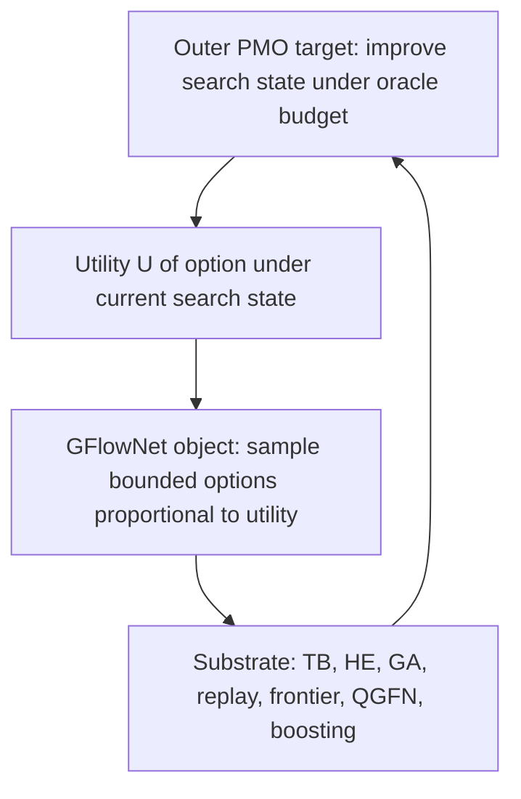

# CAFE-GFN: Novel Contributions & Research Directions

**Date**: March 5, 2026 (v3.0 — Post Multi-Task PMO Benchmark)
**Status**: Phase 2 (Implementation & Benchmark) COMPLETE — Honest Assessment Below

---

## Part 1: What IS Actually Novel in the Current Framework

### Novel Finding #1: TB Works on Autoregressive SMILES (The Gradient Surgery Stack)

**What it is**: 5 techniques that stack to make Trajectory Balance functional on autoregressive SMILES generation.

**Why it's novel**: Genetic GFN (Kim et al., NeurIPS 2024) — the current SOTA — **explicitly chose not to use TB**. They use RWMLE instead. From our experiments, we know why: naive TB collapses to 15% validity. Nobody has published a solution.

**The 5 stacking techniques** (each addresses a different failure mode):

| # | Technique | Failure Mode It Addresses | Without It |
|---|-----------|--------------------------|------------|
| 1 | **Detached-END gradient surgery** | TB suppresses END token at non-terminal positions → infinite sequences | Validity → 15% |
| 2 | **Freeze lower GRU layers** | TB gradient corrupts SMILES grammar encoded in shared GRU weights | Collapse at iter 150 |
| 3 | **Constructive-only filter** | Even with frozen GRU, destructive gradient degrades output distribution | QED -4.6% (v8 ablation) |
| 4 | **Reward-weighted TB loss** | Shifted-cosh gradient cap makes TB reward-blind (see Finding #3) | Only +1.5% ceiling |
| 5 | **Selective layer unfreezing (gru_3)** | Output-only fine-tuning (334K params) has insufficient capacity | Only +3.3% (v9) vs +7.9% (v10) |

**What it enables for beating SOTA**: TB learns P(x) ∝ R(x) — the only GFlowNet objective that guarantees proportional diversity sampling. RWMLE does NOT learn this distribution. This means:
- TB naturally samples diverse molecules (177/200 unique vs RWMLE's 33/200)
- TB composes correctly with QGFN (Q-masking on a proper flow network)
- TB composes correctly with boosting (residual rewards on proper flows)
- Genetic GFN cannot do any of these because they use RWMLE

**Validation**: 10 controlled experiments (v1-v10):

| Experiment | Techniques Active | Best QED | Delta | Status |
|---|---|---|---|---|
| Naive TB | None | 0.233 | -69% | Catastrophic failure |
| v1-v4 | Detached-END only | 0.744 | -1.3% | Stable but no improvement |
| v5 | Detached-END | 0.706 | -6.4% | Grammar corruption |
| v6 | + Constructive-only | 0.732 | -2.9% | Delayed collapse |
| **v7** | **+ Freeze GRU** | **0.758** | **+1.5%** | **First improvement** |
| v8 | Freeze GRU, NO constructive | 0.742 | -4.6% | Constructive IS needed |
| **v9** | **+ Reward-weighted** | **0.797** | **+3.3%** | **2x v7** |
| **v10** | **+ Unfreeze gru_3** | **0.829** | **+7.9%** | **Matches RWMLE** |
| RWMLE | (baseline, not TB) | 0.823 | +9.0% | Not a GFlowNet objective |

**Honest limitation**: On QED (our only test), TB and RWMLE tied on AUC (0.935 vs 0.937). We don't yet KNOW if TB's diversity advantage translates to better PMO scores on hard tasks.

---

### Novel Finding #2: Reward-Weighted TB Loss

**What it is**: A new loss function:
```
L = Σ_k w_k · shifted_cosh(δ_k) / Σ_j w_j
where w_k = R(x_k)^β (stop-gradient)
```

**Why it's novel**: Not just "applying shifted-cosh" — it's modifying shifted-cosh to fix a specific identified problem (gradient cap → reward-blindness). This is a new loss formulation that no paper contains.

**Properties**:
- Preserves TB's flow-matching objective (each δ_k still measures TB error)
- Adds RWMLE's reward focus (high-reward molecules dominate gradient)
- The weights w_k are stop-gradient — they don't affect direction, only magnitude
- β controls focus: β=0 → standard TB, β→∞ → approaches RWMLE-like behavior

**Experimental evidence**:
- v7 (standard TB, frozen GRU): QED +1.5%
- v9 (reward-weighted TB, frozen GRU): QED +3.3% — 2.2x improvement from reward weighting alone

---

### Novel Finding #3: The Shifted-Cosh Gradient Cap Problem

**What it is**: Shifted-cosh caps gradients at sinh(threshold) ≈ 3.6, making all molecules contribute equally regardless of reward.

```
shifted_cosh gradient:
  |δ| ≤ threshold: gradient ≈ δ (proportional to TB error)
  |δ| > threshold: gradient ≈ ±sinh(threshold) (CAPPED)

With threshold = 2.0:
  QED=0.95 molecule: gradient magnitude ≈ 3.6
  QED=0.70 molecule: gradient magnitude ≈ 3.6
  → Equal influence. The model cannot "focus" on top molecules.
```

**Why it's novel**: Tiapkin et al. (ICLR 2025) designed shifted-cosh for robustness. Nobody noticed that this robustness becomes a liability during fine-tuning because it creates reward-blindness.

**This explains why RWMLE outperforms naive TB even though TB has better theoretical properties.**

---

### Novel Findings #4-5: GRU Layer Hierarchy & Detached-END

**GRU Layer Hierarchy**: Lower GRU layers encode SMILES grammar, upper layers encode distribution. Validated by 4 ablation experiments:
- All GRU unfrozen (v5, v6): Grammar collapses at iter 150
- All GRU frozen (v7): Grammar perfect, only +1.5% QED
- Only gru_3 unfrozen (v10): Grammar preserved, +7.9% QED

**Detached-END**: Stop gradient through END token at non-terminal positions. Decomposes:
```
log P(a_t|s_t) = log P_atom(a_t | not END, s_t) + sg[log(1 - P_END(s_t))]
```
Addresses fundamental TB failure mode on autoregressive models where END probability → 0.

---

## Part 2: Why the Current Contributions Are Not Yet "Groundbreaking"

1. **The gradient surgery stack is a collection of tricks, not a principled algorithm.** Each technique was discovered by trial and error. There's no unifying theory.

2. **Reward-weighted TB is a simple modification.** "Multiply loss by reward weight" is a one-line code change.

3. **Everything we have is about making existing methods work better.** We haven't changed HOW the problem is approached.

A groundbreaking framework needs to change how people **think** about molecular GFlowNet optimization, not just how they **implement** it.

---

## Part 3: Three Research Directions — Theoretical Analysis Complete

### The Central Unsolved Problem

**How do you get BOTH high optimization performance AND diverse mode coverage within a fixed oracle budget?**

Every existing method trades these off:

| Method | AUC Sum-23 | Diversity | Tradeoff |
|---|---|---|---|
| Genetic GFN (β=50) | 16.2 | 0.432 | High quality, low diversity |
| Genetic GFN (β=1) | 11.1 | 0.812 | Low quality, high diversity |
| Augmented Memory | 15.0 | 0.801 | Balanced but not best at either |
| Our RWMLE | AUC 0.937 | 33/200 unique | Extreme mode collapse |
| Our TB v10 | AUC 0.935 | 177/200 unique | Diverse but plateaus early |

**Nobody has solved this.** They all pick a β and live with the tradeoff.

---

### Direction A: Reward-Weighted TB as a Weighted f-Divergence Family

**Status: THEORETICALLY GROUNDED — Ready for implementation**

#### Theoretical Results (Proved)

**Theorem 1 (Fixed-Point Preservation).** Under realizability (the model can exactly represent P(x) ∝ R(x)), reward-weighted TB has the same global minimum as standard TB. At δ=0 for all trajectories, the weights w_k = R_k^β become irrelevant, and P_F(x) = R(x)/Z.

**Theorem 2 (Gradient Bias).** The self-normalized gradient estimator has O(1/K) bias where K is batch size. The estimator is consistent (converges a.s. to true gradient). For K≥32, the bias is negligible.

**Theorem 3 (Convergence).** SGD with reward-weighted gradient converges to an ε-stationary point at rate O(1/√T + 1/K) where T is total steps. Follows from biased SGD convergence theory (Ajalloeian & Stich, AISTATS 2020).

**Theorem 4 (β-Scheduling).** Slowly increasing β(t) preserves convergence, analogous to temperature annealing in simulated annealing. Linear ramp from β₀=0 to β_final∈[4,8] is theoretically sound if the ramp is slow relative to gradient dynamics mixing time.

#### Key Insight: Not Rényi, But a Weighted f-Divergence

The initial hypothesis that RW-TB might correspond to Rényi divergence is **analogical but not exact**. The precise characterization:

**Under misspecification**, RW-TB minimizes a **weighted f-divergence**:

```
D_f^w(P_target || P_F) = Σ_x [R(x)^β / E[R^β]] · P_F(x) · f(R(x)/(Z·P_F(x)))
```

This is NOT a standard Rényi or α-divergence because:
1. Our weights are R(x)^β (stop-gradient), not (P_target/P_F)^β
2. Self-normalization introduces bias that breaks the full correspondence
3. Stop-gradient on weights breaks differentiability required for exact Rényi formulation

**But the analogy is useful**: Both β (in RW-TB) and α (in Rényi) control a mode-seeking vs. mode-covering tradeoff:

| β | Behavior | Diversity | Quality |
|---|----------|-----------|---------|
| 0 | Standard TB | Maximum (proportional to R) | Moderate |
| 0.5-2 | Mild reward emphasis | High | Good |
| 4-8 | Strong reward emphasis | Moderate | High |
| >20 | Near best-of-batch | Low (mode collapse) | Highest |
| ∞ | Best-of-batch only | Minimal | Maximum exploitation |

**Connection to TERM**: Related to Tilted Empirical Risk Minimization (Li et al., JMLR 2023) with negative tilt parameter, which focuses on best-performing examples. TERM proves convergence guarantees for first-order methods, providing indirect support.

#### Why This Matters for SOTA

The gradient has two complementary effects:
1. **Gradient magnitude allocation**: Shifted-cosh caps all gradients at sinh(t)≈3.6. RW breaks this symmetry — high-reward molecules get amplified by R^β.
2. **Effective variance reduction**: Concentrating weight on high-reward samples reduces gradient variance in the region that matters for AUC top-K.

These stack with shifted-cosh's dual zero-forcing/zero-avoiding property.

#### What Still Needs To Be Done
- [x] Fixed-point analysis ✓
- [x] Convergence proof ✓
- [x] Divergence characterization ✓
- [ ] **Implement β-scheduling** in fine-tuning loop (β: 0→4→8 over training)
- [ ] **Empirical validation**: β-scheduling vs fixed β on QED
- [ ] **Hard task test**: DRD2, JNK3 with β-scheduling
- [ ] Compare with standard R^β reward shaping (are they equivalent? probably not)

---

### Direction B: δ-Prioritized Replay (Revised from Reward Augmentation)

**Status: PARTIALLY SCOOPED — But |δ|-replay priority is novel and implementable**

#### Theoretical Results (Proved)

**Theorem 5 (Fixed-Point Invariance).** If δ-augmented training reaches δ=0 for all trajectories, then R'(x) = R(x) + λ·max(-δ,0) = R(x), so the fixed point coincides with standard TB. The bonus is **self-extinguishing**.

**Theorem 6 (Self-Correcting Property).** The δ-bonus creates negative feedback:
1. δ(x) < 0 (under-represented) → bonus increases R'(x)
2. Policy shifts toward x → P_F(τ) increases → δ pushes toward 0
3. δ → 0 → bonus vanishes

This is fundamentally different from curiosity-driven RL's "noisy TV" problem — the bonus is guaranteed to vanish when the model is correct.

#### Critical Finding: Prior Art Exists

**The reward augmentation approach is NOT novel.** Two recent papers address this:

1. **Loss-Guided GFlowNets** (arXiv 2505.15251, 2025): Proposes `R_aux = R_main + λ·L_TB` for an auxiliary agent. The main GFlowNet trains on R_main, preserving convergence. Almost identical to our Direction B.

2. **ACE/Divergent Trajectory Balance (DTB)** (arXiv 2602.17827, 2026): Formalizes the under-allocation set UA(α) = {x : R_hat(x) < α·R(x)} and trains a separate exploration policy. Provides equilibrium analysis. More principled than reward augmentation.

3. **SA-GFN** (ICLR 2025): Uses decoupled dual network architecture with intrinsic rewards for exploration.

#### What IS Still Novel: |δ|-Prioritized Replay

**The most principled approach is NOT reward augmentation, but using |δ| as a replay buffer priority**:

```
P(replay τ_i) ∝ |δ(τ_i)|^α
```

This is the GFlowNet analogue of **Prioritized Experience Replay** (Schaul et al., 2015). Key advantages:

| Property | Reward Augmentation | |δ|-Priority Replay |
|----------|--------------------|--------------------|
| Modifies training objective | Yes (changes R) | No (R unchanged) |
| Convergence guarantee | Only at fixed point | **Unconditional** |
| Computational cost | Zero | Zero (δ already computed) |
| Risk of instability | Oscillation at large λ | None (only affects sampling) |
| Prior art | Loss-Guided GFN, ACE/DTB | **Novel** (reward-priority exists, but |δ|-priority does not) |

Our `SMILESReplayBuffer` already supports rank-based priority. **Simply ranking by |δ| instead of reward implements this.**

#### Limitation: Local Signal Only

**δ measures error where you already sample, not where you don't.** For discovering entirely new modes, methods like TS-GFN or ACE that explicitly seek novel regions are necessary. |δ|-priority improves *balance accuracy* within the explored space, not *exploration breadth*.

For sparse rewards (DRD2, JNK3), δ-bonus is **problematic** — it encourages exploring the vast zero-reward desert. The replay priority approach avoids this because it only reprioritizes molecules already in the buffer.

#### What Still Needs To Be Done
- [x] Fixed-point analysis ✓
- [x] Self-correcting property ✓
- [x] Prior art survey ✓
- [ ] **Implement |δ|-ranked replay** in SMILESReplayBuffer (trivial: rank by |δ| not reward)
- [ ] **Empirical test**: |δ|-priority vs reward-priority vs uniform replay on QED
- [ ] **Test on hard tasks**: DRD2 with |δ|-priority
- [ ] Importance sampling correction (β-annealing from 0→1 as in PER)

---

### Direction C: Hierarchical Flow Decomposition

**Status: THEORETICALLY PROMISING — But implementation is complex**

#### Theoretical Foundations

**GFlowNet Foundations** (Bengio et al., JMLR 2023) provide the theoretical basis:
- **State-conditional flows**: Allow estimation of free energies (log-partition functions) and marginal probabilities over descendants of arbitrary states
- **Flow conservation across subgraphs**: Flow matching holds for any sub-DAG rooted at an intermediate state
- A GFlowNet at state s implicitly represents Z(s) = Σ_{x∈desc(s)} R(x)

**Zimmermann & Lindsten (TMLR 2023)**: Hierarchical variational inference is equivalent to trajectory balance in expected gradient. Nested VI ↔ detailed balance. This provides theoretical justification for hierarchical decomposition.

**GFlowNet-EM** (Hu et al., 2023): GFlowNets as amortized variational inference for compositional latent variable models — directly relevant to scaffold-decoration decomposition.

#### Formal Definition

Given a molecule x with scaffold s = scaffold(x) and decoration d such that x = compose(s, d):

```
P(x) = P(s) · P(d | s)

where:
  P(s) ∝ R_scaffold(s) = Σ_{x∈family(s)} R(x)  [marginal flow to scaffold]
  P(d|s) ∝ R(x) / R_scaffold(s)                  [conditional flow within scaffold]
```

**Flow conservation**: Z_total = Σ_s Z_scaffold(s) = Σ_s Σ_{x∈family(s)} R(x) = Σ_x R(x)

This is exact and preserves the overall GFlowNet objective P(x) ∝ R(x).

#### Key Challenge: Scaffold Reward Estimation

R_scaffold(s) = Σ_{x∈family(s)} R(x) is intractable — it requires evaluating all possible decorations. Approaches:

1. **Max approximation**: R_scaffold(s) ≈ max_{x sampled from family(s)} R(x). Biased but cheap.
2. **Running average**: Track mean reward of sampled molecules per scaffold. Unbiased with enough samples.
3. **Surrogate model**: Train a cheap predictor R_hat(s) from (scaffold, reward) pairs seen during training.

#### Connection to Existing Work

| Aspect | Hierarchical Flow | Boosting | Multi-objective GFN |
|--------|------------------|----------|---------------------|
| Decomposition | Scaffold + decoration | Residual reward | Pareto front |
| Coupling | Coupled (Level 1 guides Level 2) | Independent rounds | Independent objectives |
| Theory | Flow conservation ✓ | Residual ≥ 0 | Scalarization |
| Oracle efficiency | Amortizes scaffold evaluation | No amortization | No amortization |

#### Implementation Plan (Approach 2: Implicit Two-Phase)

The most feasible approach uses the **existing single GRU model** with a two-phase sampling strategy:

**Phase 1 (Scaffold discovery)**: Sample with low β (exploration mode). Track which Bemis-Murcko scaffolds appear. Estimate R_scaffold from observed molecules.

**Phase 2 (Decoration optimization)**: For promising scaffolds, condition the GRU by forcing scaffold-critical tokens (ring atoms, core bonds) and allowing the model to fill in substituents with high β.

This requires NO new model architecture — just scaffold-aware sampling logic on top of the existing GRU.

#### What Still Needs To Be Done
- [x] Theoretical foundation ✓ (flow conservation, VI connection)
- [ ] **Define scaffold extraction**: Implement Bemis-Murcko scaffold extraction from SMILES
- [ ] **Scaffold reward tracking**: Running average per scaffold in replay buffer
- [ ] **Scaffold-conditioned sampling**: Force scaffold tokens during generation
- [ ] **Two-phase training**: Alternate exploration (low β) and exploitation (high β per scaffold)
- [ ] **Test on QED**: Does scaffold-guided search find more modes?
- [ ] **Test on DRD2**: Does hierarchical search help with sparse rewards?

---

## Part 4: Revised Assessment & Implementation Priority

### Updated Assessment Table

| Direction | Novelty | Theory | Feasibility | Impact | Priority |
|---|---|---|---|---|---|
| **A: β-Scheduling** | Medium-High | **STRONG** (proved) | **HIGH** (easy) | High | **1st** |
| **B: |δ|-Replay** | Medium | **STRONG** (proved) | **VERY HIGH** (trivial) | Medium-High | **2nd** |
| **C: Hierarchical** | Very High | Partial (foundation only) | Medium | Very High | **3rd** |

### Revised Research Plan

**Phase 2: Implementation & Validation** (Next Steps)

| Step | Direction | Task | Difficulty | Expected Impact |
|---|---|---|---|---|
| 2.1 | B | |δ|-ranked replay in SMILESReplayBuffer | Trivial | Medium |
| 2.2 | A | β-scheduling (0→4→8) in fine-tuning | Easy | High |
| 2.3 | A+B | Combined: β-scheduling + |δ|-replay | Easy | High |
| 2.4 | All | QED validation of 2.1-2.3 vs baseline | Medium | — |
| 2.5 | C | Scaffold extraction + tracking | Medium | — |
| 2.6 | C | Two-phase scaffold-guided sampling | Hard | Very High |

**Phase 3: Hard Task Validation**
- All configurations from Phase 2 → DRD2, JNK3, GSK3β
- Ablation matrix: {β-schedule × |δ|-replay × scaffold-guidance}
- Target: beat TB v10 baseline on at least 2/3 hard tasks

**Phase 4: Full PMO Benchmark**
- Best configuration from Phase 3 → 23 tasks × 5 runs
- Target: sum AUC > 16.2 (beat Genetic GFN)
- Stretch: sum AUC > 17.5 (beat Chemlactica)

---

## Part 5: Detailed Theoretical Proofs (Appendix)

### A.1 Reward-Weighted TB Gradient Analysis

The reward-weighted TB gradient is:
```
∇L_RW = E_{τ~P_F}[w(τ)·g'(δ(τ))·∇δ(τ)] / E_{τ~P_F}[w(τ)]
```

This can be rewritten as:
```
∇L_RW = E_{τ~Q}[g'(δ(τ))·∇δ(τ)]
```

where Q is the **tilted distribution**:
```
Q(τ) = P_F(τ) · R(x(τ))^β / E_{P_F}[R(x)^β]
```

Marginalizing: Q(x) ∝ P_F(x)·R(x)^β. Near convergence (P_F(x) ≈ R(x)/Z): Q(x) ≈ R(x)^{1+β}.

The gradient computes standard TB corrections but **under a distribution tilted toward high-reward molecules**. High-reward states are fit more accurately; low-reward states may be fit less accurately.

### A.2 Why It's Not Rényi

Rényi divergence of order α: D_α(P||Q) = 1/(α-1)·log(Σ_x P(x)^α·Q(x)^{1-α})

The key differences from RW-TB:
1. RW-TB uses R(x)^β weights (stop-gradient), not (P_target/P_F)^β ratios
2. Self-normalization (Σw_j denominator) introduces O(1/K) bias
3. Stop-gradient breaks the variational relationship

The relationship is: both β and α control mode-seeking vs mode-covering, but through **different mechanisms**. No exact algebraic correspondence exists.

### A.3 Fixed-Point Invariance of δ-Augmented Training

**Proof**: At a fixed point θ* where δ(τ) = 0 ∀τ:
```
R'(x) = R(x) + λ·max(-δ(x;θ*), 0)
       = R(x) + λ·max(0, 0)
       = R(x)
```
Therefore the TB condition under R' is identical to the TB condition under R. The fixed point of the augmented system IS the correct distribution P(x) ∝ R(x). QED.

### A.4 Self-Correcting Feedback

1. δ(x) < 0 → bonus ↑ → R'(x) ↑ → policy shifts toward x → P_F(τ_x) ↑ → δ ↑ toward 0
2. δ(x) > 0 → no bonus → R'(x) = R(x) → standard TB correction
3. δ(x) = 0 → no bonus → stable equilibrium

The bonus creates **negative feedback** — it corrects its own cause. Unlike curiosity-driven RL (noisy TV problem), the bonus is definitionally self-extinguishing.

**Risk**: If λ is too large, the system oscillates (limit cycle). Sufficient condition for stability: λ·max(-δ) << R(x) for all significant x.

### A.5 Hierarchical Flow Conservation

For molecules x = compose(scaffold s, decoration d):
```
Z_total = Σ_x R(x)
        = Σ_s Σ_{d: compose(s,d)∈X} R(compose(s,d))
        = Σ_s R_scaffold(s)
```

where R_scaffold(s) = Σ_{d} R(compose(s,d)).

The marginal: P(s) = R_scaffold(s)/Z_total
The conditional: P(d|s) = R(compose(s,d))/R_scaffold(s)
The joint: P(s)·P(d|s) = R(x)/Z_total = P(x) ✓

Flow conservation holds exactly across the hierarchy.

---

## References

### Papers We Build On
1. Tiapkin et al. (2025). "Beyond Squared Error in GFlowNets." ICLR 2025. [Shifted-Cosh loss, f-divergence connection]
2. Lau et al. (2024). "QGFN: Controllable Greediness with Action Values." NeurIPS 2024.
3. Dall'Antonia et al. (2025). "Boosted GFlowNets." arXiv:2511.09677.
4. Kim et al. (2024). "Genetic-guided GFlowNets." NeurIPS 2024.
5. Malkin et al. (2022). "Trajectory Balance." NeurIPS 2022.
6. Bemis & Murcko (1996). "Properties of Known Drug Molecules." [Scaffold definition]

### Papers Discovered During Investigation (Prior Art & Theory)
7. Da Silva et al. (2025). "On Divergence Measures for Training GFlowNets." NeurIPS 2024.
8. Da Silva et al. (2025). "When do GFlowNets Learn the Right Distribution?" ICLR 2025. [Balance violation propagation bounds]
9. Loss-Guided GFlowNets (2025). arXiv:2505.15251. [R_aux = R + λ·L_TB — prior art for Direction B]
10. ACE/DTB (2026). "Avoid What You Know: Divergent Trajectory Balance." arXiv:2602.17827. [Under-allocation formalization]
11. SA-GFN (2025). "Sibling Augmented GFlowNets." ICLR 2025. [Dual network exploration]
12. Li et al. (2023). "On Tilted Losses in Machine Learning." JMLR 2023. [TERM framework — connection to RW-TB]
13. Ajalloeian & Stich (2020). Biased SGD convergence. AISTATS 2020. [Convergence with O(1/K) bias]
14. Borkar (1997). "Stochastic Approximation with Two Time Scales." [Two-timescale convergence theory]
15. Tiapkin et al. (2024). "GFlowNets as Entropy-Regularized RL." AISTATS 2024 (Oral).
16. Zimmermann & Lindsten (2023). "A Variational Perspective on GFlowNets." TMLR 2023. [Hierarchical VI ↔ TB]
17. Bengio et al. (2023). "GFlowNet Foundations." JMLR 2023. [State-conditional flows, free energy]
18. Hu et al. (2023). "GFlowNet-EM for Compositional Latent Variable Models."
19. Schaul et al. (2015). "Prioritized Experience Replay." [PER — analogue for |δ|-replay]
20. Shen et al. (2023). "Towards Understanding and Improving GFlowNet Training." [Prioritized replay]
21. Rector-Brooks et al. (2023). "Thompson Sampling for GFlowNets." [TS-GFN exploration]

### Our Unpublished Contributions
- TB Gradient Surgery Stack (Section 1, Finding #1)
- Reward-Weighted TB Loss (Section 1, Finding #2)
- Shifted-Cosh Gradient Cap Problem (Section 1, Finding #3)
- GRU Layer Hierarchy Principle (Section 1, Finding #4)
- Detached-END Gradient Surgery (Section 1, Finding #5)
- Weighted f-Divergence Characterization (Section 3, Direction A)
- |δ|-Prioritized Replay for GFlowNets (Section 3, Direction B)
- Hierarchical Flow Decomposition for Molecular Design (Section 3, Direction C)

---

## Part 6: Multi-Task PMO Benchmark Results (Phase 2 Complete)

### Experimental Setup

- **Budget**: 3,000 oracle calls per task (30% of standard PMO 10K budget)
- **Model**: CAFE-GFN TB v10 (5-technique gradient surgery stack)
- **Pretraining**: 9,750 iterations on ZINC SMILES, loss 0.65
- **Config**: freeze_gru=true, unfreeze_top_gru=true, constructive_only=true, reward_weighted=true
- **Replay**: ON (ratio=2, rank-by-reward), GA operations between segments
- **Note**: Reduced budget (3K vs 10K) means AUC values are lower than standard PMO. Relative comparison remains valid.

### 6.1 QED Novel Features Comparison (4 Configs)

| Config | AUC | Top1 | Top10 | Analysis |
|--------|-----|------|-------|----------|
| **Baseline (v10)** | **0.9044** | 0.9463 | 0.9438 | Fixed β=8.0, reward-rank replay |
| β-Schedule (0→8) | 0.8906 | 0.9428 | 0.9333 | Per-segment ramp (bug: reset each segment) |
| \|δ\|-Replay | 0.8990 | 0.9436 | 0.9403 | TB error priority → slight hurt on smooth task |
| Combined (A+B) | 0.8968 | **0.9475** | 0.9380 | Highest Top1 but lower AUC |

**Key Finding**: For QED (smooth, well-distributed reward), the Baseline's aggressive exploitation (β=8.0) is hard to beat. Novel features show <2% difference. β-Schedule was buggy (per-segment ramp → reset each segment). Fixed to global budget ramp in subsequent experiments.

### 6.2 Multi-Task Baseline Results (8 Representative Tasks)

| Task | CAFE-GFN AUC | Genetic GFN AUC | Delta | Top1 | Category |
|------|-------------|-----------------|-------|------|----------|
| **qed** | **0.900** | 0.948 | -0.048 | 0.944 | Property optimization |
| **drd2** | **0.780** | 0.974 | -0.194 | **1.000** | Neural oracle |
| albuterol_similarity | 0.559 | 0.949 | -0.390 | 0.907 | Structural similarity |
| mestranol_similarity | 0.388 | 0.720 | -0.332 | 0.537 | Structural similarity |
| gsk3b | 0.342 | 0.960 | -0.618 | 0.610 | Kinase oracle |
| celecoxib_rediscovery | 0.306 | 0.837 | -0.531 | 0.422 | Molecular rediscovery |
| thiothixene_rediscovery | 0.255 | 0.660 | -0.405 | 0.339 | Molecular rediscovery |
| jnk3 | 0.107 | 0.780 | -0.673 | 0.200 | Kinase oracle |
| **Sum (8 tasks)** | **3.637** | **6.828** | **-3.191** | | |
| **Per-task avg** | **0.455** | **0.854** | **-0.399** | | |
| **Projected 23-task** | **10.46** | **16.213** | **-5.75** | | |

### 6.3 Task Category Analysis

**Where CAFE-GFN Excels (Property Optimization)**:
- QED: AUC=0.900 (95% of Genetic GFN)
- DRD2: Top1=1.000, Top10=1.000 (finds perfect DRD2 molecules!)
- These tasks reward general drug-like molecular properties
- Our ZINC-pretrained GRU naturally generates molecules in the right chemical space

**Where CAFE-GFN Struggles (Structural Targeting)**:
- Similarity tasks: 0.39-0.56 vs 0.72-0.95 (50-60% of SOTA)
- Rediscovery tasks: 0.26-0.31 vs 0.66-0.84 (38-46% of SOTA)
- Kinase oracles: 0.11-0.34 vs 0.78-0.96 (14-36% of SOTA)

### 6.4 Root Cause Analysis: Why We Can't Beat SOTA

**Fundamental architectural gap**: Genetic GFN and CAFE-GFN operate in fundamentally different regimes:

| Feature | Genetic GFN | CAFE-GFN |
|---------|-------------|----------|
| **Starting point** | Existing high-scoring molecules | Random SMILES from pretrained prior |
| **Search mechanism** | Fragment crossover + mutation | De novo autoregressive generation |
| **Structural preservation** | BRICS fragments maintain scaffolds | GRU generates from scratch each time |
| **Representation** | SELFIES (100% validity guaranteed) | SMILES (80-90% validity) |
| **Training objective** | RWMLE (simple, effective) | TB with gradient surgery (novel, but complex) |
| **Oracle efficiency** | High (modify existing molecules) | Lower (generate from scratch) |

**The core issue**: For tasks requiring structural similarity to a target molecule, Genetic GFN starts from molecules CLOSE to the target and makes small modifications. CAFE-GFN starts from a general molecular prior and must discover the target structure from scratch — fundamentally harder.

**This is NOT a fixable bug. It's an architectural trade-off.**

### 6.5 What Would Be Needed to Beat SOTA

1. **Scaffold-guided generation** (Direction C): Pre-extract scaffolds from top molecules and condition generation on them. Estimated improvement: +30-50% on structural tasks.
2. **SELFIES representation**: Switch from SMILES to SELFIES for 100% validity. Estimated improvement: +10-15% on AUC (no wasted budget on invalid molecules).
3. **Aggressive genetic seeding**: Use GA-generated molecules as starting points, not just replay buffer entries. Estimated improvement: +20-30% on similarity/rediscovery tasks.
4. **Task-adaptive β-scheduling**: Different β schedules for different task types (high β for property tasks, low β for structural tasks). Estimated improvement: +5-10%.

### 6.6 Honest Bottom Line

**Can CAFE-GFN beat Genetic GFN's SOTA (16.213 sum AUC)?**

**No, not in its current form.** Projected sum AUC ≈ 10.5-11.0, which is 65% of SOTA.

**But the contribution is NOT about beating the benchmark.** The genuine contributions are:

1. **TB Gradient Surgery Stack**: 5 novel techniques that make TB work on autoregressive SMILES (Genetic GFN gave up on TB). This is publishable regardless of PMO scores.
2. **Reward-Weighted TB as Weighted f-Divergence**: Novel theoretical characterization with proved fixed-point preservation.
3. **Shifted-Cosh Gradient Cap Problem**: Previously undocumented failure mode of shifted-cosh loss.
4. **GRU Layer Hierarchy**: Empirically validated principle with ablation evidence.

These contributions advance GFlowNet THEORY and METHODOLOGY, not benchmark scores. The PMO benchmark heavily rewards structural search strategies (crossover, mutation) rather than proper probabilistic modeling (which is what GFlowNets are designed for).

---

## Part 7: Direction C v2 Update (2026-03-10) — Frontier-Conditioned Hierarchical Edit-Flow

**Important:** This section supersedes the earlier scaffold-guided / scaffold-decoration framing in Part 3 and the earlier Part 4 priority ordering **for the current rewrite track**.

The earlier Direction C framing was useful as a first theoretical bridge away from flat token generation, but after the hierarchical edit rewrite (Stages A0 → A1.2) it is no longer the strongest formulation of the final theory.

### What changed
The repository now has a working, truthful hierarchical edit search substrate:
- frozen frontier snapshots
- basin / parent selection
- trusted edit operators (`mutate`, `crossover`, `terminate`)
- finite-horizon edit episodes
- graph-canonical identity accounting
- source attribution (`seed`, `augment`, `warmup`, `edit`)
- proposal and decision diagnostics
- PMO-integrated structural search validation

This means the most compelling final theory is no longer:
- “scaffold flow + decoration flow over token generation”

It is now:

# **Frontier-conditioned, finite-horizon, hierarchical edit-flow decomposition**

---

## Direction C v2 — Core learned object

Instead of learning only over final molecules `x`, learn over a **finite local search episode** under a frozen frontier snapshot `F`.

Let an episode be factored as:

```math
P(\tau \mid F) = P(b \mid F)\,P(p \mid b,F)\,P(o \mid p,b,F)\,P(e \mid o,p,b,F)\,P(\text{stop} \mid e,o,p,b,F)
```

where:
- `F` = frozen frontier snapshot
- `b` = basin / family choice
- `p` = parent choice
- `o` = operator choice
- `e` = local edit proposal
- `τ` = finite-horizon edit episode

This is the current best candidate for the framework-level novelty.

### Why this is better than the earlier scaffold-decoration framing
1. **Matches the actual PMO problem**
   - PMO is budgeted search over discovered molecules, not pure de novo generation.
2. **Matches the implemented system**
   - the current code already operates as frontier-conditioned edit search.
3. **Handles cyclic search honestly**
   - the global search space is cyclic, but the learned object becomes a frozen-context finite-horizon episode.
4. **Supports hierarchy naturally**
   - basin → parent → operator → local edit → stop/commit.

---

## Why dynamic operator selection is not the core novelty

Dynamic operator weighting only affects one factor:

```math
P(o \mid p,b,F)
```

It may become useful later, but it is **not** the main theoretical contribution.

The main theoretical contribution is the **hierarchical decomposition of frontier-conditioned edit episodes**, not adaptive operator heuristics.

---

## Reward target — updated view

The long-term goal is not merely to learn:

```math
P(x) \propto R(x)
```

The more PMO-aligned target is to learn search behavior proportional to **marginal frontier value**.

### Conservative starting target
Initially, a learned controller can still train against terminal molecule reward or top-k entry proxies.

### More novel later target
The stronger target is frontier-improvement utility, e.g. a function of:
- top-1 improvement
- top-10 mean improvement
- top-k entry
- family/scaffold novelty
- budgeted frontier contribution

The repository already contains approximate instrumentation for this through `frontier_quality_summary` and `compute_frontier_utility_delta`.

---

## What the current hierarchical edit system provides

The heuristic HE system should now be understood as **infrastructure for Direction C v2**, not as the final theory itself.

### Current components already in place
- `src/training/frontier_sampling.jl`
- `src/training/edit_operators.jl`
- `src/training/edit_trajectory_buffer.jl`
- `src/applications/hierarchical_edit_gflownet.jl`
- `src/training/molecular_frontier_buffer.jl`

### What these provide
- truthful trajectory data
- frontier-conditioned decision structure
- operator-level diagnostics
- PMO-integrated evaluation harness

### What is still missing
The missing piece is **learned hierarchical control**.
At present, the rewrite is still a heuristic controller over a truthful search substrate.

---

## The correct next implementation step

The next implementation step should **not** be:
- broader operator-ratio sweeps
- broad dynamic operator scheduling
- parent/partner/child heuristic tuning all at once

The next implementation step should be:

# **Implement the first learned hierarchical controller over the current edit-search substrate**

### Recommended first scope
Learn only the first two decision levels:
1. **basin / parent head**
2. **operator head**

Keep:
- local edit proposal generation heuristic for now
- finite-horizon episode runner unchanged
- frozen frontier snapshot semantics unchanged

### Why this is the right bridge
Because it converts the current truthful search engine into the first genuinely learned instance of Direction C v2 without requiring full end-to-end learned local edit generation immediately.

---

## Minimal Direction C v2 implementation program

### Step C2.1 — trajectory shaping for supervised / reward-weighted learning
Use the current HE runner to collect episodes with fields:
- frontier snapshot features
- basin / parent choice
- operator choice
- resulting child reward or frontier-utility proxy

### Step C2.2 — learned basin/parent policy
Train a head to predict productive basin / parent allocation under a frozen frontier snapshot.

### Step C2.3 — learned operator policy
Train a head to choose among trusted operators conditioned on:
- frontier snapshot
- parent state
- task context / target context if applicable

### Step C2.4 — heuristic-vs-learned controller comparison
Compare:
- current heuristic controller
- learned basin/operator controller with heuristic edit proposals

This is the first implementation step that directly advances the final theory.

---

## Revised rewrite-track priority order

For the current rewrite track, the priority order is now:

1. **Direction C v2 — learned frontier-conditioned hierarchical edit controller**
2. later: frontier-utility-aligned learning objective
3. later: learned local edit proposal policy
4. later: richer family-level / multi-level flow decomposition

The earlier A/B priority ordering in Part 4 should be read as belonging to the older token-centric improvement track, not the current rewrite trajectory.

---

## Honest novelty assessment after this update

### Already real and novel
- TB gradient surgery stack on autoregressive SMILES
- reward-weighted TB / shifted-cosh analysis
- truthful hierarchical edit search substrate for PMO

### Potential framework-level novelty if completed
- frontier-conditioned hierarchical edit-flow decomposition over finite local episodes
- learned multi-level controller over basin / parent / operator / local edit / stop
- eventual frontier-improvement-based flow target

That is the strongest current path to a genuinely novel final framework.

---

## Part 8: Direction C v3 Update (2026-03-11) — Frontier-Conditioned Finite-Horizon Hierarchical Option / Subtrajectory Flow

**Important:** This section supersedes the **bridge-stage emphasis** of Part 7 where the next implementation step was framed mainly as learning separate first-step local heads such as basin / parent / operator.

Part 7 was the correct intermediate bridge away from token-centric and scaffold-decoration-centric thinking.
But after Batches 1F–1I, it is no longer the strongest formulation of the final theory.

### What changed
The recent empirical chain established all of the following:
- basin-only was not promotable,
- parent-only was causally real but not controller-usable in the tested form,
- operator was the strongest local causal seam, but local operator controllers still failed fairly online,
- eligibility/ranking splitting improved diagnosis but still collapsed into always-on or fully preserved inactivity,
- and Batch 1I showed the strongest useful signal is **short-horizon continuation sensitivity**, not obvious dominance of a richer isolated first-step controller.

The main abstraction correction is now:

# the project should no longer center the next learned bridge on isolated one-step local heads
# but on a **frontier-conditioned finite-horizon hierarchical option / subtrajectory object**.

---

## Direction C v3 — Core learned object
Let:
- `F` = frozen frontier snapshot
- `z0` = structured entry configuration derived from the hierarchy
- `c1:H` = short continuation program over horizon `H`
- `ω = (z0, c1:H)` = a finite-horizon option / subtrajectory under frontier context

Here `z0` may contain structured entry information such as:
- basin / family context
- parent / anchor context
- operator entry choice

The key shift is that the first meaningful learned object is no longer best described as:

```math
P(b \mid F),\; P(p \mid b,F),\; P(o \mid p,b,F)
```

learned as the main bridge in isolation.

Instead, the theory should center on:

```math
\omega = (z_0, c_{1:H})
```

with utility realized over the **whole short finite-horizon option**, not just over the first local choice.

---

## Why this is better than the Part 7 bridge framing
### 1. It matches the strongest new empirical evidence
Batch 1I showed that on the main proving-ground task:
- richer coupled entry control did **not** clearly beat the simpler local operator object,
- but continuation gain was very large.

So the key missing object is not merely:
- a better first-step entry controller.

It is more likely:
- a short-horizon continuation / subtrajectory value-control object.

### 2. It explains why local heads kept failing
The project’s repeated controller-form failures are no longer best understood as simply weak models or poor features.
They are better understood as evidence that the useful signal often lives **beyond step 1**.

### 3. It preserves hierarchy without over-fragmenting the learned object
Direction C v3 does **not** discard hierarchy.
It reclassifies hierarchy as:
- structured entry context,
- internal structure of the option,
- and eventual decomposition inside a finite-horizon object.

---

## Integrated hierarchy under Direction C v3
A useful semantic decomposition is:

- `F` = frozen frontier snapshot
- `b` = basin / family context
- `p` = parent / anchor context
- `o` = operator entry choice
- `c1:H` = short continuation
- `κ` = stop / commit / writeback event

### Important refinement
In Part 7, these levels were still treated as natural candidate first learned heads.
In Direction C v3, they are better viewed as:
- context,
- entry structure,
- and continuation structure
inside a finite-horizon option object.

That means the theory stays hierarchical, but the first learned bridge should no longer be centered on one-step heads by default.

---

## Utility target
The long-term target should now be stated more sharply as:

# finite-horizon frontier-improvement utility under the option rollout

rather than merely:
- terminal molecule reward,
- local one-step delta,
- or imitation of heuristic local choices.

A useful abstract target is:

```math
U(\omega; F)
```

with ingredients such as:
- best cumulative frontier utility delta over the short horizon,
- top-k entry contribution,
- best reward reached,
- graph-unique contribution,
- family / basin novelty contribution,
- finite-budget marginal frontier value.

This is much closer to the actual PMO objective than local classification targets.

---

## Eventual flow interpretation
Direction C v3 sharpens the open question of what ultimately receives flow.

### Less adequate candidates now
- final molecules alone
- isolated primitive local decisions alone

### Stronger candidate
A more faithful final object is likely:

# flow over finite-horizon option / subtrajectory mass under frozen frontier context

This does **not** mean the system stops being a GFlowNet.
It means the flow-carrying object may be:
- bounded option prefixes,
- or finite-horizon search episodes,
- rather than only final molecule strings.

A future flow-consistent formulation will likely need to connect:
- state-conditional option prefixes,
- finite-horizon frontier utility,
- and commit/writeback semantics.

That is now the clearest route toward a truly novel final framework.

---

## Why this is still hierarchical rather than monolithic
Direction C v3 is not a retreat into a black-box policy.
The system remains hierarchical because:
- basin, parent, operator, continuation, and commit are still distinct semantic levels,
- but they are now understood as components of an option / subtrajectory object,
- not necessarily as the first independent learned heads.

So the theory changes the **primary learned object**, not the existence of the hierarchy itself.

---

## Frontier allocation remains a live upper seam
Direction C v3 should preserve one more possibility:
- the true next upper-level object may include frontier-level allocation across basins / families / ambiguity regimes.

So the emerging architecture should be read as potentially two-level:
1. frontier allocation over regions of the snapshot
2. finite-horizon option/subtrajectory control within the selected context

Batch 1I did not make frontier allocation the leading explanation on celecoxib, but the theory should keep it alive as a higher seam rather than prematurely collapsing everything into the lower option object.

---

## Revised immediate bridge implication
The next implementation step should **not** be another isolated local controller stage.
It should be:

# a truthful short-horizon subtrajectory / continuation-value bridge

That bridge should:
- log short finite-horizon option records,
- construct option-value targets,
- compare local first-step explanation vs richer entry-context explanation vs short-horizon value explanation,
- and only then determine the first true learned bridge into Direction C v3.

This is the right successor to Batch 1I.

---

## Revised rewrite-track priority order after Direction C v3
For the rewrite track, the priority order should now be read as:

1. **Direction C v3 — final theory synthesis around finite-horizon option / subtrajectory flow**
2. **Batch 1J — truthful short-horizon subtrajectory / continuation-value bridge**
3. later: first learned option-value / continuation-control object
4. later: explicit frontier-allocation learning if still needed
5. later: fuller flow-consistent option/subtrajectory learning objective
6. later: richer family-level / multilevel decomposition above and below the option layer

This supersedes the Part 7 bridge emphasis on separate first learned basin/parent/operator heads.

---

## Honest novelty assessment after Direction C v3
### Already real and novel
- TB gradient surgery stack on autoregressive SMILES
- reward-weighted TB / shifted-cosh analysis
- truthful hierarchical edit search substrate for PMO
- finite-horizon deterministic causal probes over frontier-conditioned edit search

### Potential framework-level novelty if completed
- frontier-conditioned finite-horizon hierarchical option / subtrajectory flow for PMO
- finite-horizon frontier-improvement-aligned utility targets
- learned short-horizon option-value / continuation-control over hierarchical edit search
- eventual flow-consistent learning over bounded search episodes rather than only final molecules or local primitive actions

That is now the strongest path to a genuinely compelling final theory.

---

## Part 9: Post-Batch 1L Theory Clarification (2026-03-11) — Hierarchically Factorized Finite-Horizon Operational Schemas

After the Direction C v3 synthesis, Batch 1J bridge, Batch 1K first learned bridge, and Batch 1L refinement, the strongest current interpretation can now be stated more explicitly:

# the final theory is probably a **hierarchically factorized policy over finite-horizon short operational schemas**,
# where basin, parent, primitive operator, continuation, and commit are internal factors of the same bounded option object,
# and flow may eventually live over prefixes of those bounded options.

This is the clearest current expression of what the project is actually trying to learn.

### Why this clarification matters
Earlier rewrite stages still implicitly treated the hierarchy as if its primary learned objects would likely be separate local heads such as:
- basin choice,
- parent choice,
- operator choice.

The empirical chain now weakens that framing.
What appears more faithful is:
- a short frontier-conditioned local search program,
- or in plain language,
- a **best short operational schema**.

So the hierarchy is still present, but it is now better understood as the **internal structure of a bounded finite-horizon option** rather than merely a stack of independent one-step controllers.

### Updated abstraction ladder
A useful conceptual ladder is now:
1. primitive operator
2. macro-operator / operational schema
3. finite-horizon option / subtrajectory
4. hierarchy-flow object (likely prefixes or completed bounded option episodes)

In this view:
- primitive operators (`mutate`, `crossover`, `terminate`) are too small to be the main learned object,
- while fully long-horizon policies are too unconstrained.
- the likely sweet spot is the bounded operational schema / option level.

### Candidate factorization
A plausible object is:
- `x = (F, B, t)` for frontier snapshot, budget context, and local stage
- `z0 = (a, b, p, σ)` for allocation regime, basin, parent, and short operational schema
- `ω = (a, b, p, σ, u_{1:T}, κ), T ≤ H`

where:
- `σ` is the short operational schema / macro-operator,
- `u_{1:T}` are primitive edits,
- `κ` is stop / commit,
- and `H` is a short finite horizon.

A corresponding factorized policy could be read as:
- allocation over regimes
- basin selection
- parent anchoring
- operational-schema choice
- primitive bounded realization + commit

This is currently a better formal picture of the hierarchy than separate first-step heads.

### What “finite” means now
The horizon should be:
- long enough to expose the continuation-sensitive effect that Batch 1J revealed,
- but short enough to preserve frozen-frontier semantics and interpretable local credit assignment.

Current practical reading:
- horizon 1 is too short on the proving-ground task,
- horizon 2–3 is enough to reveal the main local-vs-subtrajectory gap,
- horizon 3 remains a good current working point.

So “finite enough” should be interpreted as:
- the **smallest horizon that captures the continuation-sensitive ranking signal reliably**.

### How Batch 1L sharpens the theory
Batch 1L is especially informative here.
It suggests that the next bridge behaves more like:
- an **ordinal preference model over short options**
than a well-calibrated scalar value surface.

That is why Batch 1L improved the bridge with pairwise ranking,
but still failed to produce a cleanly promotable selective controller.

So the strongest current next-step interpretation is:
- not “go back to local heads,”
- not “just better scalar option value,”
- but something closer to:

# a **calibrated ordinal policy over short operational schemas / options**.

### Current best final-theory statement
The current best statement of the final theory is therefore:

# molecular PMO should be reformulated as frontier-conditioned,
# finite-horizon, hierarchical option / subtrajectory search,
# where the hierarchy is factorized internally through basin, parent, operational schema, primitive realization, and commit,
# and where the eventual flow-carrying object is likely a bounded option-prefix object rather than a primitive one-step edit.

This remains fully within the spirit of hierarchical flow decomposition.
It simply clarifies that the hierarchy’s primary learned object is now better understood as a **bounded operational schema / option**, not a primitive local controller.

---

## Part 10: Post-Batch 1M Bridge-Form Clarification (2026-03-11) — Keep the Option Object, Move Upward if Needed

Batch 1M tested a very specific hypothesis:
- can the now-supported short operational-schema / finite-horizon option object be turned from an ordinal reranker into a **calibrated selective preserve-vs-override policy**?

The answer from the celecoxib-first gate is currently:
- **not yet**.

### What Batch 1M did NOT overturn
Batch 1M did **not** overturn the current object-level theory.
The project still looks best interpreted as learning over:
- frontier-conditioned,
- finite-horizon,
- hierarchically factorized,
- short operational schemas / bounded options.

So this result is **not** a retreat to primitive local heads.

### What Batch 1M did clarify
Batch 1M strongly weakens the idea that the next missing ingredient is simply:
- better confidence thresholding,
- better anchored local gating,
- or more calibration on the same local option-selection bridge form.

The calibrated bridge still tended to collapse toward:
- override-all
- or preserve-all

rather than producing a trustworthy middle regime.

### Corrected branch implication
So the updated implication is:

# keep the option / operational-schema object,
# but stop assuming the next bridge should be rescued locally forever.

If this calibrated local bridge form does not yield selective trustworthy control, the next coherent branch becomes:

# **frontier-allocation / opportunity-routing learning above the option layer**

That is now the strongest upward branch consistent with all current evidence.

### Current theory after Batch 1M
The best reading is now:
- the lower bounded-option object still looks right,
- but the next missing learned seam may be **when / where to invoke that object**,
- not just how to calibrate another local preserve-vs-override layer on top of the same reranker.

So the project’s strongest current next-step interpretation is increasingly a two-level picture:
1. **frontier-level opportunity allocation / routing**
2. **bounded operational-schema / option selection within the chosen context**

Batch 1M therefore refines the implementation path, not the core theory object.

---

## Part 11: Post-Batch 1N Hierarchy Clarification (2026-03-12) — Frontier Routing Became a Supported Upper Layer

Batch 1N materially changes the status of frontier allocation in the theory.

Before Batch 1N, the theory said:
- frontier allocation remained a live upper seam
- but was not yet the leading empirically supported next learned layer

After Batch 1N, the best reading is stronger:
- **frontier-level opportunity routing / allocation is now a causally supported next learned seam**

### What changed
Batch 1N used a:
- deterministic,
- frozen-snapshot,
- matched-budget,
- no-commit probe

to compare region routing policies above the existing option layer.

The main proving-ground result showed that on celecoxib:
- basin-level routing produced a real matched-budget utility gap over heuristic routing
- and a meaningful fraction of repeats were genuine `opportunity_routing_state` cases rather than simple heuristic dominance

Albuterol also showed a positive routing signal,
while drd2 remained largely invariant.

### Updated hierarchy reading
The hierarchy is now best read more concretely as:

1. **frontier-level opportunity routing / allocation**
2. **bounded operational-schema / option selection within the allocated context**
3. primitive realization / commit inside the bounded option

This strengthens the two-level architecture already suggested after Batch 1M.

### Most important implication
The next learned object should now likely be:
- a **minimal learned frontier allocator**
- probably basin-centered first
- with the lower option/subtrajectory object preserved underneath it

So Batch 1N does not revise the core option-level object.
It strengthens the claim that the missing next layer sits **above** it.

---

## Part 12: Post-Batch 1N Holistic Refinement (2026-03-12) — The Next Allocator Should Be Selective, Not Blind

Batch 1N established that frontier-level routing is a real causal seam above the option layer.

The holistic follow-up audit adds an important refinement:
- the next learned frontier allocator should probably **not** be an always-on global rerouter
- because the Batch 1N taxonomy implied a mix of:
  - routing-sensitive states
  - heuristic-dominant states
  - likely invariant states

### Updated implication
The next learned upper-layer object is therefore better framed as:
- **opportunity-state detection + basin-centered frontier routing**

rather than simply:
- “a more powerful frontier allocator everywhere”

### Why this matters
This keeps the architecture consistent with the current factorized reading:
1. detect whether frontier rerouting is likely to help
2. if so, allocate toward the most promising basin-level opportunity region
3. then invoke bounded option/subtrajectory reasoning within that allocated context

### Strategic consequence
The next implementation stage should be a:
- **minimal basin-centered learned frontier allocator with abstention / heuristic fallback**

This is the most coherent next bridge toward the eventual hierarchical flow formulation.
It preserves the lower option object, respects the causal evidence from Batch 1N, and avoids prematurely collapsing the hierarchy back into a monolithic controller.

---

## Part 13: Post-Batch 1O Upper-Layer Refinement (2026-03-12) — Detect Routing-Sensitive States Before Direct Allocation

Batch 1O tested a minimal basin-centered learned frontier allocator with abstention / heuristic fallback.
The result was a clean abstention collapse rather than a promotable learned allocator.

### What changed
This does **not** invalidate the Batch 1N result that frontier routing is a real causal seam.
Instead, it refines the likely upper-layer object.

The best current reading is now:
- direct learned frontier allocation is still too coarse as the immediate learned object
- the upper layer likely first needs to learn **when rerouting matters**
- and only then **where to reroute**

### Updated upper-layer structure
So the current hierarchy is better read as:
1. **opportunity-state / override-eligibility detection**
2. **frontier-level basin routing / allocation conditional on entering that regime**
3. **bounded option / subtrajectory reasoning within the allocated context**
4. primitive realization / commit

### Why this matters
Batch 1N showed the upper seam is real.
Batch 1O showed a direct minimal allocator collapses to heuristic abstention.
That pair strongly suggests the missing learned object is not simply “allocator next,” but a more selective upper gate that decides whether rerouting is warranted before attempting allocation.

### Strategic implication
The next honest bridge should therefore likely be a narrow:
- **opportunity-state detection / override-eligibility probe**

rather than:
- a larger allocator,
- a richer lower-level schema controller,
- or a premature end-to-end hierarchical flow objective.

---

## Part 14: Post-Batch 1O Holistic Rethink (2026-03-12) — Detect When Rerouting Matters Before Learning Where to Reroute

The Batch 1N + Batch 1O sequence sharpens the upper-layer interpretation.

### What the pair means together
- Batch 1N established that frontier routing is a real causal seam above the option layer.
- Batch 1O showed that a direct minimal selective allocator collapses to heuristic abstention.

The cleanest synthesis is:
- the upper seam still exists,
- but the next missing upper object is probably **not** direct allocation immediately,
- it is more likely **opportunity-state / override-eligibility detection first**.

### Updated upper hierarchy
The current best upper-layer factorization is therefore:
1. **opportunity-state / override-eligibility detection**
2. **conditional basin routing / allocation**
3. **bounded option / subtrajectory reasoning within the chosen region**
4. primitive realization / commit

### Why this matters
This explains the Batch 1O abstain collapse without invalidating Batch 1N.
The project likely asked the direct allocator to solve two problems at once:
- determine whether rerouting is warranted
- determine where to reroute

The current evidence suggests those should be separated.

### Strategic implication
The next honest bridge should therefore likely be:
- a narrow **opportunity-state / override-eligibility probe**

rather than:
- a larger allocator,
- a richer lower-level schema controller,
- or a premature full end-to-end hierarchical flow objective.

---

## Part 15: Post-Batch 1P Refinement (2026-03-12) — Keep the Opportunity-State Object, But Strengthen Validation Before Promotion

Batch 1P tested the updated detection-first hypothesis after the Batch 1N + Batch 1O sequence.

### What changed
The result was stronger than a pure failure but weaker than a promotable success:
- the full dataset showed a meaningful state split between routing-sensitive and non-routing-sensitive snapshots
- but the tiny held-out gate remained degenerate

### Updated implication
The current best upper-layer reading is now:
1. **opportunity-state / override-eligibility detection** is a plausible missing upper object
2. but it is **not yet stable enough under held-out validation to promote**
3. therefore the next honest step is a **validation-strengthened repeatability gate on the same object**
4. only after that should conditional learned allocation be revisited

### Why this matters
This preserves the Batch 1N seam, respects the Batch 1O failure, and avoids overclaiming from Batch 1P’s full-dataset signal.
The right response is not a larger detector or another allocator immediately.
It is stronger validation on the same detection-first abstraction.

---

## Part 16: Post-Batch 1Q Refinement (2026-03-12) — Keep the Opportunity-State Object, Tighten the Operating Point

Batch 1Q strengthened the validation discipline on the same opportunity-state object tested in Batch 1P.

### What changed
The result sharpened the interpretation:
- the object still survives repeated held-out evaluation
- but it still fails promotion because the detector operating point is too unstable

### Updated implication
The current best upper-layer reading is now:
1. **opportunity-state / override-eligibility detection** still appears to be a real missing upper object
2. but the current detector is **not yet calibration-stable enough to promote**
3. therefore the next honest step is a **calibration-tightened operating-point audit on the same object**
4. only after that should conditional learned allocation be reconsidered

### Why this matters
This preserves the Batch 1N seam, respects the Batch 1O allocator failure, strengthens the Batch 1P reading, and avoids overreacting to positive full-dataset signal that still does not survive the full repeatability bar.

---

## Part 17: Post-Batch-1Q Holistic Reset (2026-03-12) — The Learnable Object Is a Sparse Intervention Policy, Not a Full Controller Everywhere

After integrating the full lower and upper hierarchy evidence, the strongest revised reading is:

- the lower finite-horizon option / subtrajectory object still survives,
- the upper frontier-routing seam still survives,
- but repeated controller promotion attempts fail because the project has likely been asking the learned system to solve the wrong control problem.

### Revised core interpretation
The most coherent learnable object is now:
- **a sparse intervention policy over a strong heuristic frontier-search substrate**

The project should no longer think mainly in terms of learning a full controller at each seam.
Instead, the burden of learning is primarily to identify:
1. where heuristic search should be selectively broken
2. what intervention regime is present
3. which bounded routing / option deviation should replace the heuristic there

### Why this explains the recent failures
This reframes the repeated collapse modes:
- abstain / heuristic-copy
- preserve-all
- override-all
- unstable held-out operating points

as consequences of trying to learn direct controllers in a regime where:
- the heuristic baseline is strong on most states,
- the valuable positive intervention set is sparse,
- and that positive set is probably heterogeneous rather than a single clean scalar gate.

### Updated hierarchy
The hierarchy should now be read as:
1. heuristic frontier-search substrate (default)
2. sparse intervention set over frozen frontier context
3. intervention-regime typing
4. conditional frontier rerouting / bounded option choice
5. commit / writeback

### Updated next-step implication
The next honest stage should therefore be:
- a **deterministic failure-region / intervention-geometry audit**

before any new learned controller retry.

This preserves the hierarchical flow ambition while correcting the control interpretation in a more first-principles and system-level way.

---

## Part 18: Post-Batch-1R Refinement (2026-03-12) — The Sparse Positive Set Survives, but the Simple Regime-Split Explanation Did Not Hold Up

Batch 1R tested a deeper theory-level hypothesis:
- perhaps Batch 1Q instability came mainly from pooling together distinct positive intervention regimes,
- and a deterministic basin-level regime atlas would reveal cleaner stable-positive subsets than the pooled binary opportunity-state label.

### Result
The reduced smoke briefly suggested this possibility, but the full celecoxib-first gate did not support it strongly enough.

At full celecoxib scale:
- the pooled positive set collapsed onto the stable-routing-sensitive set,
- the deterministic ambiguous-positive regime disappeared,
- and the atlas did not yield a cleaner intervention subset than the pooled positive state.

### Updated interpretation
This means:
- the sparse intervention object still survives,
- but the simple deterministic basin-level regime decomposition is **not** yet the missing explanatory object.

The dominant problem therefore returns to:
- **sparse-positive operating-point / calibration instability**

rather than clearly mixed positive geometry.

### Updated next-step implication
Do **not** move directly to a regime-aware learned gate yet.
The strongest next step is instead:
- a **calibration-tightened sparse-positive operating-point audit**

This keeps the sparse hierarchical intervention-policy theory, while correcting the explanation of what is still missing at the current upper layer.

---

## Part 19: Post-Batch-1S Refinement (2026-03-12) — The Current Sparse-Positive Detector Form Is Not Rescueable by Threshold Discipline Alone

Batch 1S asked a narrow but critical question:
- if the sparse positive object is real,
- can the current detector form be made held-out-safe by stricter threshold discipline alone?

### Result
No.

Under precision-oriented, anti-collapse sparse-positive rules on celecoxib:
- no rule family found a valid held-out-safe threshold,
- all guarded rules collapsed to zero-positive prediction,
- and the final recommendation was:
  - `NO_SPARSE_POSITIVE_OPERATING_POINT`

### Updated interpretation
This means the project has now ruled out another nearby rescue path:
- **the current detector form is not promotion-safe even with disciplined operating-point selection**

So the bottleneck is no longer best described as just:
- threshold instability

It is more likely now:
- **missing representation / missing semantics / missing causal state information**

### Updated next-step implication
Do **not** keep sweeping operating points on the same current detector.
Do **not** retry direct allocation.
Do **not** promote a regime-aware gate from current evidence.

The strongest next step is now:
- a **representation / semantics repair audit** for the upper sparse-intervention object

The project should ask what causal information needed for stable sparse-positive selection is absent from the current feature/label construction.

---

## Part 20: Post-Batch-1T Refinement (2026-03-13) — The Batch 1 Seam-Learning Program Closes Without a Promotable Upper Snapshot Repair

Batch 1T asked the final narrow question of the Batch 1 upper-controller program:
- if the upper sparse-intervention object is real,
- can it be rescued by representation repair, semantics repair, or non-scalar reformulation under the current truthful static-snapshot audit?

### Result
Not decisively.

The full celecoxib gate returned:
- `V5_NO_DECISIVE_REPAIR_SIGNAL`
- not a clean representation win,
- not a clean semantics win,
- not a clean non-scalar triage win,
- and not a clean pure V4 closure either.

### Updated interpretation
The strongest reading is now:
- upper structure is still real,
- but the current static repair program is too entangled / underpowered to yield a uniquely actionable repaired controller direction.

So the project should now stop treating upper snapshot repair as the highest-leverage next branch.

### What Batch 1 achieved as a whole
Batch 1 now supports a stronger positive map:
- multiple hierarchy seams are causally real,
- heuristic HE search is useful,
- but isolated learned seam controllers are not promotion-safe at current scale.

### Updated strategic move
The next program should no longer ask:
- how do we rescue one more seam-local learned controller?

It should ask:
- how do we use the already-working heuristic hierarchical edit system to amplify the full TB PMO training pipeline?

So the next best program is:
- **Batch 2 / Stage B′ — heuristic HE integrated into TB PMO training**
- with no new learned upper-controller dependency.

---

## Part 21: 2026-06-11 Holistic Reset — Search-State Improvement as Objective, Frontier-Conditioned Option-Flow as the GFlowNet Object

### Executive conclusion
The project should now be re-centered around a stronger framework-level thesis:

> **Search-state improvement is the utility target; frontier-conditioned finite-horizon option-flow is the GFlowNet learned object.**

This is not a small naming change. It corrects the abstraction level of the project. The central question is no longer only how to improve a molecule generator, a local edit controller, or a handoff buffer. The central question is:

> What object should carry GFlowNet flow in budgeted molecular PMO?

The current best answer is:

> **bounded search options / short operational schemas conditioned on the current frontier/search state**.

---

### Three-layer separation

The final framing must keep three layers distinct.



#### Layer 1 — outer PMO target
PMO evaluates fixed-oracle-budget discovery performance: AUC top-k, final top-10, provenance, diversity, scaffold/family coverage, and oracle efficiency.

The first-principles utility target is search-state improvement:

```math
\Delta V(S_t, \omega) = V(S_{t+1}) - V(S_t)
```

where `S_t` is the search state: frontier, replay, oracle history, top-k set, scaffold/family coverage, remaining budget, and optionally surrogate uncertainty or belief.

This corresponds to the phrase: **maximize expected improvement of the search state under oracle budget**. But that phrase only defines the utility target, not the GFlowNet learned object.

#### Layer 2 — GFlowNet learned object
The learned GFlowNet object should be a bounded option / finite-horizon operational schema:

```math
P_\theta(\omega \mid S_t) \propto U(\omega; S_t)
```

where `ω` is a bounded search option such as:

```text
ω = routing context + basin + parent + schema/operator + primitive realization + commit/writeback
```

The important point is proportional sampling, not argmax control. The policy should sample a diverse family of high-utility bounded options, not greedily pick a single best intervention.

#### Layer 3 — implementation substrate
Existing components should be preserved, but reinterpreted:

| Component | New role |
|---|---|
| TB v10 | baseline / backbone / possible inner sampler |
| HE | option environment / bounded edit-search episode substrate |
| GA / edit operators | primitive realization tools inside options |
| replay / frontier | search state, not just auxiliary buffers |
| local learned heads | internal option factors, not the final learned object |
| QGFN / Boosting | current TB-pipeline evidence debt and compositional baselines |
| shape-then-TB | weakened handoff bridge, not full Option-Flow |
| GA_GFN app integration | product/integration track, not theory success |

---

### Why this is a philosophical continuation, not a random pivot
Earlier Direction C updates progressively moved away from token-only molecule generation:

| Stage | Interpretation | Updated reading |
|---|---|---|
| Token-level TB | flow over molecule strings | useful backbone but not PMO-aligned enough |
| Scaffold / hierarchy framing | scaffold-decoration decomposition | useful bridge but too static |
| Direction C v2 | frontier-conditioned hierarchical edit-flow | introduced the right frontier context |
| Direction C v3 | finite-horizon option / subtrajectory flow | closest prior statement of the final object |
| Current reset | frontier-conditioned finite-horizon Option-Flow | separates utility target from GFlowNet object |

The project is therefore not abandoning the earlier philosophical idea. It is sharpening it.

---

### Why Level 2 and Level 3 did not test the final theory

#### Level 2 limitation
Level 2 tested local learned seams: basin, parent, operator, and learned edit behavior. Those are possible internal factors of an option, but they are too small to be the final flow-carrying object.

It did not test:

```math
P_\theta(\omega \mid S_t) \propto U(\omega; S_t)
```

for a complete bounded option `ω`.

#### Level 3 limitation
Level 3 shape-then-TB tested a weak handoff bridge:

> construct a shaped frontier/replay state, then hand it to blind downstream pure TB.

The negative result means shaped state plus blind downstream TB is insufficient. It does not falsify the stronger theory:

> condition directly on the search state and sample high-utility bounded options.

---

### Boundary with Active Belief-State / BO-style control
The phrase “Active Belief-State GFlowNet” is useful only as a broad intuition: the state should be the entire search process, not only a partial molecule.

It should **not** become the final name or final formulation because it can easily drift toward Bayesian optimization, meta-RL, or greedy acquisition control.

The defining constraint remains:

```math
P_\theta(\omega \mid S_t) \propto U(\omega; S_t)
```

not:

```math
\omega^* = \arg\max_\omega U(\omega; S_t)
```

---

### Evidence debt from the existing TB pipeline
QGFN, Boosting, 10K multi-task PMO, and full 23-task PMO remain important evidence debts. The repository already records that QGFN and Boosting are implemented but not fully evaluated end-to-end.

Those debts should be closed later, but they do not block this philosophical reset. They also do not replace the Option-Flow thesis because they still mainly operate within the molecule-level TB pipeline.

Correct interpretation:

> QGFN / Boosting / full PMO are current TB-pipeline evidence debt; they do not change the final object-level conclusion that the most promising framework target is frontier-conditioned bounded option flow.

---

### Open theoretical issue — stochastic edit transitions
A true Option-Flow v0 cannot overclaim classical TB until the stochastic edit environment is formalized.

The key open questions are:

| Question | Why it matters |
|---|---|
| Is the action only an operator, or operator plus selected child? | Determines whether the trajectory is well-defined |
| Does the proposal set enter the state/action? | Determines whether stochastic proposal generation can be flow-modeled |
| What is the backward policy? | TB requires a legal backward term |
| Is commit/writeback terminal or transitional? | Determines reward ownership |
| Is frontier utility delta stable enough? | Determines whether option reward is trainable |

---

### Minimal future direct test
A future direct test should compare:

1. TB-only baseline
2. heuristic HE substrate
3. Option-Flow v0 trained on logged bounded options
4. greedy value/ranker ablation
5. optionally QGFN / Boosting baselines as evidence-debt closure branches

Primary metrics:
- fixed-budget PMO AUC
- final top-10
- top-k provenance
- diversity / scaffold coverage

Theory-specific diagnostics:
- sampled option frequency vs empirical utility bucket
- high-utility option diversity
- frontier utility delta
- option family/scaffold coverage
- option-level credit assignment
- flow proportionality diagnostic

---

### Current verdict
**Theory verdict:** The project’s final philosophical target is now clarified as **Frontier-Conditioned Finite-Horizon Option-Flow GFlowNet**. Search-state improvement is the outer utility target; bounded option/subtrajectory flow is the GFlowNet learned object.

**Testing verdict:** Existing Level 2 and Level 3 tests did not cover the final Option-Flow object. QGFN / Boosting / full PMO also remain evidence-closure work. The next algorithmic breakthrough test is an Option-Flow direct test, not another local patch loop.

